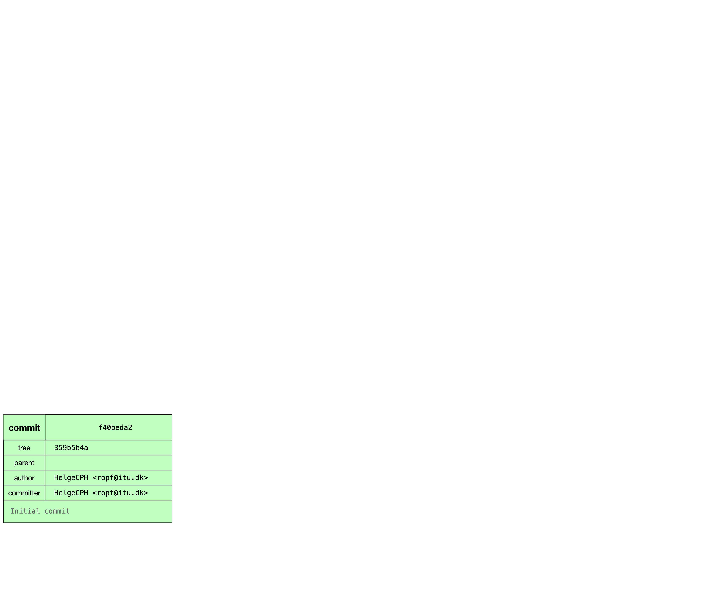
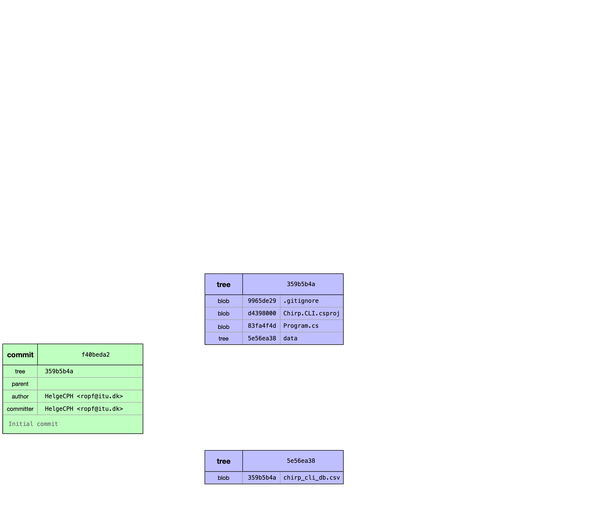
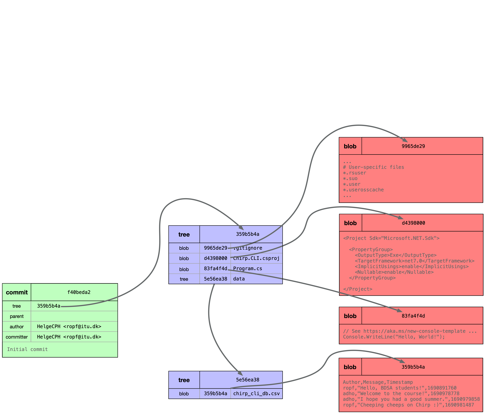
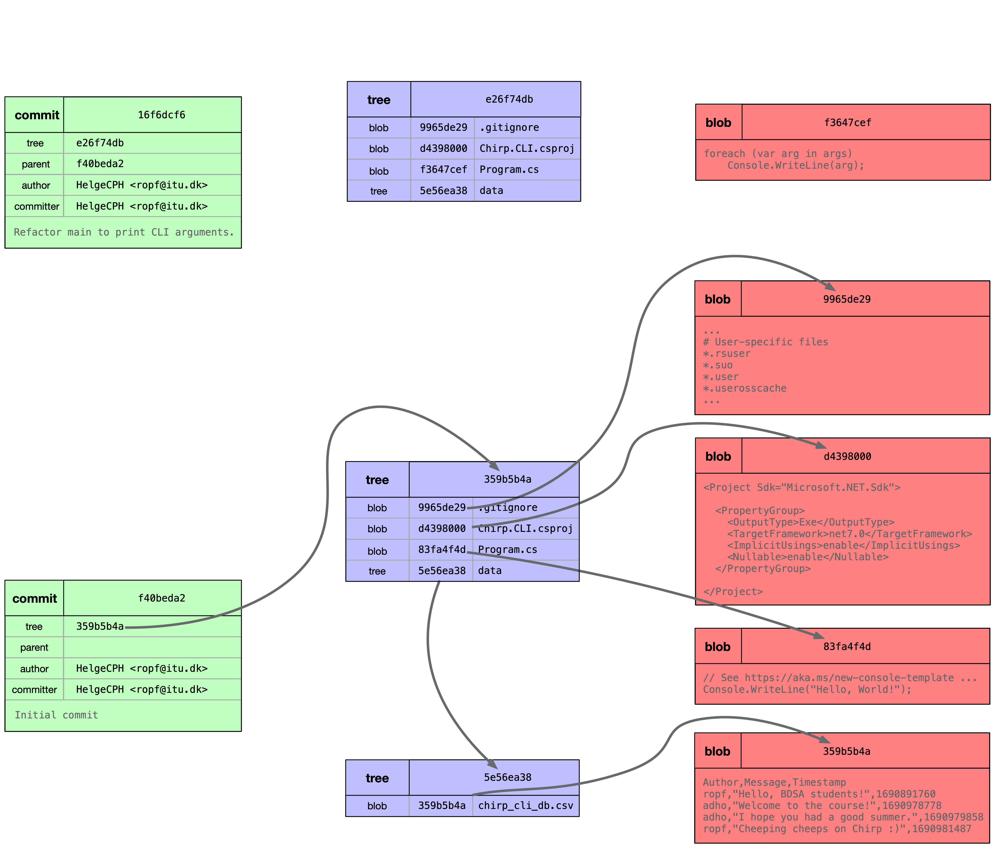
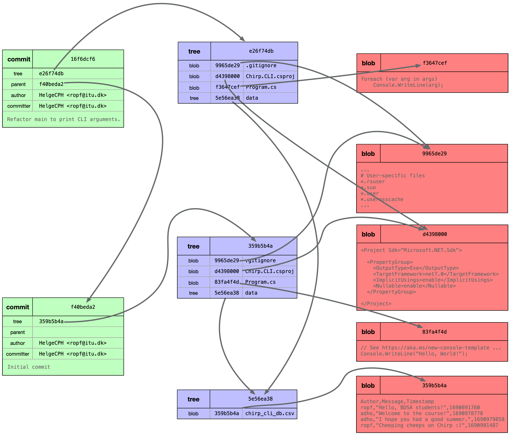

<!-- First hour: course intro -->

# **Analysis, Design and Software Architecture (BDSA)**
Week 1
[Eduard Kamburjan](eduard.kamburjan@itu.dk)


## Welcome!

  - Teachers: Eduard Kamburjan, Sven Peldszus


### The Teaching Assistants (in alphabetical order)

- Carl 
- Jakob
- Jonas
- Marius
- Patrick
- Phi Va

---

### Eduard 


&emsp;
- B.Sc./M.Sc. from TU Darmstadt (Computer Science/Logic)
- PhD in Software Analysis from TU Darmstadt
- Senior Researcher at Universitet i Oslo (Software for Digital Twins)
- Part of Software Quality Research Group at ITU
&emsp;
- Main Research Focus: Software Engineering for Emerging Information Technologies
- Digital Twins, Knowledge Graphs, Digital Engineering/Industry 4.0

---

### Sven

&emsp;
- B.Sc./M.Sc. from TU Darmstadt (Electrical Engineering and Information Technology)
- PhD in Software Engineering from University of Koblenz-Landau
- PostDoc at Ruhr University Bochum 
- Starting 01.09, Assist. Professor in Software Engineering at ITU
&emsp;
- Favorite topics: **Software Engineering** for Secure Systems
&emsp;
- Looks foward to **give the 2nd half of the BDSA lectures**; 
Will say hello next week!


## What are we going to do in this course?

  - You know how to program in the object-oriented language Java (1st semester)
  - You executed a first software development project (2nd semester)
  - Now, you get an introduction to object-oriented programming in C♯ and ASP.NET together with fundamental software engineering practices.

  - Focus I : Introduction to **Software Engineering**, the structured development of software
  - Presenting relevant aspects of software engineering that are representative for your future professional tasks in a practical way
  - Focus II : Code- and project-driven course

## Our Expectations

  * That you work for about **20-24 hours** per week on this course.
    * [According to ITU](https://itustudent.itu.dk/Your-Programme/BSc-Programmes/BSc-in-Software-Development/Courses-Projects-and-Electives), this is the amount of time corresponding to 15 ECTS.
  * That you support each other when working through the course material, on the assignments, and on the project.
  * That you work **continuously** on this course and on the project (also during the exercise classes).
  * That you work collaboratively in **public repositories on GitHub.com**.


## Our Expectations II

  * You have to read! You have to **carefully read** the provided reading material, project work descriptions, and documentation.
    * Some exams questions will be based on the book
  * That you take notes!
    * Either with pen and paper (best for your brain and retention, see e.g., [Mueller et al. _"The Pen Is Mightier Than the Keyboard: Advantages of Longhand Over Laptop Note Taking "_](https://journals.sagepub.com/doi/abs/10.1177/0956797614524581)) or digitally.
  * That you share your notes with each other.
  * We are more supervisors (vejledere) that compiled a learning journey during which you will experience different topics.


## What you **cannot** expect

- Introduction to yet another object-oriented language.
- That you can pass this course without working on the project.
- That you can pass this course with a single commit during project work.
- That you can pass this course by only passing the written exam.
- That all important information is on the lecture slides.
  - Pointers to the most important material is provided.
- That you can pass this course without reading the course book or other relevant material.

The main book accompanying this course is [Andrew Lock _ASP.NET Core in Action, Third Edition_](https://www.manning.com/books/asp-net-core-in-action-third-edition)


## How to contact us/course communication

- Do not write emails directly except if you want to share private information with us.
- Contact the TAs and us via [Teams](https://teams.microsoft.com/l/team/19%3A233Xhgb-_C_mu_gm28lBy5rj9xrVWAJhAxGOvKojle81%40thread.tacv2/conversations?groupId=b4721c89-4ecb-4130-afaf-3ac2a99d358b&tenantId=bea229b6-7a08-4086-b44c-71f57f716bdb)
- Use the channel to talk to each other, to reach the TAs, or to target questions to teachers.


---

### Schedule and Material

  - Schedule: https://github.com/itu-bdsa/lecture_notes#schedule
  - Course's repository: https://github.com/itu-bdsa/lecture_notes

---

### LearnIT and recordings

Find on LearnIT (https://learnit.itu.dk/local/coursebase/view.php?ciid=1743):

  - official course description
  - intended learning outcomes
  - exam description

### Lectures are not recorded

  - Recording lectures does not contribute positively to student attainment, see e.g., Edwards et al. [_"A study exploring the impact of lecture capture availability and lecture capture usage on student attendance and attainment"_](https://link.springer.com/article/10.1007/s10734-018-0275-9)

<!--  -->


## Additional Help: StudyLab

- Mondays 16-18
- Thursdays 14-16
- Fridays 12-14


## Timeplan for Lectures

Lectures will be organized as follows: -

- Wendesdays
  - 14:15-15:00 (1st lecture hour, 45min)
  - 15:15-15:00 (2nd lecture hour, 45min)
  - 15:15 (Excercises)
- Fridays
  - 08:15-09:00 (3rd lecture hour, 45min)
  - 09:15-10:00 (4th lecture hour, 45min)
  - 10:15 (Exercises)


## What are we going to do in this course?

  - You know how to program in the object-oriented language Java (1st semester)
  - You executed a first software development project (2nd semester)
  - Now, you get an introduction to object-oriented programming in C♯ and ASP.NET together with fundamental software engineering practices.

  - Focus I : Introduction to **Software Engineering**, the structured development of software
  - Presenting relevant aspects of software engineering that are representative for your future professional tasks in a practical way
  - Focus II : Code- and project-driven course


## What are we going to do in this course?

In this course _software engineering_ is software development according to a set of heuristics and best practices, in combination with processes.

  - You will learn various aspects of software engineering on a case, a Twitter-clone called _Chirp!_.
  - You will create various versions with varying features and properties during your project.
  - During class, we will use the case of _Chirp!_ to discuss the lecture topics.
  - You will create your versions of _Chirp!_ iteratively and incrementally, we mimic a way of agile software development.
  - We will use various versions of _Chirp!_ to reflect on Design and Architecture.


## What are we going to do in this course?

Combination of languages and frameworks

  - C♯/.NET/ASP.NET
  - Bash shell scripts
  - YAML based build workflows
  - HTML

For one third of the course, we are going to build a .NET CLI application and for the remainder various web applications.

- We do that in C♯/.NET mainly since this is an external requirement that ITU students should have experience with.
- Bash since it is ubiquitous in software development.


## Course Structure

- Project case and teaching case: _Chirp!_ ... a Twitter clone.
- Iterative development, i.e., one case in multiple versions with more and more features and growing complexity.
- Interactive lectures, where you solve three or more small tasks per lecture that bear relevance to your course and project work.
  -  If you cannot complete them in the given time, use the exercise session after teaching to do so.

[link to schedule](https://github.com/itu-bdsa/lecture_notes#schedule) and [project work description](./README_PROJECT.md) 


## Exam

  > The exam consists of two parts. The two parts are:
  > a) the project, which is covered via the final submission (report) and which covers important aspects of the project work.
  > b) a written exam (two hours), which covers generic course contents.
  >
  > Each part is graded separately, i.e., students receive a grade for the project and another grade for the written exam.
  > Final grades are computed based on the two grades from the two parts. The precise weight of each part's grade will be communicated to all students in class at the start of the course. To pass the exam, both parts need to receive a passing grade. That is, the project has to be passed and the written exam needs to be passed.

The **grading weight** is: project 1/2 written exam 1/2.


## Forming Project Groups

Today, form groups of five and register your groups on Teams.

- Possible considerations:
  - Ambition level
  - Availability
  - Schedule


## What are we going to do in this course?

### What is software engineering?

This course is about _software engineering_:

  > systematic application of scientific and technological knowledge, methods, and experience to the design, implementation, testing, and documentation of software
(Source: <a href="https://www.iso.org/obp/ui/en/#iso:std:iso-iec-ieee:24748:-5:ed-1:v1:en"><i>ISO/IEC/IEEE 24748-5:2017 Systems and software engineering--Life cycle management--Part 5: Software development planning, 3.16</i></a>)

### Why is software engineering needed?

 * Software quality
   * Product quality, development time, ...
   * Software maintainability
 * Development process

---

### Software engineering for code quality

- In this view, software engineering is a set of best practices for quality code.
- How to structure software?
- How to develop software so it is maintainable?
- How to structure communication between developers?

  > [SE is a set of] of heuristics I’ve found useful. I’m afraid it’s closer to what Adam Barr calls the _shifting sands of individual experience_ than to a scientifically founded set of laws.
  > I believe that this reflects the current state of our industry.
(Source: Mark Seemann <i>"Code That Fits in Your Head"</i>)

---

### Software engineering as a process

 - In this view, software engineering is a set of established structures for quality processes.
 - How to structure software development from a business perspective
 - Who is responsible to for deadlines?
 - If something goes wrong, who is accountable?
 - Crowdstrike 2024: Caused by bug in testing procedures, lawsuite for gross negligence 

---

### Software engineering is about risk

> IT cost risk is found to be uniquely more risky than other project types. [...]
> On the one hand, more IT projects are actually deliv-
ered on budget than for most other project types. On the other
hand, a substantial fraction of IT projects has larger cost over-
runs than other projects. (Source: The Uniqueness of IT Cost Risk: A Cross-Group Comparison of 23 Project Types, Byvent et al., 2025)

 - If software project fail, they fail big more often than other projects
 (Source: The Empirical Reality of IT Project Cost Overruns: Discovering A
Power-Law Distribution, Byvent et al., 2022)
 - Structure development helps to control risk

---

### Software engineering is not civil engineering

 - SE is less mature: other engineering disciplines have centuries of best practices
 - Humans have intuition for physics, but not for software
 - SE project goals are harder to define
 - SE project touch on business logic and internal processes

<!-- Second hour -->

## Task: Create a CLI App in .NET/C♯

<!--
_backgroundImage: "linear-gradient(to bottom, #67b8e3, #0288d1)"
_color: white
_header: 10 minutes
-->

- Open your terminals, and run the following commands

  ```bash
  dotnet new console -o Chirp.CLI

  cd Chirp.CLI
  rider .
  ```
- Inspect the created project, in particular the generated `Program.cs` file, in your editors
- Build the project with `dotnet build` or build and run the compiled program with `dotnet run` directly.
- What can you see on the terminal? Does it correspond to your expectations?

<!--
dotnet new console -o Chirp.CLI --use-program-main
-->


---

### Naming .NET/C♯ Projects

Naming convention for projects is: [`<Organization>.<Component>.dll`](https://learn.microsoft.com/en-us/dotnet/standard/design-guidelines/names-of-assemblies-and-dlls)

In your projects, `<Organization>` has to be: `ITU_BDSA2025_GROUP<no>`, where `<no>` no is your group number, see today's project work.

In your project work you have the task to register organizations and create repositories, see [here](https://ituniversity.sharepoint.com/:x:/r/sites/2025AnalysisDesignandSoftwareArchitecture/Shared%20Documents/General/Groups.xlsx?d=wba26ee18e8af4a74930ed5337ed38d77&csf=1&web=1&e=2o55hB)


## Task: Calling CLI Applications with Arguments

<!--
_backgroundImage: "linear-gradient(to bottom, #67b8e3, #0288d1)"
_color: white
_header: 10 minutes
-->

- Replace the contents of `Program.cs` from the previous task with the following code:
  ```csharp
  if (args[0] == "say")
  {
      var message = args[1];
      var frequency = int.Parse(args[2]);
      foreach (var i in Enumerable.Range(1, frequency))
          Console.Write(message + " ");
  }
  ```
- Run the program from the terminal via `dotnet run -- say hej 10`.
- The double dash means pass the subsequent arguments to the built executable.

<!-- @Helge: Afterwards explain program, mention `var`, lack of curly braces, top-level statements, and show refactoring to "regular" main program -->


## Summary

 - What is software engineering
 - First contact with C#
 - What now?
   - *no exercises today*
   - Form groups, register [here](https://ituniversity.sharepoint.com/:x:/r/sites/2025AnalysisDesignandSoftwareArchitecture/Shared%20Documents/General/Groups.xlsx?d=wba26ee18e8af4a74930ed5337ed38d77&csf=1&web=1&e=2o55hB)
 - Friday: Git and rider

<!-- Third hour -->

## Git CLI API


You should know this from your previous two semesters.


## Intro to the Git Data Model

Why does it matter?
You have to understand how Git stores data and models history to be able to properly understand its commands.

In this course we use Git as version control system (VCS). Keeping track of the history of continuously evolving software is part of the process in software engineering.


## The Git Data Model

<!--

$ dotnet new console -o Chirp.CLI
The template "Console App" was created successfully.
$ cd Chirp.CLI/
$ git init
$ dotnet new gitignore
$ mkdir data
$ cp ~/Documents/Lectures/itu-bdsa/itu-bdsa-private/sessions/session_01/chirp_cli_db.csv data/
$ tree
.
├── Chirp.CLI.csproj
├── data
│   └── chirp_cli_db.csv
└── Program.cs
$ git status
On branch main

No commits yet

Untracked files:
  (use "git add <file>..." to include in what will be committed)
	.gitignore
	Chirp.CLI.csproj
	Program.cs
	data/

$ git add .
$ git commit -m"Initial commit"


$ git cat-file -p f40beda2db7b2d72fa20faf19c7c42784c9bafb8
tree 359b5b4add98ee59e3f073f2ceb55314a03e5e7d
author HelgeCPH <ropf@itu.dk> 1724680129 +0200
committer HelgeCPH <ropf@itu.dk> 1724680129 +0200

Initial commit
$ git cat-file -p 359b5b4add98ee59e3f073f2ceb55314a03e5e7d
100644 blob 9965de2966287fbbd8b0880603145002620d7bc8	.gitignore
100644 blob d439800007d7d9fd0a7e9179b8d122498de1755b	Chirp.CLI.csproj
100644 blob 83fa4f4d5fd1f545f64172b044a07814db23104f	Program.cs
040000 tree 5e56ea38d53b63b0c8667dc1cbb8f7f27f35287c	data
$ git cat-file -p 83fa4f4d5fd1f545f64172b044a07814db23104f
// See https://aka.ms/new-console-template for more information
Console.WriteLine("Hello, World!");
$ git cat-file -p 5e56ea38d53b63b0c8667dc1cbb8f7f27f35287c
100644 blob 2b64a343a6b3202a20f9435824474ccb94d13fbc	chirp_cli_db.csv
$ git cat-file -p 2b64a343a6b3202a20f9435824474ccb94d13fbc
Author,Message,Timestamp
ropf,"Hello, BDSA students!",1690891760
adho,"Welcome to the course!",1690978778
adho,"I hope you had a good summer.",1690979858
ropf,"Cheeping cheeps on Chirp :)",1690981487

-->




## The Git Data Model



## The Git Data Model


## The Git Data Model



## The Git Data Model



## The Git Data Model




## Task: Attributions in Git History

<!--
_backgroundImage: "linear-gradient(to bottom, #67b8e3, #0288d1)"
_color: white
_header: 15 minutes
-->

- Configure your author name and email address to Git for attribution with `git config --global user.name "<Your Name>"` and `git config --global user.email <itu_login>@itu.dk`.
- In the project from the previous task (`Chirp.CLI`), create a `.gitignore` file. You can do so with `dotnet new gitignore`, which creates a configuration that ignores non-source artifacts from being version controlled (in C♯/.Net projects).
- Initialize a Git repository for the project from the previous task (`Chirp.CLI`), via `git init`.
- Create an initial commit of all the files in the local repository with `git add .` (start tracking) followed by `git commit -m"Initial commit."`
- Replace the contents of `Program.cs` with
```csharp
foreach (var arg in args)
    Console.WriteLine(arg);
```

→→ Continue on next slide →→

## Task: Attributions in Git History

<!--
_backgroundImage: "linear-gradient(to bottom, #67b8e3, #0288d1)"
_color: white
_header: 15 minutes
-->

- Add the modified file to staging `git add Program.cs`
- Attribute the work on the commit to you and a co-author (for this example me, you can choose any of your friends)

```bash
git commit -m "Refactor main to print CLI arguments.

Longer description...

Co-authored-by: Eduard <edka@itu.dk>"
```
- Inspect the history of this repository with `git log` and discuss the output with your neighbor.


More on the topic: <a href="https://docs.github.com/en/pull-requests/committing-changes-to-your-project/creating-and-editing-commits/creating-a-commit-with-multiple-authors"> GitHub documentation</a> and a good <a href="https://stackoverflow.com/a/7442255">StackOverlow Answer</a>


## Attribute Commits

From now on, and for sure for the project attribute your commits properly!

[See description of this week's project work](./README_PROJECT.md#4-ethics)


## Recommendation: Writing _Good_ Commit Messages

<!--
_backgroundImage: "linear-gradient(to bottom, #e18ac2, #d112a5)"
_color: white
-->

> **The 50/72 Rule**
>
> Write conventional Git commit messages.
>
> Write a summary in the imperative, no wider than 50 characters.
>
> If you add more text, leave the next line blank.
>
> You can add as much extra text as you’d like, but format it no wider than 72 characters.
>
> Apart from the summary, focus on explaining _why_ a change was made, since _what_ constitutes the change is already visible via Git’s diff view. (
Source: Mark Seemann <i>"Code That Fits in Your Head"</i>)


## Git Commands Cheat Sheet

Useful cheatsheet available from <a href="https://www.atlassian.com/dam/jcr:e7e22f25-bba2-4ef1-a197-53f46b6df4a5/SWTM-2088_Atlassian-Git-Cheatsheet.pdf">Atlassian</a>


<!-- Fourth hour -->

## Task: Use the Rider Debugger

<!--
_backgroundImage: "linear-gradient(to bottom, #67b8e3, #0288d1)"
_color: white
_header: 10 minutes
-->

- In the directory of the `Chirp.CLI` project that we created above, open Rider from the terminal via `rider .`
- Replace the source code in `Program.cs` with the following:
  ```csharp
  List<string> cheeps = new() { "Hello, BDSA students!", "Welcome to the course!", "I hope you had a good summer." };

  foreach (var cheep in cheeps)
  {
      Console.WriteLine(cheep);
      Thread.Sleep(1000);
  }
  ```
- Set a break point next to line 5
- Click Run -> Debug (or press the Alt+Shift+F9) and start the debugger
- Click the Step Over button (F10) to execute the program line by line
  - After each click, inspect the state of your program under the variables view on the bottom center.


## Why to Use the Rider Debugger?

<!-- @Helge: Walk through the same example and discuss what we have seen. -->

- One form of feedback about your program.
- It helps you understanding of what is going on when your program is executed and how its state is at certain times.
- Use it to experiment with code to see if it behaves according to your expectations.
- One of the best learning tools that you have.


Note, if you want to pass arguments to a console application for debugging, you have to [edit a debug configuration](https://www.jetbrains.com/help/rider/Get_Started_with_Run_Debug_Configurations.html).

## Working together, following the same style and conventions

  - Coding Conventions: https://learn.microsoft.com/en-us/dotnet/csharp/fundamentals/coding-style/coding-conventions
    - You can automatically enable their checks by generating an `.editorconfig` file: `dotnet new editorconfig`
    - VisualStudio accepts them directly.
    - for VSCode you have to [install an extra extension](https://marketplace.visualstudio.com/items?itemName=EditorConfig.EditorConfig)
    - Rider [understands them too](https://www.jetbrains.com/help/rider/Using_EditorConfig.html#standard)
  - To use the same code formatting in the team, [enable autoformat of code on save](https://www.jetbrains.com/help/rider/Enforcing_Code_Formatting_Rules.html#run-code-cleanup-automatically-on-save)

  - Make sure to create a `.gitignore` file before the first commit to exclude generated artifacts from being version controlled, e.g., `dotnet new gitignore`


## Summary

 - What is software engineering
 - First contact with C#, rider, Git details
 - What now?
   - If not done, complete the Tasks (blue slides) from this class
   - Check the [reading material](./READING_MATERIAL.md) 
   - Work on the [project](./README_PROJECT.md)
 - Next week: More on version control, building process
