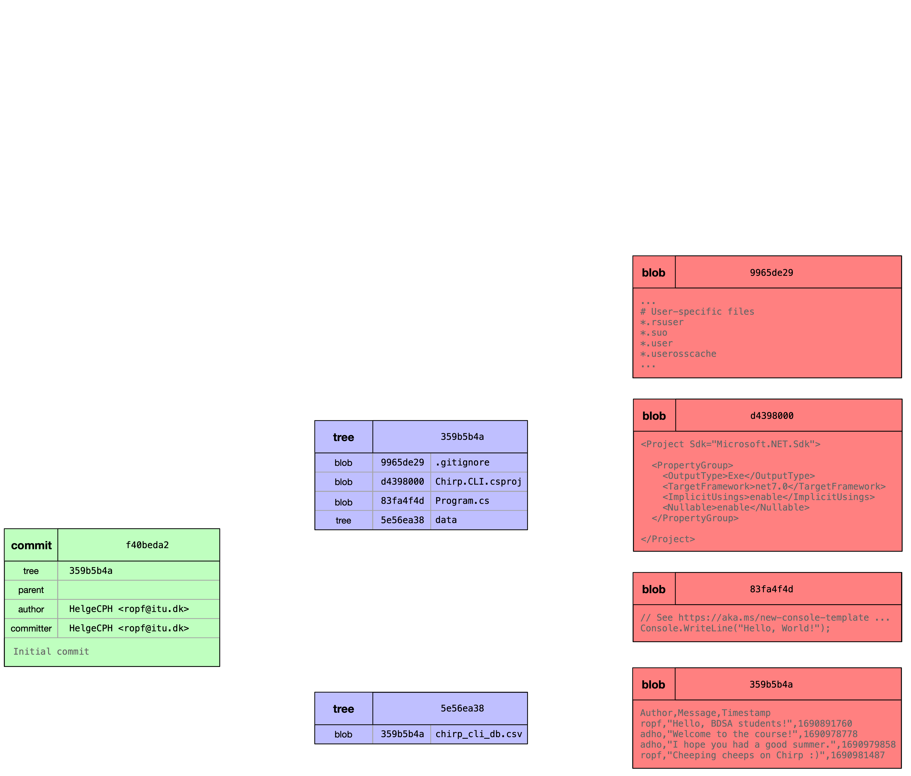

<!-- First hour: course intro -->

# **Analysis, Design and Software Architecture (BDSA)**
Session 1
[Helge Pfeiffer, Associate Professor](ropf@itu.dk)


## Who are we?

  - Teachers: Helge, Adrian


### The Teaching Assistants (in alphabetical order)

- David F.
- David S.
- Patrick
- Phi Va
- Rasmus

---

### Adrian

&emsp;
- Studied Computer Science at TU Braunschweig in Germany
  - (Bachelor's and Master's)
- Was a **PhD student at ITU** the last couple of years
  - Will defend his thesis in 3 weeks
&emsp;
- Favorite topics: **Software Engineering** and Computer Graphics
&emsp;
- Looks foward to **give a few lectures** of BDSA soon
	- very exciting topics
&emsp;
- Will say hello next week!


---

### Helge


<iframe src="https://itu.dk/~ropf/presentations/map.html" width="100%" height=300 scrolling="auto"></iframe>

<!-- 
 -->

  - Dipl-Inf. in Software Engineering from Friedrich-Schiller Universität Jena
  - PhD in Software Engineering from ITU
  - Software engineer at DMI
  - Lecturer at Cphbusiness
  - Since January 2019 back to ITU in the Research Center for Government IT

---

### Who are you?


## Your Expectations

<iframe src="menti_results.pdf" width="100%" height=600 scrolling="auto"></iframe>


## Our Expectations

  * Having fun with our work.
  * Hopefully, presenting relevant aspects of software engineering that are representative for your future professional tasks.
  - That you work for about **20-24 hours** per week on this course.
    - [According to ITU](https://itustudent.itu.dk/Your-Programme/BSc-Programmes/BSc-in-Software-Development/Courses-Projects-and-Electives), this is the amount of time corresponding to 15 ECTS.
  * That you support each other when working through the course material, on the assignments, and on the project.
  * That you work **continuously** (as we do) on this course and on the project (also during the exercise classes).
  * That you work collaboratively in **public repositories on GitHub.com**.
  * That you **engage** actively in class.


## Our Expectations II

  * You have to read! You have to **carefully read** the provided reading material, project work descriptions, and documentation.
  * That you take notes!
    * Either with pen and paper (best for your brain and retention, see e.g., [Mueller et al. _"The Pen Is Mightier Than the Keyboard: Advantages of Longhand Over Laptop Note Taking "_](https://journals.sagepub.com/doi/abs/10.1177/0956797614524581)) or some other technology.
  * That you share your notes with each other.
    * If you want to, we can establish a note sharing channel, either on Teams, in a Git repository, physically, etc.
  * Note, be prepared for **quite a bit of work** and many **moments of despair** :(
    * This is unfortunately how learning works. At the moment it hurts but once you know how to solve your problems, solutions appear to be easy and straight forward.


## Our Expectations III

We are not teachers "teaching" you "knowledge", your learning is something that you are responsible for.

We are more supervisors (vejledere) that compiled a learning journey during which you will experience a lot of relevant topics.


## What you **cannot** expect

- That you can pass this course without working on the project.
- That you can pass this course with a single commit during project work.
- That you can pass this course by only passing the written exam.
- That all important information is on the lecture slides.
  - We try to include pointers to the most important stuff though.
- That you can pass this course without reading the course book or other relevant material.

The main book accompanying this course is [Andrew Lock _ASP.NET Core in Action, Third Edition_](https://www.manning.com/books/asp-net-core-in-action-third-edition)


## How to contact us/course communication

- Do not write an email directly to Adrian, Helge, or the TAs!
  - Only exception is that you want to share private information with us.
- Contact the TAs and us via [Teams](https://teams.microsoft.com/l/channel/19%3AlIH34NxZbDH_z9JJs8g9qAJDvXTSg7pW9SrqVBCK9ns1%40thread.tacv2/General?groupId=50f54173-84af-4d6f-bea1-b06854fb189e&tenantId=bea229b6-7a08-4086-b44c-71f57f716bdb)
  - Use the channel to talk to each other, to reach the TAs, or to target questions to teachers.


## Grade distribution BDSA 2021

<style scoped>
  section {
    font-size: 22px;
  }
</style>

<iframe src="images/grades.html"
    sandbox="allow-same-origin allow-scripts"
    width="80%"
    height="300"
    scrolling="no"
    seamless="seamless"
    frameborder="0">
</iframe>

That is, more than a quarter of the students back then failed the exam and had to take the re-exam.

From these numbers and from feedback, we know that many students believe that this is the most difficult course during your BSc. But that should not block you.

We redesigned the course to be more applied and hopefully more graspable. But you have to actively work to pass the exam.

---

### Schedule and Material

  - Schedule: https://github.com/itu-bdsa/lecture_notes#schedule
  - Course's repository: https://github.com/itu-bdsa/lecture_notes

---

### LearnIT

Find on LearnIT (https://learnit.itu.dk/local/coursebase/view.php?ciid=1478) the:

  - official course description,
  - intended learning outcomes, and
  - exam description

---

### Lectures are not recorded?

  - If you require recordings, you have to take the initiative.
  - Be aware: recording lectures does not contribute positively to student attendance and attainment, see e.g., Edwards et al. [_"A study exploring the impact of lecture capture availability and lecture capture usage on student attendance and attainment"_](https://link.springer.com/article/10.1007/s10734-018-0275-9)


## Additional Help

### StudyLab

- Mondays 10-12
- Tuesdays 12-14
- Wednesdays 8-10

### Linux Lab by DASYA

  > Whether it is "AI" or "Cloud" Computing, Azure or AWS, Networking, Security or HPC - chances are that underneath it is all... Linux.
  >
  > All questions and contributions are welcome - and so are you!
  >
  > Every **Wednesday from 16.00-18.00 at the DASYA Lab, 5A56, starting 6 September 2023.**

You have to double check that it takes place again this fall.


## Timeplan for Lectures

On Wednesdays, lectures will be organized as follows:

- 10:15-11:00 (1st hour, 45min)
- 11:10-11:55 (2nd hour, 45min)
- 0.5h lunch break
- 12:25-13:05 (3rd hour, 40min)
- 13:15-14:00  (4th hour, 45min)

Exercises: 14:15


## What are we going to do in this course?

<iframe src="https://itustudent.itu.dk/Your-Programme/BSc-Programmes/BSc-in-Software-Development"
    sandbox="allow-same-origin allow-scripts"
    width="100%"
    height="500"
    scrolling="auto"
    seamless="seamless"
    frameborder="0">
</iframe>

---

### What are we going to do in this course?


  - You know how to program in the object-oriented language Java (1st semester)
  - You executed a first software development project (2nd semester)
  - Now, you get an introduction to object-oriented programming in C♯ and ASP.NET together with fundamental software engineering practices.

## Task: _Chirp!_ Demo

<!--
_backgroundImage: "linear-gradient(to bottom, #67b8e3, #0288d1)"
_color: white
_header: 10 minutes
-->

- Navigate with your web browsers to <https://chirp-razor.azurewebsites.net/>
- Login to _Chirp!_ using your GitHub accounts.
- Send a cheep
  - **OBS** [Netiquette](https://en.wikipedia.org/wiki/Etiquette_in_technology#Netiquette): Do not send anything that you would not say aloud at your grand mother's coffee table!)
- Inspect the public timeline of cheeps to see if your cheep appears there.
- Follow some other user by clicking on the "follow" link.
- See your and the followed account's cheeps on your private timeline.
- Logout

Likely, you will create a similar version of _Chirp!_ as the final stage of your project work by the end of this term.


## What are we going to do in this course?

This course is about _software engineering_:

  > systematic application of scientific and technological knowledge, methods, and experience to the design, implementation, testing, and documentation of software<font size=3>
Source: <a href="https://www.iso.org/obp/ui/en/#iso:std:iso-iec-ieee:24748:-5:ed-1:v1:en"><i>ISO/IEC/IEEE 24748-5:2017 Systems and software engineering--Life cycle management--Part 5: Software development planning, 3.16</i></a>
</font>

To Mark Seemann, software engineering is more a set:

  > of heuristics I’ve found useful. I’m afraid it’s closer to what Adam Barr calls the _shifting sands of individual experience_ than to a scientifically founded set of laws.
  > I believe that this reflects the current state of our industry.<font size=3>
Source: Mark Seemann <i>"Code That Fits in Your Head"</i>
</font>


## What are we going to do in this course?

For us, in this course _software engineering_ is the combination of software development relying on a set of heuristics and practices in combination with certain processes.

  - You will learn various aspects of software engineering on a case, a Twitter-clone called _Chirp!_.
  - You will create various versions with varying features and properties during your project.
  - During class, we will use the case of _Chirp!_ to discuss the lecture topics.
  - You will create your versions of _Chirp!_ iteratively and incrementally, we mimic a way of agile software development.
  - We will use various versions of _Chirp!_ to reflect on Design and Architecture.


## What are we going to do in this course?

Combination of languages and frameworks

  - C♯/.NET/ASP.NET
  - Bash shell scripts
  - YAML based build workflows
  - HTML

For one third of the course, we are going to build a .NET CLI application and for the remainder various web applications.

- We do that in C♯/.NET mainly since this is an external requirement that ITU students should have experience with.
- Bash since it is ubiquitous in software development.


## Course Structure

- Project case and teaching case: _Chirp!_ ... a Twitter clone.
- Iterative development, i.e., one case in multiple versions with more and more features and growing complexity.
- We try to create interactive lectures, where you solve three or more small tasks per lecture that bear relevance to your course and project work.
  -  If you cannot complete them in the given time, use the exercise session after teaching to do so.

@Helge: [link to schedule](https://github.com/itu-bdsa/lecture_notes#schedule) and [project work description](./README_PROJECT.md)


## Exam

  > The exam consists of two parts. The two parts are:
  > a) the project, which is covered via the final submission (report) and which covers important aspects of the project work.
  > b) a written exam (two hours), which covers generic course contents.
  >
  > Each part is graded separately, i.e., students receive a grade for the project and another grade for the written exam.
  > Final grades are computed based on the two grades from the two parts. The precise weight of each part's grade will be communicated to all students in class at the start of the course. To pass the exam, both parts need to receive a passing grade. That is, the project has to be passed and the written exam needs to be passed.

The **grading weight** is: project 1/2 written exam 1/2.


## Forming Project Groups

Today, form groups of five and register your groups on Teams.

- Possible considerations:
  - Ambition level
  - Availability
  - Schedule


<!-- Second hour -->

## Task: Create a CLI App in .NET/C♯

<!--
_backgroundImage: "linear-gradient(to bottom, #67b8e3, #0288d1)"
_color: white
_header: 10 minutes
-->

- Open your terminals, and run the following commands

  ```bash
  dotnet new console -o Chirp.CLI

  cd Chirp.CLI
  rider .
  ```
- Inspect the created project, in particular the generated `Program.cs` file, in your editors
- Build the project with `dotnet build` or build and run the compiled program with `dotnet run` directly.
- What can you see on the terminal? Does it correspond to your expectations?

<!--
dotnet new console -o Chirp.CLI --use-program-main
-->


---

### Naming .NET/C♯ Projects

Naming convention for projects is: [`<Organization>.<Component>.dll`](https://learn.microsoft.com/en-us/dotnet/standard/design-guidelines/names-of-assemblies-and-dlls)

In your projects, `<Organization>` has to be: `ITU_BDSA2024_GROUP<no>`, where `<no>` no is your group number, see today's project work.

In your project work you have the task to register organizations and create repositories, see [here](https://ituniversity.sharepoint.com/:x:/r/sites/2024AnalysisDesignandSoftwareArchitecture/Shared%20Documents/General/Groups.xlsx?d=w6776b670fe464ef09d2d4eb3f1a559b7&csf=1&web=1&e=VpEKVd)


## Task: Calling CLI Applications with Arguments

<!--
_backgroundImage: "linear-gradient(to bottom, #67b8e3, #0288d1)"
_color: white
_header: 10 minutes
-->

- Replace the contents of `Program.cs` from the previous task with the following code:
  ```csharp
  if (args[0] == "say")
  {
      var message = args[1];
      var frequency = int.Parse(args[2]);
      foreach (var i in Enumerable.Range(1, frequency))
          Console.Write(message + " ");
  }
  ```
- Run the program from the terminal via `dotnet run -- say hej 10`.
- The double dash means pass the subsequent arguments to the built executable.

@Helge: Afterwards explain program, mention `var`, lack of curly braces, top-level statements, and show refactoring to "regular" main program


<!-- Third hour -->

## Git CLI API


You know this from your previous two semesters.


## Intro to the Git Data Model

Why does it matter?
You have to understand how Git stores data and models history to be able to properly understand its commands.

In this course we use Git as version control system (VCS). Keeping track of the history of continuously evolving software is part of the process in software engineering.


## The Git Data Model

<!--

$ dotnet new console -o Chirp.CLI
The template "Console App" was created successfully.
$ cd Chirp.CLI/
$ git init
$ dotnet new gitignore
$ mkdir data
$ cp ~/Documents/Lectures/itu-bdsa/itu-bdsa-private/sessions/session_01/chirp_cli_db.csv data/
$ tree
.
├── Chirp.CLI.csproj
├── data
│   └── chirp_cli_db.csv
└── Program.cs
$ git status
On branch main

No commits yet

Untracked files:
  (use "git add <file>..." to include in what will be committed)
	.gitignore
	Chirp.CLI.csproj
	Program.cs
	data/

$ git add .
$ git commit -m"Initial commit"


$ git cat-file -p f40beda2db7b2d72fa20faf19c7c42784c9bafb8
tree 359b5b4add98ee59e3f073f2ceb55314a03e5e7d
author HelgeCPH <ropf@itu.dk> 1724680129 +0200
committer HelgeCPH <ropf@itu.dk> 1724680129 +0200

Initial commit
$ git cat-file -p 359b5b4add98ee59e3f073f2ceb55314a03e5e7d
100644 blob 9965de2966287fbbd8b0880603145002620d7bc8	.gitignore
100644 blob d439800007d7d9fd0a7e9179b8d122498de1755b	Chirp.CLI.csproj
100644 blob 83fa4f4d5fd1f545f64172b044a07814db23104f	Program.cs
040000 tree 5e56ea38d53b63b0c8667dc1cbb8f7f27f35287c	data
$ git cat-file -p 83fa4f4d5fd1f545f64172b044a07814db23104f
// See https://aka.ms/new-console-template for more information
Console.WriteLine("Hello, World!");
$ git cat-file -p 5e56ea38d53b63b0c8667dc1cbb8f7f27f35287c
100644 blob 2b64a343a6b3202a20f9435824474ccb94d13fbc	chirp_cli_db.csv
$ git cat-file -p 2b64a343a6b3202a20f9435824474ccb94d13fbc
Author,Message,Timestamp
ropf,"Hello, BDSA students!",1690891760
adho,"Welcome to the course!",1690978778
adho,"I hope you had a good summer.",1690979858
ropf,"Cheeping cheeps on Chirp :)",1690981487

-->


## The Git Data Model


## The Git Data Model



## The Git Data Model


## The Git Data Model


## The Git Data Model


## Task: Attributions in Git History

<!--
_backgroundImage: "linear-gradient(to bottom, #67b8e3, #0288d1)"
_color: white
_header: 15 minutes
-->

- Configure your author name and email address to Git for attribution with `git config --global user.name "<Your Name>"` and `git config --global user.email <itu_login>@itu.dk`.
- In the project from the previous task (`Chirp.CLI`), create a `.gitignore` file. You can do so with `dotnet new gitignore`, which creates a configuration that ignores non-source artifacts from being version controlled (in C♯/.Net projects).
- Initialize a Git repository for the project from the previous task (`Chirp.CLI`), via `git init`.
- Create an initial commit of all the files in the local repository with `git add .` (start tracking) followed by `git commit -m"Initial commit."`
- Replace the contents of `Program.cs` with
```csharp
foreach (var arg in args)
    Console.WriteLine(arg);
```

→→ Continue on next slide →→

## Task: Attributions in Git History

<!--
_backgroundImage: "linear-gradient(to bottom, #67b8e3, #0288d1)"
_color: white
_header: 15 minutes
-->

- Add the modified file to staging `git add Program.cs`
- Attribute the work on the commit to you and a co-author (for this example me, you can choose any of your friends)

```bash
git commit -m "Refactor main to print CLI arguments.

Longer description...

Co-authored-by: Helge <ropf@itu.dk>"
```
- Inspect the history of this repository with `git log` and discuss the output with your neighbor.


<font size=3>
More on the topic: <a href="https://docs.github.com/en/pull-requests/committing-changes-to-your-project/creating-and-editing-commits/creating-a-commit-with-multiple-authors"> GitHub documentation</a> and a good <a href="https://stackoverflow.com/a/7442255">StackOverlow Answer</a>
</font>


## Attribute Commits

From now on, and for sure for the project attribute your commits properly!

[See description of this week's project work](./README_PROJECT.md#4-ethics)


## Recommendation: Writing _Good_ Commit Messages

<!--
_backgroundImage: "linear-gradient(to bottom, #e18ac2, #d112a5)"
_color: white
-->

> **The 50/72 Rule**
>
> Write conventional Git commit messages.
>
> Write a summary in the imperative, no wider than 50 characters.
>
> If you add more text, leave the next line blank.
>
> You can add as much extra text as you’d like, but format it no wider than 72 characters.
>
> Apart from the summary, focus on explaining _why_ a change was made, since _what_ constitutes the change is already visible via Git’s diff view.
<font size=3>
Source: Mark Seemann <i>"Code That Fits in Your Head"</i>
</font>


## Git Commands Cheat Sheet

<iframe src="https://www.atlassian.com/dam/jcr:e7e22f25-bba2-4ef1-a197-53f46b6df4a5/SWTM-2088_Atlassian-Git-Cheatsheet.pdf" width="100%" height=400 scrolling="auto"></iframe>

<font size=3>
Source: <a href="https://www.atlassian.com/dam/jcr:e7e22f25-bba2-4ef1-a197-53f46b6df4a5/SWTM-2088_Atlassian-Git-Cheatsheet.pdf">Atlassian</a>
</font>

<!-- Fourth hour -->

## Task: Use the Rider Debugger

<!--
_backgroundImage: "linear-gradient(to bottom, #67b8e3, #0288d1)"
_color: white
_header: 10 minutes
-->

- In the directory of the `Chirp.CLI` project that we created above, open Rider from the terminal via `rider .`
- Replace the source code in `Program.cs` with the following:
  ```csharp
  List<string> cheeps = new() { "Hello, BDSA students!", "Welcome to the course!", "I hope you had a good summer." };

  foreach (var cheep in cheeps)
  {
      Console.WriteLine(cheep);
      Thread.Sleep(1000);
  }
  ```
- Set a break point next to line 5
- Click Run -> Debug (or press the Alt+Shift+F9) and start the debugger
- Click the Step Over button (F10) to execute the program line by line
  - After each click, inspect the state of your program under the `VARIABLES` view on the left-hand side.


## Why to Use the Rider Debugger?

@Helge: Walk through the same example and discuss what we have seen.

- One form of feedback about your program.
- It helps you understanding of what is going on when your program is executed and how its state is at certain times.
- Use it to experiment with code to see if it behaves according to your expectations.
- One of the best learning tools that you have.


Note, if you want to pass arguments to a console application for debugging, you have to [edit a debug configuration](https://www.jetbrains.com/help/rider/Get_Started_with_Run_Debug_Configurations.html).

## Working together, following the same style and conventions

  - Coding Conventions: https://learn.microsoft.com/en-us/dotnet/csharp/fundamentals/coding-style/coding-conventions
    - You can automatically enable their checks by generating an `.editorconfig` file: `dotnet new editorconfig`
    - VisualStudio accepts them directly.
    - for VSCode you have to [install an extra extension](https://marketplace.visualstudio.com/items?itemName=EditorConfig.EditorConfig)
    - Rider [understands them too](https://www.jetbrains.com/help/rider/Using_EditorConfig.html#standard)
  - To use the same code formatting in the team, [enable autoformat of code on save](https://www.jetbrains.com/help/rider/Enforcing_Code_Formatting_Rules.html#run-code-cleanup-automatically-on-save)

  - Make sure to create a `.gitignore` file before the first commit to exclude generated artifacts from being version controlled, e.g., `dotnet new gitignore`


## What to do now?


- If not done, complete the Tasks (blue slides) from this class
- Check the [reading material](./READING_MATERIAL.md)
- Work on the [project](./README_PROJECT.md)
