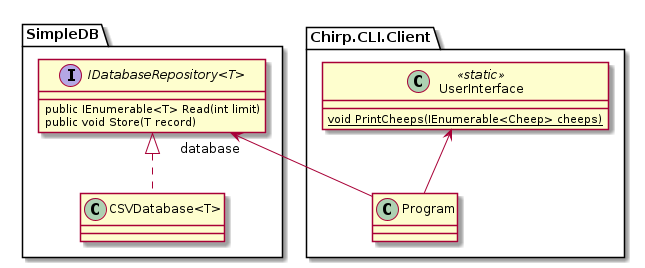

# Your turn now! -- Project Work


You have to work on the following topics.

  - [1) Process](#1-process)
  - [2) Software Development](#2-software-development)
  - [3) Ethics](#3-ethics)

Remember, you have to perform work on each topic and on **each** bullet point.
Be done with the project work before we meet again next Thursday.


## 1) Process

* From now on, organize your project work into issues (tickets) on GitHub.
Describe each issue drawing inspiration from the guidelines presented in class.
  - Issues shall describe the tasks presented in the `README_PROJECT.md` files.
  Add additional issues for tasks that you identify to complete your project work.
  - Make sure that you label your issues according to their type, e.g., do they describe a new feature, an enhancement, a bug, etc.
* From now on, make sure that you record your work in multiple _small_ commits.
Not one big one per task, as suggested by Mark Seeman in the [reading material](READING_MATERIAL.md#collaborative-work-(on-github)).
  - Remember, to register all co-authors that contributed to a commit, see session 01.
  - Each co-author is registered on a separate line in the commit message, see [feedback in lecture notes](Slides.md#feedback-III).
  - Make all these small commits in short-lived feature branches, which you merge with master (at least once per day).
* From now on, use a GitHub project board to organize your work and to make your work status visible.
  - Use the project template called _"Team backlog"_, i.e., use the _board layout_ (not the table or project layout).
  - Add all issues that you might have already created to the project board, this can be done [manually](https://docs.github.com/en/issues/planning-and-tracking-with-projects/managing-items-in-your-project/adding-items-to-your-project#bulk-adding-issues-and-pull-requests) or [automatically](https://docs.github.com/en/issues/planning-and-tracking-with-projects/automating-your-project/adding-items-automatically).
  - Make sure that the status of the issues is properly reflected in the project board, i.e., move issues that are work-in-progress to the respective column, etc.


## 2) Software Development

The following are separate tasks.
That is, treat them as such.
Even though it might tempting to perform all the refactorings in one big chunk of work, train to work on separate concerns, one at a time.


### 2.a) Refactor _Chirp!_ to use an external library for CSV file handling

In general, comprehensive support for CSV files with correct handling of escape characters, line breaks, etc. is quite difficult.
In case you are using "manual" parsing and unparsing of comma-separated values when receiving and storing cheeps to and from disk, refactor your implementation of _Chirp!_ so that it uses a library that handles CSV files properly.
One of the most used libraries for handling CSV files in C♯ seems to be [`CsvHelper`](https://joshclose.github.io/CsvHelper/getting-started/).
Use this or a [comparable library](https://www.nuget.org/packages?q=CSV&frameworks=&tfms=&packagetype=&prerel=true) to read cheeps from and write cheeps to a CSV file.

For now, cheeps shall be objects that are instances of a respective [`record`](https://learn.microsoft.com/en-us/dotnet/csharp/language-reference/builtin-types/record) that was presented in class:

```csharp
public record Cheep(string Author, string Message, long Timestamp);
```


### 2.b) Refactor data persistence to library project `SimpleDB`

Refactor the entire data persistence solution so that it resides in a library project `SimpleDB` on which your `Chirp.CLI` project depends, see [the official documentation on how to establish references between projects](https://learn.microsoft.com/en-us/dotnet/core/tools/dotnet-add-reference).

Create a new .NET `classlib` project called `SimpleDB` (or reuse the one from class) and create a class `CSVDatabase<T>` in it that implements the `IDatabaseRepository<T>` that was presented in the lecture.
Note, it shall not be possible to create further sub-classes of class `CSVDatabase<T>`, see [the official documentation on how to achieve that](https://learn.microsoft.com/en-us/dotnet/csharp/language-reference/keywords/sealed).

Make sure that your `SimpleDB` relies on the refactored code from the task above, i.e., that it depends on an external library for parsing and unparsing of CSV data.

Note, after this refactoring, your `Chirp.CLI` project is likely quite "slim" and contains only code for retrieving command-line arguments and for printing output, i.e., it contains the application's user interface.

When illustrated as UML class diagram, your current program (the one that you created in last week's project work) looks likely as on the left below. That is, all functionality is contained in a single `Program` class, which is contained in your `Program.cs` file.

After the refactoring, it should look as on the right below. That is, a generic class `CSVDatabase<T>` implements the generic interface `IDatabaseRepository<T>` and the two methods `Read` and `Store`. A reference to the `database` is used in the main program class so that cheeps can be stored to the database and be retrieved from it.

| Before refactoring              | After refactoring              |
|:-------------------------------:|:------------------------------:|
|  | |


### 2.c) Refactor `Chirp.CLI`'s `Program.cs` so that all User Interface code resides in a separate class

Refactor all code that is concerned with printing cheeps to the terminal into a separate class called `UserInterface`. That is, after refactoring, your main program depends on this new class and calls a respective method whenever cheeps are printed to the terminal.

Likely, it is a good design to make the UserInterface and the contained methods [`static`](https://learn.microsoft.com/en-us/dotnet/csharp/programming-guide/classes-and-structs/static-classes-and-static-class-members)

| Before refactoring               | After refactoring                 |
|:--------------------------------:|:---------------------------------:|
|  | |


### 2.d) Refactor `Chirp.CLI`'s `Program.cs` to use an external library CLI interface

Proper parsing of arguments and options that are provided to a program is difficult and error prone.
Therefore, refactor your current `Program.cs` so that arguments passed to the program are not manually parsed out of the `args` property.

You may want to choose [`System.CommandLine`](https://learn.microsoft.com/en-us/archive/msdn-magazine/2019/march/net-parse-the-command-line-with-system-commandline), [`CommandLine`](https://github.com/commandlineparser/commandline), [`docopt.net`](https://docopt.github.io/docopt.net/dev/), or any other comparable library that you find on [nuget.org](https://www.nuget.org/).


## 3) Ethics

Consider if want to share telemetry data with Microsoft. Per default, Microsoft collects data about many actions that you perform using their tools, see e.g., https://learn.microsoft.com/en-us/dotnet/core/tools/telemetry and https://dotnet.microsoft.com/en-us/platform/telemetry.

You can disable telemetry when using the `dotnet` command by creating an environment variable (in your `.bashrc` or whichever shell you are using) before invoking any `dotnet` commands:

  * `DOTNET_CLI_TELEMETRY_OPTOUT=1` or
  * `DOTNET_CLI_TELEMETRY_OPTOUT=true`


Additionally, VSCode collects telemetry data on how you are using it.
You might want to disable that in the settings (set `telemetry.telemetryLevel` to off), see https://code.visualstudio.com/docs/getstarted/telemetry.


**OBS:** In general, when you build software in your later professional lives, it is a good practice to make collection of telemetry opt-in and not opt-out.
