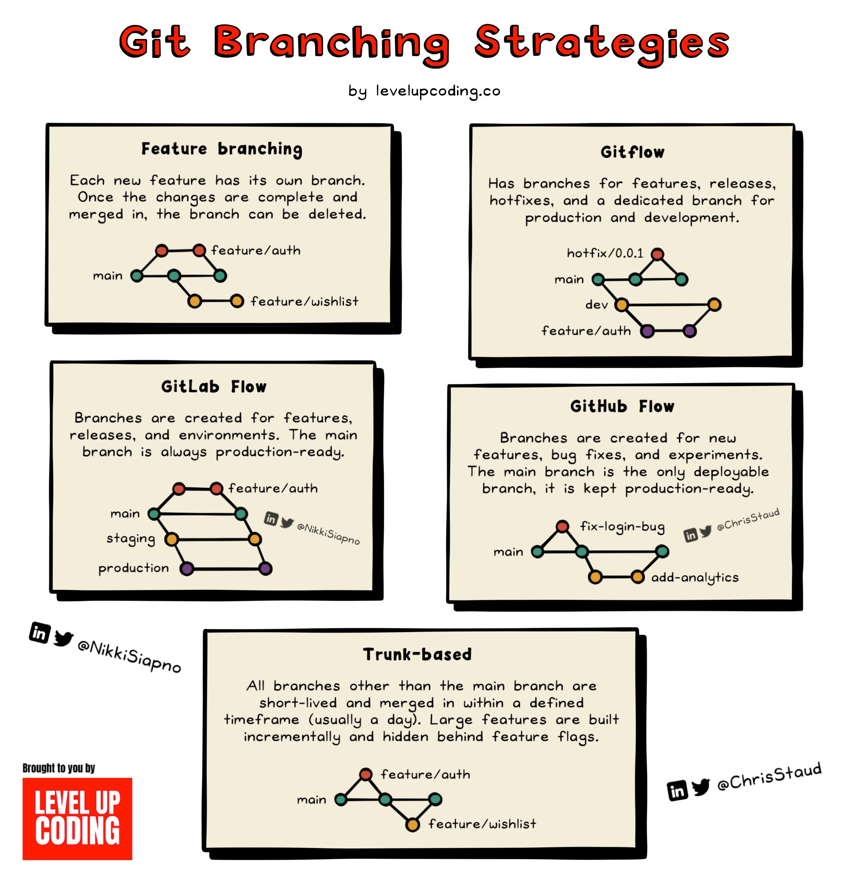

# **Analysis, Design and Software Architecture (BDSA)**
Week 2
[Eduard Kamburjan](eduard.kamburjan@itu.dk)


## Plan for this week

- Wednesday: Working together on software projects (Branching strategies and GitHub)
- Friday: Building Software, refactoring

<!-- First hour -->

## Reminder

 - What is software engineering? 
 - Git data model


## Process: Working together via Git Repositories

- **Centralized** (Source: <a href="https://git-scm.com/book/en/v2/Distributed-Git-Distributed-Workflows">https://git-scm.com/book/en/v2/Distributed-Git-Distributed-Workflows</a>)
  


## Process: Working together via Git Repositories

- **Integration-Manager** (Source: <a href="https://git-scm.com/book/en/v2/Distributed-Git-Distributed-Workflows">https://git-scm.com/book/en/v2/Distributed-Git-Distributed-Workflows</a>)
  


## Process: Working together via Git Repositories on GitHub

One specific implementation of the Integration-Manager Workflow is The GitHub Flow:

(Source: <a href="https://git-scm.com/book/en/v2/GitHub-Contributing-to-a-Project">https://git-scm.com/book/en/v2/GitHub-Contributing-to-a-Project</a>)

  * 1. Fork the project.
  * 2. Create a topic branch from `main` (or any other indicated branch).
  * 3. Make some commits to improve the project.
  * 4. Push this branch to your GitHub project.
  * 5. Open a Pull Request on GitHub.
  * 6. Discuss, and optionally continue committing.
  * 7. The project owner merges or closes the Pull Request.
  * 8. Sync the updated master back to your fork. 


## Process: Working together via Git Repositories on GitHub

 * In your projects, you decide between Centralized and Integration-Manager Workflow.
 * Centralized Workflow may be more easy to start with


## Task: Branches in Git? What was that?

<!--
_backgroundImage: "linear-gradient(to bottom, #67b8e3, #0288d1)"
_color: white
_header: 10 minutes
-->

<style scoped>
pre {
   font-size: 20px;
}
section {
  font-size: 20px;
}
</style>

- To understand `git` branches, navigate your browser to https://onlywei.github.io/explain-git-with-d3/#branch, enter the following sequence of commands, and observe how the `git` history evolves in the visualization
  ```bash
  git branch bug_fix
  git checkout bug_fix
  git commit -m"Fix bug"
  git checkout master
  git branch feature_new
  git checkout feature_new
  git commit -m"Add feature"
  git checkout master
  git merge feature_new
  git merge bug_fix
  ```

- To understand merging of `git` branches, navigate your browser to https://onlywei.github.io/explain-git-with-d3/#merge, enter the following sequence of commands, and observe how the `git` history evolves in the visualization.

  ```bash
  git checkout ff
  git checkout dev
  git checkout master
  git merge ff
  git checkout dev
  git merge ff
  ```


## Process: Branching Strategies

<!-- Git Branching Strategies -->



- Main strategies
  * Feature-based strategy
  * Trunk-based strategy
  * Multi-branch strategies
 
- Main Concepts
   * Long-lived or short-lived branches
   * Isolation of features, merge risk, release rate
   * Rest of process, e.g., 
     * Integration-manager vs. centralized
     * Code reviews vs. CI/CD


## Trunk-based Development

  > A source-control branching model, where developers collaborate on code in a single branch called ‘trunk’, **resist any pressure to create other long-lived development branches** by employing documented techniques. They therefore avoid merge hell, do not break the build, and live happily ever after.

Source: <a href="https://trunkbaseddevelopment.com/#one-line-summary">Paul Hammant</a>

  > ... trunk-based development, where each developer divides their own work into small batches and merges that work into trunk at least once (and potentially several times) a day. The key difference between [feature branches and trunk-based development] is scope. Feature branches typically involve multiple developers and take days or even weeks of work. In contrast, branches in trunk-based development typically last no more than a few hours, with many developers merging their individual changes into trunk frequently.

Source: <a href="https://dora.dev/devops-capabilities/technical/trunk-based-development/">DevOps Research and Assessment (DORA)</a>


## Trunk-based Development

 - For your project, use trunk-based branching 


(Image source: <a href="https://trunkbaseddevelopment.com/#">trunkbaseddevelopment.com, Paul Hammant</a>)


<!-- Second hour -->

## Process: Make work visible

- One problem with software and its development, it is and intagible and invisible artifact.
- One does not know how far we are in its construction and how much work there is left to its completion.
- In physical engineering projects that is more easily accessed.
- Solution for us software engineers: make work visible via suitable project planning tools.


Image Source: <a href="https://policywatch.dk/nyheder/christiansborg/article11254367.ece">PolicyWatch</a>


## Process: Organizing work on GitHub with Issues

* Despite the name, an issue usually describes a _requirement_ to a software system. They can describe _new features_, _bugs_, nice to have _enhancements_, etc.
* For us, one issue is one unit of work. 
* Sometimes issues are called _tickets_. 

* Many issue trackers are available, e.g., [Jira](https://www.atlassian.com/jira), we use GitHub issues 


Image Source: <a href="https://medevel.com/top-12-free-and-open-source-project-management-systems/">MEDevel.com</a>


## Process: How to write an Issue?

Describe User Stories.

  > the common structure for a user story addresses the “who, what, and why” of a feature:
  >
  > As a (user type), I want to (task) so that (goal).
  > ...
  > We suggest sticking that user story in the issue’s title.
  >
  > The point is to make the GitHub issue well-defined for everyone involved: it identifies **the audience** (or user), **the action** (or task), and **the outcome** (or goal) as simply as possible.

Source: <a href="https://blog.zenhub.com/best-practices-for-github-issues/
">https://blog.zenhub.com/best-practices-for-github-issues/</a>


## How to write an Issue?

- `As a <role>, I want <goal> [, so that <benefit>].` 
Source: <a href="https://research.utwente.nl/files/5122998/REFSQ2016_Proceedings_Springer_Book_-Editors_Maya_Daneva_and_Oscar_Pastor.pdf#page=209">Lucassen, Garm, et al. "The use and effectiveness of user stories in practice."</a>

- `In order to <receive benefit> as a <role>, I can <goal/desire>`
Source: <a href="http://antonymarcano.com/blog/2011/03/fi_stories/
">Antony Marcano</a>
- `As <who> <when> <where>, I want <what> because <why>` 
Source: <a href="https://t2informatik.de/en/smartpedia/user-story/
">Blog from t2informatik GmbH</a>

-No matter which template you use, let the user story be followed by an _acceptance criteria_.

For example:

    As a user, I can log in through a third-party account.

    Acceptance criteria:
      * Can log in through Microsoft
      * Can log in through Google
      * Can log in through GitHub


## Writing _Good_ Issues

  > Ask yourself if it…
  >
  >   - is something of value to customers.
  >   - avoids jargon or mumbo jumbo. A non-expert should be able to understand it.
  >   - “slices the cake,” which means it goes end-to-end to deliver something of value.
  >   - is independent of other issues if possible. Dependent issues reduce the flexibility of scope.
  >   - is negotiable, meaning there are usually several ways to get to the stated goal.
  >   - is small and easily estimable in terms of time and resources required.
  >   - is measurable; you can test for results.

Source: <a href="https://blog.zenhub.com/best-practices-for-github-issues/
">https://blog.zenhub.com/best-practices-for-github-issues/</a>


## Writing _Good_ Issues

Use the _INVEST_ acronym:

> * Independent: The User Story stands for itself and is independent of other stories.
> * Negotiable: The content is negotiable and is gradually described in more detail until it can be implemented.
> * Valuable: It is valuable and offers the user or customer an added value or benefit.
> * Estimable: The effort to realise it must be estimable by the developers.
> * Small: It is so small that it can be realised within one iteration or sprint.
> * Testable: It has acceptance criteria and can be tested.

Sources: <a href="https://xp123.com/articles/invest-in-good-stories-and-smart-tasks/">Original article by Bill Wake</a>, <a href="https://t2informatik.de/en/smartpedia/user-story/
">Blog from t2informatik GmbH"</a>, alternative good description from <a href="https://community.atlassian.com/t5/Jira-articles/Definition-of-Ready-Keeping-Your-Backlog-in-Check/ba-p/1828324">Atlassian</a>


## Writing _Good_ Issues


Other practitioners have other but similar opinions on the characteristics of a _good_ issue, which you might want to skim:

- https://medium.com/nyc-planning-digital/writing-a-proper-github-issue-97427d62a20f
- https://github.com/rstudio/rstudio/wiki/Writing-Good-Feature-Requests
- https://developers.google.com/blockly/guides/contribute/get-started/write_a_good_issue
- https://rewind.com/blog/best-practices-for-using-github-issues/
- https://hackernoon.com/45-github-issues-dos-and-donts-dfec9ab4b612

Image Source: <a href="https://medium.com/nyc-planning-digital/writing-a-proper-github-issue-97427d62a20f">medium.com</a>


## Task: Write an Issue

<!--
_backgroundImage: "linear-gradient(to bottom, #67b8e3, #0288d1)"
_color: white
_header: 15 minutes
-->

<style scoped>
section {
  font-size: 24px;
}
</style>

With your neighbors, navigate to your groups repository and create an issue (use the link with your group number `<no>` replaced `https://github.com/ITU-BDSA2025-GROUP<no>/Chirp/issues/new/choose`)
Choose one of the tasks of this week's project work and describe it in an issue, e.g., choose [task 2.d)](./README_PROJECT.md#2d-refactor-chirpclis-programcs-to-use-an-external-library-cli-interface).

- Use the user story template `In order to <receive benefit> as a <role>, I can <goal/desire>`.
- Write a suitable acceptance criteria.
- Is the issue you describe a _feature_, a _bug_, an _enhancement_ or something else? Label it accordingly.


## Collaboration; How to Work Together?


With work explicitely described in issues, it is clear _what_ you have to work on. But it is not clear which work tasks are more important than others, which are currently worked on, which are already completed, etc.

Consequently, software projects use often some form of project board to make the status of a project visible.

Image Source: <a href="https://docs.github.com/assets/cb-167219/mw-1440/images/help/projects-v2/example-board.webp">docs.github.com</a>


## Task: Project Board on GitHub

<!--
_backgroundImage: "linear-gradient(to bottom, #67b8e3, #0288d1)"
_color: white
_header: 10 minutes
-->

- Navigate to your project group organization on GitHub, e.g., `https://github.com/ITU-BDSA2025-GROUP<no>/Chirp`.
- Click `Projects` on top of the page, and then create a new project (green button in the center).
- Call the project `ITU-BDSA2025-GROUP<no> Chirp`, where `<no>` is your group's number.
- Choose to create a project board from the `Team planning` project template (to the left).
- Add the issues that you already have in your repository, e.g., the one from the previous task by clicking the command palette (`>_` icon on the top) followed by `Add items`

<!--
https://docs.github.com/en/issues/tracking-your-work-with-issues/creating-an-issue
https://docs.github.com/en/issues/planning-and-tracking-with-projects/creating-projects/creating-a-project
https://docs.github.com/en/issues/planning-and-tracking-with-projects/learning-about-projects/quickstart-for-projects
 -->

## Summary
- Integration workflows
- Branching strategies
- Issues and project boards on github
- Exercise sessions: Finish tasks from this lecture and project task from last week
- Friday: Details on building .net software


<!-- Third hour -->

## Building Software
   - What is software?

   * [Software is ...] the programs, procedures, rules, and associated documentation of an information processing system (Source: ISO/IEC/IEEE 24765:2010)
   * Software is the collection of all artifacts, which allows suitably educated persons with access to specified and suitable hardware to instantiate a running system. (Source: Pfeiffer, What Constitutes Software? 2020)

   * Building software is to transform software into a form where it can be used
   * Building software is not just compilation, and compilation is not a single step

<!--
## Building .NET Projects

* So far, you invoked your programs via `dotnet run`, which calls internally `dotnet build`
* Why does it matter how to build software?
* What is software?

    > Software is the collection of **all artifacts**, which allows **suitably educated persons** with access to specified and suitable **hardware** to **instantiate** a running system.
    >
    > Additionally, the collection of such artifacts allows such suitably persons to **understand** and **reason** about a systems' working and properties and let them **understand** why the system is as it is and why it behaves the way it does.-->

  <!-- That is, software is first software once it can be **executed** (instantiated). To be able to run software you have to first build (and distribute) it -->


<!--
## Task: Download and run a program
-->
<!--
-->

<!--
- Download the following program: [`hello.zip`](./hello.zip).
- Decompress the downloaded ZIP file, and run the program via:

```bash
cd ~/Downloads
unzip hello.zip
./hello
```

Can you actually run the program?

- If yes, what do you see?
- If not, what do you see?
-->

## Task: Build a program

<!--
_backgroundImage: "linear-gradient(to bottom, #67b8e3, #0288d1)"
_color: white
_header: 15 minutes
-->

<style scoped>
pre {
   font-size: 20px;
}
section {
  font-size: 20px;
}
</style>

- Navigate to the .NET/C♯ project in today's lecture notes [`bdsa_greeter`](./bdsa_greeter)
- There (`cd bdsa_greeter`), build the project with `dotnet build`, and inspect the results of the build with `ls -ltrh bin/Debug/net8.0/`.
- Now, run `dotnet publish`, and compare the results in `ls -ltrh bin/Release/net8.0/<RID>/publish` to the results of the build step `ls -ltrh bin/Debug/net8.0/`
  - Replace `<RID>` with either `win-x64`, `osx-64`, `osx-arm64`, or `linux-x64` depending on your operating system.
  - What do you see in the `publish` directory?
- Now, toggle the `PublishSingleFile` property of the project file [`bdsa_greeter.csproj`](./bdsa_greeter/bdsa_greeter.csproj) to false, i.e., line 10 becomes `<PublishSingleFile>false</PublishSingleFile>`
  - Run `dotnet publish` again, and compare its results in `ls -ltrh bin/Release/net8.0/publish/` with the previous results.
  - What happens when you run `dotnet bin/Release/net8.0/publish/hello.dll`?
- Lastly, toggle the `SelfContained` property of the project file [`bdsa_greeter.csproj`](./bdsa_greeter/bdsa_greeter.csproj) to true, i.e., line 11 becomes `<SelfContained>true</SelfContained>`
  - Run `dotnet publish` again, and compare its results in `ls -ltrh bin/Release/net8.0/<RID>/publish` with the previous results.

Describe to each other what you are seeing in the different publishing steps.

---

### How to build .NET software?

  > Applications you create with .NET can be published in two different modes, and the mode affects how a user runs your app.
  >
  > Publishing your app as **self-contained** produces an **application that includes the .NET runtime and libraries**, and your application and its dependencies. Users of the application can run it on a machine that doesn't have the .NET runtime installed.
  >
  > Publishing your app as **framework-dependent** produces an **application that includes only your application itself and its dependencies**. Users of the application have to separately install the .NET runtime.

Source: <a href="https://learn.microsoft.com/en-us/dotnet/core/deploying">Microsoft</a>

 - PublishSingleFile controls how to package the dll components, not the runtime

---

### How to build .Net software?


  > `dotnet publish` compiles the application, reads through its dependencies specified in the project file, and publishes the resulting set of files to a directory. The output includes the following assets:
  >
  >  * Intermediate Language (IL) code in an assembly with a `dll` extension.
  >  * A .deps.json file that includes all of the dependencies of the project.
  >  * A .runtimeconfig.json file that specifies the shared runtime that the application expects, as well as other configuration options for the runtime (for example, garbage collection type).
  >  * The application's dependencies, which are copied from the NuGet cache into the output folder.
  >
  > Publishing an app as framework-dependent produces a cross-platform binary as a `dll` file, and a platform-specific executable that targets your current platform. The `dll` is cross-platform while the executable isn't.

Source: <a href="https://learn.microsoft.com/en-us/dotnet/core/deploying/#publish-framework-dependent">Microsoft</a>

---

### Dynamically linked binaries

- The .NET compiler creates dynamically linked binaries (see previous example)
- Other languages, e.g., Go, create statically linked binaries.

---

### Static vs. dynamic linking


Image Source: <a href="https://www.baeldung.com/cs/dynamic-linking-vs-dynamic-loading">Baeldung</a>

---

### "Fat" statically linked binaries

- A statically linked binary (for a single file applications) does not necessarily contain everything we need to run a program
- Some languages, e.g., Go, allow to build "Fat" statically linked binaries
- Fat binaries include all static artifacts that a program may need during execution.

```go
import _ "embed"

//go:embed hello.txt
var s string
print(s)
```

Source: <a href="https://pkg.go.dev/embed">Official documentation</a> and <a href="http://www.inanzzz.com/index.php/post/1rwm/including-and-reading-static-files-with-embed-directive-at-compile-time-in-golang">a blog post on that topic</a>


## Intro to `make` and `Makefile`s

- Building software requires multiple commands, executed in a correct order to build the final binaries
- These commands and their order form another artifact: a build file
- Build systems handle the building of software, based on build files
- Build systems [are non-trivial software in themselves](https://www.microsoft.com/en-us/research/uploads/prod/2018/03/build-systems.pdf).


## Intro to `make` and `Makefile`s

- One of the oldest and most widely build tools is the `make` tool.

  > Make originated with a visit from Steve Johnson (author of yacc, etc.), [...] waste a morning debugging a correct program (bug had been fixed, file hadn't been compiled, cc *.o was therefore unaffected). [... It] began with an elaborate idea of a dependency analyzer, boiled down to something much simpler, and turned into Make that weekend. Use of tools that were still wet was part of the culture. Makefiles were text files, not magically encoded binaries, because that was the Unix ethos: printable, debuggable, understandable stuff.

Source: <a href="https://en.wikipedia.org/wiki/Make_(software)">Stuart Feldman, The Art of Unix Programming, Eric S. Raymond 2003</a>


## The `make` Tool


Source: <a href="https://makefiletutorial.com/">https://makefiletutorial.com/</a>


-Let's investigate a `Makefile`  for the previous example [.NET project `Makefile`](bdsa_greeter/Makefile)
- A good introduction of `Makefile`s and their syntax can be found [here](https://makefiletutorial.com/) and [here](https://ocw.mit.edu/courses/1-124j-foundations-of-software-engineering-fall-2000/pages/lecture-notes/makefile_primer)


<!-- Fourth hour -->

## Parsing CLI arguments and options

 - Last session, we extracted command line arguments and options that are passed to your program on invocation from the `args[]` property
- CLI APIs can be complicated, and are hard to document
- Use CLI argument libraries

---
### Example: Parsing CLI arguments and options with `docopt.net`

```csharp
const string usage = @"Chirp CLI version.

Usage:
  chirp read <limit>
  chirp cheep <message>
  chirp (-h | --help)
  chirp --version

Options:
  -h --help     Show this screen.
  --version     Show version.
";

var arguments = new Docopt().Apply(usage, args, version: "1.0", exit: true)!;
```


* install the `docopt.net` library, a third-party dependency into your project, e.g., via `dotnet add package docopt.net`.


## Design: Review of your current _Chirp!_ systems

<!--
_backgroundImage: "linear-gradient(to bottom, #deb887, #d17e12)"
_color: white
-->

- So far the design of your _Chirp!_ applications is as simple as it can get:
  
  - One package contains the all the code in one single class, likely with two methods
  - Note the above is illustrated as an [UML Package diagram](https://www.uml-diagrams.org/package-diagrams-overview.html) combined with a [UML class diagram](https://www.uml-diagrams.org/class-diagrams-overview.html). A package in .NET terms is a _project_

* What is good about this design and what could be improved/changed?

<!-- @Helge: illustrate that on Chirp example code from session 1.--> 


## Task: Identify potential refactorings

<!--
_backgroundImage: "linear-gradient(to bottom, #67b8e3, #0288d1)"
_color: white
_header: 10 minutes
-->

- We realize that storing and retrieving data to/from a CSV file is a generally useful feature that we might want to use independently of _Chirp!_.

- Sketch a potential refactoring of the source code of your current _Chirp!_ CLI tool that would allow to reuse a CSV file-based database in other applications too.


## Design: Refactor the design of your current _Chirp!_ systems

<!--
_backgroundImage: "linear-gradient(to bottom, #deb887, #d17e12)"
_color: white
-->

<style scoped>
section {
  font-size: 20px;
}
</style>

We realize that our current implementation is tightly coupled to our _Chirp!_ CLI tools. This coupling is two-dimensional:

  1. Reading and writing of CSV files has to be factored out of the _Chirp!_ CLI tools.
  2. Reading and writing of other data than `cheeps` should be supported to be generally useful

<!-- @Helge: illustrate that on Chirp example code! -->

* Therefore, in your project work, you will refactor the "database" engine of _Chirp!_ so that it looks as in the following
     


## The World's Simplest Database

Actually, in last week's project work, you built a database that is similar to _"the world's simplest database"_:

```bash
#!/usr/bin/env bash
db_set () {
    echo "$1,$2" >> database
}
db_get () {
    grep "^$1," database | sed -e "s/^$1,//" | tail -n 1
}
```

```
$ db_set 123456 '{"name":"London","attractions":["Big Ben","London Eye"]}'
$ db_set 42 '{"name":"San Francisco","attractions":["Golden Gate Bridge"]}'
$ db_get 42
```

Source: Martin Kleppmann <i>Designing Data-Intensive Applications_ ch.3, p.69ff</i>

## Task: Understanding Generics in C♯

<!--
_backgroundImage: "linear-gradient(to bottom, #67b8e3, #0288d1)"
_color: white
_header: 5 minutes
-->

<style scoped>
pre {
   font-size: 22px;
}
section {
  font-size: 22px;
}
</style>

- What is the meaning and purpose of `T` in that interface? Discuss with your neighbors.

```csharp
namespace SimpleDB;

public interface IDatabaseRepository<T>
{
    public IEnumerable<T> Read(int? limit = null);
    public void Store(T record);
}
```

Hint: Think about a client program, i.e., a program that uses `SimpleDB` for persistence, where a client `Program.cs` could contain the following:


```csharp
IDatabaseRepository<Cheep> database = new CSVDatabase<Cheep>();
...
var cheep = new Cheep("Peter", "Hello!", DateTimeOffset.UtcNow.ToUnixTimeSeconds()
database.Store(cheep);
...
public record Cheep(string Author, string Message, long Timestamp);
```


## Design: Depend on Abstractions

<!--
_backgroundImage: "linear-gradient(to bottom, #deb887, #d17e12)"
_color: white
-->

- The general concern of storing and retrieving data is independent of the underlying technology.
- In future, we might decide that our data should not be stored in CSV files anymore but instead in a relational, document-oriented, etc. database
- We create an interface that specifies the generic concern of retrieving and storing data.


```csharp
namespace SimpleDB;

interface IDatabaseRepository<T>
{
    public IEnumerable<T> Read(int? limit = null);
    public void Store(T record);
}
```

## Task: Create a library project

<!--
_backgroundImage: "linear-gradient(to bottom, #67b8e3, #0288d1)"
_color: white
_header: 5 minutes
-->

- We realize that storing and retrieving data is something that is a separate concern that should be implemented independently from the _Chirp!_ application.

- Therefore, in your project work, you will have to create a new library project that implements everything related to persisting data to and retrieving data from CSV files.

- Create a new library project: `dotnet new classlib -n SimpleDB`
- In it create a file `IDatabaseRepository.cs`, e.g., via `touch IDatabaseRepository.cs`
- Place the code from the previous task in it:
  ```csharp
  namespace SimpleDB;

  interface IDatabaseRepository<T>
  {
      public IEnumerable<T> Read(int? limit = null);
      public void Store(T record);
  }
  ```


## Summary

 - Workflows and branching
 - Building and refactoring
 - What now?
   - If not done, complete the Tasks (blue slides) from this class
   - Check the [reading material](./READING_MATERIAL.md) 
   - Work on the [project](./README_PROJECT.md)
 - Next week: Testing, continuous building


If you feel you want prepare for next session, read chapters 35 and 36 from [Andrew Lock _ASP.NET Core in Action, Third Edition_](https://www.manning.com/books/asp-net-core-in-action-third-edition) 
