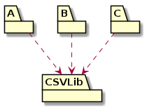
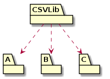
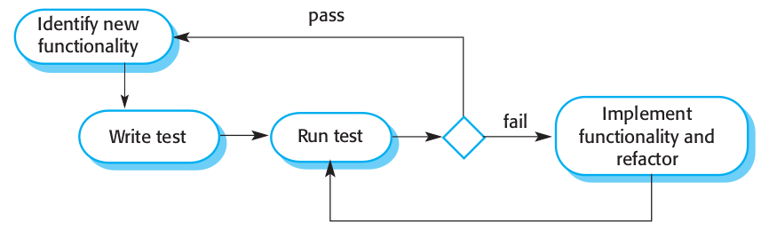

# **Analysis, Design and Software Architecture (BDSA)**
Session 3
[Helge Pfeiffer, Assistant Professor](ropf@itu.dk)


## Plan for today

- First hour: Feedback and handling dependencies
- Second hour: Intro to testing and unit testing
- Third hour: Integration and end-to-end testing
- Fourth hour: Continuous build and testing with GitHub Actions workflows

<!-- First hour -->

## Survey: How is it going so far?

- Go to https://www.menti.com/
- Use code: 6353 6231
- Complete the survey

## Feedback

How is it going?

* Are you really working on the projects?
* Merge branches to main -> At least at the end of the day.
* Read precisely! Interface spec is fixed.


## Feedback

- Remember to add a `.gitignore` file to your projects
  * Your repositories should not be littered with artifacts that are not part of your _Chirp!_ systems! `.DS_Store` files, etc.
  * **OBS**: `.gitignore` files have to be placed in root of your repositories (`.vscode` dir has to be there too)!
* Add an `.editorconfig` file, so that you apply all the same code conventions.

* Remember to clean up
  - Delete unused branches after they were merged to main.

* How to structure our projects?
  - I will provide info about this today, see under structuring projects with testing.


## Feedback

- Why do we need to refactor?
  * In this course's project work, we are simulating that you incrementally gain knowledge in a domain.
  * The more you know about possible solutions, the more they look different.
  * Constant refactoring is the core of _agile_ development processes.

- No matter what you do, do it KISS!


## Feedback: Solution File???

- > A solution is a container to organize one or more related code projects, like a class library project and a corresponding test project.<font size=3>
Source: <a href="https://learn.microsoft.com/en-us/visualstudio/get-started/tutorial-projects-solutions?view=vs-2022">Microsoft's Documentation</i></a>
</font>
- Manually create a new solution file: `dotnet new sln`
- Manually add a project to a solution `dotnet sln add todo-app/todo-app.csproj`, see https://learn.microsoft.com/en-us/dotnet/core/tools/dotnet-sln
- Why do I need one?
  - VS Code needs them to offer code completion and other IDE features.
  - > If you are using editor like VS Code then solution file facilitate to build all those project which are part of solution just by running "dotnet build" command. If projects were not part of solution then you need to build them individually.<font size=3>
Source: <a href="https://stackoverflow.com/a/43427349">StackOverflow</i></a>
</font>

<!-- ---------------------------------------------------------------------- -->
## Semantic Versioning


  > Given a version number MAJOR.MINOR.PATCH, increment the:
  >
  >   MAJOR version when you make incompatible API changes
  >   MINOR version when you add functionality in a backward compatible manner
  >   PATCH version when you make backward compatible bug fixes
  >
  > Additional labels for pre-release and build metadata are available as extensions to the MAJOR.MINOR.PATCH format.
  ><font size=3>
Source: <a href="https://semver.org/">Semantic Versioning Specification</i></a>
</font>

<font size=3>
Image source: <a href="https://blog.greenkeeper.io/introduction-to-semver-d272990c44f2">I. J. Gebauer<i>Introduction to SemVer</i></a>
</font>
<!-- ---------------------------------------------------------------------- -->


## Task: How to choose a dependency?

<!--
_backgroundImage: "linear-gradient(to bottom, #67b8e3, #0288d1)"
_color: white
_header: 10 minutes
-->

During last week's project, we asked you to use an external library to handle CSV files and another one for parsing CLI arguments and options.

When you have to choose between one of the following libraries for CSV file handling:

- [Csv](https://www.nuget.org/packages/Csv)
- [CsvHelper](https://www.nuget.org/packages/CsvHelper)
- [ServiceStack.Text](https://www.nuget.org/packages/ServiceStack.Text)
- [LumenWorksCsvReader](https://www.nuget.org/packages/LumenWorksCsvReader)
- [CsvTextFieldParser](https://www.nuget.org/packages/CsvTextFieldParser)
- [CsvTools](https://www.nuget.org/packages/CsvTools)

If you had to choose now, which of the CSV libraries would you choose and why? Discuss with your neighbors, which criteria are the basis for your decision?


## Choosing Dependencies

[Robert C. Martin in _Agile Principles, Patterns, and Practices in C♯_](https://dl.acm.org/doi/10.5555/1162257) formulates the _"Stable-dependency Principle" (SDP)_:

  > **Depend in the direction of stability**
  > ...
  > A component with lots of incoming dependencies is very stable, because it requires a great deal of work to reconcile any changes with all the dependent components.


## Choosing Dependencies
<style scoped>
section {
  font-size: 24px;
}
</style>

| Stable Component | Instable Component |
|--|--|
|  |  |
| CSVLib depends on nothing, so it has no external influence to make it change. We say it is independent | CSVLib has three components that it depends on, so changes may come from three external sources, CSVLib is dependent.

* That is, you should choose dependencies that have as many as possible users (other's that depend on it) and that depend on as few as possible other dependencies.
If a chosen dependency depends on others, the dependency tree should be as shallow as possible.

<font size=3>
Source: Images and text adapted from <a href="https://dl.acm.org/doi/10.5555/1162257">Robert C. Martin <i>Agile Principles, Patterns, and Practices in C♯</i></a>
</font>


## Choosing Dependencies

<style scoped>
section {
  font-size: 21px;
}
</style>

Of course, there are other concerns to take into consideration:

* Age:
  - The older a piece of widely used software, the better.
  - Likely the fewer bugs it has and the lower the reasons for it to change.
* Frequency of new minor versions:
  - May indicate that a library is under active maintenance.
  - Take it with a grain of salt. Libraries can also be feature complete, which may reduce update frequencies.
* Frequency of new major versions:
  - May indicate that a library is under active development, i.e., receives many new features, and many breaking changes.
  - That increases maintenance burden of you. You have to change your code to keep up-to-date with new versions of your dependency
* Legal considerations: On October 12th, we will have a guest lecture from Henrik, a lawyer who will give you an introduction to software licenses.


## Recommendation: Regularly Update Dependencies

<!--
_backgroundImage: "linear-gradient(to bottom, #e18ac2, #d112a5)"
_color: white
-->

  > **Regularly Update Dependencies**
  > Don’t let your code base fall behind its dependencies. Check for updates at a regular schedule. It’s easy to forget, but if you fall too far behind, it could be difficult to catch up.<font size=3>
Source: <a href="https://blog.ploeh.dk/2021/06/14/new-book-code-that-fits-in-your-head/">Mark Seemann <i>Code That Fits in Your Head</i></a>
</font>

## Task: Update Dependencies Automatically

<!--
_backgroundImage: "linear-gradient(to bottom, #67b8e3, #0288d1)"
_color: white
_header: 10 minutes
-->

 Dependabot is a tool that is integrated in GitHub. For many package managers, it can automatically check for new versions of dependencies. It will send a pull-request with new versions of dependencies, which you can review and merge if desired.

Read the guide in this [blog post](https://dev.to/berviantoleo/automatic-updates-nuget-package-with-dependabot-when-using-github-part-1-3jlk) and configure dependabot to work on your repository.

```yaml
version: 2
updates:
- package-ecosystem: nuget
  directory: "/"
  schedule:
    interval: daily
  open-pull-requests-limit: 25
```

<!-- Related documentation:
https://github.blog/2020-06-01-keep-all-your-packages-up-to-date-with-dependabot/
https://docs.github.com/en/code-security/dependabot/dependabot-version-updates/configuring-dependabot-version-updates
https://docs.github.com/en/code-security/dependabot/dependabot-alerts/configuring-dependabot-alerts
https://docs.github.com/en/code-security/dependabot/dependabot-version-updates/configuration-options-for-the-dependabot.yml-file#example-of-a-basic-setup-for-three-package-managers -->

<!-- ---------------------------------------------------------------------- -->
<!-- Second hour -->

## Intro to Testing

### Why shall we test at all?

*  > Testing is intended to show that a program does what it is intended to do and to discover program defects before it is put into use.<font size=3>
Source: <a href="https://www.pearson.com/en-gb/subject-catalog/p/software-engineering-global-edition/P200000005464/9781292096148">Ian Sommerville <i>Software Engineering</i></a>
</font>

* > [Software Quality...] degree to which a software product satisfies stated and implied needs when used under specified conditions<font size=3>
Source: <a href="https://www.iso.org/obp/ui/#iso:std:iso-iec:25010:ed-1:v1:en">International Organization for Standardization <i>Systems and software engineering — Systems and software Quality Requirements and Evaluation (SQuaRE) — System and software quality models</i></a>
</font>

* > [Software Quality...] degree to which a software product meets established requirements<font size=3>
Source: <a href="https://standards.ieee.org/standard/730-2014.html"><i>IEEE 730-2014 IEEE Standard for Software Quality Assurance Processes</i></a>
</font>

---

### Why shall we test?

  > GWS is the web server responsible for serving Google Search queries and is as important to Google Search as air traffic control is to an airport. Back in 2005, as the project swelled in size and complexity, productivity had slowed dramatically. Releases were becoming buggier, and it was taking longer and longer to push them out. Team members had little confidence when making changes to the service, and often found out something was wrong only when features stopped working in production. (**At one point, more than 80% of production pushes contained user-affecting bugs that had to be rolled back.**)
  > ...
  > To address these problems, the tech lead (TL) of GWS decided to institute a policy of engineer-driven, automated testing. As part of this policy, **all new code changes were required to include tests, and those tests would be run continuously**. Within a year of instituting this policy, the **number of emergency pushes dropped by half**. This drop occurred despite the fact that the project was seeing a record number of new changes every quarter.<font size=3>
Source: <a href="https://abseil.io/resources/swe-book/html/ch11.html">T. Winters et al. <i>Software Engineering at Google</i></a>
</font>

---

### What are tests?

  > The simplest test is defined by:
  > * A single behavior you are testing, usually a method or API that you are calling
  > * A specific input, some value that you pass to the API
  > * An observable output or behavior
  > * A controlled environment such as a single isolated process<font size=3>
Source: <a href="https://abseil.io/resources/swe-book/html/ch11.html">T. Winters et al. <i>Software Engineering at Google</i></a>
</font>

---

### White-box and black-box testing

Do you remember what they were?

* > _White-box_ testing, sometimes called structural testing or internal testing, **focuses on the text of the program**. The tester constructs a test suite [...] that demonstrates that all branches of the program’s choice and loop constructs — `if`, `while`, `switch`, `try`-`catch`-`finally`, and so on — can be executed. The test suite is said to cover the statements of the program.
  >
  > _Black-box_ testing, sometimes called external testing, **focuses on the problem that the program is supposed to solve**; or more precisely, the problem statement or specification for the program. The tester constructs a test data set that includes ‘typical’ as well as ‘extreme’ input data. In particular, one must include inputs that are described as exceptional or erroneous in the problem description.<font size=3>
Source: <a href="https://learnit.itu.dk/mod/resource/view.php?id=151551">P. Sestoft <i>Software Testing</i></a>
</font>

<!-- ---

### Testing stages


  > 1. Development testing, where the system is tested during development to discover bugs and defects. System designers and programmers are likely to be involved in the testing process.
  > 2. Release testing, where a separate testing team tests a complete version of the system before it is released to users. The aim of release testing is to check that the system meets the requirements of the system stakeholders.
  > 3. User testing, where users or potential users of a system test the system in their own environment. For software products, the “user” may be an internal marketing group that decides if the software can be marketed, released and sold. Acceptance testing is one type of user testing where the customer formally tests a system to decide if it should be accepted from the system supplier or if further development is required.<font size=3>
Source: <a href="https://www.pearson.com/en-gb/subject-catalog/p/software-engineering-global-edition/P200000005464/9781292096148">Ian Sommerville <i>Software Engineering</i></a>
</font> -->

## Unit Testing

What is the _unit_ in unit testing?

## Task: Your first .NET Unit Tests

<!--
_backgroundImage: "linear-gradient(to bottom, #67b8e3, #0288d1)"
_color: white
_header: 15 minutes
-->

- Clone the .NET example repository: `git clone --depth 1 https://github.com/dotnet/samples.git dotnet_samples`
- Change directory to a unit test example: `cd dotnet_samples/core/getting-started/unit-testing-using-dotnet-test/`
-  Execute the tests suite with `dotnet test`. What do you see?

Now:
- Inspect the system under test (SUT) in `PrimeService/PrimeService.cs`
- Inspect the corresponding unit tests in `PrimeService.Tests/PrimeService_IsPrimeShould.cs`


Finally and based on your inspections answer the question:

_What is the "unit" in unit testing?_


## Unit Tests for _Chirp!_

@Helge:
- Explain example from task
- illustrate on an exemplary _Chirp!_ implementation how unit tests for it could look like
- Highlight that test project contains a reference to the SUT

<!-- Third hour -->

## Integration Tests


  > In contrast to unit tests, integration tests:
  >
  > - Use the actual components that the app uses in production.
  > - Require more code and data processing.
  > - Take longer to run.
<font size=3>
Source: <a href="https://learn.microsoft.com/en-us/aspnet/core/test/integration-tests?view=aspnetcore-7.0">Jos van der Til et al.</a>
</font>


## Integration Tests

  > Integration tests check whether different chunks of code are interacting successfully in a local environment. A “chunk of code” can manifest in many ways, but **generally integration tests involve verifying service/API interactions**. Since integration tests are generally local, you may need to mock different services. <font size=3>
Source: <a href="https://www.twilio.com/blog/unit-integration-end-to-end-testing-difference">M. Tran from Twillio</a>
</font>


  > Integration tests possess the next level of complexity in the testing pyramid. They are more complex than the unit tests because you need to **handle code block dependency**. You are testing how a code snippet (the method most of the time) depends on another method to run and pass some value to it.
  >
  > [...] there is no special syntax to do it. **It’s the same syntax used in unit tests**. It’s just called integration since it’s testing code that depends on another.<font size=3>
Source: <a href="https://moduscreate.com/blog/an-overview-of-unit-integration-and-e2e-testing/">Modus Create</a>
</font>


## Integration Tests for _Chirp!_

@Helge:

- illustrate on an exemplary _Chirp!_ implementation how integration tests for CSVDB could look like
- Highlight that the XUnit framework is the same and that test methods look the same, only their content changes.


## End-to-end (E2E) Tests

  > End-to-End tests, or E2E tests, are a way of **verifying your code’s deployed behavior from a user perspective**. You automate a user simulation that interacts with your system as a black box, so all that matters is whether the user’s actions correspond to the correct output in a timely manner. These tests are typically done in a dev or staging environment, in order to match the production user interactions as closely as possible. <font size=3>
Source: <a href="https://www.twilio.com/blog/unit-integration-end-to-end-testing-difference">M. Tran from Twillio</a>
</font>

  > End-to-end (E2E) testing is a Software testing methodology to **test a functional and data application flow consisting of several sub-systems working together from start to end**.
  >
  > At times, these systems are developed in different technologies by different teams or organizations. Finally, they come together to form a functional business application. Hence, testing a single system would not suffice. Therefore, end-to-end testing verifies the application from start to end putting all its components together. <font size=3>
Source: <a href="https://microsoft.github.io/code-with-engineering-playbook/automated-testing/e2e-testing/">Code With Engineering Playbook</a>
</font>


<!-- ## End-to-end (E2E) Tests of C♯ CLI Programs

TODO: FIXME XUnit cannot handle this, shall we switch to NUnit? -> Currently no!

```csharp
  [Fact]
  public void TestReadTenCheeps()
  {
      // Arrange
      var args = new string[] { "read", "10" };
      // Act
      var result = Program.Main(args);
      // Assert
      Assert.Equal(0, result);
  }
```

<font size=3>
See for example: <a href="https://darthpedro.net/2021/02/15/lesson-1-10-cli-end-to-end-tests/">DarthPedro's Blog</a>
</font> -->


## End-to-end (E2E) Tests of Arbitrary CLI Programs

<style scoped>
pre {
   font-size: 18px;
}
</style>

```csharp
public class End2End
{
    [Fact]
    public void TestReadCheep()
    {
        // Arrange
        ArrangeTestDatabase();
        // Act
        string output = "";
        using (var process = new Process())
        {
            process.StartInfo.FileName = "/usr/bin/dotnet";
            process.StartInfo.Arguments = "./src/Chirp.CLI.Client/bin/Debug/net7.0/chirp.dll read 10";
            process.StartInfo.UseShellExecute = false;
            process.StartInfo.WorkingDirectory = "../../../../../";
            process.StartInfo.RedirectStandardOutput = true;
            process.Start();
            // Synchronously read the standard output of the spawned process.
            StreamReader reader = process.StandardOutput;
            output = reader.ReadToEnd();
            process.WaitForExit();
        }
        string fstCheep = output.Split("\n")[0];
        // Assert
        Assert.StartsWith("ropf", fstCheep);
        Assert.EndsWith("Hello, World!", fstCheep);
    }
}
```

<font size=3>
See for example: <a href="https://darthpedro.net/2021/02/15/lesson-1-10-cli-end-to-end-tests/">DarthPedro's Blog</a>
</font>


## End-to-end (E2E) Tests for _Chirp!_

@Helge:
* illustrate on an exemplary _Chirp!_ implementation how E2E tests of a CLI program could look like


## Fluent Assertions

In case you think the above assertions in test cases are unintuitive to read, you might want to formulate them using [Fluent Assertions](https://fluentassertions.com/).

```csharp
using FluentAssertions;

string actual = "ABCDEFGHI";
actual.Should().StartWith("AB").And.EndWith("HI").And.Contain("EF").And.HaveLength(9);
```


```csharp
IEnumerable<int> numbers = new[] { 1, 2, 3 };

numbers.Should().OnlyContain(n => n > 0);
numbers.Should().HaveCount(4, "because we thought we put four items in the collection");
```

<font size=3>
Source: <a href="https://fluentassertions.com/introduction">Fluent Assertions Documentation</i></a>
</font>

---

### Recommended distribution of tests:


<font size=3>
Source: <a href="https://abseil.io/resources/swe-book/html/ch11.html">T. Winters et al. <i>Software Engineering at Google</i></a>
</font>

---

### Test suite anti-pattern


<font size=3>
Source: <a href="https://abseil.io/resources/swe-book/html/ch11.html">T. Winters et al. <i>Software Engineering at Google</i></a>
</font>


## Test-driven Development (TDD)



<font size=3>
Source: <a href="https://www.pearson.com/en-gb/subject-catalog/p/software-engineering-global-edition/P200000005464/9781292096148">Ian Sommerville <i>Software Engineering</i></a>
</font>


## Recommendation: TDD — Red Green Refactor

<!--
_backgroundImage: "linear-gradient(to bottom, #e18ac2, #d112a5)"
_color: white
-->

> **Red Green Refactor**
> When engaging in test-driven development, follow the Red Green Refactor process. You can think of it as a checklist:
> 1. Write a failing test.
>     - Did you run the test?
>     - Did it fail?
>     - Did it fail because of an assertion?
>     - Did it fail because of the last assertion?
> 2. Make all tests pass by doing the simplest thing that could possibly work.
> 3. Consider the resulting code. Can it be improved? If so, do it, but make sure that all tests still pass.
> 4. Repeat.<font size=3>
Source: <a href="https://blog.ploeh.dk/2021/06/14/new-book-code-that-fits-in-your-head/">Mark Seemann <i>Code That Fits in Your Head</i></a>
</font>


## Test-driven Development (TDD)

In this course, we do not follow TDD, i.e., we do not require you to _first_ write tests that fail, which you then implement to make them pass. Once the tests pass your implementation is "complete".

However, we require that you from now on implement tests along side your solution. That is, at times you develop a test before the actual implementation of a feature, sometimes afterwards, and likely most of the time you implement them in combination, i.e., as your understanding and implementation of the solution evolves your tests evolve, etc.


## How to organize code in projects?

<style scoped>
pre {
   font-size: 16px;
}
</style>

One way could be to just put all .NET projects in the root of your repository, but don't do it.
```
.
├── Chirp_session_03.sln
├── data
│   └── chirp.csv
├── LICENSE
├── Makefile
├── README.md
├── scripts
│   └── initDB.sh
├── Chirp.CLI.Client
│   ├── Chirp.CLI.Client.csproj
│   ├── Program.cs
│   └── UserInterface.cs
├── Chirp.CSVDB
│   ├── Chirp.CSVDB.csproj
│   └── Database.cs
├── Chirp.CLI.Client.Tests
│   ├── Chirp.CLI.Client.Tests.csproj
│   ├── End2EndTests.cs
│   ├── IntegrationTests.cs
│   ├── UnitTests.cs
│   └── Usings.cs
└── Chirp.CSVDB.Tests
    ├── Chirp.CSVDB.Tests.csproj
    ├── IntegrationTest.cs
    └── Usings.cs
```

<font size=3>
Source: <a href="https://learn.microsoft.com/en-us/dotnet/core/testing/unit-testing-with-dotnet-test">Unit testing C♯ in .NET Core using dotnet test and xUnit
</a>
</font>


## Recommended way to organize code in projects

<style scoped>
pre {
   font-size: 18px;
}
</style>

```
.
├── Chirp_session_03.sln
├── data
│   └── chirp.csv
├── LICENSE
├── Makefile
├── README.md
├── scripts
│   └── initDB.sh
├── src
│   ├── Chirp.CLI.Client
│   │   ├── Chirp.CLI.Client.csproj
│   │   ├── Program.cs
│   │   └── UserInterface.cs
│   └── Chirp.CSVDB
│       ├── Chirp.CSVDB.csproj
│       └── Database.cs
└── test
    ├── Chirp.CLI.Client.Tests
    │   ├── Chirp.CLI.Client.Tests.csproj
    │   ├── End2EndTests.cs
    │   ├── IntegrationTests.cs
    │   ├── UnitTests.cs
    │   └── Usings.cs
    └── Chirp.CSVDB.Tests
        ├── Chirp.CSVDB.Tests.csproj
        ├── IntegrationTest.cs
        └── Usings.cs
```

<font size=3>
Source: <a href="">A. Lock <i>ASP.NET Core in Action</i>Third Edition</a>, <a href="https://learn.microsoft.com/en-us/dotnet/core/tutorials/testing-with-cli">Organizing and testing projects with the .NET CLI</a>
</font>


## Refactoring a project to support tests


|:warning:| Remeber to use `git mv` instead of moving files directly when moving code around during refactoring. Otherwise, your version control gets confused.|
|-----|------------------------------------|


## Recommendations for Testing

<!--
_backgroundImage: "linear-gradient(to bottom, #e18ac2, #d112a5)"
_color: white
-->

<style scoped>
pre {
   font-size: 18px;
}
section {
  font-size: 22px;
}
</style>

- > **Arrange Act Assert**
  >
  > Structure automated tests according to the Arrange Act Assert pattern. Make it clear to readers where one section ends and the next begins.<font size=3>
Source: <a href="https://blog.ploeh.dk/2021/06/14/new-book-code-that-fits-in-your-head/">Mark Seemann <i>Code That Fits in Your Head</i></a>
</font>

  ```csharp
    [Fact]
    public void NinetynineIsNotPrime()
    {
        // Arrange
        var input = 99;
        // Act
        var result = _primeService.IsPrime(input);
        // Assert
        Assert.False(result);
    }
  ```


* > **Reproduce Defects as Tests**
  >
  > If at all possible, reproduce bugs as one or more automated tests.<font size=3>
Source: <a href="https://blog.ploeh.dk/2021/06/14/new-book-code-that-fits-in-your-head/">Mark Seemann <i>Code That Fits in Your Head</i></a>
</font>

<!-- ---------------------------------------------------------------------- -->
<!-- Fourth hour -->

## Process: GitHub Actions Workflows

<!-- - For building software
- For testing software
- For automating project boards and issue tracking
- For merging to main -->

Last time, we were discussing how to build .NET/C♯ software locally on your computers. There is a problem with this: _"It builds on my computer!?"_

That can be solved by having the same build and test environment for the entire team.

Build systems, such as, GitHub Actions, attempt to "abstract away" the environment by establishing one build environment for the entire development team.


## GitHub Actions

> GitHub Actions is a continuous integration and continuous delivery (CI/CD) platform that allows you to automate your build, test, and deployment pipeline. You can create workflows that build and test every pull request to your repository, or deploy merged pull requests to production.<font size=3>
Source: <a href="https://docs.github.com/en/actions/learn-github-actions/understanding-github-actions">GitHub Docs</a>
</font>


> A workflow is a configurable automated process that will run one or more jobs. Workflows are defined by a YAML file checked in to your repository and will run when triggered by an event in your repository, or they can be triggered manually, or at a defined schedule.<font size=3>
Source: <a href="https://docs.github.com/en/actions/using-workflows/about-workflows">GitHub Docs</a>
Image Source: <a href=" https://learn.microsoft.com/en-us/training/modules/introduction-to-github-actions/3-explore-actions-flow">Microsoft Training Material</a>
</font>


---

### Alternatives to GitHub Actions

- Self-hosted most often in bigger organizations and companies:
  - [Jenkins](https://jenkins.io/index.html)
  - [Bamboo](https://www.atlassian.com/software/bamboo)
  - [TeamCity](https://www.jetbrains.com/teamcity/)
  - [Concourse](https://concourse.ci)
  - [Azure DevOps Server](https://azure.microsoft.com/en-us/services/devops/server/)

- Build systems as a service:
  - [Travis CI](https://travis-ci.org/)
  - [CircleCI](https://circleci.com)
  - [Wercker](http://www.wercker.com)
  - [Azure Pipelines](https://azure.microsoft.com/en-in/products/devops/pipelines/)


## Task: Add a workflow to your project

<!--
_backgroundImage: "linear-gradient(to bottom, #67b8e3, #0288d1)"
_color: white
_header: 10 minutes
-->

- Navigate your browser to the [Quickstart for GitHub Actions](https://docs.github.com/en/actions/quickstart) article.
- Perform the steps described in the tutorial.

```yaml
name: GitHub Actions Demo
run-name: ${{ github.actor }} is testing out GitHub Actions 🚀
on: [push]
jobs:
  Explore-GitHub-Actions:
    runs-on: ubuntu-latest
    steps:
      - run: echo "🎉 The job was automatically triggered by a ${{ github.event_name }} event."
      - run: echo "🐧 This job is now running on a ${{ runner.os }} server hosted by GitHub!"
      - run: echo "🔎 The name of your branch is ${{ github.ref }} and your repository is ${{ github.repository }}."
      - name: Check out repository code
        uses: actions/checkout@v3
      - run: echo "💡 The ${{ github.repository }} repository has been cloned to the runner."
      - run: echo "🖥️ The workflow is now ready to test your code on the runner."
      - name: List files in the repository
        run: |
          ls ${{ github.workspace }}
      - run: echo "🍏 This job's status is ${{ job.status }}."
```

---

### GitHub Actions

  > GitHub tracks events that occur. Events can trigger the start of workflows.
  >
  > Workflows can also start on cron-based schedules and can be triggered by events outside of GitHub.
  >
  > They can be manually triggered.
  >
  > Workflows are the unit of automation. They contain Jobs.
  >
  > Jobs use Actions to get work done.
  > <font size=3>
Source: <a href="https://learn.microsoft.com/en-us/training/modules/introduction-to-github-actions/">GitHub Docs</a>
</font>

---

### GitHub Actions Workflows

<style scoped>
section {
  font-size: 21px;
}
</style>

  > Workflows include several standard syntax elements.
  >
  >  **Name**: is the name of the workflow. It's optional but is highly recommended. It appears in several places within the GitHub UI.
  >
  >  **On**: is the event or list of events that will trigger the workflow.
  >
  >  **Jobs**: is the list of jobs to be executed. Workflows can contain one or more jobs.
  >
  >  **Runs-on**: tells Actions which runner to use.
  >
  >  **Steps**: It's the list of steps for the job. Steps within a job execute on the same runner.
  >
  >  **Uses**: tells Actions, which predefined action needs to be retrieved. For example, you might have an action that installs node.js.
  >
  >  **Run**: tells the job to execute a command on the runner. For example, you might execute an NPM command.
  ><font size=3>
Source: <a href="https://learn.microsoft.com/en-us/training/modules/introduction-to-github-actions/5-describe-standard-workflow-syntax-elements">GitHub Docs</a>
</font>

---

### GitHub Actions Workflow Syntax

A more thorough description of GitHub Actions workflow syntax: <https://docs.github.com/en/actions/using-workflows/workflow-syntax-for-github-actions>

<!-- https://www.jenkins.io/doc/book/pipeline/jenkinsfile/#using-a-jenkinsfile -->

---

### GitHub Actions Events

- Scheduled events
- Code events
- Manual events
- Webhook events
- External events

<font size=3>
Source: <a href="https://docs.github.com/actions/learn-github-actions/events-that-trigger-workflows">GitHub Docs</a>
</font>

---

### GitHub Actions Jobs

  > By default, if a workflow contains multiple jobs, they run in parallel.


`needs` allows to define an order between jobs:

```yaml
jobs:
  startup:
    runs-on: ubuntu-latest
    steps:

      - run: ./setup_build_env.sh
  build:
    needs: startup
    steps:

      - run: ./build.sh
```

<font size=3>
Source: <a href="https://learn.microsoft.com/en-us/training/modules/introduction-to-github-actions/7-explore-jobs">GitHub Docs</a>
</font>

---

### GitHub Actions Runners

  > When you execute jobs, the steps execute on a Runner.
  >
  > The steps can be the execution of a shell script or the execution of a predefined Action.
  >
  > GitHub provides several hosted runners to avoid you needing to spin up your infrastructure to run actions.
  >
  > Now, the maximum duration of a job is 6 hours, and for a workflow is 72 hours.
  >
  ><font size=3>
Source: <a href="https://learn.microsoft.com/en-us/training/modules/introduction-to-github-actions/8-explore-runners">Microsoft Docs</a>
</font>

<!-- TODO: Add note on allowing GH Actions to write for releases Settings -> Actions -> General -> Workflow permissions enable "Read and write permissions" -->

---

### GitHub Actions Starter Workflows

<style scoped>
pre {
   font-size: 20px;
}
</style>

```yaml
name: .NET Build and Test

on:
  push:
    branches: [ $default-branch ]
  pull_request:
    branches: [ $default-branch ]

jobs:
  build:
    runs-on: ubuntu-latest

    steps:
    - uses: actions/checkout@v3
    - name: Setup .NET
      uses: actions/setup-dotnet@v3
      with:
        dotnet-version: 7.0.x
    - name: Restore dependencies
      run: dotnet restore
    - name: Build
      run: dotnet build --no-restore
    - name: Test
      run: dotnet test --no-build --verbosity normal
```

<font size=3>
Source: Adapted from <a href="https://github.com/actions/starter-workflows/blob/main/ci/dotnet.yml">GitHub Actions Starter Workflows</a>
</font>

## Task: Add a .NET Build and Test Workflow to Your Project

<!--
_backgroundImage: "linear-gradient(to bottom, #67b8e3, #0288d1)"
_color: white
__header: 15 minutes
-->
- Add the test and build workflow to the local `.github/workflows` directory, e.g., as `build_and_test.yml`.
- Add it to version control and push it to GitHub.
- Observe on `https://github.com/ITU-BDSA23-GROUP<no>/Chirp/actions` if your project can be build and passes the tests. If not, understand with the logs what is not working.

<style scoped>
pre {
   font-size: 12px;
}
section {
  font-size: 23px;
}
</style>

```yaml
name: .NET Build and Test

on:
  push:
    branches: [ $default-branch ]
  pull_request:
    branches: [ $default-branch ]

jobs:
  build:
    runs-on: ubuntu-latest

    steps:
    - uses: actions/checkout@v3
    - name: Setup .NET
      uses: actions/setup-dotnet@v3
      with:
        dotnet-version: 7.0.x
    - name: Restore dependencies
      run: dotnet restore
    - name: Build
      run: dotnet build --no-restore
    - name: Test
      run: dotnet test --no-build --verbosity normal
```

## Design: The Singleton Design Pattern

<!--
_backgroundImage: "linear-gradient(to bottom, #deb887, #d17e12)"
_color: white
-->


@Helge: Explain the purpose on the black board and illustrate with example from _Chirp!_ implementation.

We want to assure that not every time we ask a `Database` object, we are overwriting the underlying data store, i.e., the corresponding CSV file.


## Design: The Singleton Design Pattern

<!--
_backgroundImage: "linear-gradient(to bottom, #deb887, #d17e12)"
_color: white
-->


  > The Singleton class declares the static method `getInstance` that returns the same instance of its own class.
  >
  > The Singleton’s constructor should be hidden from the client code. Calling the `getInstance` method should be the only way of getting the Singleton object.<font size=3>
Source: <a href="https://refactoring.guru/design-patterns/singleton">A. Shvets <i>Dive Into DESIGN PATTERNS</i></a>
</font>


## What to do now?


- If not done, complete the Tasks (blue slides) from this class
- Check the [reading material](./READING_MATERIAL.md)
- Work on the [project](./README_PROJECT.md)


- <font color="#cecdce">If you feel you want prepare for next session, read chapters three, four, and five [Andrew Lock _ASP.NET Core in Action, Third Edition_](https://www.manning.com/books/asp-net-core-in-action-third-edition) </font>
