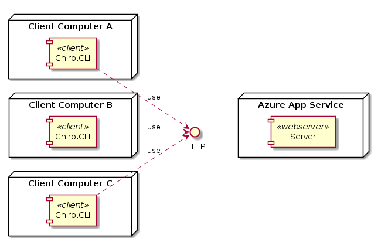
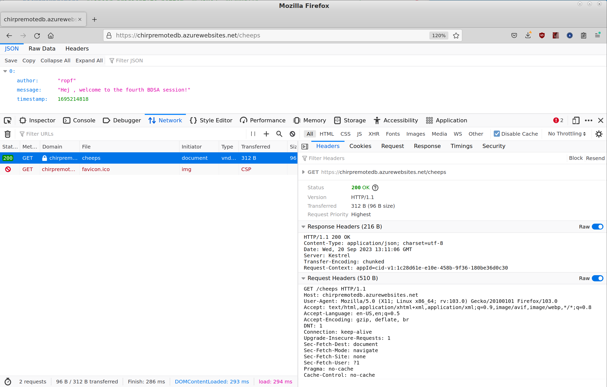
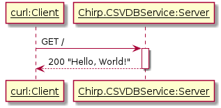
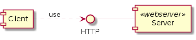
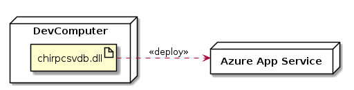
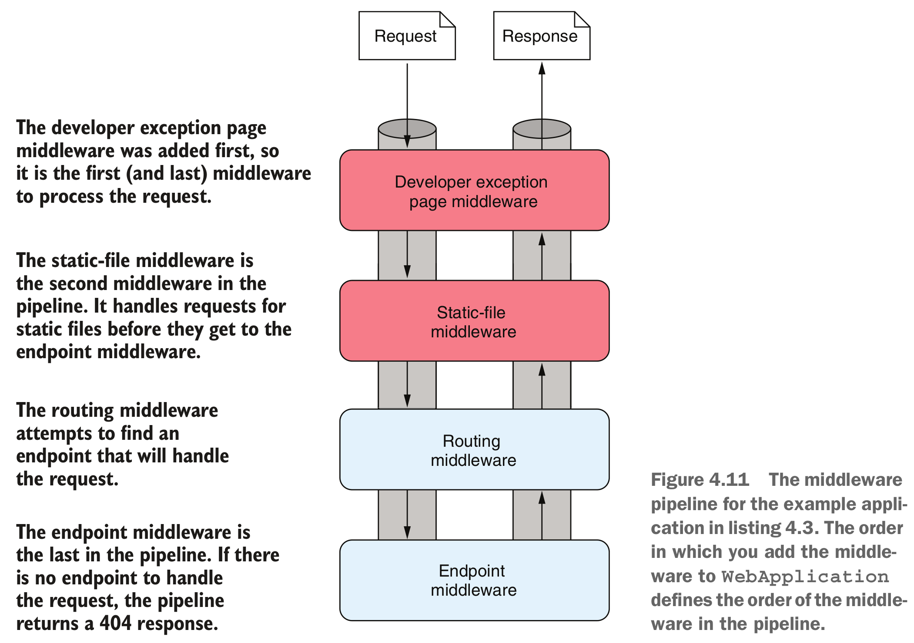

# **Analysis, Design and Software Architecture (BDSA)**
Session 4
[Helge Pfeiffer, Assistant Professor](ropf@itu.dk)


## Plan for today

- First hour: Feedback, Integration Patterns, and HTTP Intro
- Second hour: HTTP recap and Intro to Minimal Web API applications
- Third hour: Properties of ASP.Net Minimal Web applications
- Fourth hour: Deployment of Web applications


## Feedback: Cool

- You work on your projects
- You already learned a lot of new and complicated stuff

But ... :)

## Feedback: Use semantic versioning for your releases


- So tags and versions that look like 1.0.1 or v2.0.2 are good version numbers.
- Version numbers 0.5, v1. 2 are not

A good filename for a release contains the name of the project, the release version, and the target platform. That is,

* `Chirp.CLI-v.0.0.4-linux-x64.zip`, `Chirp-0.9.2-win-x64.zip`, or `chirp-v1.0.1-osx-arm64.zip` are all good release names.
* `linux-x64.tar.gz`, `Chirp-test_release-osx-x64.tar.gz`, `App-v0.1.8-macos.zip`, `v1.1.13`, etc. are all less good release names.

<font size=3>
See: <a href="https://semver.org/">Semantic Versioning Specification</i></a>
, Image source: <a href="https://blog.greenkeeper.io/introduction-to-semver-d272990c44f2">I. J. Gebauer<i>Introduction to SemVer</i></a>
</font>


## Feedback: Release what and how?

- Read precisely: publish only ZIP files for all three executables, no other compressed archive format (this is only for this course)
* Release only compressed executables (single-file, platform dependent), **no other artifacts**
  *  That is, no CSV files, no `*.sln` files , etc.
  * **single-file**: Release contains exactly _one_ file, if you have more than that, you publish wrongly.
  * **platform dependent**: Not the entire .NET runtime bundled!
  * That is, likely your releases will be 0.5MB in size (ca. 500KB) not ca. 63MB

* Most important: **Only working executables are released**!
  * > [Software Quality...] degree to which a software product satisfies stated and implied needs when used under specified conditions<font size=3>
Source: <a href="https://www.iso.org/obp/ui/#iso:std:iso-iec:25010:ed-1:v1:en">International Organization for Standardization <i>Systems and software engineering — Systems and software Quality Requirements and Evaluation (SQuaRE) — System and software quality models</i></a>
</font>


## Feedback

- 7 groups (ca. 27%) do not have a release yet?
- Remember, project work is graded and forms 2/3 of the final grade!


## Feedback

> One database file is actually quite unpractical for testing and "production".

👏👏👏

Absolutely, that is true! I wanted you to experience that.
What could you do to allow for testing and production ?

@Helge: draw these as images on black board

We will talk more about this design problem next time.

<!-- First hour -->

## Architecture: Integration Patterns

<!--
_backgroundImage: "linear-gradient(to bottom, #deb887, #d17e12)"
_color: white
-->

- Why is our _Chirp!_ application not cool yet?
  * It is not a social network, all cheeps are stored per user on the computer that runs the program.

* How can we modify our _Chirp!_ application so that it becomes a social network, i.e., so that we can read each other's cheeps?

* @Helge: with discussion from audience draw possible solutions on the blackboard

<!-- NFS, DB, WS, WA -->


## Task: Experiment with a distributed _Chirp!_ CLI system

<!--
_backgroundImage: "linear-gradient(to bottom, #67b8e3, #0288d1)"
_color: white
_header: 10 minutes
-->

- Download a new _Chirp!_ CLI client for your operating system: [Windows](clients/win/chirp.exe), [MacOS](clients/osx/chirp), or [Linux (and WSL)](clients/linux/chirp)
  - On MacOS/WSL/Linux make the file executable: `chmod u+x ~/Downloads/chirp`
- Write a cheep from the terminal with the new client
  - **OBS**: the usual netiquette applies, i.e., write only messages that you would utter at your grandma's coffee table
  - **OBS**: For now, write short cheeps, i.e., a single sentence.
  - `cd ~/Downloads`
  - `chirp[.exe] cheep "Hello!"` (Only Windows users have to add the `.exe` suffix)
- Now, read yours and your peer's cheeps on the terminal, e.g., via:
  - `chirp[.exe] read`
- Can you see cheeps that were not written by you? This is the goal for this lecture and this week's project work.


## How does this work?

How can the client that I have locally on my computer display cheeps that were written by my peers?




## Task: Send and Inspect HTTP Requests and Responses in the Browser

<style scoped>
section {
  font-size: 22px;
}
</style>

<!--
_backgroundImage: "linear-gradient(to bottom, #67b8e3, #0288d1)"
_color: white
_header: 10 minutes
-->

- Open your web browser
- Open its development tools (press F12 on Firefox, Edge, ...)
- Switch to the `Network` tab
- Enter the URL <https://chirpremotedb.azurewebsites.net/cheeps> in the address bar and hit return
- In the `Network` tab, click on the `GET` (blue document icon in Safari/Edge) request to the domain `chirpremotedb.azurewebsites.net`
- Inspect the headers and bodies of the sent request and the received response.
- Discuss with your neighbors what you see.




## Task: Send and Inspect HTTP Requests and Responses  via `curl`

<!--
_backgroundImage: "linear-gradient(to bottom, #67b8e3, #0288d1)"
_color: white
_header: 5 minutes
-->

- Open your terminal
- Send an HTTP request with the `curl` command
```bash
curl -v --header "accept: application/json" https://chirpremotedb.azurewebsites.net/cheeps
```
- Inspect the output and discuss it with your neighbors.
- If in doubt about the meaning of the provided options, read the corresponding documentation via `man curl` in the terminal.
- Discuss with your neighbors the output of the `curl` command and compare it to what you saw in the browser's network tool in the previous task.


## What was that?

- @Helge  Afterwards
  - show, inspect and explain the output of the command
  - show alternative in VS Code request tool

GET https://chirpremotedb.azurewebsites.net/cheeps


## Recap: Structure of HTTP Requests and Responses


  > - A start-line
  > - An optional set of HTTP headers
  > - A blank line indicating all meta-information for the request has been sent.
  > - An optional body containing data associated with the request.<font size=3>
Source and image source: <a href="https://developer.mozilla.org/en-US/docs/Web/HTTP/Messages">Mozilla Developer Network</a>
</font>


## Recap: HTTP headers

|Header Field |Description |Examples                                               |
|:------------|:-----------|:------------------------------------------------------|
|Accept       |I understand|`text/plain`<br>`application/json`<br>`application/xml`|
|Content-Type |I'm sending |`application/x-www-form-urlencoded`<br>`application/json; charset=utf-8`|
|Authorization|Who I am    |`Bearer ey`                                            |


## Recap: Kinds of HTTP Requests

Actions work on [_resources_](https://developer.mozilla.org/en-US/docs/Web/HTTP/Basics_of_HTTP/Identifying_resources_on_the_Web), i.e., the "thing" specified by the URL

|Action                 |Verb    |
|:----------------------|:-------|
|Request/Retrieve       |`GET`   |
|Like `GET` without body|`HEAD`  |
|Submit                 |`POST`  |
|Update/Replace         |`PUT`   |
|Delete                 |`DELETE`|
|Update/Modify          |`PATCH` |

More details on HTTP verbs: [here](https://developer.mozilla.org/en-US/docs/Web/HTTP/Methods)


## Recap: Kinds of HTTP Responses, Status Codes

|Codes      |Meaning                  |
|:----------|:------------------------|
| 100 – 199 | Informational responses |
| 200 – 299 | Successful responses    |
| 300 – 399 | Redirection messages    |
| 400 – 499 | Client error responses  |
| 500 – 599 | Server error responses  |

See https://developer.mozilla.org/en-US/docs/Web/HTTP/Status


## Recap: Kinds of HTTP Responses, Status Codes

|Code|Meaning|Code|Meaning|
|:---|:----  |:---|:----|
|200 |OK                                    |409 |Conflict              |
|201 |Created                               |415 |Unsupported Media Type|
|202 |Accepted                              |418 |I’m a Teapot          |
|204 |No Content                            |422 |Unprocessable Entity  |
|301 |Moved Permanently                     |500 |Internal Server Error |
|302 |Found (Previously "Moved temporarily")|501 |Not Implemented       |
|307 |Temporary Redirect                    |503 |Service Unavailable   |
|308 |Permanent Redirect                    |
|400 |Bad Request                           |
|401 |Unauthorized                          |
|403 |Forbidden                             |
|404 |Not Found                             |


## Application Templates in .NET

<style scoped>
pre {
   font-size: 14px;
}
</style>

```
dotnet new list
These templates matched your input:

Template Name                                 Short Name          Language    Tags
--------------------------------------------  ------------------  ----------  --------------------------------
ASP.NET Core Empty                            web                 [C#],F#     Web/Empty
ASP.NET Core gRPC Service                     grpc                [C#]        Web/gRPC
ASP.NET Core Web API                          webapi              [C#],F#     Web/WebAPI
ASP.NET Core Web App                          webapp,razor        [C#]        Web/MVC/Razor Pages
ASP.NET Core Web App (Model-View-Controller)  mvc                 [C#],F#     Web/MVC
ASP.NET Core with Angular                     angular             [C#]        Web/MVC/SPA
ASP.NET Core with React.js                    react               [C#]        Web/MVC/SPA
Blazor Server App                             blazorserver        [C#]        Web/Blazor
Blazor Server App Empty                       blazorserver-empty  [C#]        Web/Blazor/Empty
Blazor WebAssembly App                        blazorwasm          [C#]        Web/Blazor/WebAssembly/PWA
Blazor WebAssembly App Empty                  blazorwasm-empty    [C#]        Web/Blazor/WebAssembly/PWA/Empty
Class Library                                 classlib            [C#],F#,VB  Common/Library
Console App                                   console             [C#],F#,VB  Common/Console
dotnet gitignore file                         gitignore                       Config
Dotnet local tool manifest file               tool-manifest                   Config
EditorConfig file                             editorconfig                    Config
global.json file                              globaljson                      Config
MSBuild Directory.Build.props file            buildprops                      MSBuild/props
MSBuild Directory.Build.targets file          buildtargets                    MSBuild/props
MSTest Test Project                           mstest              [C#],F#,VB  Test/MSTest
MVC ViewImports                               viewimports         [C#]        Web/ASP.NET
MVC ViewStart                                 viewstart           [C#]        Web/ASP.NET
NuGet Config                                  nugetconfig                     Config
NUnit 3 Test Item                             nunit-test          [C#],F#,VB  Test/NUnit
NUnit 3 Test Project                          nunit               [C#],F#,VB  Test/NUnit
Protocol Buffer File                          proto                           Web/gRPC
Razor Class Library                           razorclasslib       [C#]        Web/Razor/Library
Razor Component                               razorcomponent      [C#]        Web/ASP.NET
Razor Page                                    page                [C#]        Web/ASP.NET
Solution File                                 sln,solution                    Solution
Web Config                                    webconfig                       Config
Worker Service                                worker              [C#],F#     Common/Worker/Web
xUnit Test Project                            xunit               [C#],F#,VB  Test/xUnit
```

## Task: Create an ASP.NET Minimal Web API

<!--
_backgroundImage: "linear-gradient(to bottom, #67b8e3, #0288d1)"
_color: white
_header: 15 minutes
-->

- Create a new minimal web api project:
```bash
dotnet new web -o Chirp.CSVDBService
```
- Thereafter, change directory to `cd Chirp.CSVDBService`
- Inspect the source code that was generated, especially `Program.cs`
- Build and run the project via `dotnet run`
  * Note the URL that is listed after `Now listening on:`
- In another terminal, send an HTTP `GET` request with `curl` to the application. (e.g., `curl -v http://localhost:5012`, or whichever other URL is listed after `Now listening on:`)
- Study and interpret the output with your neighbors.
- Repeat the process with the development tools of your browser
- Once done, stop the web service by pressing `CTRL+C`.


## Inspecting Example HTTP Request and Response

```
$ curl -v http://localhost:5012
*   Trying 127.0.0.1:5012...
* Connected to localhost (127.0.0.1) port 5012 (#0)
> GET / HTTP/1.1
> Host: localhost:5012
> User-Agent: curl/7.81.0
> Accept: */*
>
* Mark bundle as not supporting multiuse
< HTTP/1.1 200 OK
< Content-Type: text/plain; charset=utf-8
< Date: Tue, 04 Jul 2023 11:08:02 GMT
< Server: Kestrel
< Transfer-Encoding: chunked
<
* Connection #0 to host localhost left intact
Hello World!
```

@Helge: Explain the output above


## Building Web APIs

The application in the previous example returns a string in the body of the HTTP message, see the output of `curl`.

Web applications may return other kinds of data too.
- Web APIs often return data that is encoded as JSON.
- Web applications return most often HTML.


## Task: Create an ASP.Net Minimal Web API

<!--
_backgroundImage: "linear-gradient(to bottom, #67b8e3, #0288d1)"
_color: white
_header: 15 minutes
-->

- Restart the web api project from the previous task, now not with `dotnet run` but with `dotnet watch`.
- In another terminal, send an HTTP `GET` request with `curl` to the application. (e.g., `curl http://localhost:5012`, or whichever other URL is listed after `Now listening on:`)
- Modify the `Program.cs` from the previous task so that line 4 is replaced with
  ```csharp
  app.MapGet("/cheeps", () => new Cheep("me", "Hej!", 1684229348));
  ```
  and append the following line as new last line to `Program.cs`
  ```csharp
  public record Cheep(string Author, string Message, long Timestamp);
  ```
- In another terminal, send an HTTP `GET` request with `curl` to the new `cheeps` endpoint (e.g., `curl http://localhost:5012/cheeps`)
- What is the `Content-Type` of the HTTP response?


## Anonymous functions in C♯

- What was that???
  ```csharp
  () => new Cheep("me", "Hej!", 1684229348)
  ```

* Anonymous functions [also called lambdas] in C♯:
  * _Expression lambda_ that has an expression as its body:
    ```csharp
    (input-parameters) => expression
    ```
  * _Statement lambda_ that has a statement block as its body:
    ```csharp
    (input-parameters) => { <sequence-of-statements> }
    ```
<font size=3>
Source: <a href="https://learn.microsoft.com/en-us/dotnet/csharp/language-reference/operators/lambda-expressions">Microsoft Documentation</a>
</font>

@Helge: Show in code example how that would look like with normal method


## ASP.NET Automatically Serializes Objects into JSON for Transport over HTTP

The `Cheep` object from the following code

```csharp
app.MapGet("/cheeps", () => new Cheep("me", "Hej!", 1684229348));
```

gets automatically serialized into JSON by the ASP.NET Core framework:

```json
{"author":"me","message":"Hej!","timestamp":1684229348}
```

The same holds for the other way around. When you send a JSON object in a message body that has all corresponding fields, a C♯ object can be created automatically from that, e.g.,

```csharp
app.MapPost("/cheep", (Cheep cheep) => { ... });
```


## Web API??? What is that?

<style scoped>
pre {
   font-size: 24px;
}
section {
  font-size: 24px;
}
</style>

A Web _application programming interface (API)_ is an API that is accessible via a network

```csharp
WebApplicationBuilder builder = WebApplication.CreateBuilder(args);
WebApplication app = builder.Build();
...
// This is your Web API
app.MapGet("/cheeps", () => { ... });
app.MapPost("/cheep", (Cheep cheep) => { ... });

app.Run();
```
A "regular" _application programming interface (API)_ is an API that is accessible in code directly

```csharp
namespace Chirp.SimpleDB;

public interface IDatabaseRepository<T>
{
    public IEnumerable<T> Read(int? limit = null);
    public void Store(T record);
}
```


## Architecture: Our First Architectural Pattern

<!--
_backgroundImage: "linear-gradient(to bottom, #deb887, #d17e12)"
_color: white
-->

What kind of application did we build with `Chirp.CSVDBService` and `curl` or the web browser?

- A client-server application

* Dynamic view in UML sequence diagram illustrating interactions of components

* Static view in UML component diagram illustrating dependencies of components



## Sending and Receiving HTTP Requests programmatically in C♯/.NET

```csharp
using System.Net;
using System.Net.Http.Headers;
using System.Net.Http.Json;

// Create an HTTP client object
var baseURL = "http://localhost:5012";
using HttpClient client = new();
client.DefaultRequestHeaders.Accept.Clear();
client.DefaultRequestHeaders.Accept.Add(new MediaTypeWithQualityHeaderValue("application/json"));
client.BaseAddress = new Uri(baseURL);

// Send an asynchronous HTTP GET request and automatically construct a Cheep object from the
// JSON object in the body of the response
var cheep = await client.GetFromJsonAsync<Cheep>("cheeps");


public record Cheep(string Author, string Message, long Timestamp);
```


## Task: Brief Intro to Asynchronous Programming in C♯/.NET

<!--
_backgroundImage: "linear-gradient(to bottom, #67b8e3, #0288d1)"
_color: white
_header: 10 minutes
-->
What was this `await` keyword?

- In the directory of this lecture notes, you find an example called [`AsyncAwaitHTTP`](./AsyncAwaitHTTP/)
- In its [`src`](./AsyncAwaitHTTP/src/) directory, you find two .NET projects, one HTTP [`Server`](./AsyncAwaitHTTP/src/Server/) and one HTTP [`Client`](./AsyncAwaitHTTP/src/Client/).
- Start the server with `cd ./AsyncAwaitHTTP/src/Server/` followed by `dotnet run` in one terminal window
- Start the client in another terminal window with `cd ./AsyncAwaitHTTP/src/Client/` followed by `dotnet run`.
- Inspect the output of the client program.
- Now try to understand what the client is doing, see [`Program.cs`](./AsyncAwaitHTTP/src/Client/Program.cs).
  -  Discuss with your neighbors what is different in the two ways of calling the HTTP server.
  - Can you see, what makes the second example execute much faster than the first one?


## Brief Intro to Asynchronous Programming in C♯/.NET


- What was this `await` keyword?

* Network calls take long, for sure way longer than method calls in your programs running on your CPU.

@Helge: Demo on same example, what happens when `await`s in first example of the `Client`'s `Program.cs` are removed?

<table>
<tr>
<td>
<marp-pre is="marp-pre" data-auto-scaling="downscale-only"><code class="language-csharp"><span class="hljs-keyword">using</span> HttpClient client = <span class="hljs-keyword">new</span>();
client.BaseAddress = <span class="hljs-keyword">new</span> Uri(<span class="hljs-string">"http://localhost:5088"</span>);
<span class="hljs-comment">// Sequential execution</span>
<span class="hljs-keyword">var</span> watch = System.Diagnostics.Stopwatch.StartNew();
<span class="hljs-comment">// first HTTP request</span>
<span class="hljs-keyword">var</span> response = <span class="hljs-keyword">await</span> client.GetAsync(<span class="hljs-string">"/"</span>);
<span class="hljs-comment">// second HTTP request</span>
response = <span class="hljs-keyword">await</span> client.GetAsync(<span class="hljs-string">"/"</span>);
watch.Stop();
Console.WriteLine(<span class="hljs-string">$"Done after <span class="hljs-subst">{watch.ElapsedMilliseconds}</span>ms"</span>);</code></marp-pre>
</td>
<td>
<marp-pre is="marp-pre" data-auto-scaling="downscale-only"><code class="language-csharp"><span class="hljs-comment">// Concurrent execution</span>
watch = System.Diagnostics.Stopwatch.StartNew();
<span class="hljs-comment">// first HTTP request</span>
<span class="hljs-keyword">var</span> fstRequestTask = client.GetAsync(<span class="hljs-string">"/"</span>);
<span class="hljs-comment">// second HTTP request</span>
<span class="hljs-keyword">var</span> sndRequestTask = client.GetAsync(<span class="hljs-string">"/"</span>);
<span class="hljs-keyword">var</span> fstResponse = <span class="hljs-keyword">await</span> fstRequestTask;
<span class="hljs-keyword">var</span> sndResponse = <span class="hljs-keyword">await</span> sndRequestTask;
watch.Stop();
Console.WriteLine(<span class="hljs-string">$"Done after <span class="hljs-subst">{watch.ElapsedMilliseconds}</span>ms"</span>);
</code></marp-pre>
</td>
</tr>
</table>


## Note, Concurrency vs. Parallelism

| Concurrency | Parallelism |
|:--:|:--:|
| |  |

<font size=3>
Image source: <a href="https://freecontent.manning.com/concurrency-vs-parallelism/">Kirill Bobrov <i>Grokking Concurrency</i></a>
</font>


## Why does it matter?

Methods that are declared as `async` and that return a `Task` object in C♯ and whose results you have to `await` are comparable to concurrent functions that you start with `go` in Go in your distributed systems class.


## Making the CSV DB Server run on the internet

Running an HTTP server locally is good for development.

If you want to make your service accessible for everybody, i.e., if you want to have first version of _Chirp!_ that is a proper social network in which you can read other's cheeps and not only your's, you have to deploy it to the "internet".


## Brief introduction to hosting options.

* Functions-as-a-Service (FaaS)
* Software-as-a-Service (SaaS)
* Platform-as-a-Service (PaaS)
* Infrastructure-as-a-Service (IaaS)


For each of these options, there are many different providers. In this class, we use only Azure Service (a PaaS).
In case you are interested in IaaS, we will deepen that in next semester's elective _"DevOps, Software Evolution and Software Maintenance"_.

<font size=3>
Image source: <a href="https://www.linkedin.com/pulse/411-cloud-software-iaas-paas-saas-tracy-anne-griffin-manning">LinkedIn</a>
</font>


## Task: Deploy to App Service Manually

<!--
_backgroundImage: "linear-gradient(to bottom, #67b8e3, #0288d1)"
_color: white
_header: 10 minutes
-->

<style scoped>
pre {
   font-size: 20px;
}
section {
  font-size: 20px;
}
</style>

- In a previous task, you created the `Chirp.CSVDBService` minimal Web API project.
- In a terminal switch to this directory `cd <path/to/Chirp.CSVDBService>`.
- Login to App Service. The following should open a browser window indicating that you are now logged in. (Use your ITU credentials to login).
  ```bash
  az login
  ```
- After login, execute the following command. **OBS:** Replace `<no>` with the number of your group. This command deploys the current web application to Azure App Service.
  ```bash
  az webapp up --sku F1 --name bdsagroup<no>chirpremotedb --os-type Linux --location westeurope --runtime DOTNETCORE:7.0
  ```
- Once the commands completes, it should return a URL for your web application. It is likely `https://bdsagroup<no>chirpremotedb.azurewebsites.net` (again replace `<no>` with the number of your group.)
- Now, either with your web browser or with `curl`, send an HTTP GET request to `https://bdsagroup<no>chirpremotedb.azurewebsites.net/cheeps`.
- Do you receive a JSON object that corresponds to the following `Cheep` object?
  ```csharp
  new Cheep("me", "Hej!", 1684229348)
  ```


## Manually Deploy to Azure App Service

- Remember to take down the web service that you just deployed with `az webapp delete`, see `az webapp --help` in case you are in doubt of what you can do with a webapp on Azure App Service.

* What happened in the task?
  


## Automatically Deploy to App Service

<style scoped>
pre {
   font-size: 18px;
}
section {
  font-size: 20px;
}
</style>

- In your project work, you will add a step to your CI pipeline on GitHub Actions that deploys to Azure App Service automatically.
* You decide if that happens on every push to main, on a tag of a new version, etc.
* Why can't you just have another CI step that looks like in the following?

  ```yml
  name: Deploy

  on:
    push:
      branches: [ "main" ]

  jobs:
    deploy:
      name: Deploy

      runs-on: ubuntu-latest
      steps:
        - name: Checkout
          uses: actions/checkout@v3
  ...
        - name: Deploy
          shell: bash
          run: |
            az login
            az webapp up --sku F1 --name bdsagroup<no>chirpremotedb --os-type Linux --location westeurope --runtime DOTNETCORE:7.0
            az logout
  ```

## Automatically Deploy to App Service

<style scoped>
pre {
   font-size: 20px;
}
section {
  font-size: 20px;
}
</style>

In your project work, you will create a deployment workflow that will look similar to the following:

```yml
...
  deploy:
    permissions:
      contents: none
    runs-on: ubuntu-latest
    needs: build>
    environment:
      name: 'Development'
      url: ${{ steps.deploy-to-webapp.outputs.webapp-url }}

    steps:
      - name: Download artifact from build job
        uses: actions/download-artifact@v3
        with:
          name: .net-app

      - name: Deploy to Azure Web App
        id: deploy-to-webapp
        uses: azure/webapps-deploy@v2
        with:
          app-name: ${{ env.AZURE_WEBAPP_NAME }}
          publish-profile: ${{ secrets.AZURE_WEBAPP_PUBLISH_PROFILE }}
          package: ${{ env.AZURE_WEBAPP_PACKAGE_PATH }}
```
<font size=3>
Source: <a href="https://github.com/actions/starter-workflows/blob/main/deployments/azure-webapps-dotnet-core.yml">GitHub Actions starter-workflows repository.</a>
</font>

<!-- ------------------------------------------------------------------- -->

## Design: The Pipeline Pattern

<!--
_backgroundImage: "linear-gradient(to bottom, #deb887, #d17e12)"
_color: white
-->

ASP.NET application's middle ware uses the pipeline pattern to handle HTTP requests.

```csharp
WebApplicationBuilder builder = WebApplication.CreateBuilder(args);
WebApplication app = builder.Build();

// Configuration of the app's middleware pipeline
app.UseDeveloperExceptionPage();
app.UseStaticFiles();
app.UseRouting();

app.MapGet("/", () => "Hello World!");
app.Run();
```



<font size=3>
Example and image source: <a href="https://www.manning.com/books/asp-net-core-in-action-third-edition">Andrew Lock <i>ASP.NET Core in Action, Third Edition</i></a>
</font>

## Design: The Pipeline Pattern

<!--
_backgroundImage: "linear-gradient(to bottom, #deb887, #d17e12)"
_color: white
-->


> Middleware is software that's assembled into an app pipeline to handle requests and responses. Each component:
>
>  - Chooses whether to pass the request to the next component in the pipeline.
>  - Can perform work before and after the next component in the pipeline.

<font size=3>
Source and image source: <a href="https://learn.microsoft.com/en-us/aspnet/core/fundamentals/middleware/?view=aspnetcore-7.0">R. Anderson et al. <i>ASP.NET Core Middleware</i></a>
</font>


## Design: The Builder Pattern

<style scoped>
pre {
   font-size: 20px;
}
section {
  font-size: 20px;
}
</style>

<!--
_backgroundImage: "linear-gradient(to bottom, #deb887, #d17e12)"
_color: white
-->

| Object construction without Builder | ... with Builder Pattern |
|:--:|:--:|
| |  |


```csharp
var builder = WebApplication.CreateBuilder(args);
builder.Services.AddControllers();
builder.Services.AddEndpointsApiExplorer();
builder.Services.AddSwaggerGen();
WebApplication app = builder.Build();
```

More on that, the next time...<font size=3>
Image source: <a href="https://refactoring.guru/design-patterns/builder">A. Shvets <i>Design Patterns</i></a>
</font>


## Recommendation: Write _Short_ Units of Code

<!--
_backgroundImage: "linear-gradient(to bottom, #e18ac2, #d112a5)"
_color: white
-->

> **The 80/24 Rule**
>
> Write small blocks of code.
>
> In C-based languages like C#, Java, C++, or JavaScript, consider staying within a 80 × 24 character box. That corresponds to an old terminal window.
>
> Don’t take the threshold values 80 and 24 too literally. I picked them for three reasons:
>
> - They work well in practice
> - Continuity with tradition
> - Mnemonically, it sounds like the Pareto principle, also known as the 80/20 rule
>
> You can decide on other threshold values. I think the most important part of this rule is to pick a set of thresholds and consistently stay within those limits.<font size=3>
Source: Mark Seemann <i>"Code That Fits in Your Head"</i>
</font>


## Recommendation: Separate Kinds of Code

<!--
_backgroundImage: "linear-gradient(to bottom, #e18ac2, #d112a5)"
_color: white
-->

> **Command Query Separation**
>
> Separate Commands from Queries. Commands are procedures that have side effects. Queries are functions that return data. Every method should be either a Command or a Query, but not both.<font size=3>
Source: Mark Seemann <i>"Code That Fits in Your Head"</i>
</font>


## Recommendation: Hierarchy of Communication

<!--
_backgroundImage: "linear-gradient(to bottom, #e18ac2, #d112a5)"
_color: white
-->

> **Hierarchy of Communication**
>
> Write code for future readers; it may be yourself. Favour communicating behaviour and intent according to this prioritised list:
>
> 1. Guide the reader by giving APIs distinct types.
> 2. Guide the reader by giving methods helpful names.
> 3. Guide the reader by writing good comments.
> 4. Guide the reader by providing illustrative examples as automated tests.
> 5. Guide the reader by writing helpful commit messages in Git.
> 6. Guide the reader by writing good documentation.
>
> The items on the top of the list are more important than the items at the bottom.<font size=3>
Source: Mark Seemann <i>"Code That Fits in Your Head"</i>
</font>


## What to do now?


- If not done, complete the Tasks (blue slides) from this class
- Check the [reading material](./READING_MATERIAL.md)
- Work on the [project](./README_PROJECT.md)

- <font color="#cecdce">If you feel you want prepare for next session, read chapters 13, 14, and 15 [Andrew Lock _ASP.NET Core in Action, Third Edition_](https://www.manning.com/books/asp-net-core-in-action-third-edition) </font>
