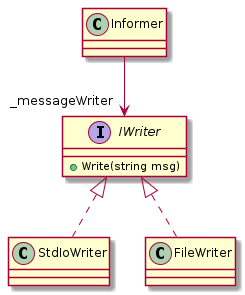

# **Analysis, Design and Software Architecture (BDSA)**
Session 5
[Helge Pfeiffer, Assistant Professor](ropf@itu.dk)


## Feedback: Who is authoring what?

- It is good that you record co-authors of you commits. However, you should make sure that it is not always the same group members that commit. Later today, we look at how to do pair-programming properly. This includes that everybody has to learn and become confident with committing.
- The same holds for who writes issues. It is not always the same person. You should all train to write issues.
- (And the same will hold for code reviews, which we discuss later today.)
- LLMs like ChatGPT, CodePilot, etc. are registered as co-authors as soon as you reused the tiniest bit of what they tell you while you are working on a task.


## Feedback: Where is our data?

- F1, the free tier, throws out your application automatically after a certain amount of inactivity. For now, this is okay since we are learning and want to experiment. We are not in production, where this would be a major concern!
- If you want to keep your data around and the applications always online, you have to switch to some other tier, for which you have to use your credits.
- Today, you will see how to use `Resources` to transfer data with your application, which you can seed on instantiation.
- Later in this course, we will create applications with a persistent database.


## Feedback: CSV databases as web services, Hmm.

- ☹️ Only 12/26 groups have a CSV database wrapped behind a web API up and running.
- ☹️ Some out of these return static data, not the data that was posted to them...
- ☹️ Some of them do not work with their CLI clients

* That is suboptimal. Especially, since you saw all the required building blocks during the last lecture.
* Are you sure you are using enough time on this course?


## Feedback: What is the exam going to be like?

- For now, I do not want to discuss that in great detail. I would like that you **focus on your project work**, which means learning all the new technologies, principles, practices, tools, etc.
- If you are interested in description of the exams, for now, check my slides in the first lecture and in the course description.
- After the fall break, I will detail the contents of the exam.

<!-- First hour -->

## Recap: HyperText Markup Language


- [The first web page](https://info.cern.ch/hypertext/WWW/TheProject.html)
- [The first HTML documentation](https://info.cern.ch/hypertext/WWW/MarkUp/MarkUp.html)


```
<!DOCTYPE html>
<html>
<head>
<title>Hej</title>
</head>
<body>

<h1>Hello, all!"</h1>
<p>Welcome to BDSA.</p>

</body>
</html>
```


## Task: What is the difference between a Web API/Web App?

<!--
_backgroundImage: "linear-gradient(to bottom, #67b8e3, #0288d1)"
_color: white
_header: 5 minutes
-->

- Navigate to `SimpleHTMLServer` (`cd SimpleHTMLServer`) and run the project with `dotnet run`
- Send a `curl` request to the root endpoint (`/`): `curl -v http://localhost:5181/`
- Now, send a `curl` request to the cheeps endpoint from last week's example (`/cheeps`): `curl -v https://chirpremotedb.azurewebsites.net/cheeps`
- Inspect the headers and bodies of the two HTTP responses. Discuss with your neighbors:
  - What is the same in these two?
  - What is different between these two?


## How could we make a web-app return HTML?

Last week, you wrote a small web service that exposed a JSON web API. You returned a list of objects, which ASP.NET automatically converted into JSON objects that are serialized into into respective strings in HTTP message bodies.

How could you convert a web API into a web app?

* ```csharp
  var htmlText = @"<h1>Hello World!</h1>
  I am an HTML document from the <a href='https://github.com/itu-bdsa/lecture_notes'>ITU BDSA course.</a>";
  app.Map("/", () => Results.Content(htmlText, "text/html"));
  ```

* @Helge: Demo on [`SimpleHTMLServer`](./SimpleHTMLServer/Program.cs) once as is and once without Content-Type


## What is the difference between a Web API/Web App?
<style scoped>
pre {
   font-size: 18px;
}
section {
   font-size: 20px;
}
</style>

The only real difference is the return type of the data in the HTTP bodies.

In your last week's project work, this was `Content-Type: application/json; charset=utf-8`. In the example above, it is `Content-Type: text/html; charset=utf-8`

```csharp
IEnumerable<Cheep> GetCheeps(int? limit = null)
{
    return database.Read(limit);
}

IResult GetCheepsHTML(int? limit = null)
{
    var htmlPage = @"<h1><i>Chirp!</i></h1>
    <form action=""/cheep"" method=""post"">
        <label>What is on your mind?</label>
        <input type=""text"" name=""text"" size=""60"">
        <input type=""submit"" value=""Share"">
    </form>
    <ul>";
    foreach (var cheep in database.Read(limit))
        htmlPage += $"<li><b>{cheep.Author}:</b> {cheep.Message}</li>\n";
    htmlPage += "</ul>";
    return Results.Content(htmlPage, "text/html; charset=utf-8");
}
```

@Helge: illustrate that with [Chirp.CSVDB.HTML](~/workspace/csharp/Chirp_session_05/src/Chirp.CSVDB.HTML)
(Not shared with students)


## Which Content-Type to use when?

- JSON is for machine-to-machine communication (application to application).
- HTML is for machine-to-human communication


## Why use a framework for web applications?

<style scoped>
pre {
   font-size: 18px;
}
section {
   font-size: 20px;
}
</style>

- Manually creating strings that contain well-formed and correct HTML, is difficult, error-prone, and violates the single-responsibility pattern in that logic is likely mixed with UI code.
- Consequently, web applications are often created with respective frameworks that support the creation of HTML responses and "filling-in" of data.
- The first such framework that we are discussing in this course is [Razor Pages](https://learn.microsoft.com/en-us/aspnet/core/razor-pages/?view=aspnetcore-7.0&tabs=visual-studio).
  - Note, I will call it just Razor in the remainder of this course.

```csharp
IResult GetCheepsHTML(int? limit = null)
{
    var htmlPage = @"<h1><i>Chirp!</i></h1>
    <form action=""/cheep"" method=""post"">
        <label>What is on your mind?</label>
        <input type=""text"" name=""text"" size=""60"">
        <input type=""submit"" value=""Share"">
    </form>
    <ul>";
    foreach (var cheep in database.Read(limit))
        htmlPage += $"<li><b>{cheep.Author}:</b> {cheep.Message}</li>\n";
    htmlPage += "</ul>";
    return Results.Content(htmlPage, "text/html; charset=utf-8");
}
```


## Intro to Razor Page applications


## Task: Install and use a Razor Page project template

<!--
_backgroundImage: "linear-gradient(to bottom, #67b8e3, #0288d1)"
_color: white
_header: 10 minutes
-->

- Navigate with your browser to https://github.com/itu-bdsa/Chirp.Templates/releases/latest
- From there, download the latest release of our project templates package, e.g., from the terminal via `wget`
  ```bash
  wget https://github.com/itu-bdsa/Chirp.Templates/releases/download/v1.0.3/BDSA.TEMPLATES.1.0.3.nupkg
  ```
- Install this new template package on your computer
  ```bash
  dotnet new install BDSA.TEMPLATES.1.0.3.nupkg
  ```
- Create a new minimal example application via `dotnet new chirp-razor -o Chirp.Razor`
- Inspect the generated code under [`Program.cs`](./Chirp.Razor/Program.cs), [`Pages/Public.cshtml`](./Chirp.Razor/Pages/Public.cshtml), and [`Pages/Public.cshtml.cs`](./Chirp.Razor/Pages/Public.cshtml.cs). Explain to each other what you see.
- Run the project


<!-- Second hour -->

## Razor Page???


> Each Razor page is a pair of files:
>
>  - A `.cshtml` file that has HTML markup with C♯ code using Razor syntax.
>  - A `.cshtml.cs` file that has C♯ code that handles page events.
>
<font size=3>
Source: <a href="https://learn.microsoft.com/en-us/aspnet/core/tutorials/razor-pages/razor-pages-start?view=aspnetcore-7.0&tabs=visual-studio-code#examine-the-project-files">Tutorial: Get started with Razor Pages in ASP.NET Core</a>
</font>


## Razor Page

The most simple Razor Page could look like the following. For it, the corresponding `.cs` could be non-existent.

```csharp
@page

<h1>Hello, world!</h1>
<h2>The time on the server is @DateTime.Now</h2>
```


## Razor Page

<style scoped>
pre {
   font-size: 18px;
}
</style>

```csharp
@page "/"
@model Chirp.Razor.Pages.PublicModel
@{
    // C# code that is not written to HTTP response
    ViewData["Title"] = "Chirp!";
    Layout = "Shared/_Layout";
}
// HTML code with dynamic C# values which is written to the HTTP response
<div>
    <h2> Public Timeline </h2>
    @if (Model.Cheeps.Any())
    {
        <ul id="messagelist" class="cheeps">
            @foreach (var cheep in Model.Cheeps)
            {
                <li>
                    <p>
                        <strong>
                            <a href="/@cheep.Author">@cheep.Author</a>
                        </strong>
                        @cheep.Message
                        <small>&mdash; @cheep.Timestamp</small>
                    </p>
                </li>
            }
        </ul>
    }
    else
    {
        <em>There are no cheeps so far.</em>
    }
</div>
```


## Mapping of Razor Pages to endpoints

- convention based: `@page` → `<PageName>.cshtml`
- explicit: `@page "/"` → `/`
- explicit parametrized: `@page "/{part}"` → e.g., `/a`, `/hello`, `uiuiui`, each of which is accessible in code under `part` variable.

See more possible mappings in the reading material.


## Architecture: MVC Pattern in Razor Page applications

<!--
_backgroundImage: "linear-gradient(to bottom, #deb887, #d17e12)"
_color: white
-->

> One of the advantages of using the MVC design pattern is that the model
representing the application’s data is decoupled from the final representation of that data, called the view. The controller is responsible for deciding whether the response should generate an HTML view, whether it should send the user to a new page, or whether it should return an error page. <font size=3>
Source: Andrew Lock <i>ASP.NET Core in Action</i>
</font>


<font size=3>
Image source: <a href="https://andrewlock.net/aspnetcore-in-action-2e-applying-the-mvc-design-pattern-to-razor-pages/">Andrew Lock <i>Applying the MVC design pattern to Razor Pages</i></a>
</font>


## Architecture: MVC Pattern in Razor Page applications

<!--
_backgroundImage: "linear-gradient(to bottom, #deb887, #d17e12)"
_color: white
-->

> I’m using the term Razor Page to refer to the combination of the Razor view and the `PageModel` that includes the page handler. Note that `PageModel` class is not the model we’re referring to when describing the MVC pattern. It fulfills other roles... <font size=3>
Source: Andrew Lock <i>ASP.NET Core in Action</i>
</font>

* What is the model in MVC then?


## Architecture: MVC Pattern in General

<!--
_backgroundImage: "linear-gradient(to bottom, #deb887, #d17e12)"
_color: white
-->


> Splits user interface interaction into three distinct roles.
>
> Model View Controller (MVC) is one of the most quoted (and most misquoted) patterns around. It started as a framework developed by Trygve Reenskaug for the Smalltalk platform in the late 1970s. Since then it has played an influential role in most UI frameworks and in the thinking about UI design.
>
> <font size=3>
Source: <a href="https://www.martinfowler.com/eaaCatalog/modelViewController.html">Martin Fowler</a>
</font>


## Architecture: Characteristics of server side rendered applications

<!--
_backgroundImage: "linear-gradient(to bottom, #deb887, #d17e12)"
_color: white
-->


> Web servers wait for client request messages, process them when they arrive, and reply to the web browser with an HTTP response message. The response contains a status line indicating whether or not the request succeeded (e.g. "HTTP/1.1 200 OK" for success).
>
> The body of a successful response to a request would contain the requested resource (e.g. a new HTML page, or an image), which could then be displayed by the web browser.
> <font size=3>
Source: <a href="https://developer.mozilla.org/en-US/docs/Learn/Server-side/First_steps/Introduction">MDN Web Docs</a>
</font>


## Architecture: Characteristics of server side rendered applications

<!--
_backgroundImage: "linear-gradient(to bottom, #deb887, #d17e12)"
_color: white
-->


<font size=3>
Image source: <a href="https://developer.mozilla.org/en-US/docs/Learn/Server-side/First_steps/Introduction">MDN Web Docs</a>
</font>


## Testing of web applications — Integration testing

- For earlier end-to-end tests of our CLI application, we started our application in a separate OS process and interacted with it.
- You could do the same with a web-application, i.e., start up the web server in a process and then send HTTP requests to the server.
- To make your tests more resource friendly, you can choose to start an in memory web server to test your applications instead, see e.g., section 36.3.2 in A. Lock _ASP.NET Core in Action_.


## Testing of web applications — Integration testing

<style scoped>
pre {
   font-size: 18px;
}
</style>

```csharp
public class TestAPI : IClassFixture<WebApplicationFactory<Program>>
{
    private readonly WebApplicationFactory<Program> _fixture;
    private readonly HttpClient _client;

    public TestAPI(WebApplicationFactory<Program> fixture)
    {
        _fixture = fixture;
        _client = _fixture.CreateClient(new WebApplicationFactoryClientOptions { AllowAutoRedirect = true, HandleCookies = true });
    }

    [Fact]
    public async void CanSeePublicTimeline()
    {
        var response = await _client.GetAsync("/public");
        response.EnsureSuccessStatusCode();
        var content = await response.Content.ReadAsStringAsync();

        Assert.Contains("Chirp!", content);
        Assert.Contains("Public Timeline", content);
    }

    [Theory]
    [InlineData("Helge")]
    [InlineData("Rasmus")]
    public async void CanSeePrivateTimeline(string author)
    {
        var response = await _client.GetAsync($"/{author}");
        response.EnsureSuccessStatusCode();
        var content = await response.Content.ReadAsStringAsync();

        Assert.Contains("Chirp!", content);
        Assert.Contains($"{author}'s Timeline", content);
    }
}
```


## Advertisement: ITU Career Weeks


27 September - 10 October, 2023
- Sign-up: https://itustudent.itu.dk/Event?id=%7bB05EED48-93A7-431D-B49E-DCA1068D7903%7d
- Full program: https://itustudent.itu.dk/study-and-career-guidance/your-career/-/media/67A803FBF21E4BE1A47453C03C3D5454.ashx


<!-- Third hour -->

## Task: DI

<!--
_backgroundImage: "linear-gradient(to bottom, #67b8e3, #0288d1)"
_color: white
_header: 10 minutes
-->

- Inspect the file `DIExample/Writer.cs`
  - It contains two classes, `StdIoWriter` and `FileWriter`.
- Now, in file [`DIExample/DirectDependency.cs`](DIExample/DirectDependency.cs) change the code so that the message that is provided is written to a file with the `FileWriter` instead of to stdout.
  - During this change note which files and classes you have to edit to make the example work as intended.
  - Sketch the dependency graph between `Informer` and `StdIoWriter` in a UML class diagram
- Now, using the code in file [`DIExample/InjectedDependency.cs`](DIExample/InjectedDependency.cs) change the code so that the message that is provided is written to a file with the `FileWriter` instead of to stdout.
  - During this change note which files and classes you have to edit to make the example work as intended.
  - Sketch the dependency graph between `Informer` and `FileWriter` in a UML class diagram


## Problem in the first case?


When you want to switch your application to a new writer, you have to modify the `Informer` class. However, it should not know anything about which specific writer is used, it is not its responsibilit.y


* > Single Responsibility
  >
  > The single responsibility principle applies to object-oriented design, but can also be considered as an architectural principle similar to separation of concerns. It states that objects should have only one responsibility and that they should have only one reason to change. Specifically, the only situation in which the object should change is if the manner in which it performs its one responsibility must be updated. <font size=3>
Source: <a href="https://learn.microsoft.com/en-us/dotnet/architecture/modern-web-apps-azure/architectural-principles#single-responsibility"><i>Architectural principles</i></a>
</font>


## Inversion of Dependencies

| Direct Dependency | Inversed Dependency |
|:--:|:--:|
| |  |


Find more information and illustrations on inversion of dependencies [here](https://learn.microsoft.com/en-us/dotnet/architecture/modern-web-apps-azure/architectural-principles#dependency-inversion).

## Dependency Injection, a Basic Example

```csharp
var theDependency = new DIExample.Writer.FileWriter();
// Here theDependency is injected into the Informer class
var informer = new InjectedDependencyExample.Informer(theDependency);
```

- Basic idea: reverse direction of a dependency by not relying on direct hard-coded dependencies.
- In our examples, it is often achieved by injecting a dependency to a class at construction time.
- The basic idea is more general:
  - When you call a binary with an argument, you inject information into the runtime without having the binary contain it directly.
  - You can inject information into a binary via environment variables.


## Dependency Injection in ASP.NET Core

From the `chirp-razor` project template

```csharp
var builder = WebApplication.CreateBuilder(args);

builder.Services.AddRazorPages();
// Wherever in the project an ICheepService implementation is needed, use the CheepService
// Use CheepService as a Singleton during application life time.
builder.Services.AddSingleton<ICheepService, CheepService>();
```

- The first time within the application that an instance of `CheepService` is required, let the ASP.NET framework create an instance and make it take care of that there is only _one_ instance ever created during application life time.
- See the [official documentation]( https://learn.microsoft.com/en-us/dotnet/core/extensions/dependency-injection) for more details.


You will see the above example again and again in the following weeks.

<!-- ---------------------------------------------------------------------- -->


## SQLite, a file based in process DB-engine


> SQLite is a complete, relational, transactional, ACID, SQL database database engine contained in a compact library that links into a larger application. There is no server. I/O is direct to disk.<font size=3>
Source: <a href="https://www.sqlite.org/src4/doc/trunk/www/design.wiki"><i>The Design Of SQLite4</i></a>, Image source: <a href="https://devopedia.org/sqlite">Devopedia <i>SQLite</i></a>
</font>


## Design: From where do you know the design of SQLite?

<!--
_backgroundImage: "linear-gradient(to bottom, #deb887, #d17e12)"
_color: white
-->

* SimpleDB? Your CSV-based database?
* | SimpleDB | SQLite |
  |--|--|
  |  |  |
  | SimpleDB, a file based in process DB-engine | SQLite, a file based in process DB-engine |
* In SQLite, there is no database server. Your program communicates with a library.
* Note, in reality, the picture to the right is a bit more complex since SQLite is written in C not C♯. So you have a cascading dependency to a shared library.
* For pedagogical reasons, you wrote a database engine that enables writing applications with the same architecture as SQLite applications.
* For the next three weeks, everything database related, we are doing with SQLite3.


## Task: Using SQLite from CLI

<!--
_backgroundImage: "linear-gradient(to bottom, #67b8e3, #0288d1)"
_color: white
_header: 5 minutes
-->

<style scoped>
pre {
   font-size: 20px;
}
section {
   font-size: 20px;
}
</style>

Usually, SQLite databases are just files on disk (it supports in memory files too).

- On the terminal, in the directory of this session, run the following two commands:
  ```bash
  sqlite3 /tmp/chirp.db < ./Chirp.SQLite/data/schema.sql
  sqlite3 /tmp/chirp.db < ./Chirp.SQLite/data/dump.sql
  ```
  - OBS: The above is Bash syntax, i.e., use WSL on Windows not the command prompt.
  - These commands create a database with the given schema (multiple SQL queries) and import data to it via multiple SQL queries. Look into the `.sql` files to see what they contain.
  - The database is stored in the file `/tmp/chirp.db`
- Check that the database file was created and is non-empty, e.g., via `ls -la`
- Now, connect via the `sqlite3` executable to the database and execute a query:
  - Connect to database: `sqlite3 /tmp/chirp.db` and execute the following two queries
  - ```sql
    SELECT COUNT(*) FROM message;
    ```
  - ```sql
    SELECT message.*, user.* FROM message, user WHERE message.author_id = user.user_id;
    ```
- To leave the `sqlite3` program, either type `.exit` or `CTRL+D`


## Task: Using SQLite from C♯

<!--
_backgroundImage: "linear-gradient(to bottom, #67b8e3, #0288d1)"
_color: white
_header: 10 minutes
-->

<style scoped>
pre {
   font-size: 19px;
}
section {
   font-size: 20px;
}
</style>

- Execute the example code in the directory of this session (`sessions/session_05`):
  ```bash
  cd Chirp.SQLite
  dotnet run
  ```
- Now, inspect the code in [Program.cs](./Chirp.SQLite/Program.cs)
  ```csharp
  var sqlDBFilePath = "/tmp/chirp.db";
  var sqlQuery = @"SELECT * FROM message ORDER by message.pub_date desc";

  using (var connection = new SqliteConnection($"Data Source={sqlDBFilePath}"))
  {
      connection.Open();

      var command = connection.CreateCommand();
      command.CommandText = sqlQuery;

      using var reader = command.ExecuteReader();
      while (reader.Read())
      {
          ...
      }
  }
  ```
- Can you describe to your neighbors what is going on in that code?
  - In which way differ the two ways that print the query results?


## SQLite directly in code

@Helge: Explain previous example (rows)
  - casts
  - Data record
  - Array of objects

Note, to use the SQL library in your own programs, you have to install the dependency

```bash
dotnet add package Microsoft.Data.Sqlite.Core --version 7.0.11
```

## `EmbeddedResource`s — Add other source code than C♯ to your project

<style scoped>
pre {
   font-size: 22px;
}
section {
   font-size: 22px;
}
</style>

- Almost all programs, rely on other data, code, or configuration that is not written in C♯.
- For this session, imagine that we want to seed data in our SQLite databases in case no database file exists.
- In the previous task, you saw the [`schema.sql`](./Chirp.SQLite/data/schema.sql) and [`dump.sql`](./Chirp.SQLite/data/dump.sql) queries that were used to initialize a database.

- If you want to bundle these files within your final `.dll`, you can include such artifacts as in the following (configuration is to be put into `.csproj` file):

```xml
  <ItemGroup>
    ...
    <EmbeddedResource Include="data/**/*" />
  </ItemGroup>
```

- The pattern `data/**/*` embeds all files under the `data` directory in the final `.dll` file, see [the official documentation](https://learn.microsoft.com/en-us/aspnet/core/fundamentals/file-providers?view=aspnetcore-7.0#glob-patterns)


## Reading `EmbeddedResource`s in .NET/C♯

```csharp
var embeddedProvider = new EmbeddedFileProvider(Assembly.GetExecutingAssembly());
using var reader = embeddedProvider.GetFileInfo("./data/schema.sql").CreateReadStream();
using var sr = new StreamReader(reader);

var query = sr.ReadToEnd();
```

@Helge: Demo and explain the following:
  - Reflection: `Assembly.GetExecutingAssembly()`
  - [`EmbeddedFileProvider`](https://learn.microsoft.com/en-us/dotnet/api/microsoft.extensions.fileproviders.embeddedfileprovider?view=dotnet-plat-ext-7.0)
  - [`StreamReader`](https://learn.microsoft.com/en-us/dotnet/api/system.io.streamreader?view=net-7.0)

<font size=3>
Source: Adapted from <a href="https://stackoverflow.com/a/76217931">StackOverflow</a> and <a href="https://stackoverflow.com/a/57811919">StackOverflow</a>
</font>


## Design: The Façade Design Pattern

<!--
_backgroundImage: "linear-gradient(to bottom, #deb887, #d17e12)"
_color: white
-->

You do not want to litter your code with SQLite related connection or query execution code, since this would violate the [single-responsibility principle](https://learn.microsoft.com/en-us/dotnet/architecture/modern-web-apps-azure/architectural-principles#single-responsibility).

| Façade Pattern in General | ... Specific Example |
|:--:|:--:|
| |  |


<font size=3>
Image source: <a href="https://refactoring.guru/design-patterns/facade">A. Shvets <i>Design Patterns</i></a>
</font>

See https://en.wikipedia.org/wiki/Facade_pattern


<!-- Fourth hour -->

## Process: Pair programming — Why?


<font size=3>
Image source: <a href="https://vincentdnl.com/drawings/pair-programming
">vincentdnl</i></a>
</font>


## Process: Pair programming — Why?

- > By  working  in tandem,  the  pairs  completed their  assignments 40% to 50% faster. <font size=3>
Image source: <a href="https://ieeexplore.ieee.org/stamp/stamp.jsp?arnumber=854064">L. Williams et al. <i>"Strengthening the Case for Pair Programming"</i></a>
</font>
* > The top benefit was fewer bugs in the source code. One person said, "It greatly reduces bug numbers." Simple bugs were found and fixed, as one respondent reported, "there are fewer 'petty' bugs." In addition, respondents speculated that the longer bugs live in the code, the more difficult they are to fix. Using pair programming, "bugs are spotted earlier" in the development process, and "may prevent bugs before [they are] deeply embedded." <font size=3><a href="https://www.researchgate.net/profile/Andrew-Begel/publication/221494979_Pair_Programming_What%27s_in_it_for_Me/links/0c960522018d66773d000000/Pair-Programming-Whats-in-it-for-Me.pdf">A. Begel et al. <i>"Pair programming: what's in it for me?"</i></a></font>
*  > for a development-time cost of about 15%, pair programming improves design quality, reduces defects, reduces staffing risk, enhances technical skills, improves team communications and is considered more enjoyable at statistically significant levels.<font size=3>
Image source: <a href="https://collaboration.csc.ncsu.edu/laurie/Papers/XPSardinia.PDF">A. Cockburn et al. <i>"The Costs and Benefits of Pair Programming"</i></a>
</font>


## Process: Pair programming — Why?


<font size=3>
Image source: <a href="https://martinfowler.com/articles/on-pair-programming.html">Martin Fowler <i>On Pair Programming</i></a>
</font>


## Process: Pair programming — How?

  > Code is written by pairs of programmers working together at the same workstation. One member of each pair **drives the keyboard and types the code**. The other member of the pair **watches the code being typed, finding errors and improvements**. The two interact intensely. Both are completely engaged in the act of writing software.
  >
  > The **roles change frequently**. If the driver gets tired or stuck, the pair partner grabs the keyboard and starts to drive. The keyboard will move back and forth between them several times in an hour. The resultant code is designed and authored by both members. Neither can take more than half the credit.
  >
  <font size=3>
Source: R. Martin <i>"Agile Principles, Patterns, and Practices in C♯"</i></a>
</font>


## Process: Pair programming — How?


<font size=3>
Image source: <a href="https://unruly.co/blog/article/2019/08/27/what-is-pair-programming/">Unruly Blog <i>What is Pair Programming?</i></a>
</font>


## Pair programming in VS Code

<!--  -->

Even when working remotely you can pair program, e.g., with Live Share.


<font size=3>
<a href="https://code.visualstudio.com/learn/collaboration/live-share">Live Share Documentation</a>, Image source: <a href="https://adamtheautomator.com/vscode-live-share/">N. X. Nguyen <i>VSCode Live Share : A Great Way to Collaborate with Your Team</i></a>
</font>


## Process: Code reviews — Why?

* > At a cost of 1-2% of the project, a 40% decrease in the number of issues  was  found. <font size=3>
Source: <a href="https://dl.acm.org/doi/pdf/10.1145/253228.253461">R.A. Baker Jr <i>Code reviews enhance software quality</i></a>
</font>
* > Findings show that unreviewed commits  (i.e., commits that did not undergo a review process) have over two times more chances of introducing bugs than reviewed commits (i.e., commits that underwent a review  process). In addition, code committed after review has a  substantially higher readability with respect to unreviewed code. <font size=3>
Source: <a href="http://citeseerx.ist.psu.edu/viewdoc/download?doi=10.1.1.709.2980&rep=rep1&type=pdf">G. Bavota et al. <i>Four eyes are better than two: On the impact of code reviews on software quality</i></a>
</font>
* > we find that both code review coverage and participation share a significant link with software quality. Low code review coverage and participation are estimated to produce components with up to two and five additional post-release defects respectively. Our results empirically confirm the intuition that poorly reviewed code has a negative impact on software quality [...] <font size=3>
Source: <a href="https://dl.acm.org/doi/abs/10.1145/2597073.2597076">S. McIntosh <i>The impact of code review coverage and code review participation on software quality: a case study of the Qt, VTK, and ITK projects</i></a>
</font>


## Process: Code reviews — How? Technical


- Create your feature branch
- Perform your work
- Once done send a pull-request to the main branch and assign reviewers

- Reviewers: Inspect diffs and the history of changes
- Reviewers: Send comments and suggestions

- After discussion and resolution of potential issues, merge the pull-request to the main branch. <font size=3>
Source: <a href="https://github.com/features/code-review
">GitHub Documentation</a>, Image source: <a href="https://www.atlassian.com/blog/bitbucket/5-pull-request-must-haves">A. Frauenholtz <i>5 elements of a perfect pull request</i></a>
</font>

## Task: Code Review, sending a pull-request

<!--
_backgroundImage: "linear-gradient(to bottom, #67b8e3, #0288d1)"
_color: white
_header: 5 minutes
-->

- Either on GitHub or on the CLI, create a new branch in your repository.
- Call it `pr_test`
- Switch to that branch and make an arbitrary change anywhere in your code.
- Now send a pull-request to the `main` branch.
- Click <svg version="1.1" width="16" height="16" viewBox="0 0 16 16" class="octicon octicon-git-pull-request" aria-hidden="true"><path d="M1.5 3.25a2.25 2.25 0 1 1 3 2.122v5.256a2.251 2.251 0 1 1-1.5 0V5.372A2.25 2.25 0 0 1 1.5 3.25Zm5.677-.177L9.573.677A.25.25 0 0 1 10 .854V2.5h1A2.5 2.5 0 0 1 13.5 5v5.628a2.251 2.251 0 1 1-1.5 0V5a1 1 0 0 0-1-1h-1v1.646a.25.25 0 0 1-.427.177L7.177 3.427a.25.25 0 0 1 0-.354ZM3.75 2.5a.75.75 0 1 0 0 1.5.75.75 0 0 0 0-1.5Zm0 9.5a.75.75 0 1 0 0 1.5.75.75 0 0 0 0-1.5Zm8.25.75a.75.75 0 1 0 1.5 0 .75.75 0 0 0-1.5 0Z"></path></svg> <strong>Pull requests</strong>
- Choose the pull-request you just created
- Under `Reviewers`, click `Request` next to a group member's username.


## Process: Code reviews — How? Socio-Technical

  > 1. We Are Human
  >   - ~~_"You wrote this method in a confusing way."_~~ → _"This method is confusing me a little bit. Is there a ..."_
  > 2. Automate
  > 3. Everyone Reviews
  > 4. Make It Readable
  > 5. Leave at Least One Positive Remark
  > 6. Provide Alternatives
  > 7. Latency is Key
  > 8. For the Sender: Keep It Small <font size=3>
  <a href="https://kellysutton.com/2018/10/08/8-tips-for-great-code-reviews.html">K. Sutton <i>8 Tips for Great Code Reviews</i></a>
</font>


## Process: Code reviews — What to look for?

<style scoped>
section {
   font-size: 21px;
}
</style>

  > In doing a code review, you should make sure that:
  >
  >  **The code is well-designed.**
  >  The functionality is good for the users of the code.
  >  Any UI changes are sensible and look good.
  >  Any parallel programming is done safely.
  >  **The code isn’t more complex than it needs to be.**
  >  **The developer isn’t implementing things they might need in the future but doesn’t know if they need now.**
  >  **Code has appropriate unit tests.**
  >  **Tests are well-designed.**
  >  **The developer used clear names for everything.**
  >  **Comments are clear and useful, and mostly explain why instead of what.**
  >  **Code is appropriately documented.**
  >  **The code conforms to our style guides.**
  >
  > Make sure to review every line of code you’ve been asked to review, look at the context, make sure you’re improving code health, and compliment developers on the good things that they do. <font size=3>Source:
  <a href="https://google.github.io/eng-practices/review/reviewer/looking-for.html">Google <i>What to look for in a code review</i></a>
</font>


## Process: Code reviews — What to look for?

  >  **The code is well-designed.**

What shall that mean?


The following five slides give examples of what Trisha Gee from JetBrains considers good design, which should be checked in a code review.

Her advice is based on Robert C. Martin's SOLID principles.

These slides are based on her [material from JetBrains](https://blog.jetbrains.com/upsource/2015/08/31/what-to-look-for-in-a-code-review-solid-principles-2/).


## Design: Single Responsibility Principle (SRP)

<!--
_backgroundImage: "linear-gradient(to bottom, #deb887, #d17e12)"
_color: white
-->

  > There should never be more than one reason for a class to change.


## Design: Open-Closed Principle (OCP)

<!--
_backgroundImage: "linear-gradient(to bottom, #deb887, #d17e12)"
_color: white
-->

> Software entities should be open for extension, but closed for modification.

| OCP Violated | ... refactored |
|:--:|:--:|
| |  |


## Design: Liskov Substitution Principle (LSP)

<!--
_backgroundImage: "linear-gradient(to bottom, #deb887, #d17e12)"
_color: white
-->

  > Functions that use references to base classes must be able to use objects of derived classes without knowing it.

*  <font size=3>Image source: <a href="https://blog.ndepend.com/solid-design-the-liskov-substitution-principle/">NDepend Blog</a></font>


## Design: Interface Segregation Principle (ISP)

  > Many client specific interfaces are better than one general purpose interface.


## Design: Dependency Inversion Principle (DIP)

  > Depend upon abstractions. Do not depend upon concretions.


## Process: Automatic Code Review Tools

Do not look for the easy to spot small details like naming convention violations, length of signatures, etc. Automatic tools can take care of this. For example, you might want to add  [CodeFactor](https://github.com/marketplace/codefactor) to check pull-requests automatically.


## What to do now?


- If not done, complete the Tasks (blue slides) from this class
- Check the [reading material](./READING_MATERIAL.md)
- Work on the [project](./README_PROJECT.md)

- <font color="#cecdce">If you feel you want to prepare for the next session, read chapters 8 to 12 in [Andrew Lock _ASP.NET Core in Action, Third Edition_](https://www.manning.com/books/asp-net-core-in-action-third-edition) </font>
