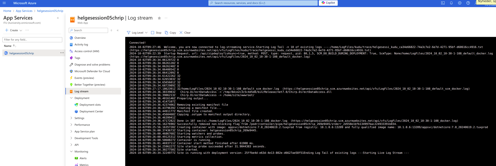

# **Analysis, Design and Software Architecture (BDSA)**
Session 6 — Feedback
[Helge Pfeiffer](ropf@itu.dk)

## Feedback

<iframe src="https://itu-bdsa.github.io/status/org-commit-frequency.html" width="100%" height=600 scrolling="auto"></iframe>

All groups are working on their projects.
Super cool!

## Feedback

<iframe src="https://itu-bdsa.github.io/status/report_razor_apps.html" width="100%" height=600 scrolling="auto"></iframe>

## Read carefully: follow URL specification!

Timelines of users should appear under the endpoint with the name of the user.

  > For example, given the [example database dump](./data/dump.sql), a response body for a `GET` request send to `/Helge` shall contain a cheep written by `Helge` and the content of a cheep shall be `Hello, BDSA students!`
  > Similarly, a response body for a `GET` request send to `/Adrian` shall contain a cheep written by `Adrian` with the content `Hej, velkommen til kurset.`
  >
  > [1.c) Add initial testing](../session_05/README_PROJECT.md)

That is, for example `/Author/Helge` is another endpoint.

## Feedback

- Have **one** main branch called `main`.
- Remember, we do trunk-based development in this course. That is, you do not have a long-lived `dev` branch (as in last semester's project). That would be another branching strategy.
- You have short-lived feature branches. That is, at latest after a day your changes land on the main branch and thereby automatically in production (your deployment workflows deploy all changes from main, right?)

What do we do if we cannot finish our feature during a day?

- Good observation, that means likely that your task descriptions in your issues are too coarse grained. Over time you should train to make them smaller so that you can complete your tasks in max. a day.

## Feedback

- Have **one** main branch called `main`.
- It is not advisable to have a `main2.0` branch.
- Likely, it is also not a good idea to call a branch `origin` since it is confusing when pointing to remote repositories in git commands.

## Process: Scientific problem solving

Our software does not work as intended: What to do?

> 1. Identify the problem
> 2. Gather information
> 3. Iterate potential solutions
> 4. Test your solution
Source: <a href="https://www.oreilly.com/content/4-steps-to-solving-any-software-problem/">E. Cain <i>4 steps to solving any software problem</i></a>

## Azure App Service: Reading the Logs

One way to identify the problem for depolyed web-applications: read the logs

## Data Transfer Objects, what are these?

> A Data Transfer Object is an object that is used to encapsulate data, and send it from one subsystem of an application to another.
>
> DTOs are most commonly used by the Services layer in an N-Tier application to transfer data between itself and the UI layer.
>
> [StackOverflow Question](https://stackoverflow.com/questions/1051182/what-is-a-data-transfer-object-dto)

## Data Transfer Objects (DTOs)?

  > Right now, our web API exposes the database entities to the client. The client receives data that maps directly to your database tables. However, that's not always a good idea. Sometimes you want to change the shape of the data that you send to client. For example, you might want to:
  >
  > - Remove circular references [...].
  > - Hide particular properties that clients are not supposed to view.
  > - Omit some properties in order to reduce payload size.
  > - Flatten object graphs that contain nested objects, to make them more convenient for clients.
  > - Avoid "over-posting" vulnerabilities. [...]
  > - Decouple your service layer from your database layer.
  >
  > [Microsoft Documentation](https://learn.microsoft.com/en-us/aspnet/web-api/overview/data/using-web-api-with-entity-framework/part-5)

## Next Week: Guest Lecture

[Martin von Haller Grønbæk](https://www.twobirds.com/en/people/m/martin-von-haller-groenbaek), one of Denmark's leading IT lawyers, will give a guest lecture on _Software Licenses and Software License Compatibility_.

The lecture will start at 11:00 (sharp) in Auditorium 1. So be there on time, best 10:50.
After his guest lecture, Martin will be available for deeper questions and discussions in the canteen (12:00 - 12:30).
