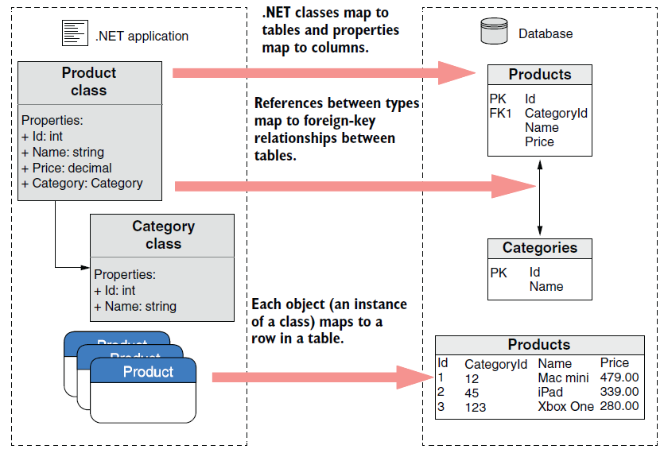
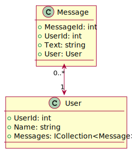
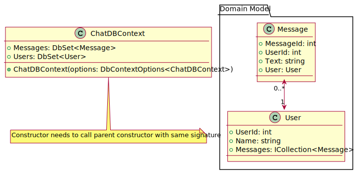
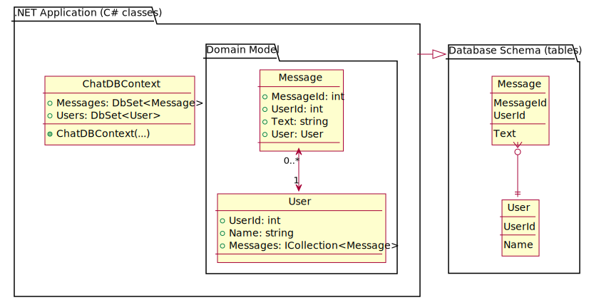
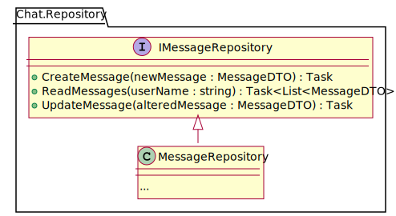
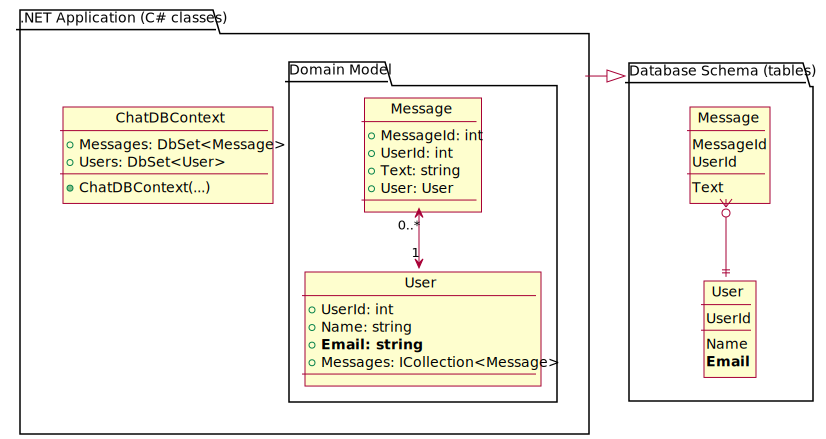
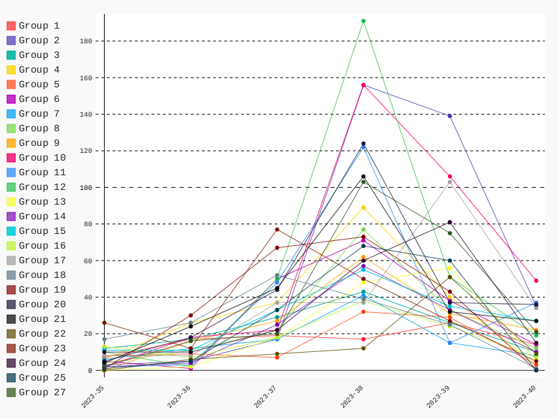

# **Analysis, Design and Software Architecture (BDSA)**
Week 6
[Eduard Kamburjan](eduard.kamburjan@itu.dk)


# Intro to EF Core with SQLite, LINQ, and Onion Architecture


# SQL Queries as Strings

Last week, we integrated SQLite as our database solution.
- We defined our <a href="https://database.guide/what-is-a-database-schema/">database schema</a> via SQLite queries (`schema.sql`)
- We defined our application data model via C# classes
- We formulated queries to the database as strings with SQL statements
- We accessed the database via an SQLite specific library


# SQL Queries as Strings

- What happens if our domain model changes? 
  - Requires adjusting both the object-oriented C# version _and_ the relational SQL schema
    - High degree of manual effort
    - Invites mismatches between the two worlds
      - for instance, we used different terminology in domain model and in database schema, e.g., `user` vs. `author` and `message` vs. `cheep`
    - Who is responsible? SQL schema and C# code may be handled by different teams!
* What happens if we want to switch from SQLite to another database solution?
  - Requires rewriting database access code (other database library API)
  - Requires rewriting queries (due to possible particularities in SQL syntax)
* Querying via strings does not allow for compile time validation


# Object-Relational Mapping (ORM)

An ORM framework bridges the gap between objects in programming languages and the relational databases:
- Database schemas and access to data are abstracted away into high-level APIs of the target programming language
- Instead of writing SQL directly,  queries are formulated via method calls
- Goals: ease and speed up the development process when working with databases
- Separation of concerns

* Example ORM frameworks:
  - Hibernate for Java
  - **Entity Framework Core** (EF Core) for .NET


# Entity Framework (EF) Core

(Entity Framework (EF) Core](https://learn.microsoft.com/en-us/ef/core/) is a lightweight, extensible, [open source](https://github.com/dotnet/efcore) and cross-platform version of the popular Entity Framework data access technology.

EF Core can serve as an object-relational mapper (ORM), which:

- Enables .NET developers to work with a database using .NET objects
- Eliminates the need for most of the data-access boilerplate code

* EF Core supports many database engines (see [Database Providers](https://learn.microsoft.com/en-us/ef/core/providers/) for details):
  - SQLite
  - PostgreSQL
  - MongoDB
  - (_many_ more) ...
  - Not DuckDB 


# EF Core: What is mapped to what?


&emsp;
&emsp;
&emsp;
&emsp;
&emsp;
&emsp;
&emsp;
&emsp;
&emsp;
&emsp;
&emsp;
Image source: <a href="https://www.manning.com/books/asp-net-core-in-action-third-edition">Andrew Lock <i>ASP.NET Core in Action, Third Edition</i></a>


# Preview: SQL in strings vs. LINQ and EF Core

Querying using a string containing SQL:
```csharp
databaseFacade.ExecuteQuery("SELECT * FROM message" +
    " INNER JOIN user ON message.author_id=user.user_id" +
    $" ORDER BY message.pub_date DESC LIMIT {32} OFFSET {32 * page}",
    (IDataRecord record) => cheeps.Add(new { record.GetString(...), ..., ... }));
```

Querying using EF Core and LINQ (expressions are automatically translated to SQL):
```csharp
var query = (from cheep in dbContext.Cheeps
            orderby cheep.TimeStamp descending
            select cheep)
            .Include(c => c.Author)
            .Skip(page * 32).Take(32);
var result = await query.ToListAsync();
```


# Strength and weaknesses of an ORM

- #### Weaknesses
  - Tight coupling of class system and DB model
  - ORMs hide the underlying database from you
    - (Complex queries might translate to suboptimal SQL causing performance problems)
  - ORMs can have a steep learning curve

* #### Strength
  - Faster development
    - Write less code: less boilerplate database code
  - Consistency between domain model and database schema
  - Security: ORMs take care of a variety of security checks (e.g., SQL injection)


# Working with EF Core (Code First Approach)

0. Install EF Core
1. Define your domain model (C# classes)
2. Give EF Core context on your database
3. Let EF Core create a migration
4. Execute the migration
5. Write database-technology-independent queries using LINQ
6. Change your domain model, update your migration, goto Step 4

&emsp;
For a detailed description of each step, refer to <b>Section 12</b> of <a href="https://www.manning.com/books/asp-net-core-in-action-third-edition">Andrew Lock <i>ASP.NET Core in Action, Third Edition</i></a>


# 0. Install EF Core
<!--
_backgroundImage: "linear-gradient(to bottom, #67b8e3, #0288d1)"
_color: white
_header: 5 minutes
-->

- Create a new Razor application
  - Use the template from last week: `dotnet new chirp-razor -o MyChat.Razor`
  - Refactor the `CheepService` class (+ interface): rename it to `ChatService`
- Use NuGet to install EF Core to your new Razor application
  - The required packages depend on the specific database you want to use
  - We want to use SQLite. Install the following packages (dotnet add package Name):

  > - **Microsoft.EntityFrameworkCore.SQLite** - This package is the main database provider package for using EF Core at runtime. It also contains a reference to the main EF Core NuGet package.
  > - **Microsoft.EntityFrameworkCore.Design** - This package contains shared build-time components for EF Core, required for building the EF Core data model for your app.


# 1. Define your domain model

[Wikipedia](https://en.wikipedia.org/wiki/Domain_model):

> In software engineering, a domain model is a conceptual model of the domain that incorporates both behavior and data

EF Core will later translate our domain model (consisting of plain old class objects - POCO) to a database schema



<div style="font-size: 0.6em; margin-top: 50px">
<strong>Ids</strong>: Attributes ending on 'Id' have a special meaning to EF Core. They will be translated to keys. 

---

## Domain model vs data model

- Models of any kind are defined by their purpose and the used technology
- Technology tends to leak into models
* Domain models, indeed most software models, structure behavior *and* data
  - Big part of design patterns is control and code reuse
  - Software optimization is about memory access and CPU usage, etc.
* Data models structure data and optimize towards database access
  - Consider normalization of relational databases

- When defining your domain model with ORM, code reuse and data modeling may conflict
- Either split domain model and behavior, especially subclassing
- Or accept that your data model results in suboptimal schemas
- If all access to the data are via EF Core, later is more likely


# Why did we not use C# records again?

So far, you saw many examples of `record`s that we used to model data, e.g., the `CheepViewModel` in our `chrip-razor` project template.


> _Value equality_
>
> For records, value equality means that two variables of a record type are equal if the types match and all property and field values match. For other reference types such as classes, equality means reference equality. That is, two variables of a class type are equal if they refer to the same object. ...
>
> Not all data models work well with value equality. For example, **Entity Framework Core depends on reference equality** to ensure that it uses only **one instance of an entity type for what is conceptually one entity**. For this reason, record types are not appropriate for use as entity types in Entity Framework Core.

Source: <a href="https://learn.microsoft.com/en-us/dotnet/csharp/fundamentals/types/records"><i>Introduction to record types in C♯</i></a>


# Example: Value equality vs. reference equality

```csharp
record User(int UserId, string Name);
User user1 = new User(1, "Peter");
User user2 = new User(1, "Peter");
Console.WriteLine($"Are the record objects equal? {(user1 == user2 ? "Yes" : "No")}");
```
Value equality - the snippet prints `Are the record objects equal? Yes`

&emsp;

```csharp
class User {
  int UserId { get; set; }
  string Name { get; set; }
}
User user1 = new User() { UserId = 1, Name = "Peter" };
User user2 = new User() { UserId = 1, Name = "Peter" };
Console.WriteLine($"Are the class objects equal? {(user1 == user2 ? "Yes" : "No")}");
```
Reference equality - the snippet prints `Are the class objects equal? No`


# 1. Define your domain model
<!--
_backgroundImage: "linear-gradient(to bottom, #67b8e3, #0288d1)"
_color: white
_header: 5 minutes
-->

&emsp;
### Implement the depicted domain model

- use classes, not records
- implement attributes as auto-properties (`{ get; set; }`)
  - otherwise, EF Core will not consider your attributes during the mapping process


# 2. Give EF Core context on your database
<!--
_backgroundImage: "linear-gradient(to bottom, #67b8e3, #0288d1)"
_color: white
_header: 5 minutes
-->

Provide EF Core with a database context class exposing top-level db entities.
- extends EF Core's `DbContext` class
- has a constructor with parameter of type `DbContextOptions<ChatDBContext>`
  - needs to call parent constructor
- has auto-properties (`{ get; set; }`) of type `DbSet<T>` for each top-level db entity T

(We use this context class later when querying from the database)




# 2. Give EF Core context on your db schema (ctd.)
<!--
_backgroundImage: "linear-gradient(to bottom, #67b8e3, #0288d1)"
_color: white
_header: 5 minutes
-->

Register your database context in the application builder.
`Program.cs`:

```csharp
var builder = WebApplication.CreateBuilder(args);

// Load database connection via configuration
string? connectionString = builder.Configuration.GetConnectionString("DefaultConnection");
builder.Services.AddDbContext<ChatDBContext>(options => options.UseSqlite(connectionString));
```

`appsettings.json`:
```yaml
{
    "Logging": { ... },
    "ConnectionStrings": {
        "DefaultConnection": "Data Source=Chat.db"
    },
    ...
}
```


# Interim Results: Where are we now?

0. ✅ Install EF Core
1. ✅ Define your domain model
2. ✅ Give EF Core context on your db
&emsp;
3. ➡️ Let EF Core create a migration
&emsp;
4. ❓ Execute the migration
5. ❓ Write queries using LINQ
6. ❓ Change domain model & update db




# What is data migration??

> Data migration is the process of **transferring data from one storage system or computing environment to another**.

Source: <a href="https://www.ibm.com/topics/data-migration">IBM</i></a>

> The [migrations feature in EF Core](https://learn.microsoft.com/en-us/ef/core/managing-schemas/migrations/?tabs=dotnet-core-cli) provides a way to incrementally update the database schema to keep it in sync with the application's data model while preserving existing data in the database.

Source: <a href="https://learn.microsoft.com/en-us/ef/core/managing-schemas/migrations/?tabs=dotnet-core-cli">Microsoft</i></a>


# 3. Let EF Core create an initial migration
<!--
_backgroundImage: "linear-gradient(to bottom, #67b8e3, #0288d1)"
_color: white
_header: 5 minutes
-->


* You can install the .NET EF command line tool to create a migration:
`dotnet tool install --global dotnet-ef --version 8`

* Once installed, the tool can be used to create a first migration:
`dotnet ef migrations add InitialDBSchema`
  - Run from within project folder
  - This generates three files, capturing the migration process
  - **Inspect them** to see what they do


# 4. Execute the migration
<!--
_backgroundImage: "linear-gradient(to bottom, #67b8e3, #0288d1)"
_color: white
_header: 5 minutes
-->


Run `dotnet ef database update` (from within project folder).

The tool will apply the migration, i.e., it will create a database with tables according to your domain model and database context class.
- This creates a `Chat.db` file
- Inspect the database with an analysis tool such as [DB Browser for SQLite](https://sqlitebrowser.org/)


# 4. Execute the migration (ctd.)

Alternatively, you can execute a migration from code.
For instance, in `Program.cs`, you could run the following snippet:

```csharp
// Create a disposable service scope
using (var scope = app.Services.CreateScope())
{
    // From the scope, get an instance of our database context.
    // Through the `using` keyword, we make sure to dispose it after we are done.
    using var context = scope.ServiceProvider.GetService<ChatDBContext>();

    // Execute the migration from code.
    context.Database.Migrate();
}
```

You _could_ access services from the DI container in other parts of your application, too. However, that is an anti pattern! You should inject services in constructors as shown later.


# 5. Write database queries using LINQ

> *Language-Integrated Query (LINQ) is the name for a set of technologies based on the **integration of query capabilities directly into the C# language**. Traditionally, queries against data are expressed as simple strings without type checking at compile time or IntelliSense support. Furthermore, you have to learn a different query language for each type of data source: SQL databases, XML documents, various Web services, and so on. With LINQ, a **query is a first-class language construct**, just like classes, methods, and events.*

Source: <a href="https://learn.microsoft.com/en-us/dotnet/csharp/linq/">Microsoft Documentation</a>

* LINQ queries are...
  - ... "first-class language constructs": They are checked for compile-time errors
  - ... (database-)technology agnostic: Queries we write this week with SQLite as database technology would still work if we replaced it with PostgreSQL next week


# 5. Write database queries using LINQ (ctd.)

LINQ query syntax:
```csharp
// Define the query - with our setup, EF Core translates this to an SQLite query in the background
var query = from message in dbContext.Messages
            where message.User.Name == "Peter"
            select new { message.Text, message.User };
// Execute the query and store the results
var result = await query.ToListAsync();
```

LINQ method syntax:
```csharp
// Define the query - with our setup, EF Core translates this to an SQLite query in the background
var query = dbContext.Messages
            .Where(message => message.User.Name == "Peter")
            .Select(message => new { message.Text, message.User });
// Execute the query and store the results
var result = await query.ToListAsync();
```


# 5. Write database queries using LINQ (ctd.)

```csharp
            select new { message.Text, message.User };
```
```csharp
            .Select(message => new { message.Text, message.User });
```

## What is that syntax?

#### [Anonymous types](https://learn.microsoft.com/en-us/dotnet/csharp/fundamentals/types/anonymous-types) = on-the-fly read-only object creation without type declaration

```csharp
var question = new
{
    Title = "The answer...?",
    Answer = 42
};
```


# 5. Write database queries using LINQ (ctd.)

```csharp
            .Select(message => new { message.Text, message.User });
```

## What is that syntax?

#### [Lambda Expressions](https://learn.microsoft.com/en-us/dotnet/csharp/language-reference/operators/lambda-expressions) = compact, anonymous functions

C# lambda without return value (void):
```csharp
Action<string> write = s => Console.WriteLine(s);
```

C# lambda with return value:
```csharp
Func<float, int> round = f => (int)Math.Round(f);
```


# 5. Write database queries using LINQ (ctd.)

```csharp
var query = dbContext.Messages.Where(...)...
```

## What is that method?

We never defined a method `Where(...)` in our `Cheep` domain model class, did we?

#### [Extension Methods](https://learn.microsoft.com/en-us/dotnet/csharp/programming-guide/classes-and-structs/extension-methods) = methods added to a type without modifying the type

```csharp
public static class MyExtensions {
    public static int WordCount(this string str) {
        return str.Split(new[] { ' ', '.', '?' }, StringSplitOptions.RemoveEmptyEntries).Length;
    }
}
```

```
int count = "Hello".WordCount();
```


# 5. Write database queries using LINQ (ctd.)
## Other useful C# language constructs
#### [Tuples](https://learn.microsoft.com/en-us/dotnet/csharp/language-reference/builtin-types/value-tuples) = Concise, lightweight data structure definition

```csharp
var s = Tuple.Create("Clark Kent", "Superman");

var b = ("Bruce Wayne", "Batman");

var f = (name: "Barry Allen", alterEgo: "The Flash");

var random = new Random();
IEnumerable<(float x, float y)> GenerateCoordinates() {
    yield return (random.NextSingle() * 100, random.NextSingle() * 100);
}
```

Find information about differences between anonymous types and tuples [here](https://learn.microsoft.com/en-us/dotnet/standard/base-types/choosing-between-anonymous-and-tuple).


# 5. Write database queries using LINQ (ctd.)
## Other useful C# language constructs
#### [Collection Initializer](https://learn.microsoft.com/en-us/dotnet/csharp/programming-guide/classes-and-structs/object-and-collection-initializers)

```csharp
IEnumerable<User> users = new[] {
    new User(1, "Adrian"),
    new User(2, "Helge")
};
```

#### [Collection + Object Initializer](https://learn.microsoft.com/en-us/dotnet/csharp/programming-guide/classes-and-structs/object-and-collection-initializers) (same link)

```csharp
Message[] messages = new Message[] {
    new Message() { MessageId = 81, Text = "Hello", UserId = 1, User = u1 },
    new Message() { MessageId = 82, Text = "Hi", UserId = 2, User = u2 },
    new Message() { MessageId = 83, Text = "What's up?", UserId = 1, User = u1 },
    new Message() { MessageId = 84, Text = "Nothing", UserId = 2, User = u2 }
};
```


# Repository Pattern
<!--
_backgroundImage: "linear-gradient(to bottom, #deb887, #d17e12)"
_color: white
-->

> The Repository pattern [intends] to keep persistence concerns outside of the system's domain model. [..] Repository implementations are classes that encapsulate the logic required to access data sources.

Text and Image Source: <a href="https://learn.microsoft.com/en-us/dotnet/architecture/microservices/microservice-ddd-cqrs-patterns/infrastructure-persistence-layer-design">Microsoft</a>

* Recommendation:
One repository per aggregate
  - `Order` in slide example
  - `Message` in running example


# Putting it all together: Repository pattern
<!--
_backgroundImage: "linear-gradient(to bottom, #67b8e3, #0288d1)"
_color: white
_header: 5 minutes
-->



- Create a message repository, i.e., interface and class
  - For now, you may leave the methods empty

- Register the repository in your Razor app via DI

```csharp
var builder = WebApplication.CreateBuilder(args);
builder.Services.AddRazorPages();
builder.Services.AddScoped<IChatService, ChatService>();
builder.Services.AddScoped<IMessageRepository, MessageRepository>();
```

What is the [difference between `AddScoped()` and `AddSingleton()`](https://learn.microsoft.com/en-us/dotnet/core/extensions/dependency-injection-usage) ? (cf. Section 9.4 in the book!)

<div style="font-size:1rem;margin-top:40px;">
(At this point, we will stop implementing the repository in the lecture, but you will need to continue with this in your project work!)
</div>


# 5. Writing database queries - final steps

Writing queries with EF Core requires an instance of your database context (see Step 2).
- How do we get access to in our repository?
  - We do not want the repository to depend on any higher-level services.
  - Use dependency injection

```csharp
public class ChatRepository : IChatRepository
{
    private readonly ChatDBContext _dbContext;
    public ChatRepository(ChatDBContext dbContext)
    {
        _dbContext = dbContext;
    }
    ...
```


# 5. Writing database queries - final steps (ctd.)

Finally, we can use our database context to start querying - example **read** query:

```csharp
public async Task<List<MessageDTO>> ReadMessages(string userName)
{
  // Formulate the query - will be translated to SQL by EF Core
  var query = _dbContext.Messages.Select(message => new { message.User, message.Text });
  // Execute the query
  var result = await query.ToListAsync();

  // ...
}
```

Beware that the first statement specifies a query, while the second statement executes the query on our database. ([More information](https://learn.microsoft.com/en-us/dotnet/csharp/linq/get-started/write-linq-queries))
- The variable `query` represents the query, not the results from executing it.
- The variable `result` contains results from executing the query (note the use of `await`)


# 5. Writing database queries - final steps (ctd.)

Example **create** method:

```csharp
public async Task<int> CreateMessage(MessageDTO message)
{
    Message newMessage = new() { Text = message.Text, ... };
    var queryResult = await _dbContext.Messages.AddAsync(newMessage); // does not write to the database!

    await _dbContext.SaveChangesAsync(); // persist the changes in the database
    return queryResult.Entity.CheepId;
}
```

**Update** and **delete** operations work similarly.

Note: The above method persists the changes directly. Depending on your use-case, you might want to deviate from that approach. For instance, when creating multiple elements, you might want to add them first (e.g., multiple `_dbContext.Message.Add(...)`) and eventually persist the changes (`_dbContext.SaveChanges()`, e.g., in another method of your repository).


# 6. Change your domain model and update your migration
<!--
_backgroundImage: "linear-gradient(to bottom, #67b8e3, #0288d1)"
_color: white
_header: 5 minutes
-->



Add a property for an email address to the `User` domain model class.

Run `dotnet ef migrations add UsersEMail`
- Inspect the generated migration files
- Execute the migration (cf. Step 4)
  - Run `dotnet ef database update` (from within project folder)
- Inspect the altered database


# Summary

Entity Framework Core = Object-Relational Mapper
1. ✅ Define your domain model (C# classes)
2. ✅ Give EF Core context on your database (`ChatDBContext` class)
3. ✅ Let EF Core create a migration (e.g., via .NET CLI tool)
4. ✅ Execute the migration (via .NET CLI tool or via C# code)
5. ✅ Write database-technology-independent queries using LINQ
    - LINQ allows to formulate queries (i.a., for quering from relational databases)
    via C# language constructs (e.g., extension methods)

... *Life happens, your domain model requires changes*

6. ✅ Update your migration
    - goto Step 4


# What to do now?


- If not done, complete the Tasks (blue slides) from this class
- Check the [reading material](./READING_MATERIAL.md), **esp. Chapter 12 in the book!**
- Work on the [project](./README_PROJECT.md)

- <font color="#cecdce">If you feel you want prepare for next session, read chapters 23, 24 [Andrew Lock _ASP.NET Core in Action, Third Edition_](https://www.manning.com/books/asp-net-core-in-action-third-edition) </font>


---

## Feedback



All groups are working on their projects!

---

## Feedback

<iframe src="http://209.38.208.62/report_razor_apps.html" width="100%" height=600 scrolling="auto"></iframe>

---

## Feedback

- Have **one** main branch called `main`.
- Remember, we do trunk-based development in this course. That is, you do not have a long-lived `dev` branch (as in last semester's project). That would be another branching strategy.
- You have short-lived feature branches. That is, at latest after a day your changes land on the main branch and thereby automatically in production (your deployment workflows deploy all changes from main, right?)

What do we do if we cannot finish our feature during a day?

- Good observation, that means likely that your task descriptions in your issues are too coarse grained. Over time you should train to make them smaller so that you can complete your tasks in max. a day.

---

## Feedback

- Have **one** main branch called `main`.
- It is not advisable to have a `main2.0` branch.
- Likely, it is also not a good idea to call a branch `origin` since it is confusing when pointing to remote repositories in git commands.


# Process: Scientific problem solving

Starting this week, you are going to work more independently.
Tasks will be less guided and you will need to research on your own.

How to do this systematically:
> 1. Identify the problem
> 2. Gather information
> 3. Iterate potential solutions
> 4. Test your solution

<font size=3>
Source: <a href="https://www.oreilly.com/content/4-steps-to-solving-any-software-problem/">E. Cain <i>4 steps to solving any software problem</i></a>
</font>

Use the book!
Use the internet, e.g., Microsoft documentation!