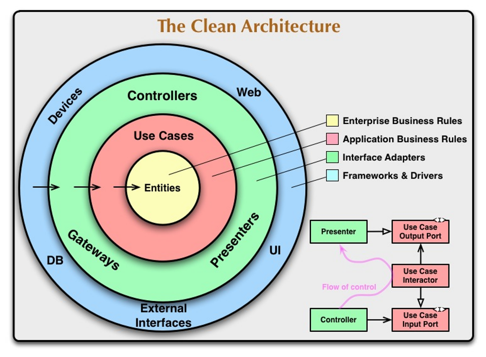

# **Analysis, Design and Software Architecture (BDSA)**
Session 7
[Rasmus Lystrøm, Senior Cloud Solution Architect](rnie@itu.dk)

---

## Guest Lecture, [Henrik Mansfeldt Witt](https://dk.linkedin.com/in/henrikmansfeldtwitt) ([Aumento](https://www.aumento.dk/))

On software licenses


---

## Info: Semester meeting

- Dan and Louise hold a semester meeting with you in Auditorium 2 on October 25th from 12.30 to 13.30.
- You should receive more information about this via LearnIT.

---

## Feedback: Working with/on issues

<object data="http://209.38.208.62/issue_activity_weekly.svg" width="60%" height="50%"><div></div></object>

---

## Feedback: Working with/on issues

<style scoped>
section {
  font-size: 22px;
}

pre {
  font-size: 22px;
}
</style>

Remember the purpose of an issue: You want to enable your team mates to take over work from the pile of issues that are required

```
As a developer, I want to test the functionality of the newly created Entity Framework Core, Razor Page app for robustness

Acceptance Criteria:

[] The test have been altered to now use EF Core
[] Unit tests for suitable functionality have been added (e.g., data conversion)
[] Test for the seeding data that was dumbed.
[] The tests have been made to use an in-memory database thereby not interfering/altering the real database.
```

* What is good about this issue?
* What could be improved?
  * What is "robustness" here?
  * What is "suitable functionality"?
* Make such knowledge and assumptions explicit in the description of the issue.
* Implicit knowledge cannot be implemented.

---

## Feedback: Continue to release!

<object data="http://209.38.208.62/release_activity_weekly.svg" width="60%" height="50%"><div></div></object>

---

## Feedback: Deployment

<iframe src="http://209.38.208.62/report_razor_apps.html" width="100%" height=500 scrolling="auto"></iframe>

---

# Agenda

- Clean architecture
- Testing repositories (EF Core)
- Validating input
- Exposing API
- Documenting API

---


<div style="text-align: right;">

# Onion Architecture

</div>

---



---

# Clean onions

## Demo

---

# Entity Framework Core


---

# Entity Framework Core

```bash
dotnet tool install --global dotnet-ef
dotnet add package Microsoft.EntityFrameworkCore.Design
dotnet ef migrations add InitialCreate --project ... --startup-project ...
dotnet ef database update --project ... --startup-project ...
```

<https://docs.microsoft.com/en-us/ef/core/miscellaneous/cli/dotnet>
<https://docs.microsoft.com/en-us/ef/core/modeling/>

---

# Command Query Seperation

<https://blog.ploeh.dk/2014/08/11/cqs-versus-server-generated-ids/>

---

## Recommendation: Separate Kinds of Code

<!--
_backgroundImage: "linear-gradient(to bottom, #e18ac2, #d112a5)"
_color: white
-->

> **Command Query Separation**
>
> Separate Commands from Queries. Commands are procedures that have side effects. Queries are functions that return data. Every method should be either a Command or a Query, but not both.<font size=3>
Source: Mark Seemann <i>"Code That Fits in Your Head"</i>
</font>

---

## Demo

---

# Task: _Fix your model_

<!--
_backgroundImage: "linear-gradient(to bottom, #67b8e3, #0288d1)"
_color: white
_header: 15 minutes
-->

Make it *Clean* with *Onion*, and *CQS*

Add restrictions to length and non-null on data model

Replace integer IDs with Guids

---

# Repository pattern


---

# Repository Pattern

- Enable CRUD on domain objects (entities)

- Usually: one repository per entity

- Debatable: has a `Save()` method

---

# Generic repository

```csharp
public interface Repository<T, K>
{
    T Create(T entity);
    IReadOnlyCollection<T> Read();
    T Read(K id);
    void Update(T entity);
    void Delete(K id);
}
```

---

# Repository Pattern

> ... but wait ...Entity Framework already does that for me!?

---

# Recommended Repository: Per entity e.g., `Character`

```csharp
public interface ICharacterRepository
{
    int Create(CharacterCreateDTO character);
    CharacterDetailsDTO Read(int characterId);
    IReadOnlyCollection<CharacterDTO> Read();
    void Update(CharacterUpdateDTO character);
    void Delete(int characterId);
}
```

...or something similar...

---

# Testing...

- Testing live databases is hard
- Testing live full systems is hard
- By transitivity: Testing ... is hard...

---

# SQLite in-memory database

```bash
dotnet add package Microsoft.EntityFrameworkCore.Sqlite
```

```csharp
// Arrange
using var connection = new SqliteConnection("Filename=:memory:");
connection.Open();
var builder = new DbContextOptionsBuilder<MyContext>().UseSqlite(connection);
using var context = new MyContext(builder.Options);
var repository = new MyRepository(context);
```

---

# Demo

## Testing Entity Framework with *SQLite in-memory*

---

# Validation

```csharp
public class CustomerValidator : AbstractValidator<Customer>
{
    public CustomerValidator()
    {
        RuleFor(x => x.Surname).NotEmpty();
        RuleFor(x => x.Forename).NotEmpty().WithMessage("Please specify a first name");
        RuleFor(x => x.Discount).NotEqual(0).When(x => x.HasDiscount);
        RuleFor(x => x.Address).Length(20, 250);
        RuleFor(x => x.Postcode).Must(BeAValidPostcode).WithMessage("Please specify a valid postcode");
    }

    private bool BeAValidPostcode(string postcode)
    {
        // custom postcode validating logic goes here
    }
}
```

---

# Validation

## Demo

---

## What to do now?


- If not done, complete the Tasks (blue slides) from this class
- Check the [reading material](./READING_MATERIAL.md)
- Work on the [project](./README_PROJECT.md)

- <font color="#cecdce">If you feel you want prepare for next session, read chapters 6, 7, and 23 [Andrew Lock _ASP.NET Core in Action, Third Edition_](https://www.manning.com/books/asp-net-core-in-action-third-edition) </font>

---

# Thank you


