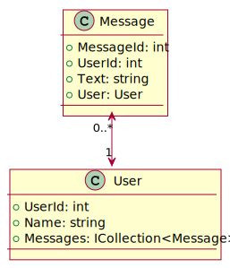

# **Analysis, Design and Software Architecture (BDSA)**
Week 7
[Eduard Kamburjan](eduard.kamburjan@itu.dk)


# Todays's lecture

- Onion architecture
- Testing: EF Core & in-memory databases
- Influencing the database schema in EF Core


# Reflections on Chirp: Architecture


We have distinct components:
- a domain model (currently the classes `Cheep` and `Author`)
- repositories (e.g., `ICheepRepository` + `CheepRepository`)
- services (e.g., `ICheepService` + `CheepService`)
- a view / user interface (the Razor pages)
- testing infrastructure
&emsp;
### Think about a good design for your app:
### What component should depend on what other?


# Onion Architecture
<!--
_backgroundImage: "linear-gradient(to bottom, #deb887, #d17e12)"
_color: white
-->

> Onion Architecture is based on the inversion of control principle. Onion Architecture is comprised of multiple concentric layers interfacing each other towards the core that represents the domain.

From <a href="https://www.codeguru.com/csharp/understanding-onion-architecture/"><i>Understanding Onion Architecture</i></a>

* Domain layer has no external dependencies, individual layers are loosly coupled.
  - Easy to replace layer implementations 
  - Good testability: we can easily replace and mock layers in tests


# Onion Architecture
<!--
_backgroundImage: "linear-gradient(to bottom, #67b8e3, #0288d1)"
_color: white
_header: 10 minutes
-->

How could we implement the onion architecture in Chirp?

#### Sketch a simple box/arrow diagram using a pen and paper
- Boxes = .NET C# projects, namespaces and classes
  - As projects use:
  `Core`, `Infrastructure`, `Web`, `Tests`
  - Nest boxes with namespaces and classes, e.g., `Chirp.Repositories`, `Program.cs`, etc.
- Arrows = Project dependencies
  - Remember dependency injection


---


<!-- <span style="font-size: 1rem;position:absolute;bottom: 20px;right: 150px">
  <ul>
    <li>This is one of <strong>many</strong> ways to implement the onion architecture</li>
    <li><strong>Beware</strong>: A multi-project setup requires adaptions to the<br>commands for working with EF Core database migrations</li>
  </ul>
</span>-->


# Onion Architecture
- Loosely coupled layers with inverted control allow to easily replace components
  - Maintainability
  - **Testability**


# Dependency Injection (revisited)

`Program.cs`:
```csharp
var builder = WebApplication.CreateBuilder(args);
builder.Services.AddScoped<IChatService, ChatService>();
builder.Services.AddScoped<IMessageRepository, MessageRepository>();
```

`ChatService.cs`:
```csharp
public class ChatService : IChatService
{
    private readonly IMessageRepository _messageRepository;
    public ChatService(IMessageRepository messageRepository)
    {
        _messageRepository = messageRepository;
    }

    ...
}
```


# Testing
For example, we can replace a component by registering a **[test double](https://martinfowler.com/articles/mocksArentStubs.html)** - without further adaptions to the unit under test.

`ChatServiceUnitTests.cs`:
```csharp
[Fact]
public void SomeUnitTestOnChatService()
{
    // Arrange
    IChatRepository chatRepo = new ChatRepositoryStub(...); // not the repository class used in production!
    IChatService service = new ChatService(chatRepo);

    // Act
    service.CreateMessage(...);

    // Assert
    ...
}
```


# Testing: Loose component coupling 

Similarly, we can replace the real database with a **fake in-memory database**.
This can be helpful when your database is slow or limits querying over time

`MessageRepositoryUnitTests.cs`:
```csharp
// Arrange
using var connection = new SqliteConnection("Filename=:memory:");
await connection.OpenAsync();
var builder = new DbContextOptionsBuilder<ChirpContext>().UseSqlite(connection);

using var context = new ChirpContext(builder.Options);
await context.Database.EnsureCreatedAsync(); // Applies the schema to the database

IMessageRepository repository = new MessageRepository(context);

// Act
var result = repository.QueryMessages("TestUser");
...
```

# Testing 

Various parts of your system can be replaced with test doubles to test a targeted unit in isolation:
- services
- repositories
- database contexts
- databases
- ...

<div style="margin-top:50px;font-size: 1rem;">Image Source:<br><a href="https://learn.microsoft.com/en-us/ef/core/testing/choosing-a-testing-strategy">Microsoft, <i>Choosing a testing strategy</i></a>
</div>


# Command Query Separation (CQS)
<!--
_backgroundImage: "linear-gradient(to bottom, #deb887, #d17e12)"
_color: white
-->


> [CQS] states that every method should either be a command that performs an action, or a query that returns data to the caller, but _not both_.

* If asking a question changes the answer, we're likely to run into problems.
Cf. Bertrand Meyer, <a href="https://se.inf.ethz.ch/old/people/meyer/publications/eiffel/eiffel_jss.pdf"><i>Eiffel: a language for software engineering</i></a>

<!--
# Command Query Separation (CQS)
_backgroundImage: "linear-gradient(to bottom, #67b8e3, #0288d1)"
_color: white
_header: 5 minutes

&emsp;
## Revisit your project code

Do not change your code. Discuss with your neighbours  the following points:
- Did you separate commands from queries in your repository?
- What makes mixing commands and queries tempting in your current setup?
  - How could we address this?
-->


# Unit of Work
<!--
_backgroundImage: "linear-gradient(to bottom, #deb887, #d17e12)"
_color: white
-->

> The repository and unit of work patterns are intended to create an abstraction layer between the data access layer and the business logic layer of an application. Implementing these patterns can help insulate your application from changes in the data store and can facilitate automated unit testing [..]

Source: <a href="https://www.martinfowler.com/eaaCatalog/repository.html"><i>Microsoft</i></a>


# Unit of Work Pattern (ctd.)

A Unit of Work bundles repositories and operations.
- Reliably and efficiently execute a batch of queries and/or commands
  - for instance: query from one repository, process the results, and send update commands to another repository
- Using EF Core, we should
  - first perform all data changes in memory, e.g., `dbContext.Messages.Add(...)`
  - and, if done successfully, persist them in our database via `dbContext.SaveChanges()`
- Note: In a unit of work operation, use one EF Core database context per database
- Similar to _transactions_


# From domain to data model
<!--
_backgroundImage: "linear-gradient(to bottom, #67b8e3, #0288d1)"
_color: white
_header: 10 minutes
-->
- We defined a domain model and mapped it to a database schema


&emsp;
* ### Inspect `*DBContextModelSnapshot.cs` in your Migrations folder
  - Inspect how the `BuildModel` method defines your db schema




# From domain model  to data model (ctd.)
The mapping process in EF Core is controlled largely by [conventions](https://learn.microsoft.com/en-us/ef/core/modeling/#built-in-conventions)
(e.g., properties ending on `Id` are turned into keys).
&emsp;
- We can control this process further through

  - _Data Annotations_ in the domain model

  - _Fluent API_: overriding the `OnModelCreating(...)` method in the database context class
&emsp;
- Precedence:  Fluent API  _overrides_  Data Annotations  _overrides_  Conventions

&emsp;
Read more about this in the documentation on [EF Core Modeling](https://learn.microsoft.com/en-us/ef/core/modeling/) and, therein, [Entity Properties](https://learn.microsoft.com/en-us/ef/core/modeling/entity-properties).


# Required properties

If you want to make sure that a property in your domain model is not null after creation,
you can use the `required` modifier.

```csharp
public required string MyProperty { get; set; }
```

&emsp;

However, EF Core does not respect the `required` modifier when creating a db schema.
You will need to use the `[Required]` annotation from `System.ComponentModel.DataAnnotations`.

```csharp
[Required]
public string MyProperty { get; set; }
```


# String length limits

To validate the maximum length of strings, you can annotate a property directly:

```csharp
[StringLength(500)]
public string Text { get; set; }
```

&emsp;

Alternatively, you can add constraings in the `OnModelCreating` method.

```csharp
modelBuilder.Entity<Message>().Property(m => m.Text).HasMaxLength(500);
```


# Try it out!
<!--
_backgroundImage: "linear-gradient(to bottom, #67b8e3, #0288d1)"
_color: white
_header: 5 minutes
-->

#### Recommended: Make sure you have committed all changes to your project
- Running `git status` returns something like `nothing to commit, working tree clean`.

- Limit the length of cheeps:
```csharp
[Required]
[StringLength(500)]
public required string Text { get; set; }
```

- Add a new migration: `dotnet ef migrations add LimitAuthorInfoStringLength`
- Inspect the changes in `XyzDBContextModelSnapshot.cs`
- Navigate to the Migrations folder in your console and and run `git diff .`


# Unique properties

If you want to make sure that a property is unique, you can use the `Index` attribute:

```csharp
[Index(IsUnique = true)]
public string MyProperty { get; set; }
```

&emsp;

Alternatively, add it in the `OnModelCreating` method:

```csharp
modelBuilder.Entity<Author>()
    .HasIndex(c => c.Name)
    .IsUnique();
```

Hint: The fluent API applies a configuration in the order of method calls. If configurations are conflicting, the later method call will overrides the earlier call.


# Try it out!
<!--
_backgroundImage: "linear-gradient(to bottom, #67b8e3, #0288d1)"
_color: white
_header: 10 minutes
-->

#### 1. Make authors' names and emails unique
Add an `OnModelCreating` method to you database context:
```csharp
protected override void OnModelCreating(ModelBuilder modelBuilder)
{
    base.OnModelCreating(modelBuilder);

    modelBuilder.Entity<User>()
        .HasIndex(c => c.Name)
        .IsUnique();
    modelBuilder.Entity<User>()
        .HasIndex(c => c.Email)
        .IsUnique();
}
```

#### 2. Add a new migration: `dotnet ef migrations add UniqueAuthorNamesAndEmails`

#### 3. Inspect the changes in `XyzDBContextModelSnapshot.cs` (run `git diff .`)


# Composite Primary Key

If you want to define a composite primary key (more than one column as the key), use the `OnModelCreating` method:

```csharp
modelBuilder.Entity<Author>()
    .HasKey(k => new { k.FollowerId, k.FollowingId });
```

&emsp;
&emsp;
&emsp;
&emsp;
&emsp;
&emsp;
&emsp;
Read more in the documentation on [EF Core Modeling](https://learn.microsoft.com/en-us/ef/core/modeling/) and, therein, [Entity Properties](https://learn.microsoft.com/en-us/ef/core/modeling/entity-properties).


# Summary

* Onion architecture
  - helps with achieving loosely coupled components
  - domain model separated from rest of system and free of dependencies
  - individual components can be replaced more easily (e.g., for testing purposes)

* Testing: EF Core & in-memory databases
  - to test units in isolation, it is userfu to replace collaborators with test doubles
  - includes the database, where using in-memory SQLite is a popular approach
  - it is easy to set up and fast in execution

* Influencing the database schema in EF Core
  - solved via data annotations and/or the fluent API (`OnModelCreating` method)
  - influences the database schema and, respectively, the migrations generated by EF Core


# What to do now?


- If not done, complete the Tasks (blue slides) from this class
- Check the [reading material](./READING_MATERIAL.md)
- Work on the [project](./README_PROJECT.md)
 - If you feel you want prepare for next session, read chapters 6, 7, and 23 [Andrew Lock _ASP.NET Core in Action, Third Edition_](https://www.manning.com/books/asp-net-core-in-action-third-edition) 

- Next review in the week after autumn break
- Will focus on razor part