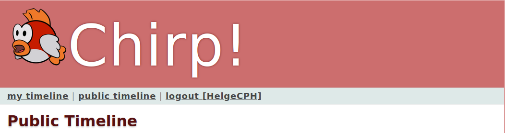

# Your turn now! -- Project Work


You have to work on the following topics.

- [Your turn now! -- Project Work](#your-turn-now----project-work)
  - [1) Software Development](#1-software-development)
    - [1.a) ASP.NET Core Identity](#1a-aspnet-core-identity)
    - [1.b) Azure AD B2C + GitHub](#1b-azure-ad-b2c--github)
    - [1.c) Azure Web Apps Easy Auth](#1c-azure-web-apps-easy-auth)
  - [2) Process](#2-process)


Remember, you have to perform work on each topic and on **each** bullet point.
Be done with the project work before we meet again next Thursday.


## 1) Software Development

Add login functionality to your _Chirp!_ applications.
You can do this in many ways and you decide how to do it.
You choose which one you want to implement.

You will have to document in your project why you chose what you did and discuss pros and cons.

In any of the cases, we want to have a navigation bar directly below the headline of every page in the _Chirp!_ `<h1>Chirp!</h1>`
 and on top of the list of cheeps that looks similar to the following.




Such a navigation bar may be implemented in a Razor View via code similar to the following.

```html
    <div class=navigation>
        @if (User.Identity.IsAuthenticated)
        {
            <div>
                <a href="/@(User.Identity.Name)">my timeline</a> |
                <a href="/">public timeline</a> |
                <a ... >logout [@(User.Identity.Name)]</a>
            </div>
        }
        else
        {
            <div>
                <a href="/">public timeline</a> |
                <a ... >register</a>
                <a ... >login</a>
            </div>
        }
    </div>
```

In the CSS file that you have in your _Chirp!_ projects, there is a style for a navigation element, which you should use, e.g., `<div class=navigation>`.
In case a user is authenticated, the navigation bar should display links to `my timeline` (links to endpoint `/<username_of_authenticated_user>`), `public timeline` (links to endpoint `/`), and `logout`.
In case a user is not authenticated, the navigation bar should display links to the `public timeline` (links to endpoint `/`), `register` and `login`.

Add a user profile page which initially only lists the claims of the user.

### 1.a) ASP.NET Core Identity

Use *Individual Accounts* and subsequently enable GitHub using [External OAuth authentication providers](https://learn.microsoft.com/en-us/aspnet/core/security/authentication/social/other-logins)

A valuable resource when choosing this solution is chapter 23 of the course book Andrew Lock _ASP.NET Core in Action_.
The first sections in it discuss ASP.NET Core Identity based on an example [from the official documentation](https://learn.microsoft.com/en-us/aspnet/core/security/authentication/identity?view=aspnetcore-7.0&tabs=netcore-cli)
Section 23.4 explains in detail how to add ASP.NET Core Identity to an existing Razor Page application, which in your case is your current _Chirp!_ application.

### 1.b) Azure AD B2C + GitHub

Use *Microsoft Identity Platform* to target your Azure AD B2C tenant and link it up to GitHub

### 1.c) Azure Web Apps Easy Auth

Configure Easy Auth on your Azure Web App with GitHub and ensure public pages are public while other pages are prompted for login.


## 2) Process

Continue to automatically deploy your _Chirp!_ application to Azure App Service.
