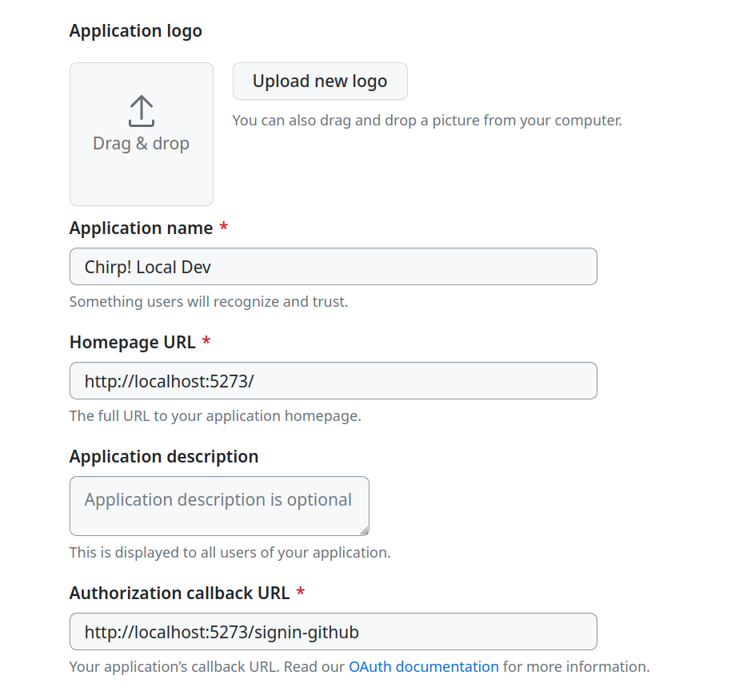

# Your turn now! -- Project Work


You have to work on the following topics.

  - [1) Software Development](#1-software-development)
  - [2) Process](#2-process)


Remember, you have to perform work on each topic and on **each** bullet point.
Be done with the project work before we meet again next week.


## 1) Software Development


Add login functionality to your _Chirp!_ applications.
You can do this in many ways and you decide how to do it.
The following two sections (1.a) and 1.b)) discuss possible solutions.
You choose which one you want to implement.

In any of the cases, we want to have a navigation bar directly below the headline of every page in the _Chirp!_ `<h1>Chirp!</h1>`
 and on top of the list of cheeps that looks similar to the following.


Such a navigation bar may be implemented in a Razor View via code similar to the following.

```html
    <div class=navigation>
        @if (User.Identity.IsAuthenticated)
        {
            <div>
                <a href="/@(User.Identity.Name)">my timeline</a> |
                <a href="/">public timeline</a> |
                <a ... >logout [@(User.Identity.Name)]</a>
            </div>
        }
        else
        {
            <div>
                <a href="/">public timeline</a> |
                <a ... >register</a>
                <a ... >login</a>
            </div>
        }
    </div>
```

In the CSS file that you have in your _Chirp!_ projects, there is a style for a navigation element, which you should use, e.g., `<div class=navigation>`.
In case a user is authenticated, the navigation bar should display links to `my timeline` (links to endpoint `/<username_of_authenticated_user>`), `public timeline` (links to endpoint `/`), and `logout`.
In case a user is not authenticated, the navigation bar should display links to the `public timeline` (links to endpoint `/`), `register` and `login`.

Note, the link to the register endpoint, likely something like `<a class="nav-link text-dark" asp-area="Identity" asp-page="/Account/Register">register</a>`, is relevant for registering a user with ASP.NET Core Identity. That is, task 1.a).
For task 1.b), you do not provide a register endpoint, since users register themselves at GitHub.


### 1.a) ASP.NET Core Identity

A valuable resource when choosing this solution is chapter 23 of the course book Andrew Lock _ASP.NET Core in Action_.
The first sections in it discuss ASP.NET Core Identity based on an example [from the official documentation](https://learn.microsoft.com/en-us/aspnet/core/security/authentication/identity?view=aspnetcore-7.0&tabs=netcore-cli)
Section 23.4 explains in detail how to add ASP.NET Core Identity to an existing Razor Page application, which in your case is your current _Chirp!_ application.
Since the book details the required steps so nicely, I do not describe them here in more detail.

Implement this option first, please make sure that two users, `Helge` and `Adrian` respectively can login to your _Chirp!_ applications.
They should be able to do so using their email addresses (`ropf@itu.dk` and `adho@itu.dk` respectively).
Helge wants to login with the password `LetM31n!` and Adrian wants to login with the password `M32Want_Access`.


### 1.b) OAuth via GitHub

After implementing login functionality via ASP.NET Core Identity in task 1.a, add a second login possibility via GitHun OAuth.
ASP.NET Core supports other [external authentication providers](https://learn.microsoft.com/en-us/aspnet/core/security/authentication/social/?view=aspnetcore-7.0&tabs=visual-studio) too.
But in this course, we would like that you choose GitHub as an external authentication provider.

To do so, and since the book does not describe it, we provide the following information to guide your work:

- [Configure your _Chirp!_ application as an OAuth application on GitHub](https://docs.github.com/en/apps/oauth-apps/building-oauth-apps/creating-an-oauth-app) ([direct link to configuration](https://github.com/settings/applications/new)).
  - Note, do that for your GitHub organization not for your GitHub users.
  - Likely, you have to create _two_ OAuth applications on GitHub.
  - One for local development and testing (pointing to `localhost` URLs) and one for the actual application on Azure App Service.
  For example, if your application for local development runs on `http://localhost:5273/`, then a corresponding configuration could look as in the following:to adapt your `Program.cs` file

  For the deployed application at Azure App Service the Homepage URL fields become the URLs like `https://bdsa2024group<no>chirprazor.azurewebsites.net/`, where `<no>` is replaced with your group's number.
- Now, you have to add a package to your web-application project with a GitHub OAuth provider [`AspNet.Security.OAuth.GitHub`](https://www.nuget.org/packages/AspNet.Security.OAuth.GitHub)
- It is likely the best starting point, to consider the [official example](https://github.com/aspnet-contrib/AspNet.Security.OAuth.Providers) and to adapt your `Program.cs` file accordingly:
  ```csharp
  builder.Services.AddAuthentication(options =>
      {
          options.DefaultAuthenticateScheme = CookieAuthenticationDefaults.AuthenticationScheme;
          options.DefaultSignInScheme = CookieAuthenticationDefaults.AuthenticationScheme;
          options.DefaultChallengeScheme = "GitHub";
      })
      .AddCookie()
      .AddGitHub(o =>
      {
          o.ClientId = builder.Configuration["authentication:github:clientId"];
          o.ClientSecret = builder.Configuration["authentication:github:clientSecret"];
          o.CallbackPath = "/signin-github";
      });
  ...
  app.UseAuthentication();
  app.UseAuthorization();
  app.UseSession();
  ...
  ```
    - Note, the [official example](https://github.com/aspnet-contrib/AspNet.Security.OAuth.Providers) stores secrets from GitHub directly in code. You should not do that!
      Instead store them as user-secrets for local development, see the [documentation on "Safe storage of app secrets in development in ASP.NET Core"](https://learn.microsoft.com/en-gb/aspnet/core/security/app-secrets?view=aspnetcore-7.0&tabs=linux")
    ```
    dotnet user-secrets init
    dotnet user-secrets set "authentication:github:clientId" "<YOUR_CLIENTID>"
    dotnet user-secrets set "authentication:github:clientSecret" "<YOUR_CLIENTSECRET>"
    ```
    - Since you cannot register secrets via the `dotnet` command on Azure App Service, you have to configure them via the application settings:
    

### Hints:

* You should _NEVER_ hardcode API secrets into your source code and upload them to your repository. They will be a part of your repository history and everyone with access to the repository can read them in cleartext.
  * In development: Use the secret manager (see slides)
  * In CI/CD and production: Use environment variables. You set them through the resp. platform (Git Runners, Azure, etc.)
    * Example for Git Runners:
      * Go to `Settings` > `Secrets and Variables` > `Actions` and register your secrets, e.g., calling them `GITHUBCLIENTID` and `GITHUBCLIENTSECRET`.
      * In your actions, you can then reference the values without leaking them, e.g., to expose them as environment variables for your .NET app:
```
- name: Test
    run: |
        export GitHub__ClientId="${{ secrets.GITHUBCLIENTID }}"
        export GitHub__ClientSecret="${{ secrets.GITHUBCLIENTSECRET }}"
        dotnet test --no-build --verbosity normal
```
* Getting a partial view to be integrated into the `_Layout.cshtml` requires adding a tag helper as in the following
```
    @addTagHelper *, Microsoft.AspNetCore.Mvc.TagHelpers
```


## 2) Process

Continue to automatically deploy your _Chirp!_ application to Azure App Service.
