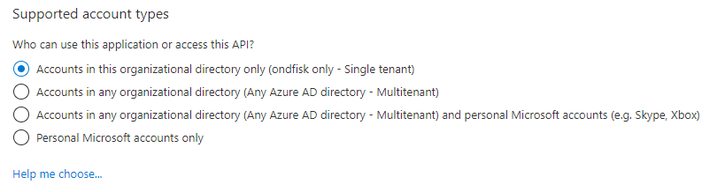
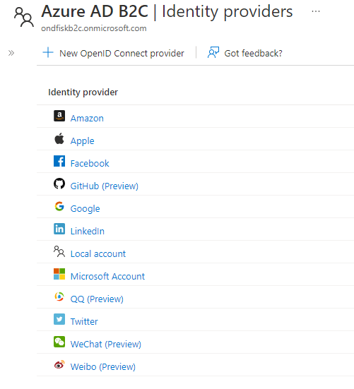
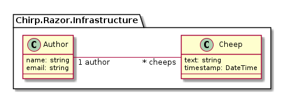
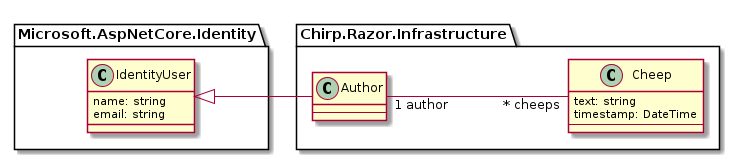

# **Analysis, Design and Software Architecture (BDSA)**
Session 8
[Rasmus Lystrøm, Senior Cloud Solution Architect](rnie@itu.dk)


## Feedback: 😎😎😎

As I hear from the TAs and can see, all of you have working _Chirp!_ applications up and running!

<iframe src="http://209.38.208.62/report_razor_apps.html" width="100%" height=500 scrolling="auto"></iframe>


## Feedback: We feel stressed by the ever growing backlog

- Focus on the tasks in this week
- Try to work only on these things.
  - Not more, nothing else, nothing that is not explicitly stated in the project description file for that week.
- Old issues:
  - If it gives you mental peace, close them for now.
  - **OBS**: when closing issues that are about previous versions, add a respective comment that explains that the issue is about a previous version, state which one, e.g. CLI version, Razor page with direct SQLite integration, etc., and state explicitly what is missing.
  - The latter is described so that you know what to do in case you reopen the issue eventually.
- Now, focus on a Razor Page _Chirp!_ application, that uses EF Core, and for which you enable authentication (this week's task).


## Feedback: One Repository to rule them all?

- Remember that Rasmus showed you and mentioned that usually, you create one repository class per entity.


## Info: The written exam???

  > The exam consists of two parts. The two parts are:
  > a) the project, which is covered via the final submission (report) and which covers important aspects of the project work.
  > b) a written exam (two hours), which covers generic course contents.
  >
  > Each part is graded separately, i.e., students receive a grade for the project and another grade for the written exam.
  > Final grades are computed based on the two grades from the two parts. The precise weight of each part's grade will be communicated to all students in class at the start of the course. To pass the exam, both parts need to receive a passing grade. That is, the project has to be passed and the written exam needs to be passed.

The **grading weight** is: project 2/3 written exam 1/3.

see [LearnIT](https://learnit.itu.dk/local/coursebase/view.php?ciid=1241)


## Info: The written exam???

* On premises Wed. January 3rd 2024, 09:00 - 11:00
* Pen and paper exam.
* No other books, tools, etc.
* Two hours.
* In person

* The exam will be similar to last year's. That is, there will be free form, multiple choice, and sketching answers.
* You can find last year's exam [here](https://ituniversity.sharepoint.com/:b:/r/sites/2023AnalysisDesignandSoftwareArchitecture/Shared%20Documents/General/Documents/2022-itu-bdsa-exam.pdf?csf=1&web=1&e=DbwOM5)
* Note, use it to get an idea of the structure and some contents of the exam.
  - Since course contents changed, not all contents of the exam apply. Good examples of kinds of questions to be prepared for are: Question 1 a-d, Question 2 a-b, Question 4 j-l, Question 6 a-g


## Topic for today

How to make it possible that **users** are supported by our _Chirp!_ applications and that these can **login/-out**?

* We need to model users.
* We need to add authentication.


## Authentication vs. Authorization


## Authentication

* Authentication is the process of verifying that a user or a device is who they claim to be
* 401 Unauthorized

## Authorization

* Authorization is the process of granting or denying access rights to a user or a device based on their identity and other factors
* 403 Forbidden

## Authentication Options

* (None)
* Individual User Accounts
* Microsoft Identity Platform (Entra ID)
* Windows
* Easy Auth (Azure only)
* Others


## Individual User Accounts

### aka ASP.NET Core Identity

* Built-in
* Local accounts
* Credentials stored in database
* Works offline
* Support for social (Facebook, Twitter, GitHub, etc.)
* Support for authorization
* You manage everyting (some code auto generated)

## Task:

<!--
_backgroundImage: "linear-gradient(to bottom, #67b8e3, #0288d1)"
_color: white
_header: 15 minutes
-->
<style scoped>
section {
   font-size: 21px;
}
</style>

Explore options using `dotnet new webapp --auth Individual` - or use Visual Studio GUI.

Look through the generated code.

Try to run the app, register a user, and sign in.

## Individual User Accounts

### Demo: Add GitHub + User Secrets

## Individual User Accounts

### Demo: Extend/connect data model

## Microsoft Identity Platform

### aka Entra ID aka Azure AD

### LOB, Corporate, Business to Business (B2B)

Entra ID is Microsoft's cloud-based identity and access management service, which helps your employees sign in and access resources in:

External resources, such as Microsoft 365, the Azure portal, and thousands of other SaaS applications.
Internal resources, such as apps on your corporate network and intranet, along with any cloud apps developed by your own organization.




## Microsoft Identity Platform

### Business to Consumer (B2C)

**Notes**:

* No built-in support for *authorization*.
* Will be replaced with *Microsoft Entra ID for customers* (public preview)



## Task:

<!--
_backgroundImage: "linear-gradient(to bottom, #67b8e3, #0288d1)"
_color: white
_header: 5 minutes
-->
<style scoped>
section {
   font-size: 21px;
}
</style>

Go to [portal.azure.com](https://portal.azure.com/)

Create new B2C Tenant

(don't wait for it to be created)

## Azure AD B2C

### Demo: Add GitHub

## Task:

<!--
_backgroundImage: "linear-gradient(to bottom, #67b8e3, #0288d1)"
_color: white
_header: 20 minutes
-->
<style scoped>
section {
   font-size: 21px;
}
</style>

Explore your new Azure AD B2C tenant.

Create a Signup-Signin policy called `sisu`.

Create a new app registration with callback `https://jwt.ms`.

Test it.

Add `https://localhost` to your app registration.

Configure a new web app to use `--auth IndividualB2C`

## Azure AD B2C

### Demo: Claims page

## Windows

Old school

Legacy

Don't use!

Works offline - Enterprise scenario with no Internet?


## Easy Auth

* Built-in to Azure App Service (Web Apps + Functions) and Azure Container Apps
* *Easy* but somewhat limited.
* Superb for prototyping but also production ready
* No built-in support for authorization
* *Only* works on Azure


## Others


* ForgeRock
* Okta
* ...


## Key takeaways:

### Don’t roll your own security/identity layer


## We mean it!

### Don’t roll your own security/identity layer


## Key takeaways (2):

* Taking the easy route (individual auth) might only be easy at first...

* Invest in learning how to implement Entra ID


---

## Feedback:

<!-- ---------------------------------------------------------------------- -->

## ASP.Net Identity

* 
* 


## ASP.Net Identity

* An `Author` entity in our data model so far
  ```csharp
  public class Author
  {
      public int AuthorId { get; set; }
      public required string Name { get; set; }
      public required string Email { get; set; }

      public required ICollection<Cheep> Cheeps { get; set; }
  }
  ```

```csharp
using Microsoft.AspNetCore.Identity;

public class Author : IdentityUser
{
    public ICollection<Cheep> Cheeps { get; set; }
}
```


## Task:

<!--
_backgroundImage: "linear-gradient(to bottom, #67b8e3, #0288d1)"
_color: white
_header: 15 minutes
-->
<style scoped>
section {
   font-size: 21px;
}
</style>

- To prepare, install the ASP.NET Code Generator tool `dotnet tool install --global dotnet-aspnet-codegenerator`.
- Create a Razor Page application example project that uses ASP.NET Core Identity for authentication.
  ```
  dotnet new webapp --auth Individual -o WebApp1
  cd WebApp1
  ```
- Add a package that is required for code generation: `dotnet add package Microsoft.VisualStudio.Web.CodeGeneration.Design`
- Scaffold, i.e., automatically generate Razor Pages for registering and login of users: `dotnet aspnet-codegenerator identity -dc WebApp1.Data.ApplicationDbContext --files "Account.Register;Account.Login;Account.Logout;Account.RegisterConfirmation" --useSqLite`
- Run the database migrations `dotnet ef database update`
- Open file [./Areas/Identity/Pages/Account/Register.cshtml.cs](WebApp1/Areas/Identity/Pages/Account/Register.cshtml.cs) in VSCode.
- Set a breakpoint on line 115.
- Run the application via the debugger in VSCode.
- Register a new user on the web UI, step through the steps of registering a user with the debugger, observe the contents of variable `user` and subsequent behavior.


<!--Based on https://learn.microsoft.com/en-us/aspnet/core/security/authentication/identity?view=aspnetcore-7.0&tabs=netcore-cli -->


<!-- ---------------------------------------------------------------------- -->


## HTTP Sessions?

  > HTTP is a stateless protocol. By default, HTTP requests are independent messages that don't retain user values.
<font size=3>
Source: <a href="https://learn.microsoft.com/en-us/aspnet/core/fundamentals/app-state?view=aspnetcore-7.0"><i>Session and state management in ASP.NET Core</i></a>
</font>

When this is the case, and when users of _Chirp!_ interact with the application via HTTP requests, which are sent by a web browser, how can we then now that a sequence of requests come from one user?

## Task: Inspect cookie contents in browser

<!--
_backgroundImage: "linear-gradient(to bottom, #67b8e3, #0288d1)"
_color: white
_header: 10 minutes
-->

<style scoped>
section {
   font-size: 23px;
}
</style>

- Run the application `Chirp.Session.Example` `dotnet run`, open the provided URL with your browser.
- Open the `Network` tab in the development tools of your browser (press F12 on Firefox, Edge, ...)
- Reload the page (`CTRL+R`) and click on the `GET` request to the root endpoint (`/`)
- Inspect the headers of the sent request and response. Are there any `Cookie:` fields in the request or any `Set-Cookie:` fields in the response?
- Switch to the terminal and quit the server application with `CTRL+C`
- Now, run it again with support for cookie sessions enabled: `dotnet run -p:DefineConstants=SESSION_COOKIE_SUPPORT`

- Switch back to the `Network` tab in the development tools of your browser, reload the page once, and inspect the headers of the sent request and response. Are there any `Cookie:` fields in the request or any `Set-Cookie:` fields in the response?
- How do these fields change in proceeding reloads?


## Cookies???

<style scoped>
pre {
   font-size: 18px;
}
</style>


Initial request:

```
GET /info.html HTTP/2.0
Host: www.cookie-monster.org
Cookie: yummy_cookie=choco; tasty_cookie=strawberry
```

Response:

```
HTTP/2.0 200 OK
Content-Type: text/html
Set-Cookie: yummy_cookie=choco
Set-Cookie: tasty_cookie=strawberry

[page content]
```

Following requests:

```
GET /info.html HTTP/2.0
Host: www.cookie-monster.org
Cookie: yummy_cookie=choco; tasty_cookie=strawberry
```

<font size=3>
Source: Adapted from <a href="https://developer.mozilla.org/en-US/docs/Web/HTTP/Cookies">MDN Docs <i>Using HTTP cookies</i></a>
</font>


## Cookies for session handling???


## Detour: Conditional compilation with preprocessor directives

<style scoped>
pre {
   font-size: 22px;
}
</style>

Like other languages in the C strain of languages, C♯ code can be compiled conditionally. In case a property is set on compile-time, code that is enclosed in preprocessor directive is included in compile step.

```csharp
// Enable this code by setting the property on run, build, publish, etc.
// E.g., dotnet run -p:DefineConstants=SESSION_COOKIE_SUPPORT
#if SESSION_COOKIE_SUPPORT
builder.Services.AddDistributedMemoryCache();

builder.Services.AddSession(options =>
{
    options.Cookie.Name = ".Chirp.Session";
    options.IdleTimeout = TimeSpan.FromMinutes(10);
    options.Cookie.HttpOnly = true;
    options.Cookie.IsEssential = true;
});
#endif
```

In the previous example, we use these only to demonstrate two features in a single program.


<font size=3>
Documentation of <a href="https://learn.microsoft.com/en-us/dotnet/csharp/language-reference/preprocessor-directives#conditional-compilation">C♯ preprocessor directives</a>
</font>

## Store information in session cookie

* > The session cookie is encrypted via `IDataProtector`. Data Protection must be properly configured to read session cookies on each machine. For more information, see ASP.NET Core Data Protection Overview and Key storage providers.<font size=3>
Source: <a href="https://learn.microsoft.com/en-us/aspnet/core/fundamentals/app-state?view=aspnetcore-7.0">Microsoft Docs <i>Session and state management in ASP.NET Core</i></a>
</font>


* > :warning: Warning
  >
  > Don't store sensitive data in session state. The user might not close the browser and clear the session cookie. Some browsers maintain valid session cookies across browser windows. A session might not be restricted to a single user. The next user might continue to browse the app with the same session cookie. <font size=3>
Source: <a href="https://learn.microsoft.com/en-us/aspnet/core/fundamentals/app-state?view=aspnetcore-7.0">Microsoft Docs <i>Session and state management in ASP.NET Core</i></a>
</font>


## OAuth Concepts

- Resource Owner
- Client
- Authorization Server


## OAuth Dance


<font size=3>
Image source: <a href="https://www.manning.com/books/oauth-2-in-action">J. Richer et al. <i>OAuth2 in Action</i></a>
</font>


## `ClaimsPrincpal` and `Claims`


 <font size=3>
Image source: Andrew Lock <i>ASP.NET Core in Action</i>
</font>


## Handling of authenticated requests


 <font size=3>
Image source: Andrew Lock <i>ASP.NET Core in Action</i>
</font>


## ASP.NET Login providers: OAuth via GitHub

<style scoped>
pre {
    font-size: 20px;
}
section {
    font-size: 20px;
}
</style>

```csharp
builder.Services.AddAuthentication(options =>
    {
        options.DefaultAuthenticateScheme = CookieAuthenticationDefaults.AuthenticationScheme;
        options.DefaultSignInScheme = CookieAuthenticationDefaults.AuthenticationScheme;
        options.DefaultChallengeScheme = "GitHub";
    })
    .AddCookie()
    .AddGitHub(o =>
    {
        o.ClientId = builder.Configuration["authentication:github:clientId"];
        o.ClientSecret = builder.Configuration["authentication:github:clientSecret"];
        o.CallbackPath = "/signin-github";
    });
...
app.UseAuthentication();
app.UseAuthorization();
app.UseSession();
...
```

<font size=3>
Source: Adapted from the <a href="https://github.com/aspnet-contrib/AspNet.Security.OAuth.Providers">Official Documentation of the <tt>AspNet.Security.OAuth.Providers</tt> package</a>
</font>

- Note: You do not have to implement the endpoint `/signin-github` for the `CallbackPath`. The `AspNet.Security.OAuth.Providers` middleware takes care of this.
- However, you have to specify it! This is the one that you register at GitHub when configuring your application there.


## Where does the `builder.Configuration` come from?

Within the project that contains your `Program.cs` file of your web-application, set the secrets for the GitHub OAuth app:

```
dotnet user-secrets init
dotnet user-secrets set "authentication:github:clientId" "<YOUR_CLIENTID>"
dotnet user-secrets set "authentication:github:clientSecret" "<YOUR_CLIENTSECRET>"
```

From another project, it can be set like this:

```
dotnet user-secrets set "authentication:github:clientId" "<YOUR_CLIENTID>" --project "<./path/to/project>"
...
```

<font size=3>
Source: <a href="https://learn.microsoft.com/en-gb/aspnet/core/security/app-secrets?view=aspnetcore-7.0&tabs=linux">Safe storage of app secrets in development in ASP.NET Core</a>
</font>


##


https://docs.github.com/en/apps/oauth-apps/building-oauth-apps/creating-an-oauth-app


## How to set such secrets in production?

On Azure App Service, you cannot set secrets via `dotnet user-secrets set`. Instead, configure them via the application settings.


## How to login? A `Challenge`

Given code like this, what is `Results.Challenge`?

```csharp
app.Map("/login", () => Results.Challenge(new AuthenticationProperties() { RedirectUri = "/" }));
```

TODO: Make a task out of this


## How to logout?

```csharp
app.Map("/logout", async (HttpContext httpContext) =>
{
    await httpContext.SignOutAsync(CookieAuthenticationDefaults.AuthenticationScheme);
    // httpContext.Session.SetString("flashes", "You were logged out.");
    return Results.Redirect("/public");
});
```


<!-- ---------------------------------------------------------------------- -->
