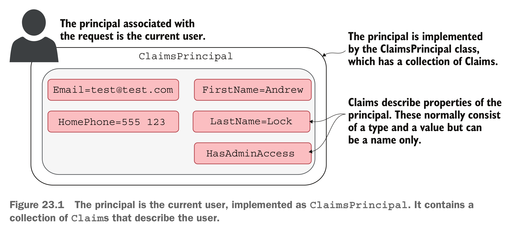

# BDSA: Session 8
## User Authentication
#### Cookies, ASP.NET Core Identity, and OAuth

[Sven Peldszus](svpe@itu.dk)

# Motivation


# Security Features

Security features are functionalities of a software system that protect assets, prevent attacks, or mitigate the damage caused by attacks.

E.g., Access Control
- Authentication
- Authorization


<br/><br/>
<sub><small>Hermann et al.: [A taxonomy of functional security features and how they can be located](https://doi.org/10.1007/s10664-025-10649-7), EMSE, 2025</small></sub>


# Todays's lecture

&emsp;
## 👤 User Authentication!

- How do we manage users?
  - Registration
  - Logging in
  - Managing accounts
- How do we _not_ mess up security related issues, e.g., storing passwords?
- What about advanced security measures, e.g., confirmation emails and MFA?

# Authentication vs. Authorization

&emsp;
- ### 👤 Authentication!
  - Who are you?
&emsp;
- ### 🔐 Authorization
  - What are you allowed to do / access?

&emsp;
* **Authorization requires Authentication!**


# Authentication over HTTP

&emsp;

> HTTP is a **stateless protocol**. By default, HTTP requests are independent messages that don't retain user values.
<span style="font-size: 0.6em;">Source: <a href="https://learn.microsoft.com/en-us/aspnet/core/fundamentals/app-state?view=aspnetcore-7.0">Session and state management in ASP.NET Core (microsoft.com)</a></span>

&emsp;

### After logging users into our system,
### how do we keep track of them when they send _subsequent_ requests??


# 🍪 Cookies 🍪


> A cookie (also known as a web cookie or browser cookie) is a **small piece of data a server sends to a user's web browser**. The browser may store cookies, create new cookies, modify existing ones, and send them back to the same server with later requests. Cookies enable web applications to store limited amounts of data and **remember state information**; by default the HTTP protocol is stateless.

<small><sub>Text and Image Source: <a href="https://developer.mozilla.org/en-US/docs/Web/HTTP/Cookies">Using HTTP cookies (mozilla.org)</a></sub></small>


# 🍪 Where are my cookies!?
<!--
_backgroundImage: "linear-gradient(to bottom, #67b8e3, #0288d1)"
_color: white
_header: 5 minutes
-->

- Open your browser and access `https://github.com/`
  - Log out if you are logged in (or open a private browser tab)
- Open the developer tools in your browser (probably by pressing `F12`)
- Navigate to the tab "Network" and reload the page (`F5`)
- Select the root HTTP request-response-pair (first in the list)
  - Inspect the headers of both the request and the response: **Do they contain cookies?**
&emsp;
* In a separate tab, log into your Github account and access `https://github.com/`
  - Again inspect the HTTP headers and compare them with your logged-out results
    - What additional cookie data is sent from your browser?
    - What does Github prompt your browser to store?


# Authentication: What are the options?

- ### Option A: We manage users in our own database
  - ⚠️ In this case, _we_ are responsible for very sensitive user data
  - Example technology: **ASP.NET Core Identity**

* ### Option B: We use an external service for managing users
  - We leave the responsibility over user data to a third party
    - This means that, to some degree, we depend on that third party
  * Different kinds of solutions exist
    - login via external authentification service (e.g., Auth0)
    - login via third party account (e.g., GitHub or Facebook)
  * Open protocols exist, e.g., **OAuth** and OpenID


# Option A: Self-managed authentication - Challenges

- Storing passwords in the database
  - **must not** be stored as cleartext
  - how else??
- Providing advanced security features, e.g., Multi-Factor-Authentication (MFA)
- Enabling users to update their information
- ...
&emsp;
* All of this requires (a lot of) source code
  - It is easy to introduce bugs and security flaws
&emsp;
* ⚠️ **We should not implement our own authentication system from scratch!**
  - It is a _lot_ of work and it is ☠️ **<span style="color:#bb2222">dangerous</span>**: mistakes can cause severe security disasters


# Managing user data: Password hashing

... as an example challenge in user authentication - you do **not** want to implement this yourself!

- **Storing passwords in cleartext is not smart**
  - Can be read by everyone with access to database (e.g., malicious engineer in a company)

* **Better**: Passing them through a function that...
  - calculates a derived value (a "**hash**"):
  `Unhackable123` -> `Pc9QceViJCRLTIX8HcN5`
  - is extremely hard to reverse (derived value cannot be converted back to password):
  `Pc9QceViJCRLTIX8HcN5` -> ???

* **Even better**: obfuscating the hashes further by adding random noise to the password
  - this is called "**salting the hash**" 🧂 - same passwords receive different hashes

If you want to learn more, you could start with these articles on [hashing](https://auth0.com/blog/hashing-passwords-one-way-road-to-security/) and [adding salt to hashes](https://auth0.com/blog/adding-salt-to-hashing-a-better-way-to-store-passwords/)!


# ASP.NET Core Identity

- Often simply referred to as "Identity" (don't be confused by online resources)

- Out-of-the-box support for (most of) what we discovered in previous slides

* Notion of users is integrated into ASP.NET
  - requests receive an `HttpContext` containing information, i.a., on the user sending it
  - based on that, ASP.NET Core Identity provides a solution for authorization

* Identity + EF Core =<span style="font-size:3rem;">❤️</span>
  - user information (name, email, password, ...) need to be stored in our database
    - passwords must be hashed (with salt! 🧂)
  - Identity provides us with a secure solution to achieve this

<!--
❤️ Identity + EF Core = A Perfect Match

ASP.NET Core Identity handles all the security logic:
user registration, login, password hashing, roles, claims, etc.

Entity Framework Core (EF Core) handles all the data persistence:
automatically creates and manages tables like AspNetUsers, AspNetRoles, etc.

Together, they give you a complete, database-backed authentication system —
secure, extensible, and ready to use out of the box.

💡 “You get users, roles, and login security — without writing SQL or auth logic yourself.”
-->

# Termology &mdash;  Principal

👤 What is a Principal?

- A Principal represents the **current user** (or system entity) that is interacting with the application.

It answers the question: 

> Who is making this request?

In short:

- A **Principal** is the security object that represents the **current user and their rights** within an application.


# ASP.NET Core Identity &mdash; Claims-based authentication



- Claims store data on who a user _is_
  - Authentication
- Can be used to determine what the user is allowed to _do_
  - Authorization

<span style="font-size: 0.6em;">Image source: <a href="https://www.manning.com/books/asp-net-core-in-action-third-edition">Andrew Lock <i>ASP.NET Core in Action, Third Edition</i></a></span>


# Summary of Authentication Terminology
<br/>
<br/>
<table>
<tr>
<th>Term</th>	<th>Meaning</th>
<tr><td>Identity</td>	<td>Describes who the user is (e.g., username, authentication method).</td></tr>
<tr><td>Principal</td>	<td>Represents the user as a whole (can have multiple identities).</td></tr>
<tr><td>Claims</td>	<td>Pieces of information about the user (e.g., email, role, permissions).</td>
</tr>
</table>

# <span style="position:absolute; top:5%; right: 5%; font-size:0.75em;">Identity: Handling of a Log-In Request</span>


<br/><br/><br/><br/><br/><br/><br/><br/><br/><br/><br/><br/>
<sub>
<small>
&emsp;&emsp;&emsp;&emsp;&emsp;&emsp;&emsp;&emsp;&emsp;&emsp;&emsp;&emsp;&emsp;&emsp;&emsp;Image source: Section 23 of <a href="https://www.manning.com/books/asp-net-core-in-action-third-edition">Andrew Lock <i>ASP.NET Core in Action, Third Edition</i></a>
</small>
</sub>


# <span style="position:absolute; top:5%; right: 5%; font-size:0.75em;">Identity: Authenticated Request</span>


<br/><br/><br/><br/><br/><br/><br/><br/><br/><br/><br/><br/>
<sub>
<small>
&emsp;&emsp;&emsp;&emsp;&emsp;&emsp;&emsp;&emsp;&emsp;&emsp;&emsp;&emsp;&emsp;&emsp;&emsp;Image source: Section 23 of 
<a href="https://www.manning.com/books/asp-net-core-in-action-third-edition">
Andrew Lock <i>ASP.NET Core in Action, Third Edition</i>
</a>
</small>
</sub>

# Try it out: Create a project and inspect the files
<!--
_backgroundImage: "linear-gradient(to bottom, #67b8e3, #0288d1)"
_color: white
_header: 10 minutes
-->

- Create a new ASP.NET Core web app project: `dotnet new webapp -au Individual`
  - the argument `-au Individual` adds Identity to the project setup, including a lot of UI templates (which, unfortunately, are hidden from you!)
  - there are other options besides `Individual`, we discuss those later

* Inspect the generated project:
  - The general structure should look familiar
  - Have a look at the `Areas` folder
    - this is a special folder with special semantics!
  - Have a look at the `Data` folder
    - the template comes with a default db context, a migration is already created
    - note that the db context inherits from `IdentityDbContext`, providing functionality
  - Have a look at the `Pages` folder, look into `Pages/Shared/_LoginPartial.cshtml`

<!--
Areas/Identity
Contains (mostly hidden) Identity UI for login, registration, etc.
→ Can be scaffolded if you want to customize pages.

Data/
Holds ApplicationDbContext (inherits from IdentityDbContext)
and initial migration for the Identity tables in app.db.

Pages/
Main Razor Pages of the app.
Shared/_LoginPartial.cshtml shows login/logout links depending on user state.

wwwroot/
Static files (CSS, JS, Bootstrap, jQuery).

When you run the app: users can register, log in, and logout — all powered by Identity and EF Core.
-->


# Try it out: Run the project and play around
<!--
_backgroundImage: "linear-gradient(to bottom, #67b8e3, #0288d1)"
_color: white
_header: 15 minutes
-->

- Run the project and play around with the launched website.
  - create a user
    - note that, per default, Identity is configured with email confirmation
      - the part of sending an email needs to be implemented manually (not now)
  - log into the website
  - inspect your user data and how to change information, e.g., email or password

* Note that these authentication features all work out of the box!

* Open the app's SQLite database with an SQLite analysis tool, e.g., [DB Browser for SQLite](https://sqlitebrowser.org/)
  - the `ASPNetUsers` table is generated by Identity and contains data for registered users
  - inspect the `ASPNetUsers` table:
    - are the passwords hashed?


# How to add Identity to an existing project

Follow the instructions in the book: **Chapter 23**

General tipps:
  - use the example project from earlier for orientation
  - the `Microsoft.AspNetCore.Identity.UI` package adds a _lot_ of razor pages to your application
    - however, these won't show in your folder structure
      - once again, Microsoft is trying to hide complexity
    - you can use "[scaffolding](https://learn.microsoft.com/en-us/aspnet/core/security/authentication/scaffold-identity?view=aspnetcore-7.0&tabs=visual-studio#scaffold-identity-into-a-razor-project-with-authorization-1)" to override hidden pages with custom content where needed
      - the book provides very useful tips here!


# How to add Identity to an existing project (ctd.)

Utilize Identity by re-using their `IdentityUser` class. Change your current domain model...


... to inherit from `IdentityUser`:


Similarly, your `DBContext` requires adaption (cf. book):
`public class ChirpDbContext : IdentityDbContext<Author, IdentityRole<int>, int> { ... }`


# Option B: Third-party authentication


- #### Authentication through external service
  - full-blown (usually paid) service that takes care of authentication (e.g., [Auth0](https://auth0.com/))
  - can be seamlessly integrated into an application

* #### Authentication through third-party account
  - authorize users through their user accounts with other services, e.g., Google, GitHub, Facebook, Apple, etc.

* #### How??
  - a plathora of protocols exist
  - notable open standards are **OAuth** and OpenID


# OAuth


> OAuth (short for **open authori-zation**) is an open standard for **access delegation**, commonly used as a way for internet users to grant websites or applications access to their information on other websites but **without giving them the passwords**.

[Wikipedia](https://en.wikipedia.org/wiki/OAuth)


# The OAuth dance

<span style="font-size: 4em;">🕺🕺💃💃</span>

In our Chirp! project, actor roles are:
- Resource Owner = User (Chirp! and GH)
  - User Agent = their browser
- Client = Chirp!
- Authorization Server = GitHub
- Resource Server (not used) = GitHub

<span style="font-size: 0.8em;">Image source: <a href="https://www.manning.com/books/oauth-2-in-action">J. Richer et al. <i>OAuth2 in Action</i></a></span>

# The OAuth dance

- <span style="background-color: #ffd40055;">Chirp > User</span>: "To authenticate, go here"

# The OAuth dance

- Chirp > User: "To authenticate, go here"
- <span style="background-color: #ffd40055;">User > GitHub</span>: "Hey, it's me!"
- <span style="background-color: #ffd40055;">User & GitHub</span>: "Allow this app?" - "Yes!"
- <span style="background-color: #ffd40055;">GitHub > User</span>: "Go here with this code"

# The OAuth dance

- Chirp > User: "To authenticate, go here"
- User > GitHub: "Hey, it's me!"
- User & GitHub: "Allow this app?" - "Yes!"
- GitHub > User: "Go here with this code"
- <span style="background-color: #ffd40055;">User > Chirp</span>: "Here I am, use this code"
- <span style="background-color: #ffd40055;">Chirp > GitHub</span>:
  - "The user authorized me!"
  - "I am the real Chirp!" (client secret)

# The OAuth dance

- Chirp > User: "To authenticate, go here"
- User > GitHub: "Hey, it's me!"
- User & GitHub: "Allow this app?" - "Yes!"
- GitHub > User: "Go here with this code"
- User > Chirp: "Here I am, use this code"
- Chirp > GitHub:
  - "The user authorized me!"
  - "I am the real Chirp!" (client secret)
- <span style="background-color: #ffd40055;">GitHub > Chirp</span>: "Here is your token"
- <span style="background-color: #ffd40055;">Chirp > GitHub</span>: "Give me this resource, here is my access token"


# The OAuth dance


&emsp;
> Oh my, this looks complicated!
Do I have to implement this myself??

&emsp;
## No 😊
There exist NuGeT packages for ASP.NET Core Identity for many services.
Among these: GitHub!

Repository: [AspNet.Security.OAuth.GitHub](https://github.com/aspnet-contrib/AspNet.Security.OAuth.Providers?tab=readme-ov-file)


# Register an Auth0 app with GitHub
<!--
_backgroundImage: "linear-gradient(to bottom, #67b8e3, #0288d1)"
_color: white
_header: 10 minutes
-->
- Go to github.com
- Click on your profile picture (upper right corner)
  - Go to Settings
- In the left-hand side panel, go to Developer Settings
- Go to OAuth Apps
- Create a new App for your Chirp! application

### Take a close look at the information GitHub demands from you:
* What is the "Authorization callback URL"?
  - Look for it in the OAuth dance diagram shown on the previous slides
* What should you fill in here?


# GitHub Auth0 app - example settings


The shown configuration works for:
- local setup (in development)
- HTTPS
- port 5000


# OAuth in ASP.NET Core - GitHub

GitHub provides you with a **Client ID** and **Client secret** for your Chirp! app.
You use these to configure the authentication:

```csharp
builder.Services
    .AddAuthentication(options =>
    {
        options.RequireAuthenticatedSignIn = true;
    })
    .AddGitHub(options =>
    {
        options.ClientId = githubClientId; // GitHub Client ID
        options.ClientSecret = githubClientSecret; // GitHub Client secret
    });
```

### DO NOT HARD CODE YOUR CLIENT SECRET INTO THE SOURCE CODE!
### 🚨 DO NOT CHECK IT INTO YOUR GIT REPOSITORY AT ALL!!! 🚨


# .NET Secret Manager
<!--
_backgroundImage: "linear-gradient(to bottom, #67b8e3, #0288d1)"
_color: white
_header: 10 minutes
-->

Microsoft developed a [minimalistic tool](https://learn.microsoft.com/en-us/aspnet/core/security/app-secrets?view=aspnetcore-7.0&tabs=windows) for storing secrets **FOR DEVELOPMENT** outside the repository environment, so that these are accessible as if defined in `appsettings.json` (where secrets will **NEVER** be included because that file is checked into Git!)

* Initialize the tool (from within project folder): `dotnet user-secrets init`
  - Inspect the resp. `.csproj` file. There should be a new tag `<UserSecretsId>8g5s...</>`
  - The tool will create a file `~/.microsoft/usersecrets/8g5s.../secrets.json`
    - The file is empty right now, we can fill it with secrets
* Enter your GitHub Client ID and Client secret
  `dotnet user-secrets set "GitHub:ClientID" "TWTt8z9RhTQjGa7jpL1q"`
  `dotnet user-secrets set "GitHub:ClientSecret" "ibep0j74ddatc3fdrpbtm627zhulvjmvgjsln6gx"`
  - Again inspect the secret file `~/.microsoft/usersecrets/8g5s.../secrets.json` and see if the entries were added
  - Note that the secret is stored in cleartext on your harddrive!


# Testing ASP.NET Core Identity apps

Of course, you should test your Identity setup.
Example: Checking whether clients get redirected when trying to access a protected resource

```csharp
// Arrange
HttpClientHandler httpClientHandler = new HttpClientHandler();
httpClientHandler.AllowAutoRedirect = false; // prevent redirects
client = new HttpClient(httpClientHandler);
// ... configuring the client and starting the server omitted

// Act
HttpResponseMessage resp = await client.GetAsync("/ProtectedPage");
string content = await resp.Content.ReadAsStringAsync();

// Assert
Assert.Equal(HttpStatusCode.Redirect, resp.StatusCode);
Assert.StartsWith("https://localhost/Identity/Account/Login", resp.Headers.Location.OriginalString);
```

Read more: https://learn.microsoft.com/en-us/aspnet/core/test/integration-tests?view=aspnetcore-7.0


# Authentication Summary

* ### 🍪 Cookies make the web stateful
  - Are carried from request to request to authenticate user
  - Do never contain sensitive data as they are stored in cleartext and can be read freely
  - Instead, services use cryptic session ids that are mapped to user sessions in backend

* ### We can manage user credentials in our own database
  - **ASP.NET Core Identity** provides a secure foundation for implementing this
  - However, we (server owners) are responsible for sensitive user data

* ### We can authenticate users via third parties
  - **OAuth** is an open standard for handling user authentication and access to resources without sharing passwords between services
  - This is great, because we do not have responsibility over sensitity data

# Access Control: From Identity to Authorization

- ### 👤 Authentication!
  - Identifies who the user is
  - Based on *Identity*, *Principal*, and *Claims*

- ### ❓ What happens after authentication?
  - Once the identity of a principal is verified, we must decide what it is allowed to do.


  - ### 🔐 Authorization
    - Decide what a principal is allowed to do / access?

- ### 🛡️ Access Control ### 
  - It is the bridge between **authentication** and **authorization**.


# 🛡️ Access Control

- The mechanism that enforces authorization decisions.
- It acts as the bridge between authentication and authorization.
<br>
- Implemented through models such as:

  - DAC (Discretionary Access Control)
  - MAC (Mandatory Access Control)
  - RBAC (Role-Based Access Control)
  - ABAC (Attribute-Based Access Control)
  - (Rule-Based Access Control)
  - ...

# Access Control in *Chirp!*
<!--
_backgroundImage: "linear-gradient(to bottom, #67b8e3, #0288d1)"
_color: white
_header: 5 minutes
-->


- Where do we already have access control in *Chirp!*&nbsp;?
<br>
- Think about
  - Software components
  - Development processes and workflows
  - ...
<br>
- Join at menti.com  | 
  use code 2562 4460


# Discretionary Access Control (DAC)

**Definition:** The owner of a resource (e.g., a file) decides who can access it and what kind of access they have.
- Authorization Implication:

  - Users have control over their own resources.
  - Permissions can be easily shared, which can lead to security risks if not managed carefully.


**Example:** In Unix/Linux, file owners can set read/write/execute permissions for others.


# Mandatory Access Control (MAC)

**Definition:** Access decisions are made based on security labels (e.g., classification levels like "Confidential", "Secret").
- Authorization Implication:

  - Users cannot change access permissions.
  - Enforced by the system based on policies.
  - Common in military and government systems.

- Security levels are typically defined in a lattice model
  - Confidential ≤ Secret: This means "Secret" dominates "Confidential".

**Example:** A user with "Confidential" clearance cannot access "Secret" documents.


#  Role-Based Access Control (RBAC)

**Definition:** Access is granted based on a user's role within an organization.
- Authorization Implication:

  - Simplifies management by grouping permissions into roles.
  - Users inherit permissions from their roles.
  - Common in enterprise systems.


**Example:** A "Manager" role might have access to employee records, while a "Staff" does not.


# Attribute-Based Access Control (ABAC)

**Definition:** Access is determined by evaluating attributes of the user, resource, and environment.
- Authorization Implication:

  - Highly flexible and dynamic.
  - Policies can include conditions like time of day, location, or user department.


**Example:** A user can access a document only if they are in the "Finance" department and it's during business hours.


# Rule-Based Access Control

**Definition:** Access is controlled by predefined rules, often in the form of "if-then" statements.
- Authorization Implication:

  - Similar to ABAC but typically simpler.
  - Often used in firewalls or network access control.


**Example:** "If user IP is from internal network, allow access."


# Access Control for *Chirp!*
<!--
_backgroundImage: "linear-gradient(to bottom, #67b8e3, #0288d1)"
_color: white
_header: 5 minutes
-->


- Which of the access control mechanisms could be usable in *Chirp!*&nbsp;?
  - Discretionary Access Control
  - Mandatory Access Control
  - Role-Based Access Control
  - Attribute-Based Access Control
  - Rule-Based Access Control
- For what would you use them?

- Join at menti.com  | 
  use code 2562 4460

# What to do now?


- If not done, complete the Tasks (blue slides) from this class
- Check the [reading material](./READING_MATERIAL.md)
- Work on the [project](./README_PROJECT.md)

- If you feel you want prepare for next session, read chapters 16, 17, and 18 in [Andrew Lock _ASP.NET Core in Action, Third Edition_](https://www.manning.com/books/asp-net-core-in-action-third-edition)
