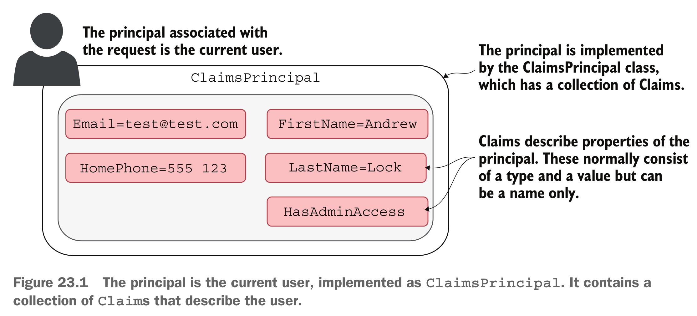
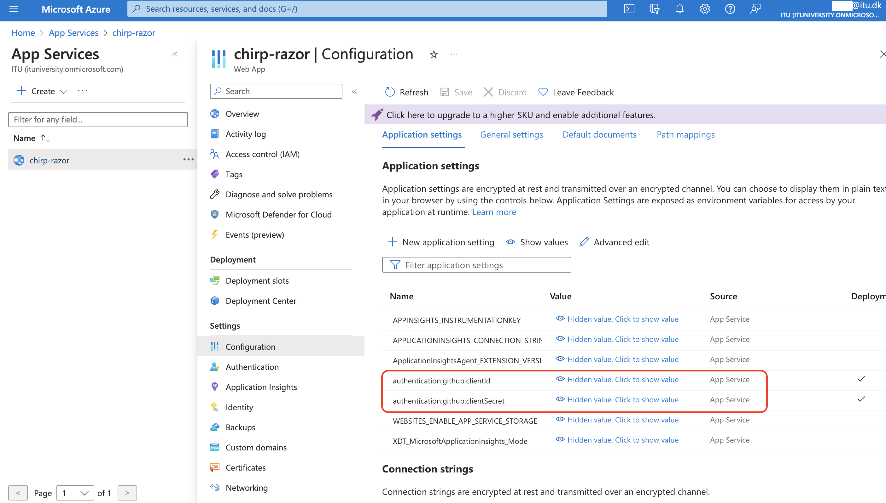

# **Analysis, Design and Software Architecture (BDSA)**
Session 8 - Supplementary Material
[Helge Pfeiffer, Associate Professor](ropf@itu.dk)


## Task: Understanding User Registration with Individual Accounts

<!--
_backgroundImage: "linear-gradient(to bottom, #67b8e3, #0288d1)"
_color: white
_header: 15 minutes
-->
<style scoped>
section {
   font-size: 21px;
}
</style>

- To prepare, install the ASP.NET Code Generator tool `dotnet tool install --global dotnet-aspnet-codegenerator`.
- Create a Razor Page application example project that uses ASP.NET Core Identity for authentication.
  ```
  dotnet new webapp --auth Individual -o WebApp1
  cd WebApp1
  ```
- Add a package that is required for code generation: `dotnet add package Microsoft.VisualStudio.Web.CodeGeneration.Design`
- Scaffold, i.e., automatically generate Razor Pages for registering and login of users: `dotnet aspnet-codegenerator identity -dc WebApp1.Data.ApplicationDbContext --files "Account.Register;Account.Login;Account.Logout;Account.RegisterConfirmation" --useSqLite`
- Run the database migrations `dotnet ef database update`
- Open file [./Areas/Identity/Pages/Account/Register.cshtml.cs](WebApp1/Areas/Identity/Pages/Account/Register.cshtml.cs) in VSCode.
- Set a breakpoint on line 115.
- Run the application via the debugger in VSCode.
- Register a new user on the web UI, step through the steps of registering a user with the debugger, observe the contents of variable `user` and subsequent behavior.


<!--Based on https://learn.microsoft.com/en-us/aspnet/core/security/authentication/identity?view=aspnetcore-7.0&tabs=netcore-cli -->


<!-- ---------------------------------------------------------------------- -->


## HTTP Sessions?

  > HTTP is a stateless protocol. By default, HTTP requests are independent messages that don't retain user values.
<font size=3>
Source: <a href="https://learn.microsoft.com/en-us/aspnet/core/fundamentals/app-state?view=aspnetcore-7.0"><i>Session and state management in ASP.NET Core</i></a>
</font>

When this is the case, and when users of _Chirp!_ interact with the application via HTTP requests, which are sent by a web browser, how can we then now that a sequence of requests come from one user?

## Task: Inspect cookie contents in browser

<!--
_backgroundImage: "linear-gradient(to bottom, #67b8e3, #0288d1)"
_color: white
_header: 10 minutes
-->

<style scoped>
section {
   font-size: 23px;
}
</style>

- Run the application `Chirp.Session.Example` `dotnet run`, open the provided URL with your browser.
- Open the `Network` tab in the development tools of your browser (press F12 on Firefox, Edge, ...)
- Reload the page (`CTRL+R`) and click on the `GET` request to the root endpoint (`/`)
- Inspect the headers of the sent request and response. Are there any `Cookie:` fields in the request or any `Set-Cookie:` fields in the response?
- Switch to the terminal and quit the server application with `CTRL+C`
- Now, run it again with support for cookie sessions enabled: `dotnet run -p:DefineConstants=SESSION_COOKIE_SUPPORT`

- Switch back to the `Network` tab in the development tools of your browser, reload the page once, and inspect the headers of the sent request and response. Are there any `Cookie:` fields in the request or any `Set-Cookie:` fields in the response?
- How do these fields change in proceeding reloads?


## Cookies???

<style scoped>
pre {
   font-size: 18px;
}
</style>


Initial request:

```
GET /info.html HTTP/2.0
Host: www.cookie-monster.org
Cookie: yummy_cookie=choco; tasty_cookie=strawberry
```

Response:

```
HTTP/2.0 200 OK
Content-Type: text/html
Set-Cookie: yummy_cookie=choco
Set-Cookie: tasty_cookie=strawberry

[page content]
```

Following requests:

```
GET /info.html HTTP/2.0
Host: www.cookie-monster.org
Cookie: yummy_cookie=choco; tasty_cookie=strawberry
```

<font size=3>
Source: Adapted from <a href="https://developer.mozilla.org/en-US/docs/Web/HTTP/Cookies">MDN Docs <i>Using HTTP cookies</i></a>
</font>


## Cookies for session handling???


## Detour: Conditional compilation with preprocessor directives

<style scoped>
pre {
   font-size: 22px;
}
</style>

Like other languages in the C strain of languages, C♯ code can be compiled conditionally. In case a property is set on compile-time, code that is enclosed in preprocessor directive is included in compile step.

```csharp
// Enable this code by setting the property on run, build, publish, etc.
// E.g., dotnet run -p:DefineConstants=SESSION_COOKIE_SUPPORT
#if SESSION_COOKIE_SUPPORT
builder.Services.AddDistributedMemoryCache();

builder.Services.AddSession(options =>
{
    options.Cookie.Name = ".Chirp.Session";
    options.IdleTimeout = TimeSpan.FromMinutes(10);
    options.Cookie.HttpOnly = true;
    options.Cookie.IsEssential = true;
});
#endif
```

In the previous example, we use these only to demonstrate two features in a single program.


<font size=3>
Documentation of <a href="https://learn.microsoft.com/en-us/dotnet/csharp/language-reference/preprocessor-directives#conditional-compilation">C♯ preprocessor directives</a>
</font>


## OAuth Concepts

- Resource Owner
- Client
- Authorization Server


## OAuth Dance


<font size=3>
Image source: <a href="https://www.manning.com/books/oauth-2-in-action">J. Richer et al. <i>OAuth2 in Action</i></a>
</font>


## `ClaimsPrincpal` and `Claims`



 <font size=3>
Image source: Andrew Lock <i>ASP.NET Core in Action</i>
</font>


## Handling of authenticated requests


 <font size=3>
Image source: Andrew Lock <i>ASP.NET Core in Action</i>
</font>


## ASP.NET Login providers: OAuth via GitHub

<style scoped>
pre {
    font-size: 20px;
}
section {
    font-size: 20px;
}
</style>

```csharp
builder.Services.AddAuthentication(options =>
    {
        options.DefaultAuthenticateScheme = CookieAuthenticationDefaults.AuthenticationScheme;
        options.DefaultSignInScheme = CookieAuthenticationDefaults.AuthenticationScheme;
        options.DefaultChallengeScheme = "GitHub";
    })
    .AddCookie()
    .AddGitHub(o =>
    {
        o.ClientId = builder.Configuration["authentication:github:clientId"];
        o.ClientSecret = builder.Configuration["authentication:github:clientSecret"];
        o.CallbackPath = "/signin-github";
    });
...
app.UseAuthentication();
app.UseAuthorization();
app.UseSession();
...
```

<font size=3>
Source: Adapted from the <a href="https://github.com/aspnet-contrib/AspNet.Security.OAuth.Providers">Official Documentation of the <tt>AspNet.Security.OAuth.Providers</tt> package</a>
</font>

- Note: You do not have to implement the endpoint `/signin-github` for the `CallbackPath`. The `AspNet.Security.OAuth.Providers` middleware takes care of this.
- However, you have to specify it! This is the one that you register at GitHub when configuring your application there.


## Where does the `builder.Configuration` come from?

Within the project that contains your `Program.cs` file of your web-application, set the secrets for the GitHub OAuth app:

```
dotnet user-secrets init
dotnet user-secrets set "authentication:github:clientId" "<YOUR_CLIENTID>"
dotnet user-secrets set "authentication:github:clientSecret" "<YOUR_CLIENTSECRET>"
```

From another project, it can be set like this:

```
dotnet user-secrets set "authentication:github:clientId" "<YOUR_CLIENTID>" --project "<./path/to/project>"
...
```

<font size=3>
Source: <a href="https://learn.microsoft.com/en-gb/aspnet/core/security/app-secrets?view=aspnetcore-7.0&tabs=linux">Safe storage of app secrets in development in ASP.NET Core</a>
</font>


##


https://docs.github.com/en/apps/oauth-apps/building-oauth-apps/creating-an-oauth-app


## How to set such secrets in production?

On Azure App Service, you cannot set secrets via `dotnet user-secrets set`. Instead, configure them via the application settings.



<!--
## How to login? A `Challenge`

Given code like this, what is `Results.Challenge`?

```csharp
app.Map("/login", () => Results.Challenge(new AuthenticationProperties() { RedirectUri = "/" }));
```

TODO: Make a task out of this


## How to logout?

```csharp
app.Map("/logout", async (HttpContext httpContext) =>
{
    await httpContext.SignOutAsync(CookieAuthenticationDefaults.AuthenticationScheme);
    // httpContext.Session.SetString("flashes", "You were logged out.");
    return Results.Redirect("/public");
});
``` -->
