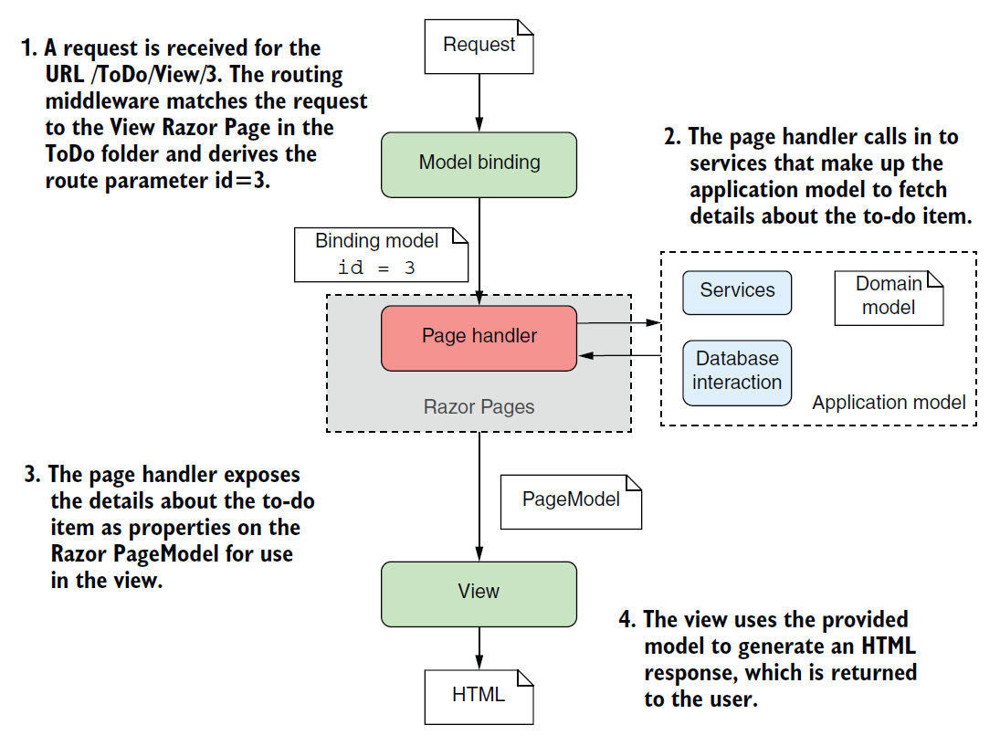

# BDSA: Session 9
## HTML Forms, Tag Helpers, and UI Testing

[Sven Peldszus](mailto:svpe@itu.dk)


# Agenda
- ## Razor Pages: Recap and Overview
  - What was what? What are the options? How do they relate?
* ## 📜 HTML Forms and ASP.NET Core Tag Helpers
  - Letting users (safely) submit data to our web server
  - How to avoid hand-writing and maintaining a lot of repetitive code
* ##  Playwright: Web UI Testing
  - Testing the web user interface by defining automated agents that click buttons, fill in data, follow links, etc.


# Razor Views



Recap in preparation for the project work:

- .cshtml - view
  - Specified via Razor template engine -  mix of HTML and C#
- .cshtml.cs - page model (code-behind)
  - Execution logic - call services, read and write database, redirect, ...

<span style="font-size: 0.6em;">Image source: <a href="https://www.manning.com/books/asp-net-core-in-action-third-edition">Andrew Lock <i>ASP.NET Core in Action</i></a></span>


# Page Model (code-behind) - .cshtml.cs
Defines page handlers (e.g., `OnGet(...)`) that are called upon receiving requests.
These execute logic and expose results via:
- PageModel properties: accessible in the view, e.g., `public List<CheepViewModel>? Cheeps { get; private set; }`
  - preferred solution; implemented in the Chirp! template
- ViewData: Dictionary accessible beyond current view, e.g., `ViewData["Title"] = "Chirp!";`
  - useful, e.g., when `_Layout.cshtml` is supposed to access data
  - beware: writes data into a dictionary based on simple strings; no compiler support
    - `"Title"` is a string, no compile-time errors thrown in code using it when deleted
- other options exist, cf. book
  - the above are most common and suitable


# View Model - .cshtml


- access data from page model to generate HTML
  - define loops and other control flow structures with C# syntax
  - write plain HTML that is delivered to HTTP clients
- compile to C# code in the background
  - generates plain HTML for HTTP clients

(see Step 4 in the figure)
<span style="font-size: 0.6em;">Image source: <a href="https://www.manning.com/books/asp-net-core-in-action-third-edition">Andrew Lock <i>ASP.NET Core in Action</i></a></span>


# View Model - .cshtml - Layouts
- define re-usable general structure of website
- contain a `@RenderBody()` or `@IgnoreBody()` call where page-specific content is placed
- by convention, the base layout is called `_Layout.cshtml` and placed in `Pages/Shared/`
  - generally, layouts starts with an underscore (convention)

```html
<!DOCTYPE html>
<html lang="en">
    <head>
        <title>@ViewData["Title"]</title>
    </head>
    <body>
      <h1>@ViewData["Title"]</h1>
      <partial name="_LoginPartial" />
      @RenderBody()
    </body>
    @await RenderSectionAsync("Scripts", required: false)
</html>
```


# View Model - .cshtml - Sections

```html
  ...
  </body>
  @await RenderSectionAsync("Scripts", required: false)
</html>
```

> Sections provide a way of organizing where view elements should be placed within a layout. They're defined in the view using an `@section` definition [..]. The `@section` can be placed anywhere in the file, top or bottom, wherever is convenient.
<span style="font-size: 0.6em;">Source: <a href="https://www.manning.com/books/asp-net-core-in-action-third-edition">Andrew Lock <i>ASP.NET Core in Action, Third Edition, Section 17.4.2</i></a></span>

```html
@{
  Layout = "_Layout";
}
@section Scripts {
  <script src="dist/jquery.validate.js"></script>
}
<p>This is the main content that will be rendered as the page body.</p>
```


# View Model - .cshtml - Partial Views

> Partial views are exactly what they sound like: part of a view. They provide a means of breaking up a larger view into smaller, **reusable chunks**. This can be useful for both **reducing the complexity** in a large view by splitting it into multiple partial views or for allowing you to **reuse part of a view** inside another.
<span style="font-size: 0.6em;">Source: <a href="https://www.manning.com/books/asp-net-core-in-action-third-edition">Andrew Lock <i>ASP.NET Core in Action, Third Edition, Section 17.4.3</i></a></span>

```html
    ...
    <body>
      <h1>@ViewData["Title"]</h1>
      <partial name="_LoginPartial" />
      ...
```

```html
@page "/"
@model Chirp.Web.Pages.PublicModel
@{ Layout = "Shared/_Layout"; }
<h2> Public Timeline </h2>
@{ await Html.RenderPartialAsync("_CheepCreationPartial", Model.Input); }
...
```


# _ViewStart and _ViewImport
- `_ViewStart.cshtml` in `Pages/` folder defines common code run for every razor page
  - name = convention
  - runs only on Razor views - not on layouts or partial views!
  - you can specify a more specific `_ViewStart.cshtml` for a subset of your views by placing it in a subfolder of `Pages/` alongside the views it should affect
  ```
  @{
      Layout = "_Layout";
  }
  ```
- `_ViewImports.cshtml` in `Pages/` folder defines common Razor directices (no C# code!)
  ```
  @using Microsoft.AspNetCore.Identity
  @namespace Chirp.Web.Pages
  @addTagHelper *, Microsoft.AspNetCore.Mvc.TagHelpers
  ```


# 📜 Letting users send data using HTML forms

```html
<h3>What's on your mind, Adrian?</h3>
<form method="post" action="/submit">
  <input type="text" name="Message" value="">
  <input type="submit" value="Share">
</form>
```


Typical "Vanilla HTML" Workflow:
- frontend: define form with input fields and map to backend route (cf. above)
  - as soon as the user triggers the `submit` input, the browser sends a request
- backend: listen to requests and read out values from the frontend form


# Try it out!
<!--
_backgroundImage: "linear-gradient(to bottom, #67b8e3, #0288d1)"
_color: white
_header: 5 minutes
-->

Create an HTML file with the following content (there is no CSS, so it will not look fancy):
```html
<!DOCTYPE html>
<html lang="en">
  <head>
    <meta charset="UTF-8">
    <title>Dummy Form Page</title>
  </head>
  <body>
    <h3>What's on your mind?</h3>
    <form method="post" action="https://httpbin.org/post">
      <input type="text" name="Message" value="">
      <input type="submit" value="Share">
    </form>
  </body>
</html>
```

The form sends the data to a dummy server (`httpbin.org`) mirroring back your original request.
**Can you see where your form data went?**


# ASP.NET Core: Model Binding

ASP.NET Core helps with binding data from an HTTP request to the pagemodel.
One option is to use the `BindProperty` annotation on a property exposed by the page model:
```csharp
[BindProperty]
public string Message { get; set; }
```
Another option is defining parameters in the handler methods of the page model:
```csharp
public ActionResult OnPost(string Message)
{
    // Do something with the text ...
    return RedirectToPage("Public"); // it is good practice to redirect the user after a post request
}
```

Which to chose depends on your use-case!
Want to use the data in your view? Bind it to a property. (Read more about this in the book!)
Want to handle only a small form? Bind it to handler method parameter(s).


# ASP.NET Core: Model Binding (ctd.)

Where does that data come from?
- **request body**, e.g., data sent in a POST request with information from an HTML form
- **route values**, e.g., route `/Adrian` mapped to a Razor page `/{author}` (cf. Chirp! project) where "Adrian" is bound to property `[BindProperty] public string author { get; set; }` in the page model
- **query strings**, e.g., `/Adrian?pageNo=2` where "2" can be bound (as an integer) to a handler method parameter `pageNo` as follows: `public ActionResult OnGet(int pageNo) { ... }`

... **in that order**!
If both request body and query strings define a variable `Message`, the value from the request body will be bound.


# ASP.NET Core: Putting it together - user sent data

With the concepts from above slides, you can let users send data (e.g., submit new cheeps) by
- ... writing HTML frontend code with "vanilla HTML" forms (as seen in previous slides)
- ... writing C# backend code with repsective model bindings (as seen in previous slides)

&emsp;
**Problem**: the above requires to maintain duplicate code in frontend and backend
- mapping of HTML input fields to binding model(s)
- data validation (should be done in both frontend _and_ backend)

&emsp;
### ASP.NET Core provides a solution to this: Tag Helpers!


# ASP.NET Core: Tag Helpers

> Tag Helpers are additions to Razor syntax that you use to customize the HTML generated in your templates. Tag Helpers can be added to an otherwise-standard HTML element, such as an `<input>`, to customize its attributes based on your C# model, saving you from having to write boilerplate code. Tag Helpers can also be standalone elements and can be used to generate completely customized HTML.
<span style="font-size: 0.6em;">Source: <a href="https://www.manning.com/books/asp-net-core-in-action-third-edition">Andrew Lock <i>ASP.NET Core in Action, Third Edition, Section 18</i></a></span>

```html
<form asp-page="SubmitMessage">
  <label asp-for="Message"></label>
  <textarea asp-for="Message"></textarea>
  <span asp-validation-for="Message"></span>
</form>
```

Before sending off HTML to clients, the `asp-*` attributes above are substituted with plain HTML attributes, e.g., `action="/SubmitMessage" method="post"` in the `form` tag.
(Note that, above, we now also have a `<span>` tag for displaying potential validation problems!)


# ASP.NET Core: Tag Helpers - example

- Razor page references a page model that binds a public property (`[BindProperty]`)
- Form references a Razor page ("SubmitMessage") via `asp-page` attribute
- Input field references a bound property in the referenced Razor page via `asp-for` attribute
```html
@page "/SubmitMessage"
@model SubmitMessageModel
...
<form asp-page="SubmitMessage">
  <input type="text" asp-for="Message">
  <input type="submit" value="Send">
</form>
```

```csharp
public class SubmitMessageModel : PageModel
{
  [BindProperty]
  public string Message { get; set; }
  ...
```


# ASP.NET Core: Tag Helpers - example (ctd.)

Resulting HTML as sent out to clients:
```html
<form method="post" action="/SubmitMessage">
  <input type="text" data-val="true" data-val-required="The Message field is required."
    id="Message" name="Message" value="">
  <input type="submit" value="Share">
  <input name="__RequestVerificationToken" type="hidden" value="CfDJ8i3PMq1Vw...">
</form>
```

The tag helper attributes from the .cshtml were substituted in the final HTML:
- `asp-page` attribute in form is automatically replaced by `method` and `action` attributes
- `asp-for` attribute is automatically replaced by attributes `id`, `name`, and a range of other attributes for client-side validation (`data-val-*`)
- a verification token for protection against [Cross Site Request Forgery (CSRF)](https://owasp.org/www-community/attacks/csrf) (next week)


# Data Validation: Frontend - HTML
<!--
_backgroundImage: "linear-gradient(to bottom, #67b8e3, #0288d1)"
_color: white
_header: 5 minutes
-->

Modern browsers provide some basic frontend form validation via html attributes such as `required` or `type="..."`.

- Revisit your manually written HTML file form from earlier
  - Try to send an empty message. (It should work)
* Add an attribute `required` to the `input` text field:
  `<input required type="text" name="Message" value="">`
  - Try to send an empty message. (It should _not_ work)
* Change the `type` of the `input` text field to be "email":
  `<input required type="email" name="Message" value="">`
  - Try to send something that is obviously not a valid email adress. (It should _not_ work)
&emsp;
* Note that you can _NOT_ rely on frontend validation alone! **Backend validation is crucial!**


# Data Validation: Frontend - HTML (ctd.)

Other HTML validation attributes include:
> - `minlength` and `maxlength`: Specifies the minimum and maximum length of textual data (strings).
> - `min` and `max`: Specifies the minimum and maximum values of numerical input types.
> - `type`: Specifies whether the data needs to be a `number`, an `email` address, or some other specific preset type.
> - `pattern`: Specifies a regular expression that defines a pattern the entered data needs to follow.
<span style="font-size: 0.6em;">Source: <a href="https://developer.mozilla.org/en-US/docs/Learn/Forms/Form_validation">Form Valiation - developer.mozilla.com</a></span>

Again, Tag Helpers are usefull to fill in these attributes automatically based on annotations on bound page model properties. On top of that, Tag Helpers provide more validation features using JavaScript (see Section 18.2 in the book).


# Data Validation - ASP.NET Core Tag Helpers

ASP.NET Core Tag Helpers generate frontend validation HTML based on C# annotations, e.g.:
```csharp
public class SubmitMessageModel : PageModel
{
  [BindProperty]
  [Required]
  [StringLength(250, ErrorMessage = "Maximum length is {1}")]
  [Display(Name = "Message Text")]
  public string Message { get; set; }
  ...
```

To display validation messages, use Tag Helper's `asp-validation-for` attribute:
```html
<form asp-page="SubmitMessage">
  <input type="text" asp-for="Message">
  <input type="submit" value="Send">
  <span asp-validation-for="Message"></span>
</form>
```


# Data Validation: Backend

Client-side frontend validation is not enough! Users can easily bypass client-side validation.

Backend validation workflow with ASP.NET Core and Tag Helpers:
- annotatate bound model page properties: `[Required]`, `[StringLength]`, `[EmailAddress]`, etc.
  - These are validated in backend, but won't throw any exceptions on violation!
  - You must check validation status manually in your page model handlers, e.g.:
    ```csharp
    public ActionResult OnPost() {
      if(!ModelState.IsValid)
        return Page(); // Show page with previously entered data and error markers
      // Process the data, i.e., write to db, call other services, etc.
      return RedirectToPage("Success"); // It is good practice to redirect users after a post request
    }
    ```
    - it is good practice to redirect users to another page after a successful post request so that they do not re-send the post request when reloading the page!


# Data Validation: Backend (ctd.)

You can add validation errors manually and map these to elements:
```csharp
public ActionResult OnPost() {
  if(...)
    ModelState.AddModelError(string.Empty, "<Some form-level validation error>");
  if(...)
    ModelState.AddModelError("Message", "Your message contains explicit language!");
  if(!ModelState.IsValid) // Will consider the errors added above, too!
    return Page(); // Show page with previously entered data and error markers
  // Process the data, i.e., write to db, call other services, etc.
  return RedirectToPage("Success"); // It is good practice to redirect users after a post request
}
```

In your Razor page, you can use a tag helper for displaying a summary of all validation errors:
`<div asp-validation-summary="All"></div>` (can make sense, esp. for long forms)

In case you are interested in displaying only form-level errors (mapped to `string.Empty`):
`<div asp-validation-summary="ModelOnly"></div>`


# Tag Helpers in ASP.NET Identity: `Login.cshtml`

You can inspect the Razor pages defined in the `Microsoft.AspNetCore.Identity.UI` package to see more of the Tag Helpers in action. Through [scaffolding](https://learn.microsoft.com/en-us/aspnet/core/security/authentication/scaffold-identity?view=aspnetcore-7.0&tabs=visual-studio#scaffold-identity-into-a-razor-project-with-authorization-1), you can generate otherwise-hidden Razor pages and page models into your project (and thereby override the default template).

```html
@page
@model LoginModel
...
<form id="account" method="post">
  <h2>Use a local account to log in.</h2>
  <div asp-validation-summary="ModelOnly" class="text-danger" role="alert"></div>
  <div>
    <input asp-for="Input.UserName" class="form-control" autocomplete="username" aria-required="true" placeholder="John Doe" />
    <label asp-for="Input.UserName" class="form-label">User Name</label>
    <span asp-validation-for="Input.UserName" class="text-danger"></span>
  </div>
  <div>
    <input asp-for="Input.Password" class="form-control" autocomplete="current-password" aria-required="true" placeholder="password" />
    <label asp-for="Input.Password" class="form-label">Password</label>
    <span asp-validation-for="Input.Password" class="text-danger"></span>
  </div>
  <button id="login-submit" type="submit" class="w-100 btn btn-lg btn-primary">Log in</button>
  ...
</form>
```


# Tag Helpers in ASP.NET Identity: `Login.cshtml.cs`

For more advanced use-cases, it can be helpful to group bound properties into nested classes:

```csharp
public class LoginModel : PageModel
{
  [BindProperty]
  public InputModel Input { get; set; }

  public class InputModel
  {
    [Required]
    public string UserName { get; set; }

    [Required]
    [DataType(DataType.Password)]
    public string Password { get; set; }

    [Display(Name = "Remember me?")]
    public bool RememberMe { get; set; }
  }
  ...
```


# UI end-to-end testing in the browser

Wouldn't it be good if we would do more end-to-end testing?
- UI interactions: filling text into a form, sending it over to the server, and testing the results
  - e.g., to realistically authenticate a users
- Goal: testing a users' journeys through all parts of the system
&emsp;
* ###  Playwright
  * > Playwright was created specifically to accommodate the needs of end-to-end testing. Playwright supports all modern rendering engines including Chromium, WebKit, and Firefox . Test on Windows, Linux, and macOS, locally or on CI, headless or headed with native mobile emulation.
  [Playwright Documentation](https://playwright.dev/dotnet/docs/intro)

___

```csharp
namespace PlaywrightTests;
[Parallelizable(ParallelScope.Self)]
[TestFixture]
public class Tests : PageTest
{
    [Test]
    public async Task HomepageHasPlaywrightInTitleAndGetStartedLinkLinkingtoTheIntroPage()
    {
        await Page.GotoAsync("https://playwright.dev");
        // Expect a title "to contain" a substring.
        await Expect(Page).ToHaveTitleAsync(new Regex("Playwright"));

        // create a locator
        var getStarted = Page.GetByRole(AriaRole.Link, new() { Name = "Get started" });
        // Expect an attribute "to be strictly equal" to the value.
        await Expect(getStarted).ToHaveAttributeAsync("href", "/docs/intro");

        // Click the get started link.
        await getStarted.ClickAsync();
        // Expects the URL to contain intro.
        await Expect(Page).ToHaveURLAsync(new Regex(".*intro"));
    }
}
```


# Create a Playwright testing project
<!--
_backgroundImage: "linear-gradient(to bottom, #67b8e3, #0288d1)"
_color: white
_header: 10 minutes
-->

- Create a new testing project. Playwright is compatible with the test frameworks `MSTest` and `NUnit` - we will choose the latter!
  - `dotnet new nunit -n PlaywrightTests --framework net8.0`
- Add the `Microsoft.Playwright.NUnit` package to your new project
  - `dotnet add package Microsoft.Playwright.NUnit --version 1.43.0`
- Build your project:
  - `dotnet build`
- Install PlayWright:
  - `pwsh bin/Debug/net8.0/playwright.ps1 install --with-deps`
    - (this is a PowerShell script - it _might_ need execution permissions: `Set-ExecutionPolicy -ExecutionPolicy RemoteSigned`)
- Include the test case shown on the previous slide and execute it
  - Play around: NUnit follows a slightly different style for defining tests than XUnit


# NUnit: Arranging and Cleaning Up Tests

```csharp
[TestFixture]
public class EndToEndTests : PageTest
{
  private Process _serverProcess;

  [SetUp]
  public async Task Init()
  {
    _serverProcess = await MyEndToEndUtil.StartServer(); // Custom utility class - not part of Playwright
  }

  [TearDown]
  public async Task Cleanup()
  {
      _serverProcess.Kill();
      _serverProcess.Dispose();
  }

  // Test cases ...
}
```


# Playwright: Who is going to write all this code?
<!--
_backgroundImage: "linear-gradient(to bottom, #67b8e3, #0288d1)"
_color: white
_header: 10 minutes
-->

```csharp
await Page.GotoAsync("https://playwright.dev");
await Expect(Page).ToHaveTitleAsync(new Regex("Playwright"));

var getStarted = Page.GetByRole(AriaRole.Link, new() { Name = "Get started" });
await Expect(getStarted).ToHaveAttributeAsync("href", "/docs/intro");

await getStarted.ClickAsync();
await Expect(Page).ToHaveURLAsync(new Regex(".*intro"));
```

* Creating Playwright test code can be simplified:
  - Playwright comes with a code generator that enables you to "record" test cases:
  `pwsh bin/Debug/net8.0/playwright.ps1 codegen https://some-address:8080/`
&emsp;
* ## Try it out: 🎥🔴 Record a test case!
  - `pwsh bin/Debug/net8.0/playwright.ps1 codegen  demo.playwright.dev/todomvc`

---


# Summary

- ### Razor Pages: Recap and Overview
  - Layouts define re-usable general structure
  - View Sections (defined in layouts) are empty regions that are filled in by concrete views
  - Partial views are reusable pieces of cshtml plugged into other views or layouts
* ### 📜 HTML Forms and ASP.NET Core Tag Helpers
  - Forms are vanilla HTML constructs used for sending data from browsers to servers
    - Backend code reads data from forms requiring matching backend and frontend code
    - Validating form data in frontend _and_ backend is crucial, but tedious to implement
  - Tag Helpers achieve both above points fast while reducing the amount of code written

# Summary (ctd.)
- ###  Playwright: Web UI Testing
  - Testing is crucial to achieve good software quality
  - This includes UI testing - we want to get our automated test suite as close as possible to the actual user experience
  - Playwright simulates users clicking through a website and filling in data while enabling us to assert desired states of the website


# What to do now?


- If not done, complete the Tasks (blue slides) from this class
- Check the [reading material](./READING_MATERIAL.md)
- Work on the [project](./README_PROJECT.md)

- <font color="#cecdce">If you feel you want prepare for next session, read chapters ??? in [Andrew Lock _ASP.NET Core in Action, Third Edition_](https://www.manning.com/books/asp-net-core-in-action-third-edition) </font>