# BDSA: Session 10
## HTTPS, Attacks on Websites, and Load Testing

Adrian Hoff
Postdoctoral Researcher
ITU


# Agenda
- ## HTTPS
  - What are setup options?
  - How to enforce HTTPS (instead of plain HTTP)
* ## Common Attacks on Websites
  - XSS, CSRF, SQL Injection
* ## Load Testing
  - Testing a web app under stress
* ## Content Delivery Network (CDN)
  - Reducing load and speeding up content delivery


# HTTP by itself is unencrypted - that is dangerous

Attackers (e.g., someone in the user's network) can easily... <span style="font-size: 0.6em;">(cf. <a href="https://www.manning.com/books/asp-net-core-in-action-third-edition">Andrew Lock <i>ASP.NET Core in Action</i>, Chapter 28</a>)</span>
- read sensitive data, e.g., passwords sent by users to your server
- inject malicious code into your responses to users, e.g., letting them mine crypto currency
- steal authentication cookies and impersonate the user on your app

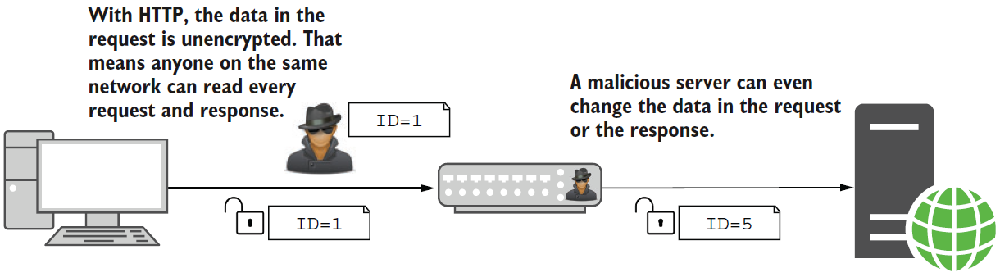

<div style="font-size: 0.6em;position:absolute;left:40%;bottom:25px">Image source: <a href="https://www.manning.com/books/asp-net-core-in-action-third-edition">Andrew Lock <i>ASP.NET Core in Action</i>, Chapter 28</a></div>


# HTTPS provides end-to-end encryption

HTTP requests and responses are encrypted using the Transport Layer Security (TLS) protocol.
- attackers cannot make sense of the sent requests and responses
  - the only "sniffable" information is the web server's domain name
  - all HTTP-level information (method, header, body, ...) are encrypted
- thus, attackers cannot systematically change them to launch attacks on users

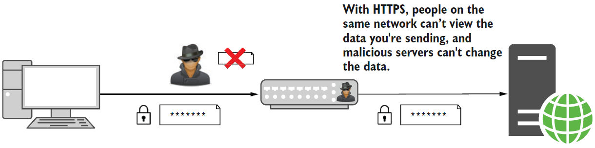

<div style="font-size: 0.6em;position:absolute;left:40%;bottom:25px">Image source: <a href="https://www.manning.com/books/asp-net-core-in-action-third-edition">Andrew Lock <i>ASP.NET Core in Action</i>, Chapter 28</a></div>


# Do you need HTTPS? Yes!!

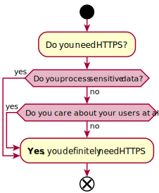

Even websites that do not process sensitive data (including simple static pages) should absolutely use HTTPS!

Otherwise, website owners leave open a _large_ variety of different attacks on their users, as attackers can intercept and modify traffic.

For that reason, many browser features will only work over HTTPS (e.g., microphone, location, ...)

**Please** have a look at this blog post and, specifically, the embedded video (it is _really_ good):
[Troy Hunt, Here's Why Your Static Website Needs HTTPS](https://www.troyhunt.com/heres-why-your-static-website-needs-https/)


# HTTPS: SSL vs. TLS

> Secure Socket Layer (**SSL**) was the **original protocol** that was used to provide encryption for HTTP traffic, in the form of HTTPS. There were two publicly released versions of SSL - versions 2 and 3. Both of these have **serious cryptographic weaknesses** and should no longer be used.
>
> For various reasons the **next version of the protocol** (effectively SSL 3.1) was named Transport Layer Security (**TLS**) version 1.0. Subsequently TLS versions 1.1, 1.2 and 1.3 have been released.
>
> The terms "SSL", "SSL/TLS" and "TLS" are **frequently used interchangeably**, and in many cases "SSL" is used when referring to the more modern TLS protocol.
&emsp;
<div style="font-size: 0.6em;">Source: <a href="https://cheatsheetseries.owasp.org/cheatsheets/Transport_Layer_Security_Cheat_Sheet.html">OWASP TLS CheatSheet</a></div>

**TL;DR**: SSL is an outdated version of TLS. Today, SSL is not used anymore as it is unsafe. Nevertheless, the terms are confused. Most uses of "SSL" can be corrected to "TLS".


# HTTPS: encryption from where to where? (1/2)

**Option A: PassThrough** - All the way from user to web app.
- There might be proxy servers along the way, but requests and responses are encrypted all the way between user and web app

&emsp;

&emsp;&emsp;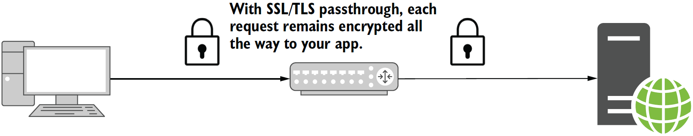

<div style="font-size: 0.6em;position:absolute;left:40%;bottom:25px">Image source: <a href="https://www.manning.com/books/asp-net-core-in-action-third-edition">Andrew Lock <i>ASP.NET Core in Action</i>, Chapter 28</a></div>


# HTTPS: encryption from where to where? (2/2)

**Option B: TLS Offloading** - "Only" from user to cloud proxy
- Requests are decrypted on a reverse proxy and forwarded via plain unencrypted HTTP
  - Web app does not need to be configured for HTTPS (significantly easier setup)
- Although less secure than PassThrough, Offloading eliminates many attack scenarios

&emsp;&emsp;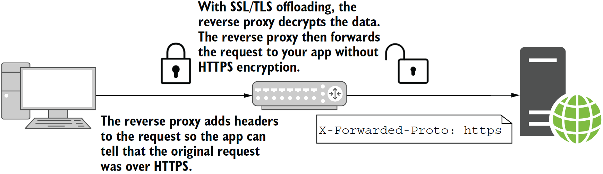

<div style="font-size: 0.6em;position:absolute;left:40%;bottom:25px">Image source: <a href="https://www.manning.com/books/asp-net-core-in-action-third-edition">Andrew Lock <i>ASP.NET Core in Action</i>, Chapter 28</a></div>


# How to set up HTTPS for development?

If you want HTTPS PassThrough, you need to configure your web app respectively.

For development on your machine, there is a .NET tool for creating local certificates that lets your web app use HTTPS:
`dotnet dev-certs https --trust`

If this causes problems, visit the [Microsoft trouble shooting page](https://learn.microsoft.com/en-us/aspnet/core/security/enforcing-ssl?view=aspnetcore-7.0&tabs=visual-studio%2Clinux-ubuntu#trust-the-aspnet-core-https-development-certificate-on-windows-and-macos).

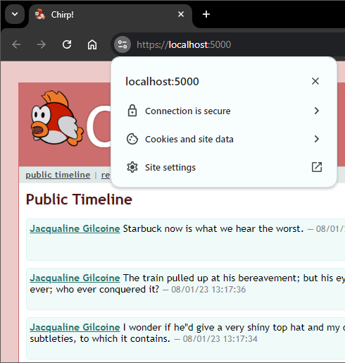


# How to set up HTTPS for production? (1/2)

**Option A**: If you want to use **HTTPS PassThrough**, you need to a TLS certificate
- TLS certificates are provided by a **certificate authority (CA)**
  - as part of the issueing process, you need to prove that you are indeed the owner of the to-be-certified web server
- Notable free certificate authority: [](https://letsencrypt.org/)
  - Let's Encrypt provides [tutorials and links to automated tools](https://letsencrypt.org/getting-started/) for the issueing process

 For a more detailed description on how to configure your Kestrel server to use HTTPS, please refer to the book, Section 28.3


# How to set up HTTPS for production? (2/2)

**Option B**: If you want to use **TLS Offloading**, the setup process is easier.
- Many cloud providers (e.g., Cloudflare) feature easy HTTPS setup
- Good introduction to the topic: **[httpsiseasy.com](https://httpsiseasy.com/)**
- For your web app to run smoothly, you might need to configure HTTP header forwarding
  - The cloud proxy forwards information about the original HTTPS request to your HTTP connection that you need to process
  - For a more detailed description, read Section 28 of the book (entirely)

&emsp;
<font color="#999">Side Note (unrelated to the course): Should you be a web admin and your website does still run on plain HTTP (despite all modern browser security warnings), now is the time to change that! Follow the above tutorial. It is a matter of 10 minutes.</font>


# Enforcing HTTPS: Redirecting from HTTP

- By default, browsers use HTTP (not HTTPS)
- (Very) good idea: redirect HTTP requests to HTTPS
  - e.g., `http://chirp.com/` to `https://chirp.com/`

&emsp;

&emsp;&emsp;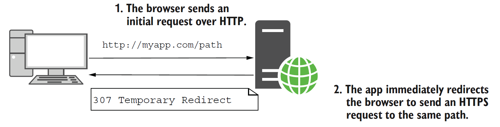
<div style="font-size: 0.6em;position:absolute;left:40%;bottom:25px">Image source: <a href="https://www.manning.com/books/asp-net-core-in-action-third-edition">Andrew Lock <i>ASP.NET Core in Action</i>, Chapter 28</a></div>


# Enforcing HTTPS: Redirecting from HTTP (ctd.)

ASP.NET Core comes with middleware to take care of HTTPS redirecting:

```csharp
WebApplicationBuilder builder = WebApplication.CreateBuilder(args);
builder.Services.AddRazorPages();

WebApplication app = builder.Build();

app.UseHttpsRedirection(); // redirect requests from HTTP to HTTPS
app.UseStaticFiles();
app.UseRouting();

app.MapRazorPages();
app.Run();
```

&emsp;
This is a good start, but it would be better if browsers would remember to use HTTPS instead of the default HTTP...


# Enforcing HTTPS: HSTS Header

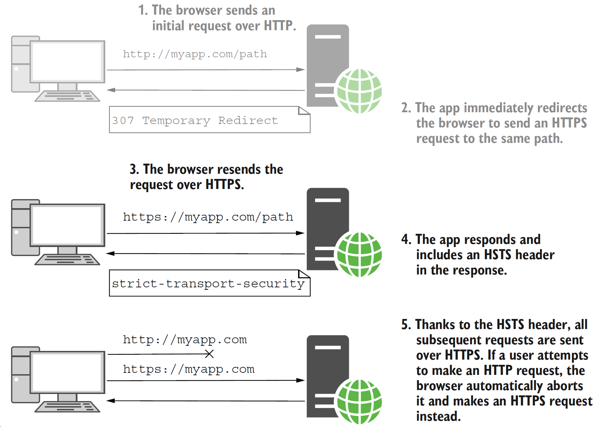

To permanently convince browsers to use HTTPS instead of the default HTTP, you can send a "**HTTP Strict Transport Security (HSTS)**" header.
    
- will only be sent as part of a reponse to an HTTP**S** request
- goes hand-in-hand with an HTTPS redirect

<div style="font-size: 0.6em">Image source: <a href="https://www.manning.com/books/asp-net-core-in-action-third-edition">Andrew Lock <i>ASP.NET Core in Action</i>, Chapter 28</a></div>


# Enforcing HTTPS: HSTS Header

```csharp
WebApplicationBuilder builder = WebApplication.CreateBuilder(args);
builder.Services.AddRazorPages();

// Once you are sure everything works, you might want to increase this value to up to 1 or 2 years
builder.Services.AddHsts(o => options.MaxAge = TimeSpan.FromHours(1));

WebApplication app = builder.Build();

if(app.Environment.IsProduction())
{
  app.UseHsts(); // Send HSTS headers, but only in production
}
app.UseHttpsRedirection();
app.UseStaticFiles();
app.UseRouting();

app.MapRazorPages();
app.Run();
```


# HTTPS - Does it protected our app from all harm?

### No... 🙄

Even with encrypted requests and responses, a large variety of different attacks can be launched on your web app by malicious parties.

Among the most common are:
- Cross-Site Scripting (XSS)
- Cross-Site Forgery Attacks (CSRF)
- SQL injection
- ...

Many more exist!


# Cross-Site Scripting (XSS)

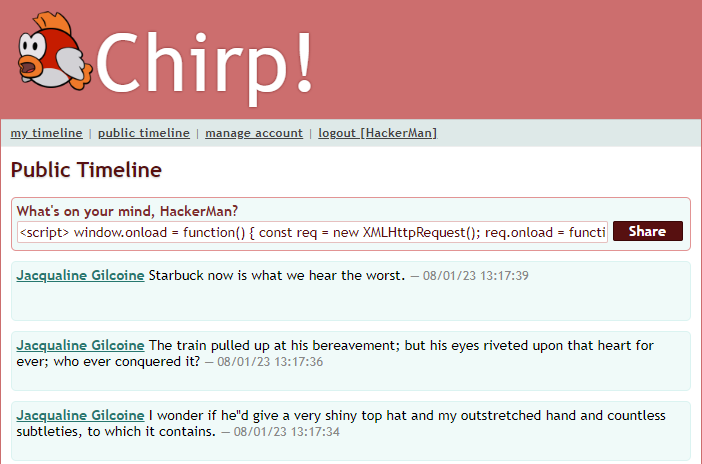

Malicious users inject scripts in your website, e.g., through HTML forms.

Popular scenario: free-text comment sections.

The weakness boils down to you (the web app owner) plainly printing out user-written content directly.


# XSS - Unprotected Results


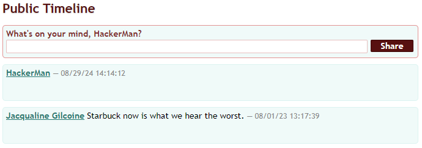


User input is directly embedded 👎

This is **extremely** dangerous: Attackers (in the form of malicious users) can _easily_ append arbitrary source code to your web page and thus steal other users' cookies, mine crypto, ask for bank logins, ...


# XSS - How to protect your web app

&emsp;

**Safe-encode all user input** (HTML forms, query strings, ...) using [HTML Entities](https://www.w3schools.com/html/html_entities.asp) instead of using raw characters before printing them on a page.

- Example: `&lt;` for `<`

- Razor Pages take care of this when using Tag Helpers, HTML Helpers, or the @ syntax


# XSS - Is your Chirp! app protected??
<!--
_backgroundImage: "linear-gradient(to bottom, #67b8e3, #0288d1)"
_color: white
_header: 10 minutes
-->

- Launch your Chirp! app locally
- Log in and create a new cheep:
  - As text, use the following:
  
    `Hello, I am feeling good!<script>alert('If you see this in a popup, you are in trouble!');</script>`

&emsp;
- The new cheep should be printed to the timeline exactly as shown above.
  - If you see a popup window, you are vulnerable to XSS attacks - which is obviously very bad and must be fixed ASAP!
&emsp;
- (Sidenote: the above would make a neat test case!)


# XSS - Protected Results


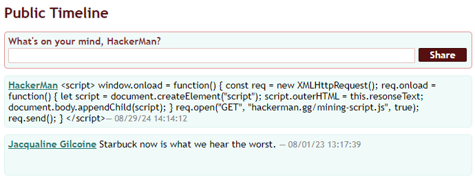
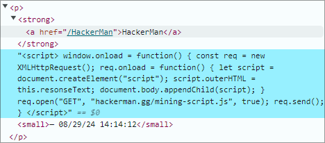

Embedded code is printed, not executed 👍

Keep this vulnerability in mind when developing web apps! Consider implementing test cases on relevant forms to avoid XSS risks.


# Cross-Site Forgery Attacks (CSRF)

A malicious/compromised websites use HTML forms to let users (without noticing it) send POST requests to your web app. The user's browser appends cookies, making the request appear legitimate on your end.

Example: You implement a new website for online banking (`https://my-bank.dk/`). You implement money transferal via a POST request on `https://my-bank.dk/send-money`
- The user was previously logged into your website
- The user visits another website (`https://compromised.dk/`)
  - For one of many possible reasons (i.a., XSS), the website contains a malicious HTML form that causes the user to send a POST request to `https://my-bank.dk/send-money`
  - The user's browser appends cookies for your website, including **authentication cookies**
    - This is intended standard behavior of the web browser
- Your web app cannot tell that this is an unlegitimate request forged on another website! 💸


# CSRF: Bank Example

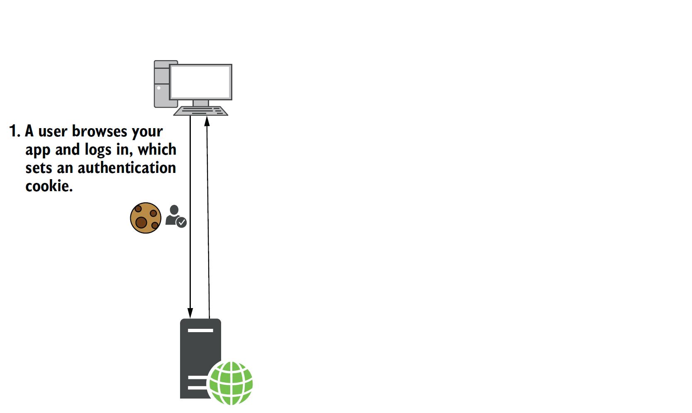
<div style="font-size: 0.6em;position:absolute;left:40%;bottom:25px">Image source: <a href="https://www.manning.com/books/asp-net-core-in-action-third-edition">Andrew Lock <i>ASP.NET Core in Action</i>, Chapter 29</a></div>

# CSRF: Bank Example

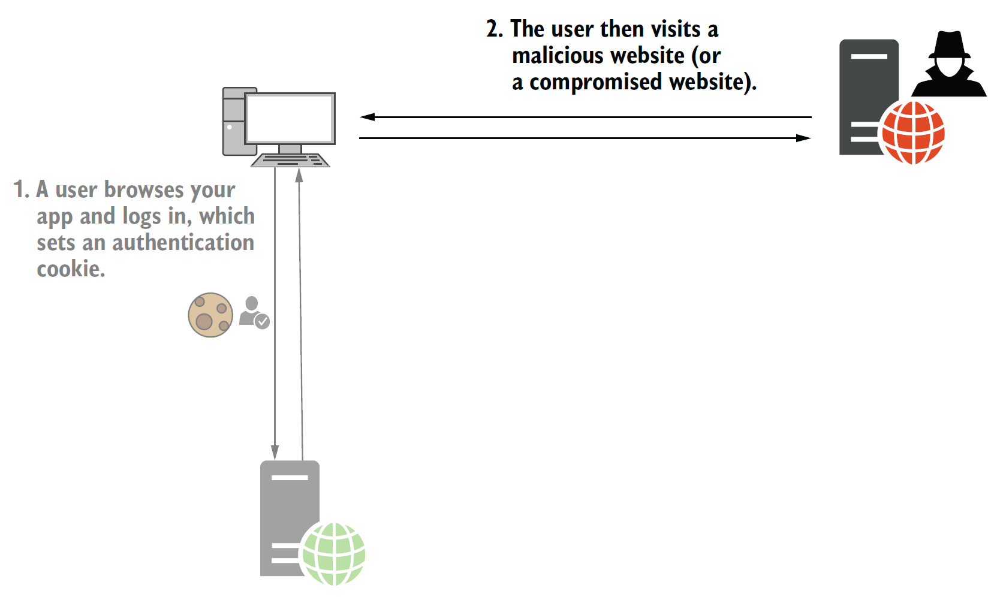
<div style="font-size: 0.6em;position:absolute;left:40%;bottom:25px">Image source: <a href="https://www.manning.com/books/asp-net-core-in-action-third-edition">Andrew Lock <i>ASP.NET Core in Action</i>, Chapter 29</a></div>

# CSRF: Bank Example

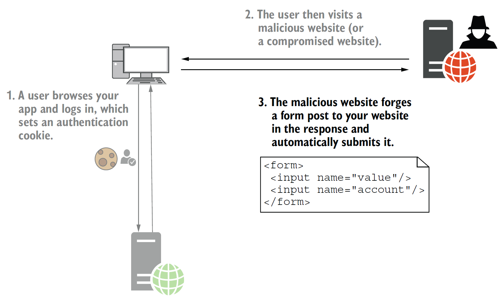
<div style="font-size: 0.6em;position:absolute;left:40%;bottom:25px">Image source: <a href="https://www.manning.com/books/asp-net-core-in-action-third-edition">Andrew Lock <i>ASP.NET Core in Action</i>, Chapter 29</a></div>

# CSRF: Bank Example

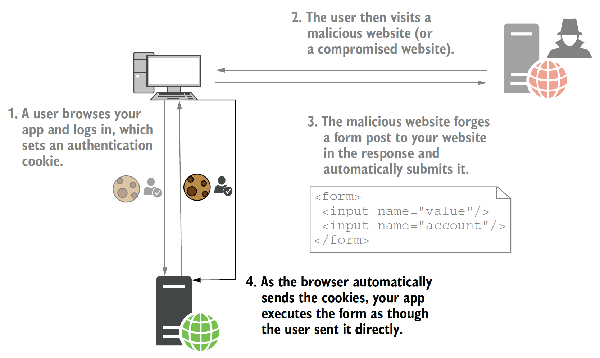
<div style="font-size: 0.6em;position:absolute;left:40%;bottom:25px">Image source: <a href="https://www.manning.com/books/asp-net-core-in-action-third-edition">Andrew Lock <i>ASP.NET Core in Action</i>, Chapter 29</a></div>


# CSRF - How to protect your web app

**Anti-Forgery Tokens** (synchronizer token pattern)
- Generate tokens to distinguish your own forms from maliciously forged forms
  - token values are based on logged-in user, malicious parties cannot mimic tokens

- One token is stored in browser cookies and re-send with every request

- Another token is placed in the form as hidden `<input>` and submitted


# CSRF - Anti-Forgery Middleware

Antiforgery middleware is added to the dependency injection container when one of the following APIs is called in `Program.cs`:

- `builder.Services.AddMvc();`
- `app.MapRazorPages();`
- `app.MapControllerRoute();`
- `app.MapBlazorHub();`

Last week, we saw how this results in a hidden `<input>` tag in HTML forms generated by Razor:
```html
<form method="post" action="/SubmitMessage">
  <input type="text" data-val="true" data-val-required="The Message field is required."
    id="Message" name="Message" value="">
  <input type="submit" value="Share">
  <input name="__RequestVerificationToken" type="hidden" value="CfDJ8i3PMq1Vw...">
</form>
```


# Built-in Browser Security

### Are internet browsers really that naive?

* Modern browsers protect against CSRF attacks by distinguishing between cookies shared between websites and so called "**SameSite cookies**"
    - You can configure your ASP.NET app to use SameSite cookies ([read more](https://learn.microsoft.com/de-de/aspnet/core/security/samesite?view=aspnetcore-8.0))

* Modern browsers protect against XSS through the **Same Origin Policy (SOP)** standard
  - Scripts can send asynchronous requests only to the site (origin) they are embedded in
  - Origin = protocol, domain, and port
    - example: SOP considers `https://chirp.dk/` and `https://www.chirp.dk/` as different

&emsp;
**Important**: Those are browser features! Old browsers and other tools ignore the above!


# SOP - How to relax it safely to enable async. scripts?

You send specific HTTP headers along with your HTTP responses to instruct client browsers:

- **Cross-Origin Resource Sharing (CORS)**: Send a [CORS Header](https://developer.mozilla.org/en-US/docs/Web/HTTP/CORS) to whitelist safe origins who may receive data from the server.
  - Use case: A browser on another website verifies if they may request data from your site
  `Access-Control-Allow-Origin: *` - "anyone can fetch my data" (_dangerous_)
  `Access-Control-Allow-Origin: chirp.dk` - "only that website can request my data"

* **Content Security Policy (CSP)**: Send a [CSP Header](https://developer.mozilla.org/en-US/docs/Web/HTTP/CSP) to whitelist safe origins from where to fetch data and scripts:
  - Use case: A browser on your site verifies if they may request data from another site
  `Content-Security-Policy: default-src 'self' chirp.dk *.chirp.dk`
  - No full protection against XSS, but makes attackers' life significantly harder!

You will want to use these headers in combination with a secure HTTPS connection.


# SQL injection


<div style="font-size: 0.6em;position:absolute;left:40%;bottom:25px">Image source: <a href="https://xkcd.com/327/">xkcd.com</a></div>


# What happened in the school system?
<!--
_backgroundImage: "linear-gradient(to bottom, #67b8e3, #0288d1)"
_color: white
_header: 10 minutes
-->

Probably, the school's system contains a query implemented as a string expression with a few variable-filled gaps for student names similar to the following:
`"INSERT INTO Students VALUES ('" + FirstName + "', '" + LastName + "')";`
- What happens when we fill in Bobby's full firstname in the above query and why is this bad?
- How could the school's vulnerability be addressed?

&emsp;
For reference, bobby's firstname is: `Robert'); DROP TABLE Students;--`
(Tip: `--` typically starts a comment in SQL)

&emsp;
* For a thorough answer to all of the above, read through this [StackOverflow post](https://stackoverflow.com/questions/332365/how-does-the-sql-injection-from-the-bobby-tables-xkcd-comic-work)


# SQL injection - protection

Attackers typically launch SQL injections through HTML forms and query strings.

Protection: Once again, you need to **safe-encode all user input** - always!

&emsp;
### Because you use EF Core, this is taken care for you 😌
(unless you do funny stuff that circumvents the built-in measures, e.g., hand-crafting SQL as strings in a similar way to little Bobby Tables' school)


# What other vulnerabilities exist?

Have a look at the [Open Web Application Security Project (OWASP)](https://owasp.org/) to see more web vulnerabilities.

> The Open Web Application Security Project, or OWASP, is an international non-profit organization dedicated to web application security.
[Cloudflare, _What is OWASP? What is the OWASP Top 10?_](https://www.cloudflare.com/learning/security/threats/owasp-top-10/)

The OWASP maintains a list of the [Top 10 Web Application Security Risks](https://owasp.org/www-project-top-ten/):

&emsp;&emsp;&emsp;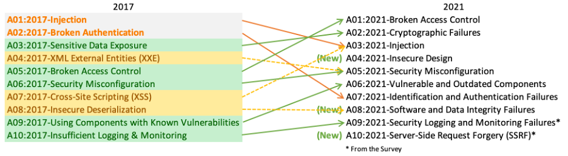


# Load Testing and Stress Testing

**Load Testing**: How performant is your web app under exptected conditions?

**Stress Testing**: How performant is your web app under extreme conditions?

&emsp;
- Define your goals upfront, especially:
  - How many users are expected normally / in extreme cases?
  - What are acceptable reponse times in each situation?
- Try to separate server resources from test clients' resources
  - If you run both server and test clients on the same machine, they might compete for resources, falsifying your results - esp. in extreme conditions with many clients!
- Many different tools for load and stress testing exist ([short introduction](https://learn.microsoft.com/en-us/aspnet/core/test/load-tests?view=aspnetcore-7.0))


# Azure Load Testing

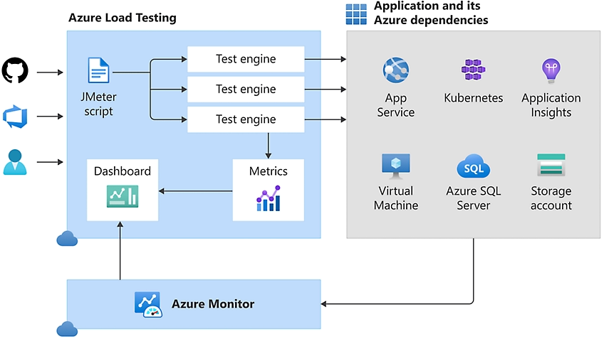

- specify tests through JMeter scripts
- integrate in your CI/CD pipeline
- not only for Azure hosted web apps!
- [learn more](https://learn.microsoft.com/en-us/training/modules/implement-azure-load-testing/)

<div style="font-size: 0.6em">Image source: <a href="https://learn.microsoft.com/en-us/azure/load-testing/overview-what-is-azure-load-testing">Microsoft.com <i>What is Azure Load Testing?</i></a></div>


# Content Delivery Network (CDN)

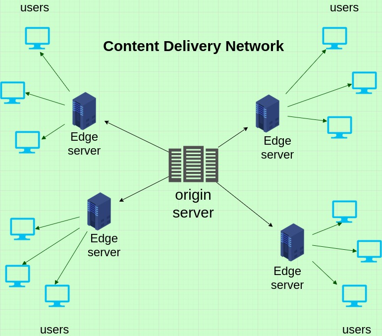

> A content delivery network (CDN) is a group of **geographically distributed servers** that speed up the delivery of web content by bringing it **closer to where users are**. CDNs rely on a process called "**caching**" that temporarily stores copies of files in data centers across the globe, allowing [users] to access internet content from a server near you.
> <div style="font-size: 0.6em">Source: <a href="https://learn.microsoft.com/en-us/azure/load-testing/overview-what-is-azure-load-testing">akamai.com <i>What Is a CDN?</i></a></div>


# Content Delivery Network (CDN): Caching behavior

Caching happens in two main places in the web:
**Local cache**: Users' browsers
**Shared cache**: CDNs proxies shared between users

You (web app host) can control the behavior of both kinds of caches via HTTP headers:
- disable caching for a resource
`Cache-Control: no-store`
- specify time constraints on cached content
`Cache-Control: max-age=604800` (1 week)
- provide version identifiers to help browsers identify whether they need to reload a resource, e.g., based on a hash of its content
`ETag: "33a64df5"`

There is much more to learn about [HTTP caching](https://developer.mozilla.org/en-US/docs/Web/HTTP/Caching) for optimizing your web apps!


# Summary

- ### HTTPS
  - **plain HTTP is insecure** - do not use it, not even for static websites!
  - HTTPS adds a layer beneath HTTP: both request and response are fully encrypted
  - **HTTPS PassThrough**: Encryption all the way from user to web app
  - **TLS Offloading**: Encryption between user and CDN proxy
  - In production, you should redirect HTTP requests to HTTPS

  

# Summary (ctd.)

- ### Common Attacks on Websites
  - **XSS**: Attackers embed malicious scripts into our web app (e.g., through HTML forms)
	- to prevent: sanitize user input!
  - **CSRF**: Attackers use an HTML form on another website to forge a request to your website where the user's browser attaches authentication cookies for your website
    - to prevent: implement synchronizer token pattern)
  - **SQL injection**: attackers inject SQL into your backend logic, e.g., through query strings
    - to prevent: sanitize user input!
  - To protect against these attacks, browsers come with built-in countermeasures:
	- **SameSite cookies** against CSRF
	- **Same Origin Policy (SOP)** against XSS
	  - to soften SOP, specify HTTP Headers for CORS and CSP


# Summary (ctd.)

- ### Load Testing
  - is valuable for understanding and monitoring the limits and bottlenecks in your system
  - should be automated in your CI/CD pipeline
* ### Content Delivery Network (CDN)
  - consist of server networks spanning the globe
  - cache content from your website to...
	- speed up delivery to users
	- reduce load on your server


# What to do now?


- If not done, complete the Tasks (blue slides) from this class
- Check the [reading material](./READING_MATERIAL.md)
- Work on the [project](./README_PROJECT.md)

- <font color="#cecdce">If you feel you want prepare for next session, read chapters [Andrew Lock _ASP.NET Core in Action, Third Edition_](https://www.manning.com/books/asp-net-core-in-action-third-edition) </font>


---


# **Analysis, Design and Software Architecture (BDSA)**

[Rasmus Lystrøm, Senior Cloud Solution Architect](rnie@itu.dk)

---

## Feedback: New Checks

I created a new set of automatic checks, that try to log into your _Chirp!_ applications and that try to send cheeps: <http://209.38.208.62/report_razor_apps2.html>

<iframe src="http://209.38.208.62/report_razor_apps2.html" width="100%" height=500 scrolling="auto"></iframe>

---

## Feedback: Read carefully!

Links to login should have `login` as link text, see [the project description](../session_08/README_PROJECT.md).

```html
    <div class=navigation>
        ...
        else
        {
            <div>
                <a href="/">public timeline</a> |
                <a ... >register</a>
                <a ... >login</a>
            </div>
        }
    </div>
```

Our automatic checks get quite complex when searching for `login`, `Login`, `Log-in`, `Log-In`, `signin`, `Signin`, `sign in`, `Sign in`, `Sign-in`, ...

---

## Feedback: Too many open tasks

I believe you are struggling with completing the project work from the last weeks:

- Sending cheeps
- Login with GitHub
- Migrate database to hosted database on Azure
- + Tasks from this week

How could you handle the situation of too many open and pressing tasks?
* Prioritization
* If you were to order, which are the most important and which are the least important tasks from the list above?

---

## Survey: How many groups have issues moving to hosted DB?

👋👋👐👐👐🖐️🖐️

---

## First Hour Next Week: Guest Lecture

Next week, we start the lecture with a guest lecture. **Be on time**


Jakob Krabbe Sørensen from [ComplyCloud](https://www.complycloud.com/) will give a guest lecture on "Privacy by Design" and why GDPR matters to you as software engineers.


