# **Analysis, Design and Software Architecture (BDSA)**
Session 11
[Helge Pfeiffer](ropf@itu.dk)


## Plan for today

- First hour: Requirements Engineering
- Second hour: Structural Modeling
- Third hour: Behavioral Modeling
- Fourth hour: Feedback


<!-- First hour -->


## Task: Privacy by Design?

<!--
_backgroundImage: "linear-gradient(to bottom, #67b8e3, #0288d1)"
_color: white
_header: 10 minutes
-->

Next week, we will have a guest lecture about GDPR and privacy by design. To motivate that lecture and to motivate the first topic of today, we conduct this task.

- What precisely do you know about your users?
- Where do you have to check?
- Inspect your data model, i.e., all entities on what you store about your users.
  - Is there somewhere else to check?
- With a database browser, investigate what your database really contains about users.


## Why do we have to care about GDPR at all?

Next week, we will have a guest lecture about GDPR and privacy by design.

But why does it matter at all?


## Functional vs. Non-functional requirements

> * _Functional requirements_ These are statements of services the system should provide, how the system should react to particular inputs, and how the system should behave in particular situations. In some cases, the functional requirements may also explicitly state what the system should not do.
> * _Non-functional requirements_ These are constraints on the services or functions offered by the system. They include timing constraints, constraints on the development process, and constraints imposed by standards. Non-functional requirements often apply to the system as a whole rather than individual system features or services.<font size=3>
Source: I. Sommerville <i>Software Engineering</i>
</font>


## Requirements more formally

<style scoped>
section {
   font-size: 22px;
}
</style>

  > **requirement**
  >
  > statement which translates or expresses a need and its associated constraints (3.1.7) and conditions (3.1.6)
  >
  > Note 1 to entry: Requirements exist at different levels in the system structure.
  >
  > Note 2 to entry: A requirement is an expression of one or more particular needs in a very specific, precise and unambiguous manner.
  >
  > Note 3 to entry: A requirement always relates to a system, software or service, or other item of interest.<font size=3>
Source: <a href="https://www.iso.org/obp/ui/#iso:std:iso-iec-ieee:29148:ed-2:v1:en">ISO/IEC/IEEE 29148:2018(en) Systems and software engineering — Life cycle processes — Requirements engineering</a>
</font>

  > **software requirements specification (SRS)**. (1) documentation of the essential requirements (functions, performance, design constraints, and attributes) of the software and its external interfaces<font size=3>
Source: <a href="https://standards.ieee.org/ieee/1012/5609/">IEEE 1012-2016 IEEE Standard for System, Software, and Hardware Verification and Validation, 3.1.29</a>
</font>

## Types of Non-functional Requirements

<font size=3>
Image source: I. Sommerville <i>Software Engineering</i>
</font>

## Metrics for Specifying Non-functional Requirements

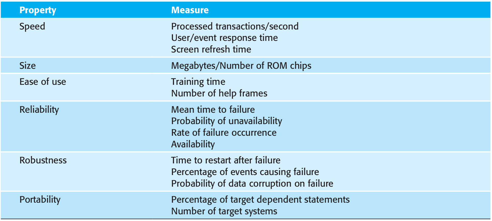<font size=3>
Image source: I. Sommerville <i>Software Engineering</i>
</font>

## Task: What kind of requirement?

<!--
_backgroundImage: "linear-gradient(to bottom, #67b8e3, #0288d1)"
_color: white
_header: 10 minutes
-->

- Read [today's project description](./README_PROJECT.md/#add-feature-users-can-follow-and-unfollow-each-other) for implementing the new un-/follow feature of _Chirp!_.
- Discuss with your neighbors: What kind of requirement is specified there?

- In next week's guest lecture, we will realize that the _Chirp!_ application has to be  [General Data Protection Regulation (GDPR)](https://en.wikipedia.org/wiki/General_Data_Protection_Regulation) compliant.
- Discuss with your neighbors: What kind of requirement is this?


## Feedback: **Requirement** for Authentication

<style scoped>
section {
   font-size: 18px;
}
</style>
#### As a user, I have to be able to login with GitHub so that I can send cheeps.

There are multiple ways to perform authentication via third parties (here via GitHub).
The lecture and the book present:
a) Idendity Core, see [ticket #XYZ](...)
b) Idendity Core with GitHub OAuth
...

The project task provides a code snippet for the Razor view. It illustrates that there has to be a link that initiates the authentication functionality, which has to contain the text `login` and which is located in the navigation bar.

```html
... Code example from task comes here ...
```

... More description that you deem necessary ...

**Acceptance Criteria**:
- There is a _link_ with text `login` displayed in the navigation bar of _Chirp!_
- If logged into GitHub in another browser window/tab and after clicking the `login` link, a user is authenticated to _Chirp!_.
- After authentication, a cheepbox appears above the list of cheeps, see [ticket #XYZ](...).
- After authentication, the `login` link in the navigation bar turns into a link to `logout` displaying the text `logout`.
- After clicking logout, the cheepbox disappears again from the top of the list of cheeps.


<!-- Second hour -->

## Visual languages for design and architecture

Eventually, you have to document your system's design and architecture so that your colleagues, customers or other stakeholders have a chance of understanding how your system is structured and how it works.

Remember Martin's guest lecture from two weeks ago? He said that he believes it is the most important task that you have.

Since it is such a common task, various visual notations were developed over time. One of them is the _Unified Modeling Language_ (UML). I will give you a whirlwind tour through some of its diagram types today.

But why do we need a _Unified Modeling Language_?


## Visualizing structure or behavior with your own notations?

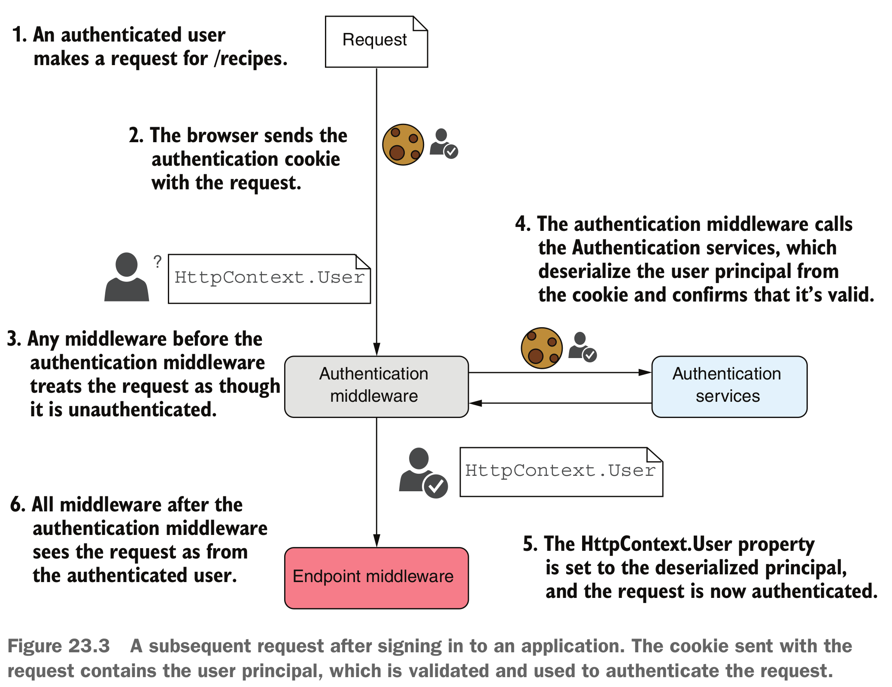

Drawback of own notation:
* What is the meaning of note symbols?
* What is the meaning of rounded rectangles?
* What is the meaning of color?
* Separation of concerns/single responsibility? The diagram mixes structural with behavioral concerns?
<font size=3>
Image source: Andrew Lock <i>ASP.NET Core in Action</i>
</font>


## Visualizing structure or behavior with your own notations?
<style scoped>
pre {
   font-size: 20px;
}
section {
   font-size: 20px;
}

</style>
Best practice:
- You have to provide a legend together with your visualization.
- It it has to describe all used symbols and their meaning.

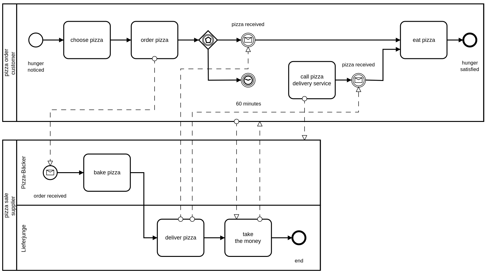


<font size=3>
Image source: <a href="https://camunda.com/bpmn/reference/">BPMN 2.0 Symbol Reference</a>
</font>


## Visualizing structure or behavior with your own notations?

<style scoped>
pre {
   font-size: 20px;
}
section {
   font-size: 20px;
}
</style>

Best practice:
- You have to provide a legend together with your visualization.
- It it has to describe all used symbols and their meaning.

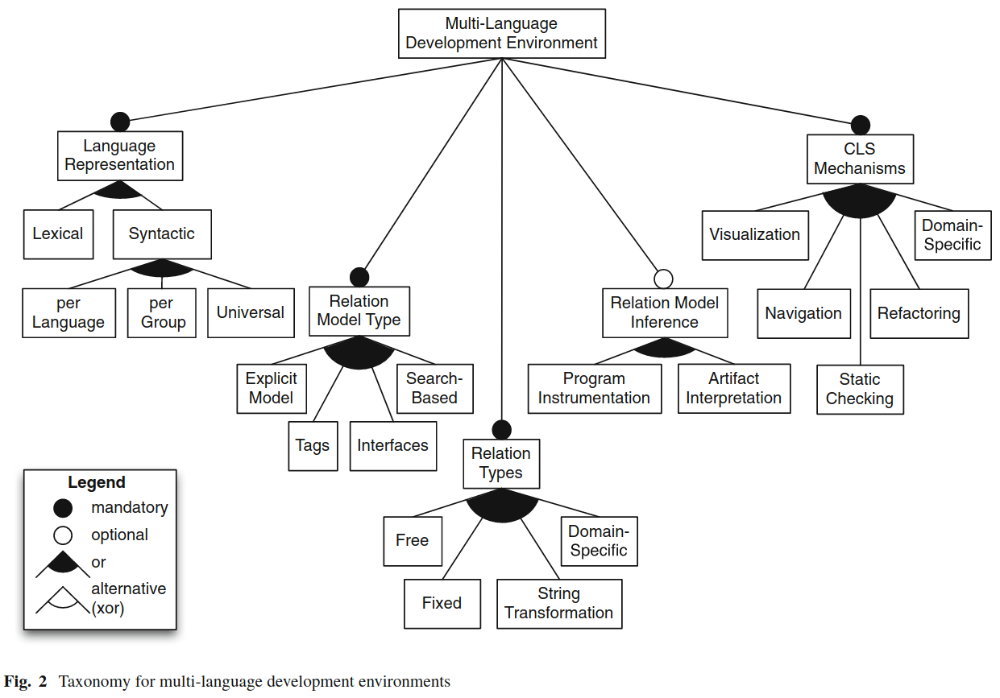

<font size=3>
Image source: <a href="https://www.researchgate.net/publication/271737676_The_design_space_of_multi-language_development_environments">H. Pfeiffer et al. <i>The design space of multi-language development environments</i></a>
</font>


## Structural Diagrams
<!-- _class: centered -->


## Design: UML Class diagrams — Class with Fields
<!--
_backgroundImage: "linear-gradient(to bottom, #deb887, #d17e12)"
_color: white
-->

```csharp
public class Student
{
    public string Name;
    public Image photo;
    private List<int> courses;

    public void enroll(int courseID)
    {
        courses.Add(courseID);
    }
}
```

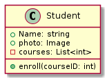


## Design: UML Class diagrams — Inheritance
<!--
_backgroundImage: "linear-gradient(to bottom, #deb887, #d17e12)"
_color: white
-->

```csharp
public class Student
{

}
public class GuestStudent : Student
{

}
```

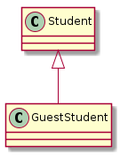


## Design: UML Class diagrams — Associations
<!--
_backgroundImage: "linear-gradient(to bottom, #deb887, #d17e12)"
_color: white
-->

<style scoped>
pre {
   font-size: 22px;
}
section {
   font-size: 22px;
}
</style>

```csharp
public class Student
{
    public string Name;
    public Image photo;
    private List<Course> courses;

    public void enroll(Course course)
    {
        courses.Add(course);
    }
}

public class Course
{
    public int Id;
}
```


If you have bi-directional references in your code, then the association becomes just a line, i.e., no arrows, with the names of the respective references at the opposite end of the association.

## Use UML Class diagrams scarcely

For documentation, do not overuse UML class diagrams.

Likely, it is best to use them to illustrate your domain model, i.e., your entities and their relations.

## Task: Entity Diagram

<!--
_backgroundImage: "linear-gradient(to bottom, #67b8e3, #0288d1)"
_color: white
_header: 10 minutes
-->

- Navigate to https://app.diagrams.net/.
- From the UML elements in the bottom left, choose classes, associations, and if necessary inheritance relations.
- Draft an illustration of the domain model of your _Chirp!_ application.
- Once done, send an image to our Teams chat (all in one thread), so that we can discuss some of the diagrams.


## Design: UML Class diagrams to illustrate Domain model

<!--
_backgroundImage: "linear-gradient(to bottom, #deb887, #d17e12)"
_color: white
-->


- Note, the above is likely not a complete entity diagrams once you decide to implement an un-/follow feature to your systems.


What are alternatives to entity diagrams with UML class diagrams?
* ER diagrams as you saw them in your database class.


## UML Package diagrams — Mapping of visual elements to code
<!--
_backgroundImage: "linear-gradient(to bottom, #deb887, #d17e12)"
_color: white
-->

<style scoped>
pre {
   font-size: 22px;
}
section {
   font-size: 22px;
}
</style>

```csharp
namespace Chirp.CLI.SimpleDB;

public interface IDatabaseRepository<T>
{
    public IEnumerable<T> Read(int? limit = null);
    public void Store(T record);
}
```

```csharp
namespace Chirp.CLI.SimpleDB;

using CsvHelper;
using System.Globalization;

public sealed class CSVDatabase<T> : IDatabaseRepository<T>
{
    ...
}
```

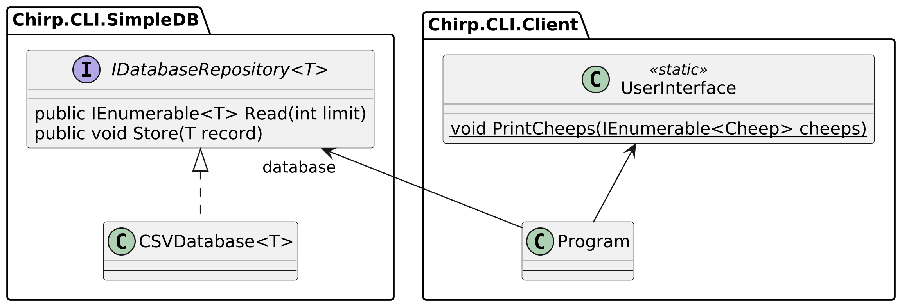


## UML Component diagrams
<!--
_backgroundImage: "linear-gradient(to bottom, #deb887, #d17e12)"
_color: white
-->


## Detour: What is a _component_???


  > A software element that conforms to a standard component model and can be **independently deployed and composed** without modification according to a composition standard.<font size=3>
Source:  W.T. Councill et al. _"Definition of a Software Component and Its Elements."_
</font>

  > A software component is a unit of composition with contractually-specified interfaces and explicit context dependencies only. A software component can be **deployed independently and is subject to composition** by third parties.<font size=3>
Source:  C. Szyperski _"Component Software: Beyond Object-Oriented Programming"_
</font>


## Detour: Characteristics of Components

  > 1. The component is an **independent executable entity** that is defined by its interfaces. You don’t need any knowledge of its source code to use it. It can either be referenced as an **external service or included directly** in a program.
  >
  > 2. The services offered by a component are made available through an interface, and all interactions are through that interface. The component interface is expressed in terms of parameterized operations, and its internal state is never exposed.<font size=3>
Source: I. Sommerville _Software Engineering_
</font>


## Task: What are components in your _Chirp!_ applications?

<!--
_backgroundImage: "linear-gradient(to bottom, #67b8e3, #0288d1)"
_color: white
_header: 5 minutes
-->

Discuss with each other, what are components in your _Chirp!_ applications?


## Architecture in the small vs. in the large

  > 1. **Architecture in the small** is concerned with the architecture of individual programs. At this level, we are concerned with the way that an individual program is decomposed into components.
  > 2. **Architecture in the large** is concerned with the architecture of complex enterprise systems that include other systems, programs, and program components. These enterprise systems may be distributed over different computers, which may be owned and managed by different companies.<font size=3>
Source: I. Sommerville _Software Engineering_
</font>

@Helge: Name what maps to components in the small and in the large.


## Design: UML Deployment diagrams
<!--
_backgroundImage: "linear-gradient(to bottom, #deb887, #d17e12)"
_color: white
-->

> [A] Node is a deployment target which represents computational resource upon which artifacts may be deployed for execution.<font size=3>
Source: <a href="https://www.uml-diagrams.org/deployment-diagrams.html">uml-diagrams.org</a>
</font>


In your cases, you can consider each service that you receive from Azure as a Node.


## Behavioral Diagrams
<!-- _class: centered -->


## Design: UML Statecharts (State Machines)
<!--
_backgroundImage: "linear-gradient(to bottom, #deb887, #d17e12)"
_color: white
-->

- States can be state of your entire application, of some of its components, etc.
* Below is the state of a user of your application. From a starting state (black dot), a user's state transitions between the two states `LoggedIn` and `LoggedOut`.
  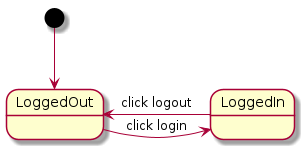
* Note, likely a state machine diagram does not map directly to code in the same way that the class diagram for your domain model does, at least not for your _Chirp!_ applications.


## Design: Nested UML Statecharts (State Machines)
<!--
_backgroundImage: "linear-gradient(to bottom, #deb887, #d17e12)"
_color: white
-->

  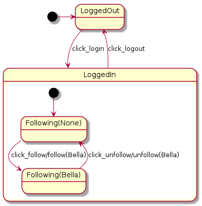


## UML Activity diagrams
<!--
_backgroundImage: "linear-gradient(to bottom, #deb887, #d17e12)"
_color: white
-->

* Initial state
* Activity. Can be anything from what is done in a single method all the way up to long running (even manual) processes.
* Condition (◇)
* Final state

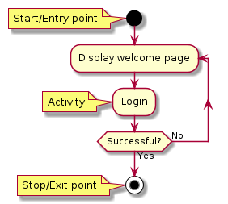

## Design: UML Activity Diagrams
<!--
_backgroundImage: "linear-gradient(to bottom, #deb887, #d17e12)"
_color: white
-->

An example of sequence of activities for sending (sharing) a cheep could look like.
Note, in your implementations, activities might be in a different order or different activities.

Again, activities do likely map to larger parts of your source code, e.g., controller methods in C♯, Razor views, etc.

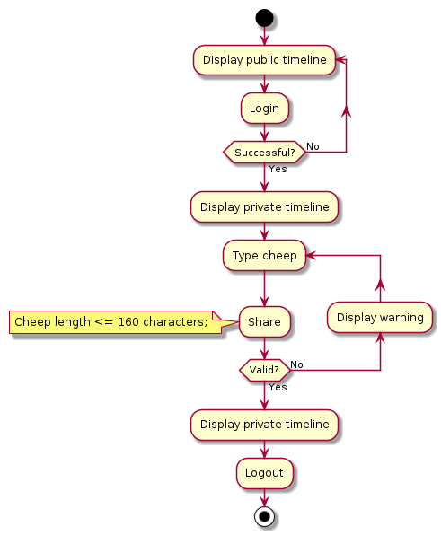


## UML Activity Diagrams combined with Wireframes
<!--
_backgroundImage: "linear-gradient(to bottom, #deb887, #d17e12)"
_color: white
-->

Can be used as screen transition diagrams that may be used during design of user centered flow of screens.

Note, the following is an incomplete activity diagram.

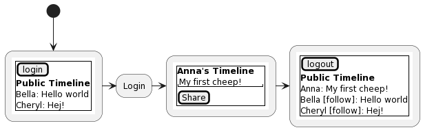


## Task: Activity Diagram

<!--
_backgroundImage: "linear-gradient(to bottom, #67b8e3, #0288d1)"
_color: white
_header: 10 minutes
-->


- Read again [today's project description](./README_PROJECT.md/#add-feature-users-can-follow-and-unfollow-each-other) for implementing the new un-/follow feature of _Chirp!_.
- Navigate to https://app.diagrams.net/.
- From the UML elements in the bottom left, choose activities, conditions, and start and end states.
- Draft an activity diagram that illustrates a sequence of activities when a user is choosing to follow another user.
<!-- - Once done, send an image to our Teams chat (all in one thread), so that we can discuss some of the diagrams. -->


<!-- Third hour -->


## UML Sequence diagrams — Mapping of visual elements to code
<!--
_backgroundImage: "linear-gradient(to bottom, #deb887, #d17e12)"
_color: white
-->

<style scoped>
pre {
   font-size: 22px;
}
section {
   font-size: 22px;
}
</style>

```csharp
public class Student
{
    public string Name;
    public Image photo;
    private List<Course> courses;

    public Status enroll(Course course)
    {
        courses.Add(course);
        return Status.Sucess;
    }
}

public class Manager
{
    private List<Student> students;

    public void SignUp(string Name, Course course) {
        student = students.Where(s -> s.Name == Name).First();
        student.enroll(course);
    }
}
```


## Sub-system sequence diagrams
<!--
_backgroundImage: "linear-gradient(to bottom, #deb887, #d17e12)"
_color: white
-->

You saw a quite complex diagram that was inspired by sequence diagrams already earlier. It illustrates the sequence of calls between different systems in OAuth authentication.


## Sub-system sequence diagrams
<!--
_backgroundImage: "linear-gradient(to bottom, #deb887, #d17e12)"
_color: white
-->

Note, sub-system sequence diagrams are more abstract than "normal" sequence diagrams. The former are on the level of (sub-)systems and the latter on the level of objects (in terms of object-orientation).

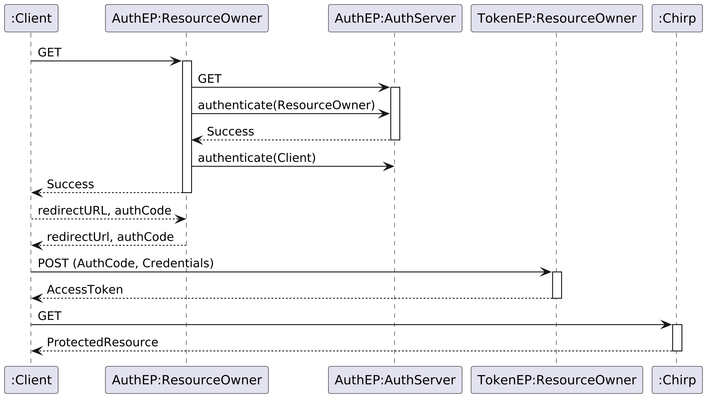


## Illustrating Structure vs. Behavior

What did we do in the previous slides?

- There are two major concerns of a system that you want to illustrate:
  - Structure: UML class diagrams
  - Behavior: UML statecharts, activity diagrams, sequence diagrams


<!-- Fourth hour -->


## Feedback: Manual check of each group's _Chirp!_

<style scoped>
table {
   font-size: 9px;
}

section {
   font-size: 15px;
}
</style>

| Group| Comment |
|:-----:|:------|
|1 | Cannot login with Github |
|2 | I cannot login via GitHub. After login, I have to register an email address and no cheep box appears? |
|3 | I cannot login via GitHub. After login, I have to register a username/email address and no cheep box appears? |
|4 | I cannot register via GH OAuth. I can login via GH but no cheepbox appears? |
|5 | I cannot login via GitHub. I cannot login via Identity Core. Registration seems to work. |
|6 | Via Identity Core, my username is my email? After login, no cheepbox appears? |
|7 | I cannot login via GitHub. After login, I have to register an email address and no cheep box appears? |
|8 |  I cannot login via GitHub. My cheeps are only displayed on my timeline not on the public timeline? Cheeps can be longer than 160 characters? |
|9 | I cannot cheep from my timeline, why not? I cannot login via Identity Core. Registration seems not to work. |
|10 | I cannot register via GH OAuth. (Username 'ropf@itu.dk' is already taken.) |
|11 | I cannot cheep from my timeline, why not? I cannot logout when logged in via GH? I cannot login via Identity Core. Registration seems to work. |
|12 | I cannot login via GitHub. After login, I have to register an email address and no cheep box appears? Cheeps can be longer than 160 characters? |
|13 | I can neither login via Identity Core nor via GitHub OAuth. Cheepboxes appear without being logged in. |
|14 | I cannot login via GitHub (Error's Timeline). |
|15 | I cannot login via GitHub. Cheeps can be longer than 160 characters? |
|16 | No running application? |
|17 | I cannot cheep from my timeline, why not? |
|18 | I can neither login via Identity Core nor via GitHub OAuth. |
|19 | I cannot login via GitHub. (Exception) |
|20 | ✓ |
|21 | I cannot login via GitHub (Error's Timeline). I cannot login via Identity Core. Registration seems to work. |
|22 | I cannot cheep from my timeline, why not? Why am I a "cutie" when trying to send a long cheep? :) |
|23 | I cannot cheep from my timeline, why not? Cheeps can be longer than 160 characters? I cannot register/login via Identity Core? |
|24 | I can neither login via Identity Core nor via GitHub OAuth. |
|25 | ✓ |
|26 | I cannot login via GitHub. I cannot cheep from my timeline, why not? Why are Adrian's cheeps listed in my private timeline when I am user "A"? |
|28 | No running application? |
|29 | I cannot login via GitHub. I cannot login via Identity Core. Registration seems not to work. |
|30 | No running application? |
|31 | No running application? |


## Feedback: Requirements for users of _Chirp!_

Let's agree on the requirements:

- An author on your chirp application has always a name and an email address.
- An email address **is not** the name.
- For login: be specific if you want the user to insert a name or an email address.

* When logging in via GitHub OAuth, a user **shall not** provide an extra email or username. If you need this in your _Chirp!_ application receive this from GitHub with the help of the information that you receive in the ClaimsPrinciple. It should contain a GitHub user ID.


## Feedback Validation of user input?

Where should you validate that a cheep is maximal 160 characters long?

a) Via a constraint on the view code?
b) Via a constraint on the data model?
c) Via a constraint on the endpoint?

How to handle too long cheeps?

a) Prevent a user from sending them?
b) Accept them but truncate them?

Consider the [principle of least surprise](https://en.wikipedia.org/wiki/Principle_of_least_astonishment) when taking a decision.


## Feedback: What should be in releases?

The same that is deployed in production.
That is, no longer a single executable if this is not deployed like that.


## Intro to project work

- From now on, tasks in project work are formulated more openly.
- That is, you have to _analyze_ what is written there to be able to design a suitable solution and to implement it correctly.

- If the illustration tools that were presented today help you in analyzing project descriptions and designing suitable solutions, then use them.


## Next week, guest lecture: GDPR and "Privacy by Design"

We will start the lecture with a guest lecture.


Jakob Krabbe Sørensen from [ComplyCloud](https://www.complycloud.com/) will give a guest lecture on "Privacy by Design" and why GDPR matters to you as software engineers.


## What to do now?


- If not done, complete the Tasks (blue slides) from this class
- Check the [reading material](./READING_MATERIAL.md)
- Work on the [project](./README_PROJECT.md)

- <font color="#cecdce">We are done reading chapters from [Andrew Lock _ASP.NET Core in Action, Third Edition_](https://www.manning.com/books/asp-net-core-in-action-third-edition)! </font>
