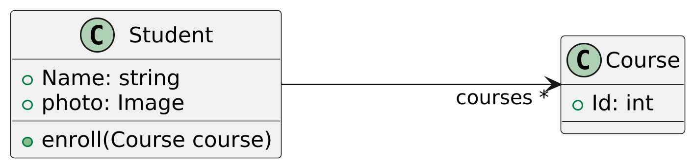
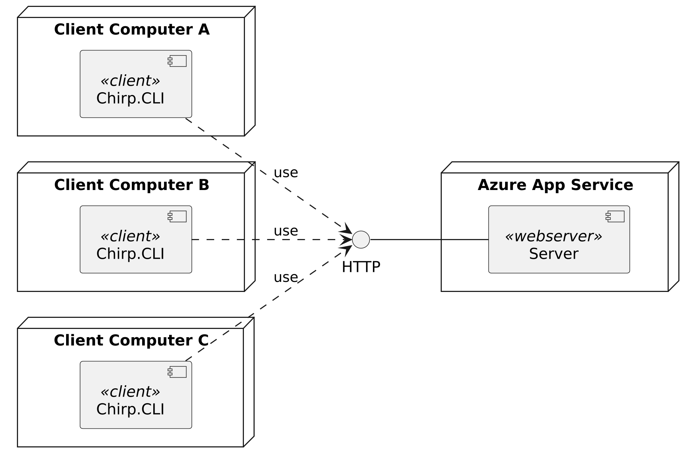
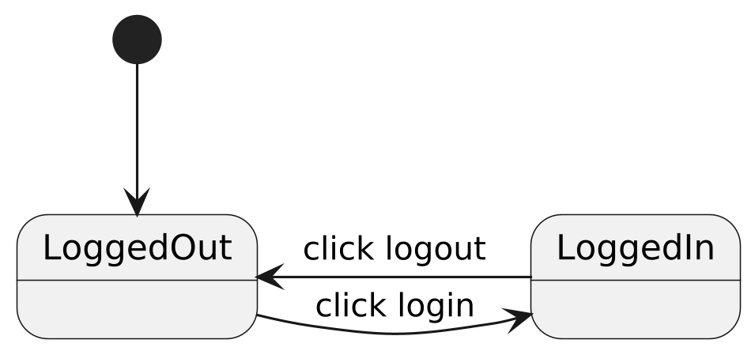
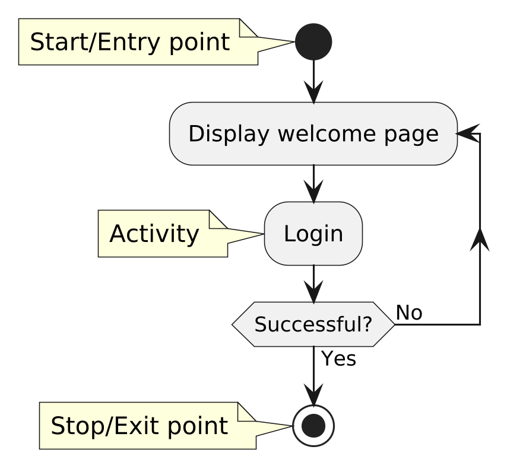
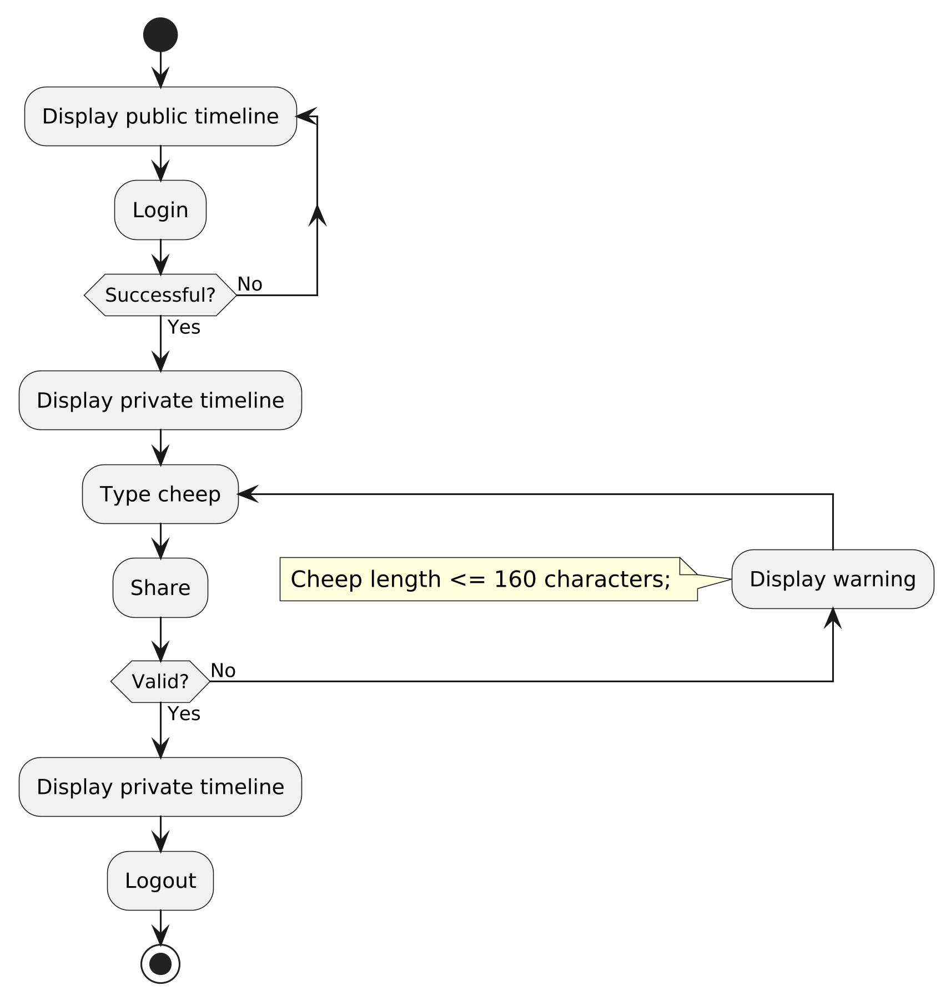
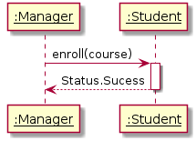
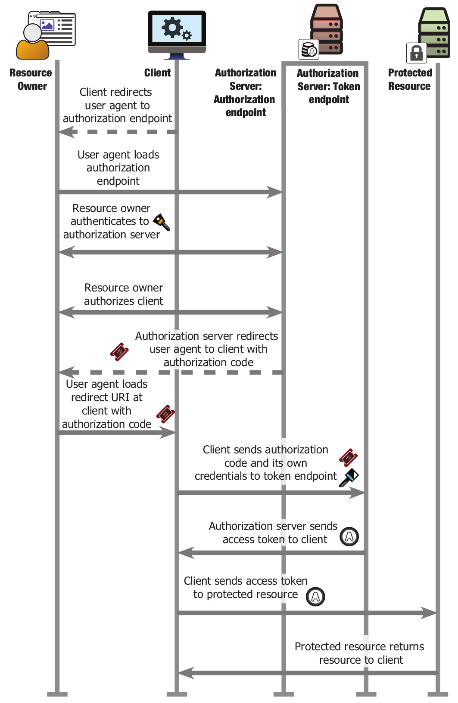
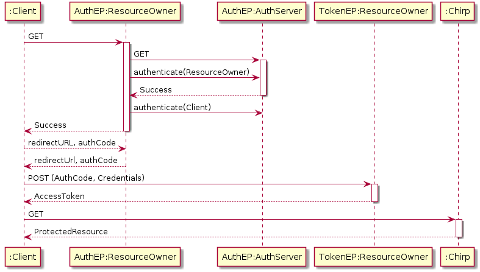

# **Analysis, Design and Software Architecture (BDSA)**
Session 11
[Sven Peldszus](svpe@itu.dk)


## Plan for this week

- Last week
  - Requirements Engineering
  - Structural Modeling (class and component diagrams)
- This week
  - Structural Modeling (deployment diagrams)
  - Behavioral Modeling
  - Documentation

<!-- First hour -->

## Unified Modeling Language (UML)

- What is the UML?
  - General purpose modeling language for developing software systems
  - Provides a standard way to visualize the design of a system
- Detailed specification in the UML Super Structure: https://www.omg.org/spec/UML/ 


## Computer-Aided Software Engineering (CASE) Tools

Assist developers and analysts in creating and managing models (like UML class diagrams) and other artifacts throughout the software development life cycle (SDLC).

Functions
  - **Modeling:**	Create and edit UML diagrams (class, use case, sequence, activity, state, etc.).
  - **Code Generation:**	Automatically generate source code from UML diagrams.
  - **Reverse Engineering:**	Generate UML diagrams from existing source code.
  - **Consistency Checking:**	Verify relationships and constraints across diagrams.
  - **Documentation:**	Automatically produce technical documentation from models.
  - **Collaboration:**	Working together on the same UML project with version control.

In this course, we use the community edition of Visual Paradigm
 - https://www.visual-paradigm.com/download/community.jsp
 

## Structural Diagrams
<!-- _class: centered -->


## Design: UML Class diagrams to illustrate Domain model

<!--
_backgroundImage: "linear-gradient(to bottom, #deb887, #d17e12)"
_color: white
-->


- Note, the above is likely not a complete entity diagrams once you decide to implement an un-/follow feature to your systems.


What are alternatives to entity diagrams with UML class diagrams?
* ER diagrams as you saw them in your database class.


## Modeling Best Practices
- Classes
  - Names are singular, e.g., *Cheep*

- Associations
  - At least one association end name
  - At least one multiplicity
  - Names reflect multiplicities, e.g., \* *courses*




## UML Component diagrams
<!--
_backgroundImage: "linear-gradient(to bottom, #deb887, #d17e12)"
_color: white
-->


## Detour: What is a _component_???


  > A software element that conforms to a standard component model and can be **independently deployed and composed** without modification according to a composition standard.
  *Source:  W.T. Councill et al. _"Definition of a Software Component and Its Elements."_*

  > A software component is a unit of composition with contractually-specified interfaces and explicit context dependencies only. A software component can be **deployed independently and is subject to composition** by third parties.
  *Source:  C. Szyperski _"Component Software: Beyond Object-Oriented Programming"_*


## Detour: Characteristics of Components

  > 1. The component is an **independent executable entity** that is defined by its interfaces. You don’t need any knowledge of its source code to use it. It can either be referenced as an **external service or included directly** in a program.
  >
  > 2. The services offered by a component are made available through an interface, and all interactions are through that interface. The component interface is expressed in terms of parameterized operations, and its internal state is never exposed.
  *Source: I. Sommerville _Software Engineering_*


## Task: What are components in your _Chirp!_ applications?

<!--
_backgroundImage: "linear-gradient(to bottom, #67b8e3, #0288d1)"
_color: white
_header: 5 minutes
-->

Discuss with each other, what are components in your _Chirp!_ applications?


## Architecture in the small vs. in the large

  > 1. **Architecture in the small** is concerned with the architecture of individual programs. At this level, we are concerned with the way that an individual program is decomposed into components.
  > 2. **Architecture in the large** is concerned with the architecture of complex enterprise systems that include other systems, programs, and program components. These enterprise systems may be distributed over different computers, which may be owned and managed by different companies.
  
Source: *I. Sommerville _Software Engineering_*

<!--@Helge: Name what maps to components in the small and in the large.-->


## Design: UML Deployment diagrams
<!--
_backgroundImage: "linear-gradient(to bottom, #deb887, #d17e12)"
_color: white
-->

> [A] Node is a deployment target which represents computational resource upon which artifacts may be deployed for execution.
*Source: <a href="https://www.uml-diagrams.org/deployment-diagrams.html">uml-diagrams.org</a>*



In your cases, you can consider each service that you receive from Azure as a Node.


## Behavioral Diagrams
<!-- _class: centered -->


## Design: UML Statecharts (State Machines)
<!--
_backgroundImage: "linear-gradient(to bottom, #deb887, #d17e12)"
_color: white
-->

- States can be state of your entire application, of some of its components, etc.
* Below is the state of a user of your application. From a starting state (black dot), a user's state transitions between the two states `LoggedIn` and `LoggedOut`.
  
* Note, likely a state machine diagram does not map directly to code in the same way that the class diagram for your domain model does, at least not for your _Chirp!_ applications.


## Design: Nested UML Statecharts (State Machines)
<!--
_backgroundImage: "linear-gradient(to bottom, #deb887, #d17e12)"
_color: white
-->

  


## UML Activity diagrams
<!--
_backgroundImage: "linear-gradient(to bottom, #deb887, #d17e12)"
_color: white
-->

* Initial state
* Activity. Can be anything from what is done in a single method all the way up to long running (even manual) processes.
* Condition (◇)
* Final state



## Design: UML Activity Diagrams
<!--
_backgroundImage: "linear-gradient(to bottom, #deb887, #d17e12)"
_color: white
-->

An example of sequence of activities for sending (sharing) a cheep could look like.
Note, in your implementations, activities might be in a different order or different activities.

Again, activities do likely map to larger parts of your source code, e.g., controller methods in C♯, Razor views, etc.




## UML Activity Diagrams combined with Wireframes
<!--
_backgroundImage: "linear-gradient(to bottom, #deb887, #d17e12)"
_color: white
-->

Can be used as screen transition diagrams that may be used during design of user centered flow of screens.

Note, the following is an incomplete activity diagram.


## Task: Activity Diagram

<!--
_backgroundImage: "linear-gradient(to bottom, #67b8e3, #0288d1)"
_color: white
_header: 10 minutes
-->


- Read again [today's project description](./README_PROJECT.md#add-feature-users-can-follow-and-unfollow-each-other) for implementing the new un-/follow feature of _Chirp!_.

- Use Visual Paradigm

- Draft an activity diagram that illustrates a sequence of activities when a user is choosing to follow another user.
<!-- - Once done, send an image to our Teams chat (all in one thread), so that we can discuss some of the diagrams. -->


<!-- Third hour -->


## UML Sequence diagrams — Mapping of visual elements to code
<!--
_backgroundImage: "linear-gradient(to bottom, #deb887, #d17e12)"
_color: white
-->

<style scoped>
pre {
   font-size: 22px;
}
section {
   font-size: 22px;
}
</style>

```csharp
public class Student
{
    public string Name;
    public Image photo;
    private List<Course> courses;

    public Status enroll(Course course)
    {
        courses.Add(course);
        return Status.Sucess;
    }
}

public class Manager
{
    private List<Student> students;

    public void SignUp(string Name, Course course) {
        student = students.Where(s -> s.Name == Name).First();
        student.enroll(course);
    }
}
```




## Sub-system sequence diagrams
<!--
_backgroundImage: "linear-gradient(to bottom, #deb887, #d17e12)"
_color: white
-->

You saw a quite complex diagram that was inspired by sequence diagrams already earlier. It illustrates the sequence of calls between different systems in OAuth authentication.




## Sub-system sequence diagrams
<!--
_backgroundImage: "linear-gradient(to bottom, #deb887, #d17e12)"
_color: white
-->

Note, sub-system sequence diagrams are more abstract than "normal" sequence diagrams. The former are on the level of (sub-)systems and the latter on the level of objects (in terms of object-orientation).




## Illustrating Structure vs. Behavior

What did we do in the previous slides?

- There are two major concerns of a system that you want to illustrate:
  - Structure: UML class diagrams
  - Behavior: UML statecharts, activity diagrams, sequence diagrams

<!-- Third hour -->

<!-- ## Documentation -->

## In-code documentation

<style scoped>
pre {
  font-size: 23px;
}
section {
  font-size: 23px;
}
</style>

```csharp
/// <summary>
/// This class repesents the user of the _Chirp!_ application.
/// Since _Chirp!_ is a micro-blogging application, all authenticated
/// users are expected to author cheeps.
/// </summary>
public class Author : IdentityUser
{
    public List<Cheep> Cheeps { get; set; }
    ...
}

/// <summary>
/// ...?
/// </summary>
public class Cheep
{
    public int Id { get; set; }
    public required string Content { get; set; }
    public required DateTime Timestamp { get; set; }
    ...
}
```
<font size=3>
Source: <a href="https://learn.microsoft.com/en-us/dotnet/csharp/language-reference/xmldoc/">.NET Docs Documentation comments</a>, <a href="https://learn.microsoft.com/en-us/dotnet/csharp/language-reference/language-specification/documentation-comments">.NET Docs Annex D Documentation comments</a>
</font>


## Best practice

<style scoped>
section {
  font-size: 23px;
}
</style>

- Do not over use in-code documentation.
- **Never** document trivial or default code!
- Focus on your domain and complicated business logic.
  - Likely you do not have a lot of the latter in _Chirp!_.
  - Where you have it, add respective documentation

- In code, provide links to sources that influenced your solution.
- If you create code that is complex and difficult to understand, explain next to it **what** the reasons for complexity are, what you ruled out as more simple solutions, and everything that the future you/colleague needs to know to understand the reason for complexity.
  - Likely you do not have a lot of that in _Chirp!_.
  - You want to document that this is not _accidental_ complexity.
  - If you were Skat, you had a lot of _inherent_ complexity.

- A good example is the implementation of [Gitlet](https://github.com/maryrosecook/gitlet/blob/master/gitlet.js)


## Task: In-code documentation

<!--
_backgroundImage: "linear-gradient(to bottom, #67b8e3, #0288d1)"
_color: white
_header: 5 minutes
-->

Provide an explanatory comment for the `Cheep` entity class.

```csharp
/// <summary>
/// ...?
/// </summary>
public class Cheep
{
    public int Id { get; set; }
    public required string Content { get; set; }
    public required DateTime Timestamp { get; set; }
    ...
}
```

## External documentation — Know your audience

- End-user documentation
- Developer documentation
- Operator documentation

In your project report, you will provide information for developers and operators, not for end-users. We skip that in this course.


## How to write?

> - Use inline markup liberally.
> - Write in short paragraphs.
> - Use a variety of structural elements. [Lists, tables, code blocks, etc.]
> - Make your structure visual.
>
>
> - Watch out for passivity.
> - Omit fluff.<font size=3>
Source: <a href="https://jacobian.org/2009/nov/11/technical-style/">Jacob Kaplan-Moss</a>
</font>


## How to write technical documentation?

> 1. Dry sucks
> 1. Before you start, be clear about what you want your reader to do after you end
> 1. Write to a well formed outline, always
> 1. Avoid ambiguous pronouns
> 1. clarity = illustrations + words
> 1. When dealing with concepts… logical illustration and example
> 1. Embrace revision<font size=3>
Source: <a href="https://www.developer.com/guides/the-7-rules-for-writing-world-class-technical-documentation">Bob Reselman</a>
</font>


## How to write technical documentation?
<style scoped>
section {
   font-size: 18px;
}
</style>

> Technical documentation is hard, really hard. It's easier to explain what not to do. Some suggestions:
>
>  - It's no prose, so don't try to be arty.
>  - Keep it short!
>  - When in doubt, drop it.
>  - Use simple words. Not everyone is fluent in English.
>  - Any sentence with more then two lines is an anomaly.
>  - Be consistent. Avoid surprises.
>  - Use cases and Examples are important and may shorten explanations.
>  - Include common mistakes and their workarounds.
>  - You have to refactor often (>>20x).
>   - Use a versioning system like git or mercurial.
>  - Avoid abbreviations and introduce them at first occurrence e.g: concurrent versioning system (CVS)
>  - A column shouldn't exceed 9-12 words (~60 chars) to improve readability.
>  - Keep your rules in a file (e.g: doc.playbook) and check them
>  - Let others proof read, or yet better find an editor.
>  - Try to be gender agnostic. Why? cautionary tale: https://github.com/joyent/libuv/pull/1015<font size=3>
Source: <a href="https://news.ycombinator.com/item?id=8414714">kevin_bauer on Hacker News</a>
</font>


## Writing documentation for an open-source project

... for which you want to have contributors is a bit different though, see e.g., [Write the Docs](https://www.writethedocs.org/guide/writing/beginners-guide-to-docs/#what-to-write)


## Best practice: Be short and concise


<font size=3>
Image source: <a href="https://www.archbee.com/blog/how-to-improve-technical-writing-skills">Archbee Blog</a>
</font>


## Best practice: KISS


> 6. Be CONCISE
>
>Don't say: "The mystery lady was one who every eligible man at the ball admired."
>
>Instead say : "Every eligible man at the ball admired the mystery lady."
>
> 7. Use the VOCABULARY that you know.
>
> Don't always feel you have to use big words. It is always better to be clear and use simple language rather than showing off flashy words you aren't sure about and potentially misusing them. This is not to say, however, that you should settle for very weak vocabulary choices (like "bad" or "big" or "mad").
<font size=3>
Source: <a href="https://slc.berkeley.edu/writing-worksheets-and-other-writing-resources/nine-basic-ways-improve-your-style-academic-writing">Berkeley Student Learning Center</a>
</font>


## Task: Improve writing

<!--
_backgroundImage: "linear-gradient(to bottom, #67b8e3, #0288d1)"
_color: white
_header: 5 minutes
-->

Read the following paragraph.

> Modern software development is full of dependencies on
free open source software (FOSS). This software ranges from
the application the code is being written in e.i. visual studio
code, to how the quality of the software is tested e.i. Moq,
NUnit, etc. As such, it is important to keep the health of
a project in mind when choosing to rely on it.<font size=3>
Source: Anonymous
</font>

- Can you understand it?
- Try to improve it.


## Tooling for writing documentation

- Simple: [mkdocs](https://www.mkdocs.org/)
- More elaborate: [Sphinx](https://www.sphinx-doc.org/en/master/)
- [AsciiDoc](https://docs.asciidoctor.org/)

We take it way more simple. Your project reports are written in one Markdown file and converted to PDF with [`pandoc`](https://pandoc.org/).


## Tools for illustration

There is a plethora of such tools. In this and future courses at ITU, you likely find the following two sufficient.

- [PlantUML](https://plantuml.com/)
- [DrawIO](https://app.diagrams.net/).

Many projects consider it a good practice when your illustrations are generated in-code (PlantUML) compared to WYSIWYG editors (DrawIO).
(Same philosophy as with markup languages compared, e.g. Microsoft Word files.)


## Best practice: Let documentation live together with your source code

What is Software? Helge's definition:

  > Software is the collection of **all artifacts**, which allow (a) **suitably educated person(s)** with access to specified and suitable **hardware** to instantiate a running system.
  >
  > Additionally, the collection of such artifacts allow such suitably educated person(s) to **understand** and **reason** about a systems' working and properties and let them **understand** why the system is as it is and why it behaves the way it does.<font size=3>
Source:  Helge
</font>


## The report

- See the description of the deliverable [here](./README_REPORT.md)
- Find the template for the report [here](./docs/)


<!-- Fourth hour -->

## Software Design?

  > use of **scientific principles**, **technical information**, and **imagination** in the definition of a software system to perform **pre-specified functions** with maximum **economy** and **efficiency**<font size=3>
Source: ISO/IEC/IEEE 24765:2017 <i>Systems and software engineering-Vocabulary</i>
</font>


## Software Design?

  > In every engineering discipline, design encompasses the **disciplined approach** we use to **invent a solution** for some problem, thus providing a **path from requirements to implementation**. In the context of software engineering, Mostow suggests that the purpose of design is to construct a system that:
  >
  > - **Satisfies** a given (perhaps informal) **functional specification**
  > - **Conforms to limitations** of the target medium
  > - **Meets** implicit or explicit **requirements** on performance and resource usage
  > - **Satisfies** implicit or explicit **design criteria** on the form of the artifact
  > - **Satisfies** restrictions on the **design process** itself, such as its length or cost, or the tools available for doing the design<font size=3>
Source: <a href="https://www.informit.com/articles/article.aspx?p=726130&seqNum=6">G. Booch et al. _"Object-Oriented Analysis and Design with Applications"_</a>
</font>


## Software Design?

That is similar to what Sommerville says about _Software Engineering_:

  > **Engineering discipline** Engineers make things work. They **apply theories, methods, and tools** where these are appropriate. However, they use them selectively and always **try to discover solutions** to problems even when there are no applicable theories and methods. Engineers also recognize that they must **work within organizational and financial constraints**, and they must look for solutions within these constraints.<font size=3>
Source: I.Sommerville _"Software Engineering"_
</font>


## Software Design

  > The **final goal of any engineering activity** is the some type of **documentation**. When a design effort is complete, the design documentation is turned over to the manufacturing team. This is a completely different group with completely different skills from the design team. If the design documents truly represent a complete design, the manufacturing team can proceed to build the product. In fact, they can proceed to build lots of the product, all without any further intervention of the designers.
  > [...] the only software documentation that actually seems to satisfy the criteria of an engineering design is the source code listings.<font size=3>
Source: J. Reeves _"What is Software?"_
</font>


## Software Design

Note, other more object-oriented analysis and design advocates have a slightly other opinion on that:

  > Design involves **balancing a set of competing requirements**. The **products of design are models** that enable us to reason about our structures, make trade-offs when requirements conflict, and in general, provide **a blueprint for implementation**.<font size=3>
Source: <a href="https://www.informit.com/articles/article.aspx?p=726130&seqNum=6">G. Booch et al. _"Object-Oriented Analysis and Design with Applications"_</a>
</font>


## Task: One system/feature many different designs?

<!--
_backgroundImage: "linear-gradient(to bottom, #67b8e3, #0288d1)"
_color: white
_header: 10 minutes
-->

- Read on task of this weeks [project work](./README_PROJECT.md#add-feature-forget-me)
- Brainstorm with your peers, how you could design such a feature.
  - What could be the most simple solution?
  - Can you foresee any issues?


## Note on Pseudonomization vs. Anonymization

> Pseudonymization is a data management and de-identification procedure by which personally identifiable information fields within a data record are replaced by one or more artificial identifiers, or pseudonyms. A single pseudonym for each replaced field or collection of replaced fields makes the data record less identifiable while remaining suitable for data analysis and data processing.
>
> [it] is one way to comply with the European Union's new General Data Protection Regulation (GDPR) demands for secure data storage of personal information. Pseudonymized data can be restored to its original state with the addition of information which allows individuals to be re-identified. In contrast, anonymization is intended to prevent re-identification of individuals within the dataset.
> <font size=3>
Source: <a href="https://en.wikipedia.org/wiki/Pseudonymization">Wikipedia</a>
</font>


## Software Architecture?

  > Architecture represents the set of **significant design decisions** that shape the form and the function of a system, where **significant is measured by cost of change.**<font size=3>
Source: <a href="https://twitter.com/Grady_Booch/status/1301810358819069952">G. Booch</a>
</font>


## Software Architecture?

  > Architecture is about **the important stuff**. Whatever that is. On first blush, that sounds trite, but I find it carries a lot of richness. It means that the heart of thinking architecturally about software is to decide what is important, (i.e. what is architectural), and then expend energy on keeping those architectural elements in good condition. For a developer to become an architect, they need to be able to recognize what elements are important, recognizing what elements are likely to result in serious problems should they not be controlled.<font size=3>
Source: <a href="https://ieeexplore.ieee.org/document/1231144">Martin Fowler _"Design - Who needs an architect?"_</a>
</font>


## Software Architecture?

  > Combining the concept of the **class and object structures** together with the five attributes of a complex system (hierarchy, relative primitives [i.e., multiple levels of abstraction], separation of concerns, patterns, and stable intermediate forms), we find that virtually all complex systems take on the same (canonical) form, [...]. Collectively, we speak of the **class and object structures of a system as its architecture**.<font size=3>
Source: <a href="https://www.informit.com/articles/article.aspx?p=726130&seqNum=4">G. Booch et al. _"Object-Oriented Analysis and Design with Applications"_</a>
</font>


## Software Architecture &mdash; Case: Coronapas App

An illustration of architecture in the large:


<font size=3>
Source: <a href="https://digst.dk/media/24346/whitepaper-om-coronapas_290521.pdf">Whitepaper om coronapas-appen</a>
</font>


## Feedback: Use of Large Language Models?

In all of your commits, I found nine that stated to be co-authored with ChatGPT.
Is that true? I cannot believe that 😃

Let's get some data that I can use for next week. Please fillout the following survey:
https://www.menti.com/alete7oe13yv


## What to do now?


- If not done, complete the Tasks (blue slides) from this class
- Check the [reading material](./READING_MATERIAL.md)
- Work on the [project](./README_PROJECT.md)
