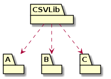

# **Analysis, Design and Software Architecture (BDSA)**
Session ~~13~~ → 14
[Helge Pfeiffer](ropf@itu.dk)


## What are we going to do today?

We reflect and develop different perspectives.

- One way of development
  - Could we do differently?
- One set of tools
  - Could we benefit from using others?
- Development of one kind of applications: web-apps
  - Could there be something else?
- Design and Architecture
  - Are our _Chirp!_ applications good?

<!-- First hour -->

## Process: Iterative and Incremental

During this course, we simulated an iterative and incremental development process.
That means that from week to week you implemented new features and learned new aspects of the C♯ language and the ASP.NET framework.

That is only one way of working.
However, in big projects, e.g., those for the public sector, you will meet more plan-driven processes.


## Software Processes?

> A _software process_ is a set of related activities that leads to the production of a software system.
>
> [...]
> 1. **Software specification** The functionality of the software and constraints on its operation must be defined.
> 2. **Software development** The software to meet the specification must be produced.
> 3. **Software validation** The software must be validated to ensure that it does what the customer wants.
> 4. **Software evolution** The software must evolve to meet changing customer needs.<font size=3>
Source: I. Sommerville <i>Software Engineering</i>
</font>


## Software Processes?

* **Plan-driven processes** are processes where all of the process activities are planned in advance and progress is measured against this plan.
* In **iterative** or **incremental processes**, planning is incremental and it is easier to
change the process to reflect changing customer requirements.
* In **agile processes**, planning is incremental and continual as the software is developed. It is therefore easier to change the process to reflect changing customer or product requirements.
  * Development of “shippable” software takes precedence over planning and documentation.

<font size=3>
Based on: I. Sommerville <i>Software Engineering</i> and P. Tell BDSA'21
</font>


## An Early Software Process Model — The "Waterfall"

A plan-driven and document-oriented process


<font size=3>
Image source: Royce <a href="https://blog.jbrains.ca/assets/articles/royce1970.pdf"><i>Managing the development of large software systems</i></a>
</font>


## Waterfall wrongly characterized since inception
<style scoped>
section {
  font-size: 23px;
}
</style>

  > I should add that in my own experience, Royce is right saying that the waterfall model is a risky approach to software development. In the vast majority of cases I strongly recommend against a waterfall. A waterfall model can work well in small projects where everything is completely known ahead-of-time and the requirements never change, but such projects are rare. [...] In practice, some sort of incremental or iterative approach is usually much less risky.
  >
  > Once the pictures became widespread, they became fossilized in various organizations and standards. For example, the US Department of Defense (DoD) developed the standards DOD-STD-2167 (4 June 1985), later revised to DOD-STD-2167A (29 Feb 1988), aka "Defense System[s] Software Development". [...] Those standards are officially no longer required, but the practices remain. The [Final Report of the Defense Science Board (DSB) Task Force on the "Design and Acquisition of Software for Defense Systems" (February 14, 2018)](https://www.acq.osd.mil/dsb/reports/2010s/DSB_SWA_Report_FINALdelivered2-21-2018.pdf) explains that the DoD **"still largely buys and develops software developed using the slower traditional Waterfall approach that was mostly abandoned by commercial companies years ago."** Once something becomes entrenched, it is hard to change.
  >
  > [D. A. Wheeler _"The Waterfall Model"_](https://dwheeler.com/essays/waterfall.html)


## Actually Royce described an iterative process


<font size=3>
Image source: Royce <a href="https://blog.jbrains.ca/assets/articles/royce1970.pdf"><i>Managing the development of large software systems</i></a>
</font>


## Project Models

Why does it matter? Because certain ideas about plan-driven process models survive in contemporary project models.


## PRINCE2

> PRINCE2 (PRojects IN Controlled Environments) is a structured **project management method** [...]. PRINCE2 emphasises dividing projects into manageable and controllable stages.
>
> PRINCE2 was developed as a UK government standard for information systems projects.<font size=3>
Source: <a href="https://en.wikipedia.org/wiki/PRINCE2">Wikipedia</a>
</font>


<font size=3>
Image source: <a href="https://www.axelos.com/resource-hub/case-study/using-prince2-to-manage-us-federal-it-projects">AXELOS</a>
</font>


## Statens IT-projektmodel

The Danish governmental IT-project model is inspired by PRINCE2 and references plan-driven processes (waterfall model) directly.

> Statens it-projektmodel er en generel projektledelsesmodel, som kan bruges af alle typer af statslige it-projekter. Modellen indeholder en fasemodel for projektgennemførelse samt en række styringsdokumenter og vejledninger.<font size=3>
Source: <a href="https://digst.dk/media/18239/01-vejledning-til-statens-it-projektmodel-v-13.pdf">Digitaliseringsstyrelsen</a>
</font>


## Statens IT-projektmodel

> Statens it-projektmodel er en generel projektledelsesmodel, der skal udgøre et ambitiøst, men også realistisk beslutnings- og styringsgrundlag for alle statslige projekter. Modellen skal understøtte styring og ledelse af projektet igennem hele projektets levetid, og sikre at der også er et fokus på realisering af gevinster fra projektets start og til efter projektets afslutning. Modellen består af fem hovedelementer:
>
> 1. Fem principper for it-projekter i staten
> 2. En fasemodel der dækker gevinsternes livscyklus
> 3. Obligatorisk styringsgrundlag
> 4. Projektorganisationens roller og ansvar
> 5. Støtteværktøjer og procesguider
>
<font size=3>
Source: <a href="https://digst.dk/media/18239/01-vejledning-til-statens-it-projektmodel-v-13.pdf">Digitaliseringsstyrelsen</a>
</font>


##  It-udviklingsmetoder i Statens IT-projektmodel


<font size=3>
Image source: <a href="https://digst.dk/media/18239/01-vejledning-til-statens-it-projektmodel-v-13.pdf">Digitaliseringsstyrelsen</a>
</font>


## Alternative Process

Consequently, we could have followed a drastically different development process.

For example, we could have started with eliciting requirements, and documented them thoroughly in a complete requirements specification.
Based on this, we could have developed the architecture and design of our _Chirp!_ systems, which we then would have had to implement and test.

Such a process is likely more recommendable if you know precisely what you are doing beforehand and when you have experience from similar projects. That is rarely that case in software development projects.

<!-- Second hour -->

## Process reflection: Tools

In this (and previous) course(s) you used Git as a version control system.

In a real-world project you would choose the tools that support your work best.

Being a perceived "industry standard" is not a good selection criteria for a tool.
Git is difficult.
It was developed to support development of the Linux kernel.
That means, thousands of developers (most of which do not know each other) that work distributed over the entire globe collaborate on a single software project.
Even random outsiders might contribute their changes.


## Process reflection: Tools


- This is not how you worked in this project!
- The [Fossil version control system](https://www.fossil-scm.org/) was developed by the developers of SQLite to support their work on SQLite.
- They are a small team of developers that know each other and who are co-located most of the times. They want to quickly see each other's work (no possibility to hide behind a non-shared branch).

This is what is called Cathedral vs. Bazaar style development, see [E. Reymond _The cathedral and the bazaar_](https://firstmonday.org/ojs/index.php/fm/article/download/1472/1387?inline=1).
Most of your professional work will be on Cathedral style development, so choose the right tools for it.

<!-- https://www.fossil-scm.org/home/doc/trunk/www/fossil-v-git.wiki -->


## Process reflection: Tools, the Unix philosophy

<style scoped>
section {
  font-size: 23px;
}
</style>

> The Unix philosophy is documented by Doug McIlroy in the Bell System Technical Journal from 1978
>
>  - Make each program do one thing well. To do a new job, build afresh rather than complicate old programs by adding new "features".
>  - Expect the output of every program to become the input to another, as yet unknown, program. Don't clutter output with extraneous information. Avoid stringently columnar or binary input formats. Don't insist on interactive input.
>  - Design and build software, even operating systems, to be tried early, ideally within weeks. Don't hesitate to throw away the clumsy parts and rebuild them.
>  - Use tools in preference to unskilled help to lighten a programming task, even if you have to detour to build the tools and expect to throw some of them out after you've finished using them.<font size=3>
Source: <a href="https://en.wikipedia.org/wiki/Unix_philosophy
">Wikipedia</a>
</font>

* In your later careers, in case no suitable tools exist that support your work, create them.


## Non-functional requirement: Maintainability

Choosing a language and a technology stack has impact on the maintainability of a system, e.g., how often do we have to touch/modify it?


## .NET Release Train


<font size=3>
Image source: <a href="https://visualstudiomagazine.com/articles/2023/10/10/final-net8-rcs.aspx">VisualStudio Magazine</a>
</font>

<!-- https://learn.microsoft.com/en-us/dotnet/core/releases-and-support -->

## .NET Release Train


|  Version  | Release Date | Support | Latest Patch Version | End of Support |
| :-- | :-- | :-- | :-- | :-- |
| [.NET 9](release-notes/9.0/README.md) | [November 12, 2024](https://devblogs.microsoft.com/dotnet/announcing-dotnet-9/) | [STS][policies] | [9.0.0][9.0.0] | May 12, 2026 |
| [.NET 8](release-notes/8.0/README.md) | [November 14, 2023](https://devblogs.microsoft.com/dotnet/announcing-dotnet-8/) | [LTS][policies] | [8.0.11][8.0.11] | November 10, 2026 |


The following table lists end-of-life releases.

|  Version  |  Release Date | Support | Final Patch Version | End of Support |
| :-- | :-- | :-- | :-- | :-- |
| [.NET 6](release-notes/6.0/README.md) | [November 8, 2021](https://devblogs.microsoft.com/dotnet/announcing-net-6/) | [LTS][policies] | [6.0.36][6.0.36]  | [November 12, 2024](https://devblogs.microsoft.com/dotnet/dotnet-6-end-of-support/) |
| [.NET 7](release-notes/7.0/README.md) | [November 8, 2022](https://devblogs.microsoft.com/dotnet/announcing-dotnet-7/) | [STS][policies] | [7.0.20][7.0.20] |[May 14, 2024](https://devblogs.microsoft.com/dotnet/dotnet-7-end-of-support/) |
...

<font size=3>
Source: <a href="https://github.com/dotnet/core/blob/main/releases.md">dotnet/core</a>
</font>


## Alternative: Ruby on Rails
<style scoped>
section {
  font-size: 20px;
}
</style>


- David Heinemeier Hansson, a former student from CBS, developed [Ruby on Rails](https://rubyonrails.org/) in 2004
- Ruby on Rails relies on the Ruby programming language

<font size=3>
Image source: <a href="https://dhh.dk/">dhh.dk</a>, <a href="https://en.wikipedia.org/wiki/Ruby_on_Rails">Wikipedia</a>
</font>


- Rails 5.0 Initial release: June 30, 2016, latest release: 5.2.7 March 11, 2022
- Rails 6.0 Initial release: August 16, 2019, latest release: 6.1.7.10 October 23, 2024
- Rails 7.0 Initial release: December 15, 2021, latest release: 7.2.2 October 31, 2024

- Ruby 3.0.0 2020-12-25 (Ruby 3.2.2 2023-03-30)
- Ruby 2.0.0 2013-02-24 (Ruby 2.7.7 2022-11-24)
- Ruby 1.6.7 2002-03-01 (Ruby 1.9.3-p551 2014-11-13)

<font size=3>
Source: <a href="https://rubyonrails.org/category/releases">rubyonrails.org</a>, <a href="https://en.wikipedia.org/wiki/Ruby_on_Rails">Wikipedia</a>
</font>


## Choosing language and frameworks for new projects

Consequently, when starting a new project, you should evaluate which programming language, which framework, and which tools to choose for a given project.

There are many relevant criteria, like release train, maintenance burden, length of system life time, skills of colleagues, etc.
"We have always done like that" is likely not a good criteria of choice.

In this course, we did not do this since language and framework are defined a priori as a requirement for the course.


## Choosing Dependencies

Besides programming language and frameworks, you likely have to choose between many third-party packages on which to base your work. But how to choose them?

[Robert C. Martin in _Agile Principles, Patterns, and Practices in C♯_](https://dl.acm.org/doi/10.5555/1162257) formulates the _"Stable-dependency Principle" (SDP)_:

  > **Depend in the direction of stability**
  > ...
  > A component with lots of incoming dependencies is very stable, because it requires a great deal of work to reconcile any changes with all the dependent components.


## Choosing Dependencies
<style scoped>
section {
  font-size: 24px;
}
</style>

| Stable Component | Instable Component |
|--|--|
|  |  |
| CSVLib depends on nothing, so it has no external influence to make it change. We say it is independent | CSVLib has three components that it depends on, so changes may come from three external sources, CSVLib is dependent.

* That is, you should choose dependencies that have as many as possible users (other's that depend on it) and that depend on as few as possible other dependencies.
If a chosen dependency depends on others, the dependency tree should be as shallow as possible.

<font size=3>
Source: Images and text adapted from <a href="https://dl.acm.org/doi/10.5555/1162257">Robert C. Martin <i>Agile Principles, Patterns, and Practices in C♯</i></a>
</font>


## Choosing Dependencies

<style scoped>
section {
  font-size: 21px;
}
</style>

Of course, there are other concerns to take into consideration:

* Age:
  - The older a piece of widely used software, the better.
  - Likely the fewer bugs it has and the lower the reasons for it to change.
* Frequency of new minor versions:
  - May indicate that a library is under active maintenance.
  - Take it with a grain of salt. Libraries can also be feature complete, which may reduce update frequencies.
* Frequency of new major versions:
  - May indicate that a library is under active development, i.e., receives many new features, and many breaking changes.
  - That increases maintenance burden of you. You have to change your code to keep up-to-date with new versions of your dependency
* Legal considerations, e.g., license compatibility etc.


## Recommendation: Regularly Update Dependencies

<!--
_backgroundImage: "linear-gradient(to bottom, #e18ac2, #d112a5)"
_color: white
-->

  > **Regularly Update Dependencies**
  > Don’t let your code base fall behind its dependencies. Check for updates at a regular schedule. It’s easy to forget, but if you fall too far behind, it could be difficult to catch up.<font size=3>
Source: <a href="https://blog.ploeh.dk/2021/06/14/new-book-code-that-fits-in-your-head/">Mark Seemann <i>Code That Fits in Your Head</i></a>
</font>


## Alternative to Microsoft?

If you did not realize, in this course **everything** was Microsoft.

- GitHub for version control and project management → Microsoft
- Our programming language and framework → Microsoft
- Our editor → Microsoft (for those of you not using JetBrains Rider)
- Hosting platform → Microsoft

Perhaps scary but from a business point of view for sure very risky!


## Alternative to Microsoft?

For example, what happens when Microsoft changes their pricing models?

  > Danske myndigheder er blevet dybt afhængige af amerikanske techgiganter, der bliver ved med at sætte priserne på licenserne op og dermed lænser de offentlige pengekasser. I Region Hovedstaden har det allerede kostet 150 stillinger.<font size=3>
Source: <a href="https://www.version2.dk/artikel/se-eksperterne-i-studiet-her-er-vejen-ud-af-tech-giganternes-jerngreb">Version2</a>
</font>

<!-- https://www.version2.dk/artikel/det-offentlige-danmark-sender-1-milliard-kroner-til-microsoft -->


Alone recent license fee increases in the Danish regions amount to the salary costs of 200 nurses.


<font size=3>
Source:
<a href="https://www.version2.dk/holdning/ingen-er-fyret-koebe-microsoft-naa-jo-200-sygeplejersker">Version2 blog post</a> Image source:
<a href="https://politiken.dk/danmark/art10141042/Regninger-fra-techgiganter-koster-regioner-l%C3%B8nninger-til-200-sygeplejersker">Politiken</a>
</font>


## Alternative to Microsoft?

Denmark is quite an exception when compared to other countries with its strong dependency on Microsoft offerings.

In a real world project, you would likely start by looking at the market besides Microsoft Azure, AWS, and Google GCP.
These are all operated by large profit-oriented US American companies, i.e., their interests are likely not aligned with those of your project.

Besides considering if you host your own cloud, you should evaluate [European alternatives](https://european-alternatives.eu) to the offerings of the US Americans.


<font size=3>
Image source: <a href="https://www.version2.dk/holdning/hovedloes-digitalisering-har-bundet-os-til-big-tech-danmark-skal-have-en-exitstrategi">Version2</a>
</font>


## Energy Consumption of GenAI Prompts

  > "Hvis folk ved, hvad det koster af energi at interagere med ChatGPT, så tror jeg, det vil have en betydning for ens valg og gøre, at man ændrer adfærd", siger Raghavendra Selvan.
  >
  > For samme mængde strøm kan man streame en times Netflix eller køre en kilometer i elbil, oplyser ingeniørforeningen IDA.
  > <font size=3>
Source: <a href="https://www.dr.dk/nyheder/viden/teknologi/chatbots-sviner-klimaet-kaempe-datacentre-kan-om-faa-aar-sluge-hele-japans">"Chatbots sviner klimaet" - dr.dk</a>
</font>

<!-- (28 * 3 + 17 * 8 + 10*13 + 5 * 18 + 25 * 7) * 15 -->
<!--  -->

* You have used on average ca. 615 prompts per week (estimated). In total ca. 9225 prompts for this course.
That is, we could have driven by electric car from here to approximately Bata in Equatorial Guinea for the energy of all your prompts.


<!-- https://www.google.dk/maps/dir/Rued+Langgaards+Vej,+2300+K%C3%B8benhavn/Bata,+%C3%86kvatorial+Guinea/@35.7317341,-13.9329023,7092404m/data=!3m1!1e3!4m15!4m14!1m5!1m1!1s0x465253445552c81f:0x427bb7a5b87cffe8!2m2!1d12.5912226!2d55.6602156!1m5!1m1!1s0x107cf975f426f005:0x1fb510ca7f0558c6!2m2!1d9.7790227!2d1.8533177!3e0!5i1?entry=ttu&g_ep=EgoyMDI0MTEyNC4xIKXMDSoASAFQAw%3D%3D -->


## E-waste of Generative AI

> Our results indicate potential for rapid growth of e-waste from 2.6 thousand tons (kt) yr in 2023 to around 0.4–2.5 million tons (Mt) yr in 2030, when no waste reduction measures are considered. For context, this total annual mass would be equivalent to discarding 2.1–13.3 billion units of the iPhone 15 Pro (187 g per unit, Fig. 1b) in 2030, which translates to 0.2–1.6 units for every person on the planet that year.
> <font size=3>
Source: <a href="http://www.shb.cas.cn/kydt2024/kjjz2024/202411/W020241108575198309930.pdf">Wang et al. <i>E-waste challenges of generative artificial intelligence</i></a>
</font>


## Task: Architectural implications of a single line of code?

<!--
_backgroundImage: "linear-gradient(to bottom, #67b8e3, #0288d1)"
_color: white
_header: 5 minutes
-->

Some of you have a line like the following when configuring your services:

```csharp
builder.Services.AddDistributedMemoryCache();
```

Discuss with your neighbors: What impact does this line have to the design of your application?


## Login in distributed application?

```csharp
builder.Services.AddDistributedMemoryCache();
```

- What impact does this line have to the design of your application?
* > AddDistributedMemoryCache(IServiceCollection) should only be used in single server scenarios as this cache stores items in memory and doesn't expand across multiple machines. For those scenarios it is recommended to use a proper distributed cache that can expand across multiple machines.<font size=3>
Source: <a href="https://learn.microsoft.com/en-us/dotnet/api/microsoft.extensions.dependencyinjection.memorycacheservicecollectionextensions.adddistributedmemorycache?view=dotnet-plat-ext-7.0">Microsoft .NET API documentation</a>
</font>


## Task: Architectures for Social Networks

<!--
_backgroundImage: "linear-gradient(to bottom, #67b8e3, #0288d1)"
_color: white
_header: 5 minutes
-->

- What did we build?
  * Centralized system

- Discuss with your neighbors, what are advantages and what are drawbacks of this architecture?
- Can you imagine alternative architectures?


## Non-functional requirements & architecture


  > Non-functional requirements may affect the overall architecture of a system.<font size=3>
Source and image source: I. Sommerville <i>Software Engineering</i>
</font>

* Imagine how a non-functional requirement like: "Users are in full control of their cheeps. Every cheep should only be stored on a user's device, nowhere else."
* How would that drive the architecture?


## Alternative Architecture

<style scoped>
section {
  font-size: 20px;
}
</style>

Do not reinvent the wheel, use/extend existing technology.

> The finger program was written in 1971 by Les Earnest who created the program to solve the need of users who wanted information on other users of the network. Information on who is logged in was useful to check the availability of a person to meet.
>
> The program would supply information such as whether a user is currently logged-on, e-mail address, full name etc. As well as standard user information, finger displays the contents of the .project and .plan files in the user's home directory. <font size=3>
Source: <a href="https://en.wikipedia.org/wiki/Finger_(protocol)">Wikipedia</a>
</font>

Somebody built a web-frontend for it: https://plan.cat/


<font size=3>
Image source: <a href="https://socialmediacollective.org/2014/02/07/what-came-before-social-media/finger-protocol/">Social Media Collective (SMC)</a>
</font>


## Alternative Architecture


Think creatively to solve a problem with existing technology.

For example, store cheeps as Git commit messages, let follow relations be pointers to remote repositories, etc.

This is for example how `diracdeltas/tweets` or an earlier proof-of-concept implementation called [`gitgeist`](https://www.karimyaghmour.com/blog/2019/02/gitgeist-a-git-based-social-network-proof-of-concept.html) work.

One could use fancy marketing words of having a Twitter system with a blockchain (due to the same underlying data structure, see [Merkle trees](https://en.wikipedia.org/wiki/Merkle_tree))

<font size=3>
Image source: <a href="https://github.com/diracdeltas/tweets">diracdeltas/tweets</a>
</font>


## Alternative Architecture

* [Mastodon](https://mastodon.social/explore), a federated micro-blogging application


<font size=3>
Image source: <a href="https://softwaremill.com/the-architecture-of-mastodon/">A. Warski <i>The architecture of MastodonThe architecture of Mastodon</i></a>
</font>


## Task: Good design?

<!--
_backgroundImage: "linear-gradient(to bottom, #67b8e3, #0288d1)"
_color: white
_header: 5 minutes
-->

- With a database browser, investigate how follow relationships are modeled in your database.
- Can you identify any potential issues with the data model?


## What is the design problem?

<style scoped>
pre {
  font-size: 20px;
}
section {
  font-size: 20px;
}
</style>

A potential SQL schema (SQLite dialect) for authors, cheeps, and followers

```sql
drop table if exists author;
create table author (
  author_id integer primary key autoincrement,
  name string not null,
  email string not null,
  pw_hash string not null
);

drop table if exists follower;
create table follower (
  who_id integer,
  whom_id integer
);

drop table if exists cheep;
create table cheep (
  cheep_id integer primary key autoincrement,
  author_id integer not null,
  text string not null,
  pub_date integer
);
```
<font size=3>
Source: Schema of minitwit, an early example of a <a href="https://github.com/pallets/flask/blob/1592c53a664c82d9badac81fa0104af226cce5a7/examples/minitwit/schema.sql">pallets/flask</a> application.
</font>


This is similar to how [EFCore would model many-to-many relations](https://learn.microsoft.com/en-us/ef/core/modeling/relationships/many-to-many).


## Design for actual load

> To make this idea more concrete, let’s consider Twitter as an example, using data published in November 2012. Two of Twitter’s main operations are:
> _Post tweet_ A user can publish a new message to their followers (4.6k requests/sec on average, over 12k requests/sec at peak).
> _[View] Home timeline_ A user can view tweets posted by the people they follow (300k requests/sec).<font size=3>
Source: M. Kleppmann <i>Designing Data-Intensive Applications</i>
</font>

* How to support these operations?
  * Basically there are two designs:


## Design a) Join on read ("Our" design)

> Posting a tweet simply inserts the new tweet into a global collection of tweets.
> When a user requests their home timeline, look up all the people they follow, find all the tweets for each of those users, and merge them (sorted by time). In a relational database [...], you could write a query such as:
> ```sql
> SELECT tweets.*, users.* FROM tweets
> JOIN users ON tweets.sender_id = users.id
> JOIN follows ON follows.followee_id = users.id
> WHERE follows.follower_id = current_user
> ```
<font size=3>
Source: M. Kleppmann <i>Designing Data-Intensive Applications</i>
</font>

This is what we are doing and what Twitter did in the beginning (until 2012).


## Design b) Join on write

> 2. Maintain a cache for each user’s home timeline—like a mailbox of tweets for each recipient user (see Figure 1-3). When a user posts a tweet, look up all the people who follow that user, and insert the new tweet into each of their home timeline caches. The request to read the home timeline is then cheap, because its result has been computed ahead of time.<font size=3>
Source and image source: M. Kleppmann <i>Designing Data-Intensive Applications</i>
</font>


## Design reflection

Why do we implement strategy a), when we know from the book that it does not scale?

Many different good answers

  * > The real problem is that programmers have spent far too much time worrying about efficiency in the wrong places and at the wrong times; premature optimization is the root of all evil (or at least most of it) in programming.<font size=3>
Source: <a href="https://en.wikiquote.org/wiki/Donald_Knuth">D. Knuth <i>Computer Programming as an Art</i></a>
</font>
    * Do we have 300k reads per second?
  * As stated in lecture 3: _"No matter what you do, do it KISS!"_ (["Keep it simple, stupid!" design principle](https://en.wikipedia.org/wiki/KISS_principle))
    * That means, whenever you have a design choice, you go for the most simple one that satisfies the current need.


## Design in professional projects

In reality, you would specify precisely what your _current need_ is when grooming your ticket.

For example, you have the non-functional requirement, that private timelines should be displayed within 0.3s on a user's client.

You plan for the most likely usage scenario. For you, this might be that all of Denmark (Scandinavia) uses your system 😀.


## Design in professional projects

During planning, before designing/implementing, you compute:

  - How many Danish citizens are there?
  - How many of these are using your system on peaks.
  - How many on average during a time interval?
  - How many requests does that translate to?
  - How many DB queries/transactions does that correspond to?
  - Can responses be cached?

The answers to such questions, steer you towards the most simple design that can satisfy these.

OBS: You are not Twitter, Google, Facebook, etc. The system that has to deliver highest peak performance in Denmark is likely SKATs system. Most of what you are going to work on in a professional setup is way smaller, Scandinavia is quite small.

<!-- postlude -->

## What to do after this course?

* _Andetårsprojekt: Softwareudvikling i større grupper_/Second Year Project: _Software Development in Large Teams_ in spring 2025
Thought by Paolo Tell et al. 

* Elective _DevOps, Software Evolution and Software Maintenance_ in spring 2025
Thought by me and Mircea

* Eventually your theses...


## Theses topics

#### What I would like to supervise

- Group projects of 3 to 4 **motivated** students on
  - Software quality, software quality assessments
  - Tools implementing software quality metrics
  - Mining (VCS, issue trackers, etc.) studies

#### What I do not want to supervise as projects:

- _"We want to do something with Kubernetes"_
- _"We want to implement a certain DevOps CI pipeline"_
  - Only exception, in case you are working with a company and you plan to evaluate and measure quality in-/decrease by working in a certain way.

## Theses topics: Energy Consumption of Software


Possible projects:

  - Energy consumption of various versions of .NET
  - Energy impact of various frameworks like Razor, Blazor, etc.
  - Energy impact of different compilation modes of .NET application, e.g.,self-contained, single file, native AOT, etc.

<font size=3>
Image source: <a href="https://itu.dk/~ropf/blog/assets/pfeiffer_quatic2024.pdf">Helge Pfeiffer <i>On the Energy Consumption of CPython</i></a>
</font>


## Theses topics:  DaSEA – A Dataset for Software Ecosystem Analysis


The [DaSEA](https://github.com/DaSEA-project/DASEA) project was born out of the research project and MSc of three students that took this course two years ago.
Find a deeper [description of the dataset in the paper](https://itu.dk/~ropf/blog/assets/msr2022.pdf) and a high-level introduction in [the presentation](https://mybinder.org/v2/gh/DaSEA-project/MSR22-DaSEA-Dataset-Presentation/main?filepath=index.ipynb) and the [presentation video](https://itu.dk/~ropf/presentations/msr2022.html).

Possible projects:

  - Add more miners, especially for other operating systems (APT, Gentoo's portage, RPM, ...)
  - Improve long-running miners of large ecosystems like Maven (Maven Central), .NET (NuGet), etc.
  - Improve operating system miners how to automatically update host version and mined package versions?
  - Execute studies with the dataset


## Once you are graduated, applied research, Industrial PhD

Once you are graduated, you work professionally and you experience industrial (problems) with
  - software quality
  - software quality metrics
  - software quality assessments

In case you want to tackle some of such problems rigorously via an [Industrial PhD](https://innovationsfonden.dk/sites/default/files/2022-01/Guidelines%20Industrial%20PhD%2020.12.2021.pdf) project, feel free to contact me. For sure, we can create a valuable collaboration.

See e.g., https://en.itu.dk/Collaboration/Industrial-PhD


<font size=3>
Image source: <a href="https://cse.wustl.edu/academics/graduate/PhD-in-Computer-Science-or-Computer-Engineering.html">Washington University in St. Louis</a>
</font>


## Work with us!?


## TA for BDSA Fall 2025


In case you would like to become Teaching Assistant (TA) for BDSA next fall, please apply via the official application page.

Will be very similar to this year! Now that you know about _Chirp!_ and all its intricacies, you are well prepared to become a TA.

Tasks:
  - Help prepare lecture and preparation material
  - Providing feedback and guidance to student groups
  - 15ECTS course, i.e., many paid hours of work 😀

<font size=3>
Image source: <a href="https://teach.ufl.edu/resource-library/inclusivity-in-the-classroom/">Center for Teaching Excellence, University of Florida</a>
</font>


## Evaluation

Please provide feedback for IT University now:
https://learnit.itu.dk/mod/questionnaire/view.php?id=212514

##


